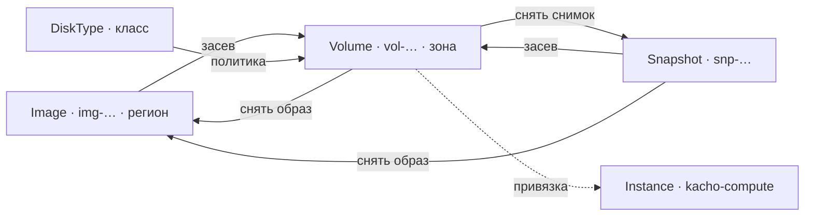

# Kachō Storage

**Kachō Storage** — сервис блочного хранения платформы. Он владеет четырьмя ресурсами:
постоянными томами (`Volume`), их снимками (`Snapshot`), загрузочными образами (`Image`)
и каталогом классов диска (`DiskType`). Здесь же живёт таблица привязок тома к машине —
именно storage, а не потребитель, отвечает на вопрос «к какой машине примонтирован этот
том».

Сервис относится к control plane: он ведёт учёт, инварианты и права, а не переносит
блоки данных. Всё, что описано ниже, — это контракт управления ресурсами.

## Ресурсы и идентификаторы

| Ресурс | Префикс id | Размещение | Что это |
|---|---|---|---|
| `Volume` | `vol` | зональный | Постоянный блочный том. Живёт независимо от машин: может сколь угодно долго оставаться без единой привязки |
| `Snapshot` | `snp` | зональный (собственный якорь) | Снимок тома. Переживает исходный том вместе со своей зоной |
| `Image` | `img` | региональный (anycast) | Загрузочный образ, из которого засевается том |
| `DiskType` | человекочитаемый slug | каталог | Класс диска: ярус, состояние обращения, границы размера, способности |
| `Operation` | `sop` | — | Долгая операция: результат любой мутации |

Идентификатор ресурса — префикс плюс 17 символов crockford-base32, например
`vola1b2c3d4e5f6g7h8j`. Он присваивается на создании и **неизменен всю жизнь ресурса**:
именно `id` попадает в ссылки, в область выдачи прав и в адресацию. Имя (`name`) —
косметическая метка проекта, её можно менять свободно, и она никогда не участвует в
адресации.

`DiskType` — исключение по форме: его идентификатор не генерируется, а назначается
администратором как читаемый slug при регистрации класса, потому что это позиция
справочника, а не созданный тенантом ресурс.

Ещё две записи живут **только на внутреннем листенере** и арендатору не адресованы:
зарегистрированный бэкенд (`sb-…`) — чем исполняется хранение и где, — и неизменяемая
ревизия привязки (`dtb-…`) — на каких условиях класс исполняется в конкретной зоне. Они
инфра-чувствительны целиком; см. [Внутренний API](/api/internal).

## Жизненный цикл в одном взгляде

Том создаётся пустым либо засевается ровно из одного источника — снимка или образа.
Обратно: с тома снимается снимок, а образ снимается с тома или со снимка. Привязка тома к
машине — отдельное состояние, оно не меняет владения томом.

Перенос данных между зонами и регионами делается **копированием**: `Snapshot:copy` в
другую зону, `Image:copy` в другой регион. Зона и регион у созданного ресурса неизменяемы,
поэтому глагола «переехать» не существует — данные лежат в конкретном хранилище.

## Что сервис даёт и чего не делает

**Даёт.** Полный CRUD над томами, снимками и образами с проверкой прав на каждый объект;
каталог классов диска с их политикой; авторитетное состояние привязок; когерентность
размещения (том и машина в одной зоне, том и образ — в одном регионе); все инварианты на
уровне БД, а не проверками в коде.

**Не делает.** Блоки не наши: их хранит и переносит внешний бэкенд, зарегистрированный
администратором. Storage владеет **намерением и учётом** — что заказано, под какой
политикой, что из этого подтверждено хранилищем.

Отсюда две величины у каждого ресурса: **желаемое** (что мы заказали) и **наблюдённое**
(что сверщик увидел у бэкенда). Ресурс рождается в `CREATING`, готовность объявляет
сверщик, а расхождение между двумя величинами — это то, что делает дрейф находимым.

Отображение тома на узле (появление устройства в гостевой системе) — предмет узлового
агента плоскости данных, отдельного компонента: `IN_USE` означает «привязка объявлена в
control plane», а не «устройство примонтировано».

## Владелец блочного хранения

Блочное хранение выделено в отдельный сервис из вычислительного домена. **На стороне
storage раскол завершён**: он единственный владелец томов, снимков, образов и типов
диска, и связующая таблица привязок живёт у него. Дубликаты этих ресурсов сняты
миграциями **вычислительного** сервиса — `0021_drop_block_storage_duplicates.sql` и
`0022_drop_disk_types.sql` в его каталоге миграций, не в нашем (у storage номера 0021 и
0022 заняты своими миграциями, к расколу отношения не имеющими).

Почему привязку инициирует сосед, а таблица лежит здесь — и почему при этом обратного
вызова не возникает — разобрано в разделе
[Привязка тома к машине](/architecture/attachments).

## Куда дальше

- [Быстрый старт](/getting-started) — создать том, снять снимок, привязать.
- [Архитектура](/architecture/overview) — слои, инварианты, границы сервиса.
- [API](/api/overview) — поверхность, коды ошибок, пагинация.
- [Решения дизайна](/advanced/design-decisions) — что и почему решено именно так.
