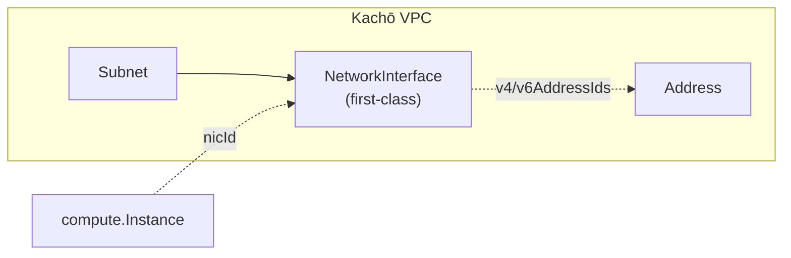

import { Codes } from '@site/src/components/commonBlocks/Codes'

# Осознанные дизайн-решения Kachō VPC

Kachō VPC — самостоятельный control-plane сети. Его API следует **конвенциям Kachō**:
camelCase JSON, асинхронный `Operation`-envelope на каждой мутации, REST-пути
`/<service>/v1/<resource>`, формат ошибок `{code, message, details[]}`, gRPC-коды
(`INVALID_ARGUMENT` / `NOT_FOUND` / `FAILED_PRECONDITION` / `ALREADY_EXISTS`), truncate
timestamp до секунд и единая `update_mask`-дисциплина. Эти конвенции стабильны и
описаны в [обзоре API](/api/overview).

Состав ресурсов, полей и RPC спроектирован **в чистой форме под задачу VPC**, а не
скопирован у кого-либо. Эта страница описывает ключевые дизайн-решения и объясняет
**зачем так** — это намеренные, зафиксированные решения, а не баги и не задачи к
переделке.

:::info Конвенции стабильны, структура — по делу
**Стилевой слой** (текст ошибки, regex имени, точность timestamp, дисциплина
`update_mask`, формат `google.rpc.Status`) — единый для всего Kachō и проверяется как
часть конвенций. **Структурный слой** (состав ресурсов / полей / RPC, oneof-вариации,
internal-проекции) проектируется удобно под домен и **не повод заводить баг**. Источник
истины по дизайн-решениям — `docs/architecture/` репозитория.
:::

## Сводка решений

<table>
  <thead>
    <tr><th>Решение</th><th>Kachō VPC</th><th>Почему так</th></tr>
  </thead>
  <tbody>
    <tr>
      <td><strong>NetworkInterface</strong></td>
      <td>first-class ресурс домена VPC</td>
      <td>самостоятельный CRUD, серверная MAC-аллокация, multi-NIC, NIC отвязан от Instance</td>
    </tr>
    <tr>
      <td><strong>AddressPool</strong></td>
      <td>admin-only internal-ресурс (IPAM)</td>
      <td>явное управление пулами внешних IP средствами платформы</td>
    </tr>
    <tr>
      <td><strong>AddressPool CIDR</strong></td>
      <td>split-by-family (<code>v4CidrBlocks</code> / <code>v6CidrBlocks</code>) + <code>:addCidrBlocks</code> / <code>:removeCidrBlocks</code></td>
      <td>явный v4-only / v6-only / dual-stack pool</td>
    </tr>
    <tr>
      <td><strong>Internal-проекции</strong></td>
      <td>две проекции: публичная (lean) + <code>Internal\*</code> (full)</td>
      <td>defense-in-depth по инфра-чувствительным данным</td>
    </tr>
    <tr>
      <td><code>SecurityGroup.networkId</code></td>
      <td>обязателен и immutable</td>
      <td>SG→SG-правила валидны только внутри одной сети</td>
    </tr>
    <tr>
      <td><strong>Отслеживание изменений</strong></td>
      <td>List-polling / Operations (без Watch RPC)</td>
      <td>упрощение клиентской модели — поллинг вместо server-streaming</td>
    </tr>
  </tbody>
</table>

---

## 1. NetworkInterface — first-class ресурс

В Kachō **NetworkInterface (NIC)** — самостоятельный first-class ресурс домена
`kacho-vpc`, а не inline-описание внутри спеки инстанса. NIC живет независимо: его можно
создать, получить, изменить и удалить как отдельный ресурс. Это дает чистое разделение
доменов и гибкую сетевую модель: интерфейс существует сам по себе, а привязка к нагрузке —
вторична.

<table>
  <thead><tr><th>Свойство</th><th>Значение</th></tr></thead>
  <tbody>
    <tr><td>Сервис</td><td><code>NetworkInterfaceService</code> (REST под <code>/vpc/v1/networkInterfaces</code>)</td></tr>
    <tr><td>Операции</td><td><code>Get</code> / <code>List</code> / <code>Create</code> / <code>Update</code> / <code>Delete</code> / <code>ListOperations</code></td></tr>
    <tr><td>Принадлежит</td><td><code>Subnet</code> (FK <code>subnetId</code> ON DELETE <code>RESTRICT</code>)</td></tr>
    <tr><td>Адреса</td><td>ссылается на ресурсы <code>Address</code> по id — <code>v4AddressIds[]</code> / <code>v6AddressIds[]</code>, кардинальность ≤ 1 IPv4 + ≤ 1 IPv6</td></tr>
    <tr><td>MAC</td><td><code>macAddress</code> — output-only, аллоцируется сервером (префикс <code>0e:</code>), уникален в пределах облака</td></tr>
  </tbody>
</table>

:::note Отдельных RPC привязки к инстансу нет
У `NetworkInterfaceService` **нет** публичных RPC `AttachToInstance` / `DetachFromInstance`,
и поля «кто использует интерфейс» (`usedBy`) **нет в публичной проекции** ресурса. Управление
привязкой NIC к нагрузке решается на стороне домена compute по ссылке `nicId`, а VPC остается
владельцем самого интерфейса. NIC, на который ссылается активная нагрузка, нельзя удалить —
сначала отвязать (`FailedPrecondition`).
:::

:::note Кардинальность ≤ 1 v4 / ≤ 1 v6
На одной NIC — максимум один IPv4 и максимум один IPv6 (всего ≤ 2 адреса). Это
осознанно упрощенная модель: multi-IP на VM делается через **несколько NIC**, а не через
secondary-адреса в одном NIC. Инвариант проверяется sync-валидацией и закреплен на
DB-уровне (`CHECK (jsonb_array_length(...) <= 1)`).
:::

Нагрузка (инстанс) ссылается на NIC через `nicId` (а не встраивает его) — это дает чистое
разделение доменов: VPC владеет интерфейсом, потребитель держит только ссылку. Подробнее —
[NetworkInterface API](/api/network-interface).

---

## 2. AddressPool — admin-only IPAM-ресурс

**AddressPool** — явный **глобальный infrastructure-ресурс** (как Region/Zone), которым
управляет встроенный **IPAM**. Выделение внешних IP не спрятано внутри платформы, а
оформлено как первоклассный admin-ресурс — это дает оператору прямой контроль над пулами.

<table>
  <thead><tr><th>Свойство</th><th>Значение</th></tr></thead>
  <tbody>
    <tr><td>Видимость</td><td><strong>internal-only</strong> — управляется через <code>InternalAddressPoolService</code> на cluster-internal порту <code>:9091</code></td></tr>
    <tr><td>REST</td><td>проброшен через api-gateway на cluster-internal listener: <code>/vpc/v1/addressPools</code> (для UI / admin-tooling)</td></tr>
    <tr><td>Скоуп</td><td>глобальный — не привязан к проекту; пулы общие на всю инсталляцию</td></tr>
    <tr><td>ID-префикс</td><td><code>apl</code></td></tr>
  </tbody>
</table>

:::tip Не на external endpoint
AddressPool и прочие admin-only пути **не должны** быть доступны на external endpoint
(advertised для внешних клиентов) — они живут только на cluster-internal listener `:9091`
и пробрасываются через api-gateway лишь на internal REST mux (UI / admin-tooling). Это
правило Internal-vs-external разделения — см. [Авторизация и приватность](/architecture/authz).
:::

---

## 3. Внутренний идентификатор сети (`vrf_id`) — только на internal-проекции

У сети есть авторитетный **числовой идентификатор тенант-домена data-plane** (`vrf_id`),
который control-plane аллоцирует уникально на каждую сеть (sequence-backed, UNIQUE по
построению). Он нужен, чтобы будущий data-plane строил overlap-safe тенантинг на
доверенном значении из control-plane, а не на client-side-вычислении.

Это инфра-чувствительное значение, поэтому оно намеренно **не выставлено на публичной
поверхности** ресурса `Network` и отдается **только** через internal-проекцию —
`InternalNetworkService.GetNetwork` на cluster-internal порту `:9091` (read-tier authz-gate).

<table>
  <thead><tr><th>Проекция</th><th>Идентификатор сети</th></tr></thead>
  <tbody>
    <tr><td>Публичная (<code>NetworkService.Get</code>, <code>:9090</code>)</td><td>только tenant-facing <code>id</code> / <code>name</code> / <code>labels</code> — числового инфра-идентификатора нет</td></tr>
    <tr><td>Internal (<code>InternalNetworkService.GetNetwork</code>, <code>:9091</code>)</td><td>дополнительно <code>vrfId</code> — авторитетный data-plane-идентификатор</td></tr>
  </tbody>
</table>

:::note Две проекции — намеренно
Это конкретный случай общего принципа «две проекции ресурса» (§5): tenant видит только
«намерение + результат», а инфра-чувствительные поля (включая числовой идентификатор сети)
доступны исключительно через `Internal*`-API. Так публичный API не раскрывает физику /
тенантинг data-plane даже при компрометации.
:::

---

## 4. AddressPool CIDR — split-by-family

В исходной форме у AddressPool было одно поле `cidr_blocks`. Оно разделено по семейству
адресов на два независимых поля — чтобы pool явно объявлял себя **v4-only**, **v6-only**
или **dual-stack**:

<table>
  <thead><tr><th>Поле</th><th>Описание</th></tr></thead>
  <tbody>
    <tr><td><code>v4CidrBlocks</code></td><td>IPv4 CIDR-блоки пула (пусто → pool не участвует в v4-аллокации)</td></tr>
    <tr><td><code>v6CidrBlocks</code></td><td>IPv6 CIDR-блоки пула (пусто → pool не участвует в v6-аллокации)</td></tr>
  </tbody>
</table>

Старый тег `cidr_blocks` зарезервирован (не переиспользуется). CIDR-состав пула immutable
в `Update` (CIDR-поле в mask → `InvalidArgument`) и меняется отдельными `:verb`-методами —
паритет с Subnet:

<table>
  <thead><tr><th>Метод</th><th>Семантика</th></tr></thead>
  <tbody>
    <tr><td><code>:addCidrBlocks</code></td><td>добавить v4- и/или v6-блоки одним запросом (dedup; пересечение CIDR per kind → <code>FAILED\_PRECONDITION</code>)</td></tr>
    <tr><td><code>:removeCidrBlocks</code></td><td>удалить блоки; блок с выделенными адресами → <code>FAILED\_PRECONDITION</code></td></tr>
  </tbody>
</table>

:::note Pool не может стать пустым
После `RemoveCidrBlocks` суммарный CIDR-состав (v4 + v6) не может стать пустым — иначе <code>InvalidArgument</code>.
Family-aware фильтр действует и в IPAM-каскаде резолва пула: pool пропускается на каждом шаге, если его
запрошенный family-список пуст.
:::

---

## 5. Инфра-чувствительные данные — не на публичной поверхности

Принцип defense-in-depth: любые данные, раскрывающие физическую инфраструктуру или
тенантинг data-plane, никогда не попадают в публичный ответ. Публичная проекция ресурса —
это чисто tenant-facing «намерение + результат»; инфра-чувствительные поля (если они есть)
живут отдельно, на `Internal*`-проекции (см. §3):

<table>
  <thead><tr><th>Ресурс</th><th>Публичная проекция (lean)</th></tr></thead>
  <tbody>
    <tr><td><code>Network</code></td><td>id, name, projectId, labels, createdAt, defaultSecurityGroupId (числового инфра-id нет — <code>vrfId</code> только на internal-проекции)</td></tr>
    <tr><td><code>NetworkInterface</code></td><td>id, name, labels, subnetId, v4/v6AddressIds, securityGroupIds, macAddress, status (ни инфра-полей, ни <code>usedBy</code>)</td></tr>
  </tbody>
</table>

Инфра-чувствительные данные (placement — привязка к физическому хосту, числовой
идентификатор тенант-домена сети) структурно недоступны на публичном API: они не входят
ни в одну публичную проекцию ресурса.

:::info Почему так
Даже если публичный API скомпрометирован (или tenant имеет read к своим ресурсам), он не должен узнать
физическую топологию / placement — это разведка для lateral movement. Tenant сети A не должен
мочь вывести «мой инстанс и инстанс tenant'а B на одном физическом хосте». Поэтому инфра-данные
структурно отделены от публичного control-plane-API.
:::

---

## 6. `SecurityGroup.networkId` — обязателен и immutable

Группа безопасности **обязана** принадлежать ровно одной сети при создании
(`network_id [(required) = true]`), и эта привязка неизменна после создания. Причина:
правила SG→SG валидны только внутри одной сети — SG в разных сетях физически изолированы
и никогда не «видят» друг друга. Привязка SG к сети, фиксированная на Create, делает этот
инвариант проверяемым и стабильным.

:::note Привязка к сети фиксируется на Create
`network_id` **обязателен** на Create и **immutable** после создания. Это сознательно:
переезд SG между сетями ломал бы инвариант «SG-rule ссылается только на SG той же сети»,
поэтому привязка задается один раз и далее не меняется.
:::

Следствия:

<table>
  <thead><tr><th>Сценарий</th><th>Поведение</th></tr></thead>
  <tbody>
    <tr><td><code>Create</code> без <code>networkId</code></td><td><code>INVALID\_ARGUMENT</code> (поле обязательно)</td></tr>
    <tr><td><code>Update</code> с <code>networkId</code> в mask</td><td><code>INVALID\_ARGUMENT</code> — поле immutable</td></tr>
    <tr><td>SG-rule ссылается на SG из другой сети</td><td><code>INVALID\_ARGUMENT "security group rule can only reference a security group in the same network"</code></td></tr>
  </tbody>
</table>

<Codes codes={['invalidArgument', 'notFound', 'failedPrecondition']} />

---

## 7. Отслеживание изменений — List-polling / Operations

Публичного per-resource **Watch RPC** (server-streaming-слежение за состоянием ресурса) в
API нет. Это осознанное упрощение клиентской модели: вместо постоянного streaming-соединения
клиент использует поллинг.

Клиент отслеживает изменения двумя способами:

<table>
  <thead><tr><th>Задача</th><th>Механизм</th></tr></thead>
  <tbody>
    <tr><td>Дождаться результата мутации</td><td><code>OperationService.Get(id)</code> — поллинг до <code>done: true</code></td></tr>
    <tr><td>Отследить изменения списка ресурсов</td><td><code>List</code>-polling каждые 2–5 сек</td></tr>
  </tbody>
</table>

:::info Durable change-log внутри сервиса
Каждая успешная мутация в той же транзакции пишет событие в transactional-outbox
`vpc_outbox` (монотонный `sequence_no` + `pg_notify`). Это **внутренний** durable
change-log домена — основа для асинхронной доставки событий и для register-outbox
(owner-tuple в kacho-iam, см. [Наблюдаемость](/advanced/observability)). Это не публичный
per-resource Watch RPC: tenant-клиент по-прежнему наблюдает изменения через
`OperationService.Get` и `List`-polling.
:::

---

## 8. Материализация в data-plane — дизайн оператора

Сам `kacho-vpc` — control-plane only; реальную сеть программирует отдельный sibling
**`kacho-vpc-operator`** (вне build-графа control-plane). У его архитектуры — несколько
осознанных решений; полная картина потока — на странице
[Материализация в data-plane](/architecture/data-plane).

<table>
  <thead><tr><th>Решение</th><th>Почему так</th></tr></thead>
  <tbody>
    <tr>
      <td><strong>Промежуточный CRD <code>KachoSubnet</code></strong> (Subnet не маппится в сеть напрямую)</td>
      <td>дает контроллеру локальный desired-state в кластере: ownerRef-каскад, finalizer-teardown и поэлементный prune работают на k8s-объекте, а не на удаленном gRPC-ресурсе</td>
    </tr>
    <tr>
      <td><strong>Имена child'ов — по неизменяемому id</strong> (<code>&lt;subnet-id&gt;-&lt;hashCIDR&gt;</code>, не по <code>name</code>)</td>
      <td>имя в сетевом стеке неизменяемо, а Kachō <code>name</code> мутабелен; привязка имени к id означает, что переименование Subnet не осиротит и не пересоздаст уже работающую сеть</td>
    </tr>
    <tr>
      <td><strong>Один CIDR = одна child-подсеть</strong> (single-family, без dual-stack-объединения)</td>
      <td>поэлементная сверка/prune: убрали CIDR из Subnet → запрунилась ровно его child-пара (подсеть + NAD); IPv4 и IPv6 живут независимыми единицами</td>
    </tr>
    <tr>
      <td><strong>Polling, не Watch</strong> (оператор читает control-plane поллингом)</td>
      <td>согласуется с клиентской моделью всего API — наблюдение через polling/Operations; публичного Watch RPC в Kachō нет (см. §7)</td>
    </tr>
    <tr>
      <td><strong>IPAM — на стороне <code>kacho-vpc</code></strong> (webhook резолвит уже выделенный Address, не выдает IP сам)</td>
      <td>единый источник истины по адресам — control-plane; data-plane фиксируется на fixed-IP из Kachō <code>Address</code>, а не аллоцирует параллельно</td>
    </tr>
  </tbody>
</table>

:::note Куда развивается покрытие
Материализация остальных ресурсов (SecurityGroup / RouteTable / Gateway / reserved- и
external-Address) и multi-AZ-связность между зонами (per-zone подсети, native L3 между
зонами) спроектированы и реализуются поэтапно. Control-plane proto/API для этого менять не
требуется — `Subnet.zone_id` и per-Network непересечение CIDR уже есть.
:::

---

## Что СЮДА не относится

Эта страница — про **структурные** дизайн-решения. Сюда **не** входит:

- **Стилевые конвенции** (текст ошибки, regex, точность timestamp, формат `update_mask`) —
  они едины для всего Kachō; отклонение от конвенции — это повод для GitHub Issue, а не
  дизайн-решение.
- **Корректная реализация контракта** (project-scoped ресурсы, валидация имени `NameVPC` и т.п.) —
  это не «решение», а спека.
- **Найденные баги** — заводятся как GitHub Issues в `PRO-Robotech/kacho-vpc`.

Полный нормативный разбор дизайн-решений — в `docs/architecture/` репозитория `kacho-vpc`.
