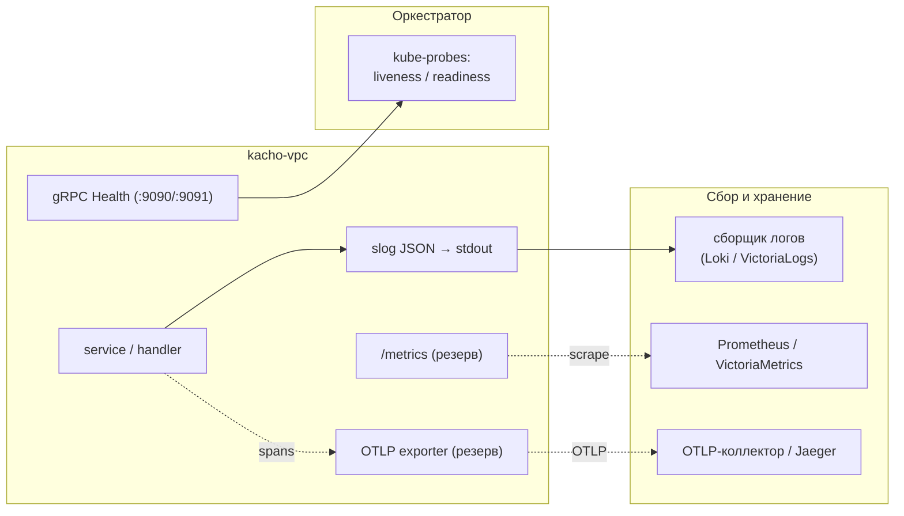
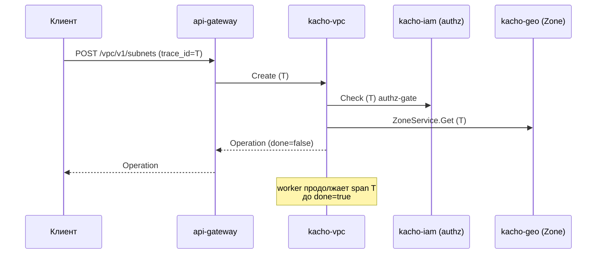

import { Codes } from '@site/src/components/commonBlocks/Codes'
import CodeBlock from '@theme/CodeBlock'
import dedent from 'ts-dedent'

# Наблюдаемость

Наблюдаемость (observability) Kachō VPC строится на трех классических столпах — **логи**,
**метрики**, **трейсинг** — плюс **health/readiness-пробы** и **доменные сигналы** (backlog
операций, лаг outbox). Cross-cutting-инфраструктура вынесена в `kacho-corelib/observability`
и переиспользуется всеми сервисами платформы, поэтому формат логов, имена сигналов и
конвенции одинаковы в kacho-vpc, kacho-iam, kacho-geo, kacho-compute и api-gateway.

:::info Уровень зрелости
Часть подсистем уже в проде (структурные slog-логи, gRPC Health), часть — на скелете
(Prometheus `/metrics`, OTLP-трейсинг подключаются через конфиг-флаги / env). Ниже явно
помечено, что **активно сейчас**, а что — **зарезервированный контракт** под включение.
:::

## Обзор

<table>
  <thead>
    <tr><th>Сигнал</th><th>Транспорт</th><th>Где живет</th><th>Статус</th></tr>
  </thead>
  <tbody>
    <tr><td><strong>Структурные логи</strong></td><td>slog JSON → <code>stdout</code></td><td><code>corelib/observability.NewSlogger</code></td><td>активно</td></tr>
    <tr><td><strong>gRPC Health</strong></td><td><code>grpc.health.v1.Health</code></td><td><code>corelib/grpcsrv.NewServer</code></td><td>активно</td></tr>
    <tr><td><strong>Метрики</strong></td><td>Prometheus <code>/metrics</code></td><td>секция <code>metrics</code> конфига</td><td>резерв (флаг <code>metrics.enable</code>)</td></tr>
    <tr><td><strong>Трейсинг</strong></td><td>OTLP-спаны</td><td><code>corelib/observability.InitOtel</code></td><td>резерв (env <code>KACHO\_OTEL\_EXPORTER\_OTLP\_ENDPOINT</code>)</td></tr>
    <tr><td><strong>Backlog операций</strong></td><td>таблица <code>operations</code></td><td>доменный сигнал (SQL)</td><td>активно</td></tr>
    <tr><td><strong>Register-outbox</strong></td><td><code>fga\_register\_outbox</code> + corelib <code>outbox/metrics</code></td><td>доменный сигнал (SQL + reconciler)</td><td>активно</td></tr>
  </tbody>
</table>

## Структурные логи (slog JSON)

kacho-vpc логирует через стандартный `log/slog` с JSON-handler'ом. Логгер создается один раз
в `cmd/vpc/main.go` и ставится глобальным дефолтом:

<CodeBlock language="go">
  {dedent`
    logger := observability.NewSlogger(os.Stdout)
    slog.SetDefault(logger)
  `}
</CodeBlock>

`NewSlogger` оборачивает `slog.NewJSONHandler` с минимальным уровнем `Info`. Каждая запись —
одна JSON-строка в `stdout` (контейнерный лог собирает Loki / VictoriaLogs):

<CodeBlock language="json">
  {dedent`
    {
      "time": "2026-06-06T14:27:00.512Z",
      "level": "INFO",
      "msg": "kacho-vpc listening",
      "public": "0.0.0.0:9090",
      "internal": "0.0.0.0:9091"
    }
  `}
</CodeBlock>

### Уровни и конфигурация

Уровень логирования задается секцией `logger` конфига (`logger.level`); допустимые значения —
`FATAL | ERROR | WARN | INFO | DEBUG`.

<table>
  <thead><tr><th>Уровень</th><th>Когда</th></tr></thead>
  <tbody>
    <tr><td><code>ERROR</code></td><td>Сбой worker'а операции, недоступность peer-сервиса (fail-closed), ошибка БД</td></tr>
    <tr><td><code>WARN</code></td><td>Fail-open authz при недоступном kacho-iam (если включен), деградации, ретраи</td></tr>
    <tr><td><code>INFO</code></td><td>Старт/останов сервиса, привязка listener'ов, ключевые переходы состояний</td></tr>
    <tr><td><code>DEBUG</code></td><td>Подробная трассировка request-path (только в dev)</td></tr>
  </tbody>
</table>

:::tip Не логировать инфра-чувствительное
Логи — публичная для оператора поверхность. Не выводите в логи placement (привязку к физическому
хосту) и прочие инфра-чувствительные детали (см.
[Авторизация и приватность](/architecture/authz)). Это разведданные для lateral movement.
Секреты (JWT, пароли БД) в логах также запрещены.
:::

:::note Корреляция запросов
Структурные поля (`grpc.method`, `operation.id`, `resource.id`) добавляются через
`logger.With(...)` в обработчиках. При включенном трейсинге к записи дополнительно
прикладываются `trace_id` / `span_id` — это связывает строку лога с распределенным трейсом.
:::

## Метрики (Prometheus)

Контракт метрик — Prometheus-формат на отдельном HTTP-эндпоинте `/metrics`, который scrape'ит
Prometheus / VictoriaMetrics. Включение — секция `metrics` конфига:

<CodeBlock language="yaml">
  {dedent`
    metrics:
      enable: true   # placeholder под /metrics endpoint
    healthcheck:
      enable: true   # placeholder под /healthz
    logger:
      level: INFO
  `}
</CodeBlock>

:::note Текущий статус
`metrics.enable` — placeholder-флаг: секция конфига уже зафиксирована, сам HTTP-handler `/metrics`
включается отдельным шагом. До его активации основными сигналами наблюдаемости остаются **логи**,
**gRPC Health** и **доменные SQL-сигналы** (backlog операций, лаг outbox — см. ниже).
:::

Ожидаемые семейства метрик (по мере включения) — стандартный набор для gRPC-сервиса на Go:

<table>
  <thead><tr><th>Группа</th><th>Что измеряет</th></tr></thead>
  <tbody>
    <tr><td><strong>gRPC RED</strong></td><td>Rate / Errors / Duration по RPC-методам (через interceptor): счетчик запросов, доля ненулевых gRPC-кодов, гистограмма латентности</td></tr>
    <tr><td><strong>Operations</strong></td><td>Количество незавершенных (<code>done=false</code>) операций, время до <code>done</code>, доля failed</td></tr>
    <tr><td><strong>Register-outbox</strong></td><td>Незадоставленные register-intents, число «отравленных» записей (<code>outbox\_poisoned\_total</code>), лаг доставки owner-tuple в kacho-iam</td></tr>
    <tr><td><strong>pgxpool</strong></td><td>Занятые / свободные / ожидающие соединения пула к <code>kacho\_vpc</code></td></tr>
    <tr><td><strong>Go runtime</strong></td><td>Стандартные <code>go\_\*</code> / <code>process\_\*</code> (heap, goroutines, GC, открытые fd)</td></tr>
  </tbody>
</table>

## Трейсинг (OpenTelemetry)

Распределенный трейсинг — через OTLP. Инициализация — `observability.InitOtel(ctx, serviceName)`:

<CodeBlock language="go">
  {dedent`
    shutdown, err := observability.InitOtel(ctx, "kacho-vpc")
    if err != nil { /* ... */ }
    defer shutdown(ctx)
  `}
</CodeBlock>

Поведение зависит от env `KACHO_OTEL_EXPORTER_OTLP_ENDPOINT`:

<table>
  <thead><tr><th>Условие</th><th>Поведение</th></tr></thead>
  <tbody>
    <tr><td>env <strong>не задан</strong></td><td>возвращается no-op <code>ShutdownFn</code> — спаны не экспортируются, оверхеда нет</td></tr>
    <tr><td>env <strong>задан</strong> (напр. <code>otel-collector:4317</code>)</td><td>OTLP-провайдер шлет спаны в коллектор (Jaeger / Tempo / VictoriaTraces)</td></tr>
  </tbody>
</table>

:::note Текущий статус
Полная OTLP-инициализация — на скелете: при заданном endpoint каркас присутствует, а инструментация
gRPC-interceptor'ом подключается отдельным шагом. До этого основной инструмент корреляции — связка
`operation.id` в логах + поллинг `OperationService.Get(id)`. Контракт env-переменной и сигнатура
`InitOtel` уже зафиксированы и едины для всех сервисов.
:::

## Health и readiness

`corelib/grpcsrv.NewServer` регистрирует на **каждом** gRPC-listener'е стандартный сервис
`grpc.health.v1.Health` в состоянии `SERVING`, а также server-reflection (для `grpcurl` / dev-tooling):

<CodeBlock language="go">
  {dedent`
    h := health.NewServer()
    h.SetServingStatus("", healthpb.HealthCheckResponse_SERVING)
    healthpb.RegisterHealthServer(s, h)
    reflection.Register(s)
  `}
</CodeBlock>

Сервис слушает **два** listener'а, и Health доступен на обоих:

<table>
  <thead><tr><th>Listener</th><th>Адрес (dev)</th><th>Назначение</th></tr></thead>
  <tbody>
    <tr><td><strong>public</strong></td><td><code>:9090</code></td><td>Tenant-RPC через api-gateway; per-RPC authz-gate включен</td></tr>
    <tr><td><strong>internal</strong></td><td><code>:9091</code></td><td>Admin / peer / IPAM RPC; per-RPC authz-gate включен на тех же условиях (security-инвариант: оба listener'а проходят Check)</td></tr>
  </tbody>
</table>

Проба через `grpc_health_probe` (используется как liveness/readiness в Kubernetes):

<CodeBlock language="bash">
  {dedent`
    grpc_health_probe -addr=localhost:9090   # public listener
    # status: SERVING
    grpc_health_probe -addr=localhost:9091   # internal listener
    # status: SERVING
  `}
</CodeBlock>

:::tip Liveness vs readiness
**Liveness** = процесс жив и gRPC-сервер отвечает (Health = `SERVING`). **Readiness** дополнительно
подразумевает готовность зависимостей: миграции применены, пул к `kacho_vpc` поднят, доступен
internal-listener kacho-iam (для authz-gate). HTTP-проба `/healthz` (секция `healthcheck.enable`) —
зарезервированный контракт для оркестраторов, которым удобнее HTTP, а не gRPC-проба.
:::

## Доменные сигналы

Помимо инфраструктурных метрик, состояние kacho-vpc хорошо видно через **доменные данные** — их
можно снимать SQL-запросами (в dev — `make psql SVC=vpc`) или экспортировать как метрики.

### Backlog операций

Все мутации асинхронны: возвращают `Operation` и доводятся до `done=true` worker-горутиной
(`operations.Run`). Здоровый сервис быстро дренирует незавершенные операции — растущий backlog
`done=false` сигнализирует о застрявших worker'ах или сбоях зависимостей.

<CodeBlock language="sql">
  {dedent`
    -- Незавершенные операции (backlog)
    SELECT count(*) FROM kacho_vpc.operations WHERE done = false;

    -- Самая старая незавершенная (показатель «застряло»)
    SELECT id, description, created_at
      FROM kacho_vpc.operations
     WHERE done = false
     ORDER BY created_at ASC
     LIMIT 5;
  `}
</CodeBlock>

:::note Операция всегда завершается
Worker помечает операцию `done=true` и при успехе (`MarkDone` → <code>response</code>), и при ошибке
(`MarkError` → `google.rpc.Status` в <code>error</code>). Поэтому «вечный» `done=false` — аномалия,
а не нормальное долгое выполнение. Механика LRO — [Операции](/architecture/operations).
:::

### Register-outbox (доставка owner-tuple в kacho-iam)

При создании / удалении ресурса kacho-vpc публикует **register-intent** в таблицу
`fga_register_outbox` — и делает это **в той же writer-транзакции**, что и сама DML-мутация.
Так гарантируется co-commit: либо ресурс создан И его owner-hierarchy-tuple поставлен в
очередь на запись в OpenFGA, либо ни то ни другое. Фоновый **drainer** (corelib
`outbox/drainer`) дренирует очередь через `kacho-iam.InternalIAMService.RegisterResource`,
**reconciler** возвращает «застрявшие» записи в claimable, а **metrics-collector**
(`outbox/metrics`) считает backlog и «отравленные» (исчерпавшие ретраи) записи.

<CodeBlock language="sql">
  {dedent`
    -- Незадоставленные register-intents (backlog: sent_at еще не проставлен)
    SELECT count(*) FROM kacho_vpc.fga_register_outbox WHERE sent_at IS NULL;

    -- Самые старые недоставленные (показатель «застряло»)
    SELECT id, resource_type, resource_id, attempt_count, created_at
      FROM kacho_vpc.fga_register_outbox
     WHERE sent_at IS NULL
     ORDER BY created_at ASC
     LIMIT 5;
  `}
</CodeBlock>

:::caution Drainer должен быть подключен к kacho-iam
Если `authz.iam-endpoint` не задан, register-drainer **не стартует**: intents остаются
durable в таблице, но owner-tuple не доходят до OpenFGA → per-resource FGA `Check` уходит
в `no path` (deny). Readiness сервиса в этом режиме сигнализирует `NotReady` до подключения
drainer'а к kacho-iam. Метрика `outbox_poisoned_total` отражает записи, исчерпавшие ретраи.
:::

### Change-log `vpc_outbox`

Каждая успешная мутация в той же транзакции пишет событие в `vpc_outbox` с монотонным
`sequence_no`; триггер `vpc_outbox_notify_trg` шлет `pg_notify('vpc_outbox', …)`. Это
durable change-log домена (transactional outbox): он накапливается атомарно с DML и служит
основой для будущей доставки событий подписчикам.

<CodeBlock language="sql">
  {dedent`
    -- Голова change-log (последний sequence_no)
    SELECT max(sequence_no) AS head FROM kacho_vpc.vpc_outbox;
  `}
</CodeBlock>

<table>
  <thead><tr><th>Сигнал</th><th>Норма</th><th>Тревога</th></tr></thead>
  <tbody>
    <tr><td>Backlog операций (<code>done=false</code>)</td><td>около нуля, быстро дренируется</td><td>растет / старые операции «висят»</td></tr>
    <tr><td>Register-outbox backlog (<code>sent\_at IS NULL</code>)</td><td>малый, быстро дренируется drainer'ом</td><td>монотонно растет (drainer не подключен / kacho-iam недоступен)</td></tr>
    <tr><td><code>outbox\_poisoned\_total</code></td><td>0</td><td>&gt; 0 — intents исчерпали ретраи (нужен разбор)</td></tr>
  </tbody>
</table>

## Диагностика инцидентов

При расследовании сбоя полезно сопоставить gRPC-код ответа с источником сигнала:

<Codes codes={['failedPrecondition', 'unavailable', 'internal']} />

<table>
  <thead><tr><th>Симптом</th><th>Где смотреть</th><th>Вероятная причина</th></tr></thead>
  <tbody>
    <tr><td>«Тупит» / пустые списки на свежем стенде</td><td>логи peer-conn, gRPC keepalive</td><td>idle inter-service conn в half-open (keepalive)</td></tr>
    <tr><td><code>UNAVAILABLE</code> на Create/Update</td><td>логи + Health peer-сервиса</td><td>недоступен kacho-iam / kacho-geo (fail-closed валидация project / zone)</td></tr>
    <tr><td>Операции «висят» <code>done=false</code></td><td>backlog-запрос + ERROR-логи worker'а</td><td>паника / зависшая зависимость в worker'е</td></tr>
    <tr><td>Owner-tuple не доходят до FGA (per-resource <code>Check</code> = deny)</td><td>register-outbox backlog + <code>outbox\_poisoned\_total</code></td><td>drainer не подключен / kacho-iam недоступен</td></tr>
    <tr><td><code>INTERNAL "internal database error"</code></td><td>ERROR-логи (детали БД не утекают в ответ)</td><td>ошибка pgx / нарушение неотображенного constraint</td></tr>
  </tbody>
</table>

:::info Текст ошибки БД не утекает наружу
gRPC-код `INTERNAL` отдает клиенту обезличенное `"internal database error"`; настоящая причина
(SQLSTATE, текст pgx) попадает только в `ERROR`-лог сервиса. Поэтому для диагностики `INTERNAL`
смотрите именно логи, а не тело ответа.
:::
