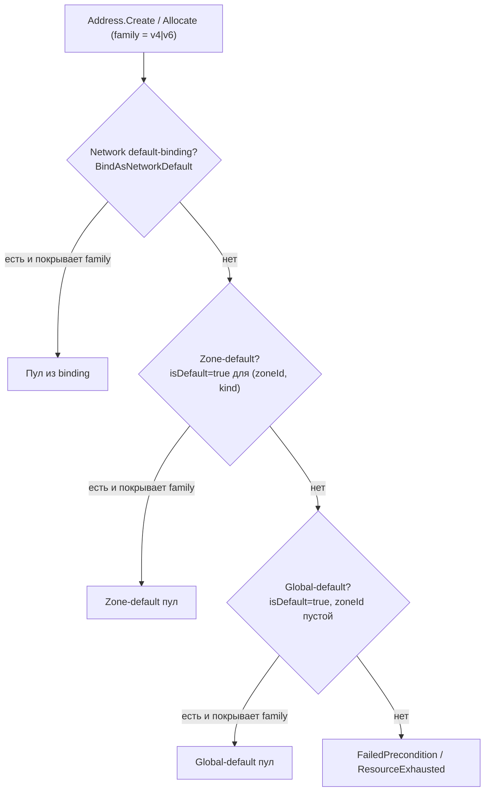

import { DICTIONARY } from '@site/src/constants/dictionary'
import { TYPES } from '@site/src/constants/types'
import { RESTRICTIONS } from '@site/src/constants/restrictions'
import { Restrictions } from '@site/src/components/commonBlocks/Restrictions'
import { Codes } from '@site/src/components/commonBlocks/Codes'
import { ApiOperation } from '@site/src/components/commonBlocks/ApiOperation'
import CodeBlock from '@theme/CodeBlock'
import dedent from 'ts-dedent'

# AddressPool

## Зачем нужен AddressPool

Чтобы выдать ресурсу клиента **внешний** (публично-маршрутизируемый) IP-адрес, платформе нужен
запас публичных префиксов, которым она распоряжается. **AddressPool** — это абстракция такого
запаса: именованная коллекция CIDR-блоков, из которых система аллоцирует внешние IP при создании
`Address`. Оператор инсталляции один раз заводит пулы (например, арендованный у провайдера
`/24`), привязывает их к зонам и сетям — и дальше любой проект просто запрашивает внешний адрес,
не зная, откуда физически берется IP. Так управление дефицитным ресурсом (публичные адреса)
централизовано у администратора, а тенанты получают самообслуживание без доступа к самому пулу.

Это **admin-ресурс уровня инсталляции**, а не tenant-facing объект: пул не принадлежит проекту,
не виден в публичном API и управляется только из admin-поверхности. Пулы общие для зоны —
`Address` из любого проекта в указанной зоне берет IP из единого пула. CIDR-блоки разделены по
семействам: `v4CidrBlocks` и `v6CidrBlocks` хранятся отдельно, поэтому пул может быть v4-only,
v6-only или dual-stack. ID-префикс ресурса — `apl`.

:::warning Internal / admin-only — не на external TLS endpoint
`AddressPool` управляется через `InternalAddressPoolService` на **cluster-internal listener (`:9091`)**.
Через api-gateway эндпоинты проброшены на REST-путь `/vpc/v1/addressPools/...` **только для
UI / admin-tooling**. На **external TLS endpoint** (`api.kacho.local:443`, advertised для внешних
клиентов — CLI / UI / SDK) эти пути **недоступны** (TLS-фильтр → 404). Каждый RPC проходит
per-RPC authz-Check с требованием admin-tier (`system_admin`) на cluster-scope — обычный
проектный токен пул не увидит и не изменит. Примеры ниже используют локальный port-forward
api-gateway на `localhost:18080`. Подробнее — [Авторизация и приватность](/architecture/authz)
и [IPAM](/architecture/ipam).
:::

:::info Мутации пула — синхронные
В отличие от tenant-ресурсов VPC (где `Create`/`Update`/`Delete` возвращают [`Operation`](/api/operations)),
`AddressPool` — **синхронный** ресурс: все мутирующие RPC (`Create`, `Update`, `Delete`,
`AddCidrBlocks`, `RemoveCidrBlocks`, биндинги) возвращают результат сразу, без long-running
operation. Это осознанное решение: операции над пулом — короткие чисто-метаданные admin-действия,
у которых нет асинхронной data-plane-фазы.
:::

## Поля ресурса

<table>
  <thead><tr><th>Поле</th><th>Тип</th><th>Описание</th></tr></thead>
  <tbody>
    <tr><td><code>id</code></td><td><code>{TYPES.string}</code></td><td>{DICTIONARY.id.short} (префикс <code>apl</code>)</td></tr>
    <tr><td><code>name</code></td><td><code>{TYPES.string}</code></td><td>{DICTIONARY.name.short}</td></tr>
    <tr><td><code>description</code></td><td><code>{TYPES.string}</code></td><td>{DICTIONARY.description.short}</td></tr>
    <tr><td><code>labels</code></td><td><code>{TYPES.mapStringString}</code></td><td>{DICTIONARY.labels.short}</td></tr>
    <tr><td><code>createdAt</code></td><td><code>{TYPES.timestamp}</code></td><td>{DICTIONARY.createdAt.short}</td></tr>
    <tr><td><code>v4CidrBlocks</code></td><td><code>{TYPES.stringArray}</code></td><td>IPv4 CIDR-блоки пула (host-bits = 0). Пустой → пул не покрывает IPv4-семейство</td></tr>
    <tr><td><code>v6CidrBlocks</code></td><td><code>{TYPES.stringArray}</code></td><td>IPv6 CIDR-блоки пула. Пустой → пул не покрывает IPv6-семейство</td></tr>
    <tr><td><code>kind</code></td><td><code>AddressPoolKind</code></td><td>Тип пула (<code>EXTERNAL\_PUBLIC</code> — public-routable)</td></tr>
    <tr><td><code>zoneId</code></td><td><code>{TYPES.string}</code></td><td>Зона, в которой валиден пул. Пустое = глобальный. <code>TEXT</code> без FK; существование зоны валидируется через <code>kacho-geo</code> (<code>ZoneService.Get</code>)</td></tr>
    <tr><td><code>isDefault</code></td><td><code>{TYPES.bool}</code></td><td>Fallback-пул для зоны. В пределах <code>(zoneId, kind)</code> — не более одного <code>isDefault=true</code></td></tr>
    <tr><td><code>selectorLabels</code></td><td><code>{TYPES.mapStringString}</code></td><td>Метки пула (зарезервировано; в текущем cascade не участвует — резолв идет network-default → zone-default → global-default)</td></tr>
    <tr><td><code>selectorPriority</code></td><td><code>{TYPES.int32}</code></td><td>Tie-break-приоритет пула (зарезервировано)</td></tr>
  </tbody>
</table>

:::info Семейства CIDR
Пул не может быть пустым: после `Create` / `Update` должно выполняться
`cardinality(v4CidrBlocks) + cardinality(v6CidrBlocks) > 0`, иначе `InvalidArgument`. Резолв для
IPv4 берет пул только если у него непустой `v4CidrBlocks`, симметрично для IPv6 — см. cascade в
[IPAM](/architecture/ipam).
:::

---

## Get

<ApiOperation method="GET" endpoint="/vpc/v1/addressPools/{poolId}">

Возвращает пул по идентификатору.

#### Пример запроса

<CodeBlock language="bash">
  {dedent`
    curl http://localhost:18080/vpc/v1/addressPools/{addressPoolId} \\
      -H 'Authorization: Bearer <ADMIN_JWT>'
  `}
</CodeBlock>

#### Пример ответа

<CodeBlock language="json">
  {dedent`
    {
      "id": "{addressPoolId}",
      "name": "default-zone-a",
      "description": "Дефолтный публичный пул для zone-a",
      "labels": {},
      "createdAt": "2026-06-06T14:27:00Z",
      "v4CidrBlocks": ["198.51.100.0/24"],
      "v6CidrBlocks": [],
      "kind": "EXTERNAL_PUBLIC",
      "zoneId": "zone-a",
      "isDefault": true,
      "selectorLabels": {},
      "selectorPriority": 0
    }
  `}
</CodeBlock>

<Codes codes={['invalidArgument', 'notFound', 'permissionDenied', 'unauthenticated', 'internal']} />

</ApiOperation>

---

## List

<ApiOperation method="GET" endpoint="/vpc/v1/addressPools">

Список пулов (глобальный, без `projectId`) с опциональным фильтром по `kind` / `zoneId` и
cursor-пагинацией.

#### Параметры запроса

<table>
  <thead><tr><th>Параметр</th><th>Обязательность</th><th>Тип</th><th>Описание</th></tr></thead>
  <tbody>
    <tr><td><code>kind</code></td><td>нет</td><td><code>AddressPoolKind</code></td><td>Фильтр по типу пула</td></tr>
    <tr><td><code>zoneId</code></td><td>нет</td><td><code>{TYPES.string}</code></td><td>Фильтр по зоне</td></tr>
    <tr><td><code>pageSize</code></td><td>нет</td><td><code>{TYPES.int64}</code></td><td>{DICTIONARY.pageSize.short}</td></tr>
    <tr><td><code>pageToken</code></td><td>нет</td><td><code>{TYPES.string}</code></td><td>{DICTIONARY.pageToken.short}</td></tr>
  </tbody>
</table>

#### Пример запроса

<CodeBlock language="bash">
  {dedent`
    curl 'http://localhost:18080/vpc/v1/addressPools?zoneId=zone-a&kind=EXTERNAL_PUBLIC' \\
      -H 'Authorization: Bearer <ADMIN_JWT>'
  `}
</CodeBlock>

#### Пример ответа

<CodeBlock language="json">
  {dedent`
    {
      "pools": [
        { "id": "{addressPoolId}", "name": "default-zone-a", "kind": "EXTERNAL_PUBLIC", "zoneId": "zone-a", "isDefault": true, "v4CidrBlocks": ["198.51.100.0/24"] }
      ],
      "nextPageToken": ""
    }
  `}
</CodeBlock>

<Restrictions items={[{ label: 'pagination', rules: RESTRICTIONS.pagination }]} />
<Codes codes={['invalidArgument', 'permissionDenied', 'unauthenticated', 'internal']} />

</ApiOperation>

---

## Create

<ApiOperation method="POST" endpoint="/vpc/v1/addressPools">

Создает пул. **Sync** — возвращает созданный `AddressPool` сразу (не `Operation`: internal admin-RPC).
Должен быть задан хотя бы один CIDR-блок (`v4CidrBlocks` или `v6CidrBlocks`).

#### Тело запроса

<table>
  <thead><tr><th>Параметр</th><th>Обязательность</th><th>Тип</th><th>Описание</th></tr></thead>
  <tbody>
    <tr><td><code>name</code></td><td>нет</td><td><code>{TYPES.string}</code></td><td>{DICTIONARY.name.short}</td></tr>
    <tr><td><code>description</code></td><td>нет</td><td><code>{TYPES.string}</code></td><td>{DICTIONARY.description.short}</td></tr>
    <tr><td><code>labels</code></td><td>нет</td><td><code>{TYPES.mapStringString}</code></td><td>{DICTIONARY.labels.short}</td></tr>
    <tr><td><code>kind</code></td><td>нет</td><td><code>AddressPoolKind</code></td><td>Тип пула (по умолчанию <code>EXTERNAL\_PUBLIC</code>)</td></tr>
    <tr><td><code>zoneId</code></td><td>нет</td><td><code>{TYPES.string}</code></td><td>Зона пула; пустое = глобальный</td></tr>
    <tr><td><code>isDefault</code></td><td>нет</td><td><code>{TYPES.bool}</code></td><td>Сделать fallback-пулом зоны</td></tr>
    <tr><td><code>selectorLabels</code></td><td>нет</td><td><code>{TYPES.mapStringString}</code></td><td>Метки пула (зарезервировано; в текущем cascade не участвует)</td></tr>
    <tr><td><code>selectorPriority</code></td><td>нет</td><td><code>{TYPES.int32}</code></td><td>Tie-break-приоритет (зарезервировано)</td></tr>
    <tr><td><code>v4CidrBlocks</code></td><td>нет*</td><td><code>{TYPES.stringArray}</code></td><td>IPv4 CIDR-блоки (host-bits = 0)</td></tr>
    <tr><td><code>v6CidrBlocks</code></td><td>нет*</td><td><code>{TYPES.stringArray}</code></td><td>IPv6 CIDR-блоки</td></tr>
  </tbody>
</table>

* Должен быть задан хотя бы один из <code>v4CidrBlocks</code> / <code>v6CidrBlocks</code>.

#### Пример запроса

<CodeBlock language="bash">
  {dedent`
    curl -X POST http://localhost:18080/vpc/v1/addressPools \\
      -H 'Authorization: Bearer <ADMIN_JWT>' \\
      -H 'Content-Type: application/json' \\
      -d '{
        "name": "default-zone-a",
        "kind": "EXTERNAL_PUBLIC",
        "zoneId": "zone-a",
        "v4CidrBlocks": ["198.51.100.0/24"],
        "isDefault": true
      }'
  `}
</CodeBlock>

#### Пример ответа

<CodeBlock language="json">
  {dedent`
    {
      "id": "{addressPoolId}",
      "name": "default-zone-a",
      "kind": "EXTERNAL_PUBLIC",
      "zoneId": "zone-a",
      "v4CidrBlocks": ["198.51.100.0/24"],
      "v6CidrBlocks": [],
      "isDefault": true,
      "createdAt": "2026-06-06T14:27:00Z"
    }
  `}
</CodeBlock>

<Restrictions items={[
  { label: 'name', rules: RESTRICTIONS.name },
  { label: 'labels', rules: RESTRICTIONS.labels },
  { label: 'cidr', rules: RESTRICTIONS.cidr },
  { label: 'zoneId', rules: ['существование валидируется через kacho-geo ZoneService.Get; пустое = глобальный пул'] },
  { label: 'cidr family', rules: ['должен быть задан ≥ 1 CIDR-блок (v4 или v6); пустой пул → InvalidArgument'] },
  { label: 'cidr overlap', rules: ['CIDR-блоки не должны пересекаться: внутри запроса → InvalidArgument «address pool CIDRs can not overlap» (sync-precheck); с другим пулом того же kind → FailedPrecondition с тем же текстом (DB EXCLUDE)'] },
  { label: 'isDefault', rules: ['в пределах (zoneId, kind) — не более одного isDefault=true (partial UNIQUE)'] },
]} />
<Codes codes={['invalidArgument', 'alreadyExists', 'failedPrecondition', 'permissionDenied', 'unauthenticated', 'internal']} />

</ApiOperation>

---

## Update

<ApiOperation method="PATCH" endpoint="/vpc/v1/addressPools/{poolId}">

Изменяет **метаданные** пула. **Sync** — возвращает обновленный `AddressPool`. Partial-update —
через `updateMask` (единая update_mask-дисциплина Kachō): пустой mask → full-PATCH всех
mutable-полей (`name`, `description`, `labels`, `isDefault`, `selectorLabels`,
`selectorPriority`); `kind` / `zoneId` в mask → `InvalidArgument` (immutable после
`AddressPool.Create`).

:::note CIDR-блоки не меняются через Update
Состав CIDR-блоков пула изменяется **только** через [`:addCidrBlocks`](#addcidrblocks) /
[`:removeCidrBlocks`](#removecidrblocks). `Update` CIDR-поля не принимает и не мутирует.
:::

#### Тело запроса

<table>
  <thead><tr><th>Параметр</th><th>Тип</th><th>Описание</th></tr></thead>
  <tbody>
    <tr><td><code>updateMask</code></td><td><code>{TYPES.fieldMask}</code></td><td>{DICTIONARY.updateMask.short}</td></tr>
    <tr><td><code>name</code></td><td><code>{TYPES.string}</code></td><td>{DICTIONARY.name.short}</td></tr>
    <tr><td><code>description</code></td><td><code>{TYPES.string}</code></td><td>{DICTIONARY.description.short}</td></tr>
    <tr><td><code>labels</code></td><td><code>{TYPES.mapStringString}</code></td><td>{DICTIONARY.labels.short}</td></tr>
    <tr><td><code>isDefault</code></td><td><code>{TYPES.bool}</code></td><td>Fallback-флаг. Второй <code>isDefault=true</code> в пределах <code>(zoneId, kind)</code> → <code>AlreadyExists</code> (сначала снимите текущий default)</td></tr>
    <tr><td><code>selectorLabels</code></td><td><code>{TYPES.mapStringString}</code></td><td>Метки пула (зарезервировано; в текущем cascade не участвует)</td></tr>
    <tr><td><code>selectorPriority</code></td><td><code>{TYPES.int32}</code></td><td>Tie-break-приоритет (зарезервировано)</td></tr>
  </tbody>
</table>

#### Пример запроса

<CodeBlock language="bash">
  {dedent`
    curl -X PATCH http://localhost:18080/vpc/v1/addressPools/{addressPoolId} \\
      -H 'Authorization: Bearer <ADMIN_JWT>' \\
      -H 'Content-Type: application/json' \\
      -d '{
        "updateMask": "description,isDefault",
        "description": "premium egress pool",
        "isDefault": true
      }'
  `}
</CodeBlock>

<Restrictions items={[
  { label: 'name', rules: RESTRICTIONS.name },
  { label: 'labels', rules: RESTRICTIONS.labels },
  { label: 'updateMask', rules: RESTRICTIONS.updateMask },
  { label: 'immutable', rules: ['kind / zoneId в mask → InvalidArgument; CIDR через Update не меняется — используйте :addCidrBlocks / :removeCidrBlocks'] },
]} />
<Codes codes={['invalidArgument', 'notFound', 'alreadyExists', 'failedPrecondition', 'permissionDenied', 'unauthenticated', 'internal']} />

</ApiOperation>

---

## Delete

<ApiOperation method="DELETE" endpoint="/vpc/v1/addressPools/{poolId}">

Удаляет пул (hard-delete). **Sync** — возвращает пустой ответ.

#### Пример запроса

<CodeBlock language="bash">
  {dedent`
    curl -X DELETE http://localhost:18080/vpc/v1/addressPools/{addressPoolId} \\
      -H 'Authorization: Bearer <ADMIN_JWT>'
  `}
</CodeBlock>

#### Пример ответа

<CodeBlock language="json">
  {dedent`
    {}
  `}
</CodeBlock>

<Codes codes={['invalidArgument', 'notFound', 'failedPrecondition', 'permissionDenied', 'unauthenticated', 'internal']} />

</ApiOperation>

---

## AddCidrBlocks

<ApiOperation method="POST" endpoint="/vpc/v1/addressPools/{poolId}:addCidrBlocks">

Добавляет CIDR-блоки в пул. **Sync** — возвращает обновленный `AddressPool`. Уже присутствующие
блоки дедуплицируются (повторный add того же блока — no-op). Для новой v4-дельты материализуется
per-IP freelist; v6-блок впервые на пуле инициализирует sparse-counter.

#### Тело запроса

<table>
  <thead><tr><th>Параметр</th><th>Обязательность</th><th>Тип</th><th>Описание</th></tr></thead>
  <tbody>
    <tr><td><code>addressPoolId</code></td><td>да</td><td><code>{TYPES.string}</code></td><td>Id пула (в path)</td></tr>
    <tr><td><code>v4CidrBlocks</code></td><td>нет*</td><td><code>{TYPES.stringArray}</code></td><td>IPv4 CIDR-блоки для добавления (host-bits = 0)</td></tr>
    <tr><td><code>v6CidrBlocks</code></td><td>нет*</td><td><code>{TYPES.stringArray}</code></td><td>IPv6 CIDR-блоки для добавления</td></tr>
  </tbody>
</table>

* Должен быть задан хотя бы один из <code>v4CidrBlocks</code> / <code>v6CidrBlocks</code>.

#### Пример запроса

<CodeBlock language="bash">
  {dedent`
    curl -X POST http://localhost:18080/vpc/v1/addressPools/{addressPoolId}:addCidrBlocks \\
      -H 'Authorization: Bearer <ADMIN_JWT>' \\
      -H 'Content-Type: application/json' \\
      -d '{
        "v4CidrBlocks": ["203.0.113.0/24"]
      }'
  `}
</CodeBlock>

#### Пример ответа

<CodeBlock language="json">
  {dedent`
    {
      "id": "{addressPoolId}",
      "name": "default-zone-a",
      "kind": "EXTERNAL_PUBLIC",
      "zoneId": "zone-a",
      "v4CidrBlocks": ["198.51.100.0/24", "203.0.113.0/24"],
      "v6CidrBlocks": []
    }
  `}
</CodeBlock>

<Restrictions items={[
  { label: 'cidr', rules: RESTRICTIONS.cidr },
  { label: 'cidr family', rules: ['IPv4-префикс → v4CidrBlocks, IPv6-префикс → v6CidrBlocks; cross-family → InvalidArgument'] },
  { label: 'cidr overlap', rules: ['добавляемые блоки не должны пересекаться: внутри запроса → InvalidArgument «address pool CIDRs can not overlap»; с существующими блоками / другим пулом того же kind → FailedPrecondition с тем же текстом (DB EXCLUDE)'] },
]} />
<Codes codes={['invalidArgument', 'notFound', 'failedPrecondition', 'permissionDenied', 'unauthenticated', 'internal']} />

</ApiOperation>

---

## RemoveCidrBlocks

<ApiOperation method="POST" endpoint="/vpc/v1/addressPools/{poolId}:removeCidrBlocks">

Удаляет CIDR-блоки из пула. **Sync** — возвращает обновленный `AddressPool`. Соответствующие
свободные IP убираются из freelist; удаленный диапазон освобождается (новый пул с тем же CIDR
снова допустим).

#### Тело запроса

<table>
  <thead><tr><th>Параметр</th><th>Обязательность</th><th>Тип</th><th>Описание</th></tr></thead>
  <tbody>
    <tr><td><code>addressPoolId</code></td><td>да</td><td><code>{TYPES.string}</code></td><td>Id пула (в path)</td></tr>
    <tr><td><code>v4CidrBlocks</code></td><td>нет*</td><td><code>{TYPES.stringArray}</code></td><td>IPv4 CIDR-блоки для удаления</td></tr>
    <tr><td><code>v6CidrBlocks</code></td><td>нет*</td><td><code>{TYPES.stringArray}</code></td><td>IPv6 CIDR-блоки для удаления</td></tr>
  </tbody>
</table>

* Должен быть задан хотя бы один из <code>v4CidrBlocks</code> / <code>v6CidrBlocks</code>.

#### Пример запроса

<CodeBlock language="bash">
  {dedent`
    curl -X POST http://localhost:18080/vpc/v1/addressPools/{addressPoolId}:removeCidrBlocks \\
      -H 'Authorization: Bearer <ADMIN_JWT>' \\
      -H 'Content-Type: application/json' \\
      -d '{
        "v4CidrBlocks": ["203.0.113.0/24"]
      }'
  `}
</CodeBlock>

:::caution Удаление CIDR и уже выданные IP
Нельзя удалить CIDR, в котором есть **выделенные** external-адреса — сначала освободите их, иначе
`FailedPrecondition` «address pool CIDR &lt;cidr&gt; has allocated addresses». Пул нельзя
опустошить: после удаления должен остаться ≥ 1 CIDR-блок (`InvalidArgument`). Удаление
отсутствующего в пуле блока → `FailedPrecondition`.
:::

<Restrictions items={[
  { label: 'cidr', rules: RESTRICTIONS.cidr },
  { label: 'use-guard', rules: ['CIDR с выделенным external-IP не удаляется → FailedPrecondition'] },
  { label: 'непустой пул', rules: ['после удаления cardinality(v4)+cardinality(v6) > 0 — иначе InvalidArgument'] },
]} />
<Codes codes={['invalidArgument', 'notFound', 'failedPrecondition', 'permissionDenied', 'unauthenticated', 'internal']} />

</ApiOperation>

---

## BindAsNetworkDefault

<ApiOperation method="POST" endpoint="/vpc/v1/networks/{networkId}/addressPoolBinding">

Назначает пул default-ом для всех external `Address`, создаваемых в указанной Network — первый
шаг cascade-резолва (network-default → zone-default → global-default).
Один Network — не более одного default-binding'а. Идемпотентно: повторный bind того же пула — no-op.

#### Тело запроса

<table>
  <thead><tr><th>Параметр</th><th>Обязательность</th><th>Тип</th><th>Описание</th></tr></thead>
  <tbody>
    <tr><td><code>poolId</code></td><td><strong>да</strong></td><td><code>{TYPES.string}</code></td><td>id привязываемого пула</td></tr>
  </tbody>
</table>

#### Пример запроса

<CodeBlock language="bash">
  {dedent`
    curl -X POST http://localhost:18080/vpc/v1/networks/{networkId}/addressPoolBinding \\
      -H 'Authorization: Bearer <ADMIN_JWT>' \\
      -H 'Content-Type: application/json' \\
      -d '{ "poolId": "{addressPoolId}" }'
  `}
</CodeBlock>

#### Пример ответа

<CodeBlock language="json">
  {dedent`
    {}
  `}
</CodeBlock>

<Codes codes={['invalidArgument', 'notFound', 'permissionDenied', 'unauthenticated', 'internal']} />

</ApiOperation>

---

## UnbindNetworkDefault

<ApiOperation method="DELETE" endpoint="/vpc/v1/networks/{networkId}/addressPoolBinding">

Снимает default-binding для Network. После этого новые `Address` резолвятся следующими шагами
cascade: zone-default-, затем global-default-пулом.

#### Пример запроса

<CodeBlock language="bash">
  {dedent`
    curl -X DELETE http://localhost:18080/vpc/v1/networks/{networkId}/addressPoolBinding \\
      -H 'Authorization: Bearer <ADMIN_JWT>'
  `}
</CodeBlock>

#### Пример ответа

<CodeBlock language="json">
  {dedent`
    {}
  `}
</CodeBlock>

<Codes codes={['invalidArgument', 'notFound', 'permissionDenied', 'unauthenticated', 'internal']} />

</ApiOperation>

---

## ListAddresses

<ApiOperation method="GET" endpoint="/vpc/v1/addressPools/{poolId}/addresses">

Admin-observability: все `Address` (cross-project), получившие IP из этого пула. Поддерживает
опциональный фильтр по `projectId` и cursor-пагинацию.

#### Параметры запроса

<table>
  <thead><tr><th>Параметр</th><th>Обязательность</th><th>Тип</th><th>Описание</th></tr></thead>
  <tbody>
    <tr><td><code>projectId</code></td><td>нет</td><td><code>{TYPES.string}</code></td><td>Фильтр «адреса этого клиента»</td></tr>
    <tr><td><code>pageSize</code></td><td>нет</td><td><code>{TYPES.int64}</code></td><td>{DICTIONARY.pageSize.short}</td></tr>
    <tr><td><code>pageToken</code></td><td>нет</td><td><code>{TYPES.string}</code></td><td>{DICTIONARY.pageToken.short}</td></tr>
  </tbody>
</table>

#### Пример запроса

<CodeBlock language="bash">
  {dedent`
    curl 'http://localhost:18080/vpc/v1/addressPools/{addressPoolId}/addresses?pageSize=50' \\
      -H 'Authorization: Bearer <ADMIN_JWT>'
  `}
</CodeBlock>

#### Пример ответа

<CodeBlock language="json">
  {dedent`
    {
      "addresses": [
        {
          "id": "{addressId}",
          "projectId": "{projectId}",
          "name": "egress-ip",
          "ipv4": "198.51.100.17",
          "zoneId": "zone-a",
          "reserved": true,
          "used": false,
          "createdAt": "2026-06-06T14:27:00Z"
        }
      ],
      "nextPageToken": ""
    }
  `}
</CodeBlock>

<Restrictions items={[{ label: 'pagination', rules: RESTRICTIONS.pagination }]} />
<Codes codes={['invalidArgument', 'notFound', 'permissionDenied', 'unauthenticated', 'internal']} />

</ApiOperation>

---

## GetUtilization

<ApiOperation method="GET" endpoint="/vpc/v1/addressPools/{poolId}/utilization">

Статистика использования пула: `totalIps` = сумма usable-IP по всем `v4CidrBlocks` + `v6CidrBlocks`
(для IPv4 без network/broadcast), `usedIps` = число `Address` с `externalIpv4.addressPoolId=<этот>`,
`freeIps = total − used`, `usedPercent` (floor `used*100/total`) и per-CIDR разбивка.

#### Пример запроса

<CodeBlock language="bash">
  {dedent`
    curl http://localhost:18080/vpc/v1/addressPools/{addressPoolId}/utilization \\
      -H 'Authorization: Bearer <ADMIN_JWT>'
  `}
</CodeBlock>

#### Пример ответа

<CodeBlock language="json">
  {dedent`
    {
      "poolId": "{addressPoolId}",
      "totalIps": 254,
      "usedIps": 17,
      "freeIps": 237,
      "usedPercent": 6,
      "cidrs": [
        { "cidr": "198.51.100.0/24", "total": 254, "used": 17 }
      ]
    }
  `}
</CodeBlock>

<Codes codes={['invalidArgument', 'notFound', 'permissionDenied', 'unauthenticated', 'internal']} />

</ApiOperation>

---

## Резолв пула при выдаче внешнего IP

Когда проект создает внешний `Address` без явного указания пула, система выбирает пул каскадом —
от наиболее специфичного к наиболее общему. Дополнительно каждый шаг отбрасывает пул без CIDR
нужного семейства, чтобы default-пул IPv4 не «перехватывал» IPv6-аллокацию (и наоборот):

:::note Источник истины каскада
Резолв сведен ровно к трем шагам: **network-default → zone-default → global-default**. Поля
`selectorLabels` / `selectorPriority` присутствуют в схеме, но в текущем каскаде **не участвуют**
(зарезервированы под будущий label-selector-шаг). Полное описание аллокатора (freelist для IPv4,
sparse-counter для IPv6, сериализация против `Delete`) — в разделе [IPAM](/architecture/ipam).
:::

## Типичные сценарии

- **Bootstrap инсталляции.** Завести один global-default пул (`zoneId` пустой, `isDefault: true`)
  с арендованным публичным `/24` — этого достаточно, чтобы любой проект в любой зоне сразу мог
  получать внешние IPv4.
- **Per-zone сегрегация адресов.** В каждой зоне — свой `isDefault`-пул со своим префиксом
  (`zoneId: zone-a`, `zoneId: zone-b`); адреса проектов получают IP «из своей зоны».
- **Выделенный пул под конкретную сеть.** Если конкретному клиенту нужен отдельный диапазон —
  заводим пул и привязываем его через [`BindAsNetworkDefault`](#bindasnetworkdefault) к его Network;
  все внешние адреса этой сети пойдут из него, минуя zone/global-default.
- **Расширение запаса без простоя.** Пул близок к исчерпанию ([`GetUtilization`](#getutilization)
  показывает высокий `usedPercent`) — добавляем новый префикс через
  [`AddCidrBlocks`](#addcidrblocks), не трогая уже выданные адреса.
- **Аудит и расследование.** «Чей это внешний IP / сколько адресов держит проект» —
  [`ListAddresses`](#listaddresses) с фильтром `projectId`; «не пора ли расширять запас» —
  [`GetUtilization`](#getutilization).
- **Вывод диапазона из эксплуатации.** Освобождаем все адреса в префиксе, затем
  [`RemoveCidrBlocks`](#removecidrblocks) — диапазон возвращается, и тот же CIDR можно завести
  в другом пуле.

## Подводные камни и рекомендации

:::caution Что важно знать
- **Пул нельзя опустошить.** После `Create` / `RemoveCidrBlocks` должно оставаться
  `cardinality(v4) + cardinality(v6) > 0`; пустой пул → `InvalidArgument`.
- **CIDR с выданными адресами не удаляется.** `RemoveCidrBlocks` по префиксу, где есть
  аллоцированные external-IP → `FailedPrecondition`. Сначала освободите адреса.
- **CIDR не пересекаются в рамках одного `kind`.** Перекрытие внутри запроса ловится sync-пречеком
  (`InvalidArgument`), с другим пулом того же `kind` — DB-инвариантом (`FailedPrecondition`). Оба
  случая дают стабильный текст `address pool CIDRs can not overlap`.
- **Один `isDefault=true` на `(zoneId, kind)`.** Чтобы переназначить default — сначала снимите
  флаг с текущего пула, иначе второй default → `AlreadyExists`.
- **`kind` и `zoneId` иммутабельны** после `Create` (в `updateMask` → `InvalidArgument`).
  Состав CIDR меняется только через `:addCidrBlocks` / `:removeCidrBlocks`, не через `Update`.
- **Семейство важно для резолва.** Пул без `v6CidrBlocks` никогда не выдаст IPv6, даже будучи
  zone-default — нужен dual-stack пул или отдельный v6-пул.
:::

:::tip Рекомендации
- Держите **ровно один** global-default пул как safety-net и переопределяйте его per-zone /
  per-network там, где нужна сегрегация.
- Перед удалением пула или префикса всегда сверяйтесь с [`GetUtilization`](#getutilization) и
  [`ListAddresses`](#listaddresses) — это дешевле, чем ловить `FailedPrecondition` на половине
  миграции.
- Заводите запас по адресам заранее: добавление CIDR (`AddCidrBlocks`) — безопасная no-downtime
  операция, дедуплицирующая уже присутствующие блоки.
- Все вызовы требуют admin-токена (`system_admin`, cluster-scope) — не выдавайте эти права
  проектным сервис-аккаунтам.
:::