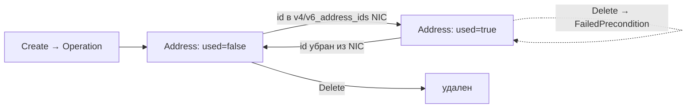

import { DICTIONARY } from '@site/src/constants/dictionary'
import { TYPES } from '@site/src/constants/types'
import { RESTRICTIONS } from '@site/src/constants/restrictions'
import { Restrictions } from '@site/src/components/commonBlocks/Restrictions'
import { Codes } from '@site/src/components/commonBlocks/Codes'
import { StatusTable } from '@site/src/components/commonBlocks/StatusTable'
import { ApiOperation } from '@site/src/components/commonBlocks/ApiOperation'
import Tabs from '@theme/Tabs'
import TabItem from '@theme/TabItem'
import CodeBlock from '@theme/CodeBlock'
import dedent from 'ts-dedent'

# Address

**Address** — это управляемый IP-адрес как самостоятельный, именованный ресурс. Мы выделили
адрес в отдельную сущность, чтобы дать пользователю **стабильную точку адресации**: один и тот же
IP можно создать заранее, переиспользовать, защитить от случайного удаления и привязать к сетевому
интерфейсу — независимо от жизненного цикла самих вычислительных ресурсов. Это закрывает типовую
задачу «нужен постоянный адрес, который не меняется при пересоздании инфраструктуры».

Адрес бывает одного из двух видов (выбирается `oneof address_spec` — **ровно один** вариант):

- **internal** — выделяется из CIDR-блока подсети (`Subnet`) и существует в ее адресном пространстве
  (`internal_ipv4_address_spec` / `internal_ipv6_address_spec`). Используется для приватной адресации
  внутри сети;
- **external** — публичный адрес, аллоцируется встроенным IPAM из глобального пула (`AddressPool`)
  по зоне и виду через каскад резолва пула (`external_ipv4_address_spec` / `external_ipv6_address_spec`).
  Используется для статического входного/выходного адреса в Интернет.

Адрес принадлежит проекту (`project_id`). Адрес, используемый каким-либо ресурсом
(`used = true`) — сетевым интерфейсом (`NetworkInterface`) или network load balancer'ом, —
**нельзя удалить**: сначала отвяжите его у ресурса-потребителя. Кто именно использует адрес,
видно в output-only поле `used_by`. Спецификация вида адреса (`external_*` / `internal_*`) и
`project_id` — **immutable** после `Create`.

## Поля ресурса

<table>
  <thead><tr><th>Поле</th><th>Тип</th><th>Описание</th></tr></thead>
  <tbody>
    <tr><td><code>id</code></td><td><code>{TYPES.string}</code></td><td>{DICTIONARY.id.short}</td></tr>
    <tr><td><code>projectId</code></td><td><code>{TYPES.string}</code></td><td>{DICTIONARY.projectId.short}</td></tr>
    <tr><td><code>name</code></td><td><code>{TYPES.string}</code></td><td>{DICTIONARY.name.short}</td></tr>
    <tr><td><code>description</code></td><td><code>{TYPES.string}</code></td><td>{DICTIONARY.description.short}</td></tr>
    <tr><td><code>labels</code></td><td><code>{TYPES.mapStringString}</code></td><td>{DICTIONARY.labels.short}</td></tr>
    <tr><td><code>createdAt</code></td><td><code>{TYPES.timestamp}</code></td><td>{DICTIONARY.createdAt.short}</td></tr>
    <tr><td><code>externalIpv4Address</code></td><td><code>ExternalIpv4Address</code></td><td>Вариант oneof: внешний IPv4 (<code>address</code>, <code>zoneId</code>, <code>requirements</code>)</td></tr>
    <tr><td><code>internalIpv4Address</code></td><td><code>InternalIpv4Address</code></td><td>Вариант oneof: внутренний IPv4 (<code>address</code>, <code>subnetId</code>)</td></tr>
    <tr><td><code>internalIpv6Address</code></td><td><code>InternalIpv6Address</code></td><td>Вариант oneof: внутренний IPv6 (<code>address</code>, <code>subnetId</code>)</td></tr>
    <tr><td><code>externalIpv6Address</code></td><td><code>ExternalIpv6Address</code></td><td>Вариант oneof: внешний IPv6 (<code>address</code>, <code>zoneId</code>, <code>requirements</code>)</td></tr>
    <tr><td><code>reserved</code></td><td><code>{TYPES.bool}</code></td><td>Адрес зарезервирован (не освобождается автоматически)</td></tr>
    <tr><td><code>used</code></td><td><code>{TYPES.bool}</code></td><td>Адрес используется (output-only; <code>true</code>, когда его использует <code>NetworkInterface</code> или network load balancer)</td></tr>
    <tr><td><code>type</code></td><td><code>Address.Type</code></td><td>Тип адреса: <code>INTERNAL</code> / <code>EXTERNAL</code> (output-only enum)</td></tr>
    <tr><td><code>ipVersion</code></td><td><code>Address.IpVersion</code></td><td>Версия адреса: <code>IPV4</code> / <code>IPV6</code> (output-only enum)</td></tr>
    <tr><td><code>deletionProtection</code></td><td><code>{TYPES.bool}</code></td><td>{DICTIONARY.deletionProtection.short}</td></tr>
    <tr><td><code>usedBy</code></td><td><code>{TYPES.reference}[]</code></td><td>{DICTIONARY.usedBy.short}. Каждый элемент: <code>referrer</code> (<code>type</code>, <code>id</code>, <code>name</code>), <code>type</code> и <code>owned</code> (см. ниже)</td></tr>
    <tr><td><code>dnsRecords</code></td><td><code>DnsRecord[]</code></td><td>DNS-записи адреса (поле зарезервировано; обработка отложена — <code>blocked:kacho-dns</code>)</td></tr>
  </tbody>
</table>

### Тип и версия адреса

`type` и `ipVersion` — output-only enum'ы, вычисляются сервером из выбранного варианта `oneof`:

<StatusTable values={[
  { code: 'INTERNAL', desc: 'Внутренний адрес — выделен из CIDR-блока подсети (internal_ipv4 / internal_ipv6)' },
  { code: 'EXTERNAL', desc: 'Публичный адрес — аллоцирован из глобального пула AddressPool (external_ipv4 / external_ipv6)' },
  { code: 'IPV4', desc: 'Версия протокола — IPv4' },
  { code: 'IPV6', desc: 'Версия протокола — IPv6' },
]} />

:::note Инфра-чувствительные данные
Схема аллокации внешних адресов (какой `AddressPool` сработал, его CIDR-блоки, IPAM-cascade) —
видна только через `InternalAddressService` / `InternalAddressPoolService` на internal-порту.
Публичный `Address` показывает лишь выделенный tenant-адрес и `used_by`
(см. [Авторизация и приватность](/architecture/authz)).
:::

### Кто использует адрес — `usedBy`

`usedBy` — output-only список ссылок (`Reference`), заполняемый сервером на `Get`/`List`
(на `Create`/`Update` игнорируется). Каждый элемент:

<table>
  <thead><tr><th>Поле</th><th>Тип</th><th>Описание</th></tr></thead>
  <tbody>
    <tr><td><code>referrer.type</code></td><td><code>{TYPES.string}</code></td><td>Тип ресурса-потребителя (например, <code>loadbalancer.networkLoadBalancer</code>, <code>compute.instance</code>)</td></tr>
    <tr><td><code>referrer.id</code></td><td><code>{TYPES.string}</code></td><td>id ресурса-потребителя</td></tr>
    <tr><td><code>referrer.name</code></td><td><code>{TYPES.string}</code></td><td>Имя потребителя на момент привязки (best-effort denormalised, может устареть)</td></tr>
    <tr><td><code>type</code></td><td><code>Reference.Type</code></td><td><code>USED_BY</code> / <code>MANAGED_BY</code></td></tr>
    <tr><td><code>owned</code></td><td><code>{TYPES.bool}</code></td><td>Владеет ли потребитель адресом (lifecycle связан), а не просто ссылается. Для VIP network load balancer'а <code>owned=true</code>, когда адрес заказан LB неявно (auto), и <code>owned=false</code>, когда tenant создал адрес заранее и залинковал (link)</td></tr>
  </tbody>
</table>

Флаг `owned` важен при удалении: если LB владеет адресом (`owned=true`), при снятии VIP
адрес освобождается вместе с LB; при `owned=false` адрес — самостоятельный ресурс tenant'а
и переживает LB.

---

## Get

<ApiOperation method="GET" endpoint="/vpc/v1/addresses/{addressId}">

Возвращает адрес по идентификатору.

#### Пример запроса

<CodeBlock language="bash">
  {dedent`
    curl http://localhost:18080/vpc/v1/addresses/{addressId} \\
      -H 'Authorization: Bearer <JWT>'
  `}
</CodeBlock>

#### Пример ответа

<CodeBlock language="json">
  {dedent`
    {
      "id": "{addressId}",
      "projectId": "{projectId}",
      "name": "web-internal",
      "description": "Внутренний адрес фронта",
      "labels": { "app": "web" },
      "createdAt": "2026-06-06T14:27:00Z",
      "internalIpv4Address": {
        "address": "10.0.0.5",
        "subnetId": "{subnetId}"
      },
      "reserved": false,
      "used": true,
      "type": "INTERNAL",
      "ipVersion": "IPV4",
      "deletionProtection": false,
      "usedBy": [
        {
          "referrer": { "type": "network_interface", "id": "{networkInterfaceId}", "name": "web-nic" },
          "type": "USED_BY",
          "owned": false
        }
      ]
    }
  `}
</CodeBlock>

<Restrictions items={[{ label: 'resourceId', rules: RESTRICTIONS.resourceId }]} />
<Codes codes={['invalidArgument', 'notFound', 'permissionDenied', 'internal']} />

</ApiOperation>

---

## List

<ApiOperation method="GET" endpoint="/vpc/v1/addresses">

Список адресов проекта с фильтром и cursor-пагинацией. Опциональный `subnetId` ограничивает
выборку адресами, выделенными из указанной подсети.

#### Параметры запроса

<table>
  <thead><tr><th>Параметр</th><th>Обязательность</th><th>Тип</th><th>Описание</th></tr></thead>
  <tbody>
    <tr><td><code>projectId</code></td><td><strong>да</strong></td><td><code>{TYPES.string}</code></td><td>{DICTIONARY.projectId.short}</td></tr>
    <tr><td><code>filter</code></td><td>нет</td><td><code>{TYPES.string}</code></td><td>{DICTIONARY.filter.short}</td></tr>
    <tr><td><code>subnetId</code></td><td>нет</td><td><code>{TYPES.string}</code></td><td>Только адреса, выделенные из этой подсети (для ref-picker NIC)</td></tr>
    <tr><td><code>pageSize</code></td><td>нет</td><td><code>{TYPES.int64}</code></td><td>{DICTIONARY.pageSize.short}</td></tr>
    <tr><td><code>pageToken</code></td><td>нет</td><td><code>{TYPES.string}</code></td><td>{DICTIONARY.pageToken.short}</td></tr>
  </tbody>
</table>

#### Пример запроса

<CodeBlock language="bash">
  {dedent`
    curl 'http://localhost:18080/vpc/v1/addresses?projectId={projectId}&filter=name%3D%22web-internal%22' \\
      -H 'Authorization: Bearer <JWT>'
  `}
</CodeBlock>

#### Пример ответа

<CodeBlock language="json">
  {dedent`
    {
      "addresses": [
        {
          "id": "{addressId}",
          "projectId": "{projectId}",
          "name": "web-internal",
          "internalIpv4Address": { "address": "10.0.0.5", "subnetId": "{subnetId}" },
          "type": "INTERNAL",
          "ipVersion": "IPV4",
          "createdAt": "2026-06-06T14:27:00Z"
        }
      ],
      "nextPageToken": ""
    }
  `}
</CodeBlock>

<Restrictions items={[
  { label: 'projectId', rules: RESTRICTIONS.projectId },
  { label: 'pagination', rules: RESTRICTIONS.pagination },
]} />
<Codes codes={['invalidArgument', 'permissionDenied', 'internal']} />

</ApiOperation>

---

## Create

<ApiOperation method="POST" endpoint="/vpc/v1/addresses" async>

Создает адрес. Возвращает `Operation` (async). В worker'е: проверка существования проекта →
аллокация IP (internal — из CIDR подсети; external — встроенным IPAM из `AddressPool`) →
вставка `Address` → запись событий в outbox.

Тело должно содержать **ровно один** вариант `oneof address_spec`. Если `address` внутри спеки не
задан — IP выделяется автоматически (internal — из подсети, external — из пула выбранной зоны).
Повторный `Create` с тем же явным `address` в том же scope идемпотентен на стороне IPAM: один IP
не выдается дважды.

#### Тело запроса

<table>
  <thead><tr><th>Параметр</th><th>Обязательность</th><th>Тип</th><th>Описание</th></tr></thead>
  <tbody>
    <tr><td><code>projectId</code></td><td><strong>да</strong></td><td><code>{TYPES.string}</code></td><td>{DICTIONARY.projectId.short}</td></tr>
    <tr><td><code>name</code></td><td>нет</td><td><code>{TYPES.string}</code></td><td>{DICTIONARY.name.short}</td></tr>
    <tr><td><code>description</code></td><td>нет</td><td><code>{TYPES.string}</code></td><td>{DICTIONARY.description.short}</td></tr>
    <tr><td><code>labels</code></td><td>нет</td><td><code>{TYPES.mapStringString}</code></td><td>{DICTIONARY.labels.short}</td></tr>
    <tr><td><code>internalIpv4AddressSpec</code></td><td>oneof</td><td><code>InternalIpv4AddressSpec</code></td><td>Внутренний IPv4: <code>address?</code> + <code>subnetId</code> (обязателен)</td></tr>
    <tr><td><code>internalIpv6AddressSpec</code></td><td>oneof</td><td><code>InternalIpv6AddressSpec</code></td><td>Внутренний IPv6: <code>address?</code> + <code>subnetId</code> (обязателен)</td></tr>
    <tr><td><code>externalIpv4AddressSpec</code></td><td>oneof</td><td><code>ExternalIpv4AddressSpec</code></td><td>Внешний IPv4: <code>address?</code> + <code>zoneId</code> (если адрес не задан) + <code>requirements?</code></td></tr>
    <tr><td><code>externalIpv6AddressSpec</code></td><td>oneof</td><td><code>ExternalIpv6AddressSpec</code></td><td>Внешний IPv6: <code>address?</code> + <code>zoneId</code> (если адрес не задан) + <code>requirements?</code></td></tr>
    <tr><td><code>deletionProtection</code></td><td>нет</td><td><code>{TYPES.bool}</code></td><td>{DICTIONARY.deletionProtection.short}</td></tr>
  </tbody>
</table>

#### Пример запроса

<Tabs>
  <TabItem value="internal" label="internal IPv4" default>

<CodeBlock language="bash">
  {dedent`
    curl -X POST http://localhost:18080/vpc/v1/addresses \\
      -H 'Authorization: Bearer <JWT>' \\
      -H 'Content-Type: application/json' \\
      -d '{
        "projectId": "{projectId}",
        "name": "web-internal",
        "internalIpv4AddressSpec": { "subnetId": "{subnetId}" }
      }'
  `}
</CodeBlock>

  </TabItem>
  <TabItem value="external" label="external IPv4">

<CodeBlock language="bash">
  {dedent`
    curl -X POST http://localhost:18080/vpc/v1/addresses \\
      -H 'Authorization: Bearer <JWT>' \\
      -H 'Content-Type: application/json' \\
      -d '{
        "projectId": "{projectId}",
        "name": "nat-public",
        "externalIpv4AddressSpec": { "zoneId": "region-1-a" }
      }'
  `}
</CodeBlock>

  </TabItem>
</Tabs>

#### Пример ответа (Operation)

<CodeBlock language="json">
  {dedent`
    {
      "id": "{operationId}",
      "description": "Create address web-internal",
      "createdAt": "2026-06-06T14:27:00Z",
      "done": false,
      "metadata": {
        "@type": "type.googleapis.com/kacho.cloud.vpc.v1.CreateAddressMetadata",
        "addressId": "{addressId}"
      }
    }
  `}
</CodeBlock>

:::tip Опрос результата
Поллите <code>GET /operations/&#123;operationId&#125;</code> до <code>done: true</code>; затем <code>response</code>
содержит созданный <code>Address</code>, либо <code>error</code> — <code>google.rpc.Status</code>.
См. [Операции](/architecture/operations).
:::

:::caution oneof — ровно один вариант
В `address_spec` должен быть указан **ровно один** вариант (`exactly_one`). Ноль или два варианта →
`InvalidArgument`. Для internal-адреса `subnetId` обязателен; explicit `address` должен попадать в
один из CIDR-блоков подсети (иначе `InvalidArgument`).
:::

<Restrictions items={[
  { label: 'projectId', rules: RESTRICTIONS.projectId },
  { label: 'name', rules: RESTRICTIONS.name },
  { label: 'labels', rules: RESTRICTIONS.labels },
  { label: 'zoneId', rules: RESTRICTIONS.zoneId },
]} />
<Codes codes={['invalidArgument', 'alreadyExists', 'notFound', 'failedPrecondition', 'unavailable', 'permissionDenied', 'internal']} />

</ApiOperation>

---

## Update

<ApiOperation method="PATCH" endpoint="/vpc/v1/addresses/{addressId}" async>

Изменяет mutable-поля адреса (`name`, `description`, `labels`, `reserved`, `deletionProtection`).
Спецификация вида адреса (`external_ipv4_address_spec` / `internal_ipv4_address_spec`) и
`project_id` — **immutable**: явное указание в `updateMask` → `InvalidArgument`
(`"<field> is immutable after Address.Create"`).

#### Тело запроса

<table>
  <thead><tr><th>Параметр</th><th>Обязательность</th><th>Тип</th><th>Описание</th></tr></thead>
  <tbody>
    <tr><td><code>updateMask</code></td><td>нет</td><td><code>{TYPES.fieldMask}</code></td><td>{DICTIONARY.updateMask.short}</td></tr>
    <tr><td><code>name</code></td><td>нет</td><td><code>{TYPES.string}</code></td><td>{DICTIONARY.name.short}</td></tr>
    <tr><td><code>description</code></td><td>нет</td><td><code>{TYPES.string}</code></td><td>{DICTIONARY.description.short}</td></tr>
    <tr><td><code>labels</code></td><td>нет</td><td><code>{TYPES.mapStringString}</code></td><td>{DICTIONARY.labels.short}</td></tr>
    <tr><td><code>reserved</code></td><td>нет</td><td><code>{TYPES.bool}</code></td><td>Зарезервировать / снять резерв адреса</td></tr>
    <tr><td><code>deletionProtection</code></td><td>нет</td><td><code>{TYPES.bool}</code></td><td>{DICTIONARY.deletionProtection.short}</td></tr>
  </tbody>
</table>

#### Пример запроса

<CodeBlock language="bash">
  {dedent`
    curl -X PATCH http://localhost:18080/vpc/v1/addresses/{addressId} \\
      -H 'Authorization: Bearer <JWT>' \\
      -H 'Content-Type: application/json' \\
      -d '{
        "updateMask": "reserved,description",
        "reserved": true,
        "description": "Зарезервирован под прод"
      }'
  `}
</CodeBlock>

<Restrictions items={[
  { label: 'resourceId', rules: RESTRICTIONS.resourceId },
  { label: 'updateMask', rules: RESTRICTIONS.updateMask },
]} />
<Codes codes={['invalidArgument', 'notFound', 'permissionDenied', 'internal']} />

</ApiOperation>

---

## Delete

<ApiOperation method="DELETE" endpoint="/vpc/v1/addresses/{addressId}" async>

Удаляет адрес (hard-delete). Возвращает `Operation` (response = `Empty`).

**Адрес в использовании удалить нельзя:** если `used = true` — `FAILED_PRECONDITION`.
Сообщение указывает конкретного потребителя из `used_by`: `"address <id> is in use by
<referrer> <name>; detach it before deleting the address"` (например, `network interface
web-nic` или `network_load_balancer prod-lb`); если referrer-строку прочитать не удалось —
generic `"address <id> is in use"`. Сначала отвяжите адрес у потребителя (для NIC — убрать
его id из `v4_address_ids` / `v6_address_ids` через `NetworkInterface.Update`; для LB —
снять VIP). Также удаление блокируется при включенной `deletionProtection`
(`"address <id> has deletion_protection enabled; clear it via Update before Delete"`).

#### Пример запроса

<CodeBlock language="bash">
  {dedent`
    curl -X DELETE http://localhost:18080/vpc/v1/addresses/{addressId} \\
      -H 'Authorization: Bearer <JWT>'
  `}
</CodeBlock>

#### Пример ответа (Operation, response = Empty)

<CodeBlock language="json">
  {dedent`
    {
      "id": "{operationId}",
      "description": "Delete address {addressId}",
      "done": false,
      "metadata": {
        "@type": "type.googleapis.com/kacho.cloud.vpc.v1.DeleteAddressMetadata",
        "addressId": "{addressId}"
      }
    }
  `}
</CodeBlock>

<Restrictions items={[{ label: 'resourceId', rules: RESTRICTIONS.resourceId }]} />
<Codes codes={['invalidArgument', 'notFound', 'failedPrecondition', 'permissionDenied', 'internal']} />

</ApiOperation>

---

## GetByValue

<ApiOperation method="GET" endpoint="/vpc/v1/addresses:byValue">

Возвращает адрес по его **значению** (текстовому IP), а не по id. Удобно для ref-валидации в
peer-сервисах. Указывается один из вариантов значения (`externalIpv4Address` /
`internalIpv4Address`); для internal-адреса дополнительно задается область поиска `subnetId`.

#### Параметры запроса

<table>
  <thead><tr><th>Параметр</th><th>Обязательность</th><th>Тип</th><th>Описание</th></tr></thead>
  <tbody>
    <tr><td><code>externalIpv4Address</code></td><td>oneof</td><td><code>{TYPES.string}</code></td><td>Значение внешнего IPv4-адреса для поиска</td></tr>
    <tr><td><code>internalIpv4Address</code></td><td>oneof</td><td><code>{TYPES.string}</code></td><td>Значение внутреннего IPv4-адреса для поиска</td></tr>
    <tr><td><code>subnetId</code></td><td>нет</td><td><code>{TYPES.string}</code></td><td>{DICTIONARY.subnetId.short} — область поиска internal-адреса</td></tr>
  </tbody>
</table>

#### Пример запроса

<CodeBlock language="bash">
  {dedent`
    curl 'http://localhost:18080/vpc/v1/addresses:byValue?internalIpv4Address=10.0.0.5&subnetId={subnetId}' \\
      -H 'Authorization: Bearer <JWT>'
  `}
</CodeBlock>

#### Пример ответа

<CodeBlock language="json">
  {dedent`
    {
      "id": "{addressId}",
      "projectId": "{projectId}",
      "name": "web-internal",
      "internalIpv4Address": { "address": "10.0.0.5", "subnetId": "{subnetId}" },
      "type": "INTERNAL",
      "ipVersion": "IPV4",
      "used": true
    }
  `}
</CodeBlock>

<Codes codes={['invalidArgument', 'notFound', 'permissionDenied', 'internal']} />

</ApiOperation>

---

## ListBySubnet

<ApiOperation method="GET" endpoint="/vpc/v1/addresses:bySubnet">

Список адресов, выделенных из указанной подсети (`subnetId` обязателен). Используется для
ref-валидации и UI-выбора адресов в пределах конкретной `Subnet`.

#### Параметры запроса

<table>
  <thead><tr><th>Параметр</th><th>Обязательность</th><th>Тип</th><th>Описание</th></tr></thead>
  <tbody>
    <tr><td><code>subnetId</code></td><td><strong>да</strong></td><td><code>{TYPES.string}</code></td><td>{DICTIONARY.subnetId.short}</td></tr>
    <tr><td><code>pageSize</code></td><td>нет</td><td><code>{TYPES.int64}</code></td><td>{DICTIONARY.pageSize.short}</td></tr>
    <tr><td><code>pageToken</code></td><td>нет</td><td><code>{TYPES.string}</code></td><td>{DICTIONARY.pageToken.short}</td></tr>
  </tbody>
</table>

#### Пример запроса

<CodeBlock language="bash">
  {dedent`
    curl 'http://localhost:18080/vpc/v1/addresses:bySubnet?subnetId={subnetId}' \\
      -H 'Authorization: Bearer <JWT>'
  `}
</CodeBlock>

#### Пример ответа

<CodeBlock language="json">
  {dedent`
    {
      "addresses": [
        {
          "id": "{addressId}",
          "internalIpv4Address": { "address": "10.0.0.5", "subnetId": "{subnetId}" },
          "type": "INTERNAL",
          "ipVersion": "IPV4"
        }
      ],
      "nextPageToken": ""
    }
  `}
</CodeBlock>

<Restrictions items={[
  { label: 'resourceId', rules: RESTRICTIONS.resourceId },
  { label: 'pagination', rules: RESTRICTIONS.pagination },
]} />
<Codes codes={['invalidArgument', 'permissionDenied', 'internal']} />

</ApiOperation>

---

## ListOperations

<ApiOperation method="GET" endpoint="/vpc/v1/addresses/{addressId}/operations">

Список операций по конкретному адресу (cursor-пагинация).

#### Параметры запроса

<table>
  <thead><tr><th>Параметр</th><th>Обязательность</th><th>Тип</th><th>Описание</th></tr></thead>
  <tbody>
    <tr><td><code>addressId</code></td><td><strong>да</strong></td><td><code>{TYPES.string}</code></td><td>{DICTIONARY.id.short}</td></tr>
    <tr><td><code>pageSize</code></td><td>нет</td><td><code>{TYPES.int64}</code></td><td>{DICTIONARY.pageSize.short}</td></tr>
    <tr><td><code>pageToken</code></td><td>нет</td><td><code>{TYPES.string}</code></td><td>{DICTIONARY.pageToken.short}</td></tr>
  </tbody>
</table>

#### Пример запроса

<CodeBlock language="bash">
  {dedent`
    curl 'http://localhost:18080/vpc/v1/addresses/{addressId}/operations' \\
      -H 'Authorization: Bearer <JWT>'
  `}
</CodeBlock>

<Restrictions items={[
  { label: 'resourceId', rules: RESTRICTIONS.resourceId },
  { label: 'pagination', rules: RESTRICTIONS.pagination },
]} />
<Codes codes={['invalidArgument', 'notFound', 'permissionDenied', 'internal']} />

</ApiOperation>

---

## Жизненный цикл и привязка

`Address` — независимый ресурс: он создается, существует и удаляется отдельно от своих
потребителей. Связь устанавливается со стороны потребителя: для `NetworkInterface` — id
адреса добавляется в `v4_address_ids` / `v6_address_ids` интерфейса
(см. [NetworkInterface](/api/network-interface)); network load balancer может использовать
адрес как VIP. Как только адрес начинает использоваться, сервис помечает его `used = true`
и заполняет `used_by`, а адрес становится защищенным от удаления. Флаг `owned` в `used_by`
различает адрес, заказанный потребителем неявно (`owned=true`, освобождается вместе с ним),
и заранее созданный tenant'ом и залинкованный (`owned=false`, переживает потребителя).

:::note Источник истины — vpc
И internal-, и external-адрес целиком управляется в kacho-vpc: его выделение, привязка и
освобождение не требуют участия других сервисов. Существование `zone_id` для external-адреса
валидируется через kacho-geo на этапе создания.
:::

## Типичные сценарии

<table>
  <thead><tr><th>Задача</th><th>Как сделать</th></tr></thead>
  <tbody>
    <tr>
      <td>Статический внешний IPv4 под входной трафик</td>
      <td><code>Create</code> с <code>externalIpv4AddressSpec.zoneId</code> (без <code>address</code> — IP выдаст IPAM) → дождаться <code>Operation.done</code> → привязать id к <code>NetworkInterface</code>. Адрес сохранится при пересоздании интерфейса.</td>
    </tr>
    <tr>
      <td>Внутренний IPv4 под конкретный NIC</td>
      <td><code>Create</code> с <code>internalIpv4AddressSpec.subnetId</code>; при необходимости задать точный <code>address</code> из CIDR подсети. Затем добавить id адреса в <code>v4_address_ids</code> интерфейса.</td>
    </tr>
    <tr>
      <td>Зарезервировать адрес впрок</td>
      <td><code>Create</code> + <code>Update</code> c <code>reserved=true</code> и <code>deletionProtection=true</code> — IP закреплен за проектом, но еще не привязан к интерфейсу.</td>
    </tr>
    <tr>
      <td>Найти адрес по значению IP</td>
      <td><code>GetByValue</code> (для internal — с <code>subnetId</code> как областью поиска); для перечисления в пределах подсети — <code>ListBySubnet</code>.</td>
    </tr>
  </tbody>
</table>

## Подводные камни и рекомендации

:::caution Что важно знать
- **Удаление используемого адреса** (`used = true`) → `FailedPrecondition`; сообщение
  называет потребителя из `used_by`. Сначала отвяжите адрес у него (для NIC — уберите id
  адреса из `v4_address_ids` / `v6_address_ids` через `NetworkInterface.Update`; для LB —
  снимите VIP), затем удаляйте. То же для `deletionProtection = true` — снимите защиту перед
  удалением.
- **Вид адреса immutable.** После `Create` нельзя сменить `internal` ↔ `external` или версию
  протокола — это другой ресурс. Указание `internal_*`/`external_*`/`project_id` в `updateMask` →
  `InvalidArgument` (`"<field> is immutable after Address.Create"`).
- **Explicit internal `address`** должен попадать в один из CIDR-блоков подсети — иначе
  `InvalidArgument`. Для external без явного `address` поле `zoneId` обязательно (из него IPAM
  выбирает пул).
- **External-адреса берутся из пула.** Если в выбранной зоне нет подходящего `AddressPool`
  (по виду/семейству v4/v6) или пул исчерпан — `Create` завершится ошибкой в `Operation.error`.
  Управление пулами — admin-функция (см. [Авторизация и приватность](/architecture/authz)).
:::

:::tip Рекомендации
- Создавайте внешний адрес **заранее и без явного значения** — пусть IPAM выберет свободный IP;
  фиксируйте именно полученный адрес в своей конфигурации.
- Для адресов, критичных к доступности, включайте `deletionProtection` — это снимает риск
  случайного удаления через автоматизацию.
- Привязка адреса — асинхронная операция на стороне `NetworkInterface`; после ее завершения
  перечитайте `Address.used`, чтобы убедиться в фактической привязке (Watch RPC не существует —
  поллите `Operation.Get` или `Get`).
:::
