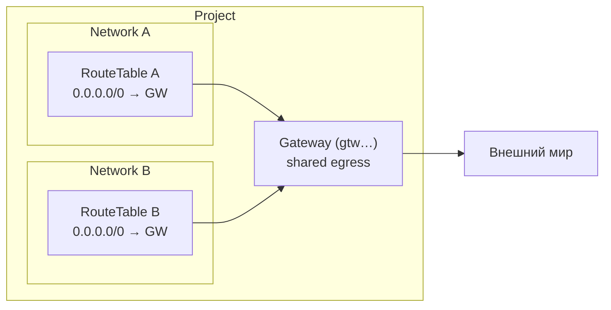

import { DICTIONARY } from '@site/src/constants/dictionary'
import { TYPES } from '@site/src/constants/types'
import { RESTRICTIONS } from '@site/src/constants/restrictions'
import { Restrictions } from '@site/src/components/commonBlocks/Restrictions'
import { Codes } from '@site/src/components/commonBlocks/Codes'
import { ApiOperation } from '@site/src/components/commonBlocks/ApiOperation'
import CodeBlock from '@theme/CodeBlock'
import dedent from 'ts-dedent'

# Gateway

**Gateway** — это управляемая Kachō точка выхода ваших сетей во внешний мир. Вместо
того чтобы заводить отдельный egress-узел в каждой сети и держать его конфигурацию
синхронной вручную, вы создаете один shared egress-шлюз на уровне проекта и
переиспользуете его как next-hop в маршрутах любых своих сетей. Это снимает с команды
рутину по дублированию инфраструктуры выхода и дает единую, предсказуемую границу
исходящего трафика для всего проекта.

Абстракция намеренно сделана **project-level и shared**: один `Gateway` обслуживает
маршруты из разных `Network` одного проекта. Так egress становится переиспользуемым
ресурсом, а не свойством конкретной сети — вы описываете «куда выходить» один раз и
ссылаетесь на это из таблиц маршрутизации там, где нужно.

В отличие от `Subnet` / `RouteTable` / `SecurityGroup`, шлюз **не привязан к Network** —
у него есть только `project_id`. Конфигурация типа шлюза задается через `oneof gateway`;
на текущем этапе доступен единственный вариант — `sharedEgressGateway` (общий egress).

:::note Строгое имя (отличие от прочих VPC-ресурсов)
Имя Gateway валидируется **строгим** контрактом: только lowercase, **без uppercase и
underscore** (regex `^([a-z]([-a-z0-9]{0,61}[a-z0-9])?)?$`; пустая строка допустима).
Остальные ресурсы VPC (`Network` / `Subnet` / …) используют permissive-контракт, где
дополнительно разрешены uppercase и underscore. Учитывайте это при автоматизации, чтобы
имя, валидное для сети, не отвалилось на шлюзе.
:::

## Поля ресурса

<table>
  <thead><tr><th>Поле</th><th>Тип</th><th>Описание</th></tr></thead>
  <tbody>
    <tr><td><code>id</code></td><td><code>{TYPES.string}</code></td><td>{DICTIONARY.id.short} (префикс <code>gtw</code>)</td></tr>
    <tr><td><code>projectId</code></td><td><code>{TYPES.string}</code></td><td>{DICTIONARY.projectId.short}</td></tr>
    <tr><td><code>name</code></td><td><code>{TYPES.string}</code></td><td>Имя шлюза (strict, lowercase; уникально в пределах проекта)</td></tr>
    <tr><td><code>description</code></td><td><code>{TYPES.string}</code></td><td>{DICTIONARY.description.short}</td></tr>
    <tr><td><code>labels</code></td><td><code>{TYPES.mapStringString}</code></td><td>{DICTIONARY.labels.short}</td></tr>
    <tr><td><code>createdAt</code></td><td><code>{TYPES.timestamp}</code></td><td>{DICTIONARY.createdAt.short}</td></tr>
    <tr><td><code>sharedEgressGateway</code></td><td><code>SharedEgressGateway</code></td><td>Спецификация шлюза (вариант <code>oneof gateway</code>); общий egress-шлюз</td></tr>
  </tbody>
</table>

:::info Префикс ID
Идентификатор шлюза имеет префикс <code>gtw</code>: 3-символьный префикс + 17 символов
crockford-base32, тип ресурса читается по префиксу. Префикс <code>enp</code> — у
операций (`Operation`), не у шлюзов.
:::

## Где используется Gateway

Шлюз сам по себе не «включает» выход в интернет — он становится точкой выхода, когда на
него ссылается маршрут. Привязка происходит на стороне [RouteTable](/api/route-table):
маршрут указывает шлюз как next-hop, и трафик подсетей, к которым привязана эта таблица,
направляется через него.

:::note Next-hop в маршруте — текущая фаза
В контракте `RouteTable` next-hop через `gateway_id` зарезервирован в `oneof next_hop`;
на текущем этапе маршруты задают next-hop через `nextHopAddress`. Сам ресурс `Gateway`
создается и управляется уже сейчас и готов к привязке, как только включится
`gateway_id`-вариант next-hop.
:::

---

## Get

<ApiOperation method="GET" endpoint="/vpc/v1/gateways/{gatewayId}">

Возвращает шлюз по идентификатору (sync). Malformed id (нераспознанный префикс) →
`InvalidArgument` первым стейтментом; well-formed, но отсутствующий → `NotFound`.

#### Пример запроса

<CodeBlock language="bash">
  {dedent`
    curl http://localhost:18080/vpc/v1/gateways/{gatewayId} \\
      -H 'Authorization: Bearer <JWT>'
  `}
</CodeBlock>

#### Пример ответа

<CodeBlock language="json">
  {dedent`
    {
      "id": "{gatewayId}",
      "projectId": "{projectId}",
      "name": "egress-gw",
      "description": "Общий egress-шлюз",
      "labels": { "env": "prod" },
      "createdAt": "2026-06-06T14:27:00Z",
      "sharedEgressGateway": {}
    }
  `}
</CodeBlock>

<Restrictions items={[{ label: 'resourceId', rules: RESTRICTIONS.resourceId }]} />
<Codes codes={['invalidArgument', 'notFound', 'permissionDenied', 'internal']} />

</ApiOperation>

---

## List

<ApiOperation method="GET" endpoint="/vpc/v1/gateways">

Список шлюзов проекта (sync) с фильтром и cursor-пагинацией. Результат отфильтрован по
правам вызывающего: вы видите только шлюзы проектов, к которым у вас есть доступ.

#### Параметры запроса

<table>
  <thead><tr><th>Параметр</th><th>Обязательность</th><th>Тип</th><th>Описание</th></tr></thead>
  <tbody>
    <tr><td><code>projectId</code></td><td><strong>да</strong></td><td><code>{TYPES.string}</code></td><td>{DICTIONARY.projectId.short}</td></tr>
    <tr><td><code>filter</code></td><td>нет</td><td><code>{TYPES.string}</code></td><td>{DICTIONARY.filter.short}</td></tr>
    <tr><td><code>pageSize</code></td><td>нет</td><td><code>{TYPES.int64}</code></td><td>{DICTIONARY.pageSize.short}</td></tr>
    <tr><td><code>pageToken</code></td><td>нет</td><td><code>{TYPES.string}</code></td><td>{DICTIONARY.pageToken.short}</td></tr>
  </tbody>
</table>

#### Пример запроса

<CodeBlock language="bash">
  {dedent`
    curl 'http://localhost:18080/vpc/v1/gateways?projectId={projectId}&filter=name%3D%22egress-gw%22' \\
      -H 'Authorization: Bearer <JWT>'
  `}
</CodeBlock>

#### Пример ответа

<CodeBlock language="json">
  {dedent`
    {
      "gateways": [
        {
          "id": "{gatewayId}",
          "projectId": "{projectId}",
          "name": "egress-gw",
          "createdAt": "2026-06-06T14:27:00Z",
          "sharedEgressGateway": {}
        }
      ],
      "nextPageToken": ""
    }
  `}
</CodeBlock>

:::tip Пагинация
Если `nextPageToken` непуст — есть еще страница: передайте его в `pageToken` следующего
запроса. Токен opaque (base64 от `{createdAt, id}`); не конструируйте его вручную.
:::

<Restrictions items={[
  { label: 'projectId', rules: RESTRICTIONS.projectId },
  { label: 'pagination', rules: RESTRICTIONS.pagination },
]} />
<Codes codes={['invalidArgument', 'permissionDenied', 'internal']} />

</ApiOperation>

---

## Create

<ApiOperation method="POST" endpoint="/vpc/v1/gateways" async>

Создает шлюз в указанном проекте. Возвращает `Operation` (async). В обработчике
операции: проверка существования проекта → вставка `Gateway` → запись события в outbox.
Имя должно быть уникальным в пределах проекта (дубликат → `ALREADY_EXISTS`).

#### Тело запроса

<table>
  <thead><tr><th>Параметр</th><th>Обязательность</th><th>Тип</th><th>Описание</th></tr></thead>
  <tbody>
    <tr><td><code>projectId</code></td><td><strong>да</strong></td><td><code>{TYPES.string}</code></td><td>{DICTIONARY.projectId.short}</td></tr>
    <tr><td><code>name</code></td><td>нет</td><td><code>{TYPES.string}</code></td><td>Имя шлюза (strict, lowercase; уникально в проекте)</td></tr>
    <tr><td><code>description</code></td><td>нет</td><td><code>{TYPES.string}</code></td><td>{DICTIONARY.description.short}</td></tr>
    <tr><td><code>labels</code></td><td>нет</td><td><code>{TYPES.mapStringString}</code></td><td>{DICTIONARY.labels.short}</td></tr>
    <tr><td><code>sharedEgressGatewaySpec</code></td><td>нет</td><td><code>SharedEgressGatewaySpec</code></td><td>Спецификация типа шлюза (вариант <code>oneof gateway</code>); пустой объект для shared-egress</td></tr>
  </tbody>
</table>

#### Пример запроса

<CodeBlock language="bash">
  {dedent`
    curl -X POST http://localhost:18080/vpc/v1/gateways \\
      -H 'Authorization: Bearer <JWT>' \\
      -H 'Content-Type: application/json' \\
      -d '{
        "projectId": "{projectId}",
        "name": "egress-gw",
        "labels": { "env": "prod" },
        "sharedEgressGatewaySpec": {}
      }'
  `}
</CodeBlock>

#### Пример ответа (Operation)

<CodeBlock language="json">
  {dedent`
    {
      "id": "{operationId}",
      "description": "Create gateway egress-gw",
      "createdAt": "2026-06-06T14:27:00Z",
      "done": false,
      "metadata": {
        "@type": "type.googleapis.com/kacho.cloud.vpc.v1.CreateGatewayMetadata",
        "gatewayId": "{gatewayId}"
      }
    }
  `}
</CodeBlock>

:::tip Опрос результата
Поллите <code>GET /operations/&#123;operationId&#125;</code> до <code>done: true</code>; затем <code>response</code>
содержит созданный <code>Gateway</code>, либо <code>error</code> — <code>google.rpc.Status</code>.
См. [Операции](/architecture/operations).
:::

<Restrictions items={[
  { label: 'projectId', rules: RESTRICTIONS.projectId },
  { label: 'name', rules: RESTRICTIONS.nameGateway },
  { label: 'description', rules: RESTRICTIONS.description },
  { label: 'labels', rules: RESTRICTIONS.labels },
]} />
<Codes codes={['invalidArgument', 'alreadyExists', 'notFound', 'unavailable', 'permissionDenied', 'internal']} />

</ApiOperation>

---

## Update

<ApiOperation method="PATCH" endpoint="/vpc/v1/gateways/{gatewayId}" async>

Изменяет mutable-поля шлюза (`name`, `description`, `labels`, `sharedEgressGatewaySpec`).
Поле `projectId` — immutable. Возвращает `Operation` (async). Соблюдается
`update_mask`-дисциплина: неизвестное поле или immutable в маске → `InvalidArgument`;
пустая маска = full-PATCH (применяются все mutable-поля, immutable из тела
игнорируются).

#### Тело запроса

<table>
  <thead><tr><th>Параметр</th><th>Обязательность</th><th>Тип</th><th>Описание</th></tr></thead>
  <tbody>
    <tr><td><code>updateMask</code></td><td>нет</td><td><code>{TYPES.fieldMask}</code></td><td>{DICTIONARY.updateMask.short}</td></tr>
    <tr><td><code>name</code></td><td>нет</td><td><code>{TYPES.string}</code></td><td>Новое имя шлюза (strict, lowercase; уникально в проекте)</td></tr>
    <tr><td><code>description</code></td><td>нет</td><td><code>{TYPES.string}</code></td><td>{DICTIONARY.description.short}</td></tr>
    <tr><td><code>labels</code></td><td>нет</td><td><code>{TYPES.mapStringString}</code></td><td>{DICTIONARY.labels.short} (полная замена набора)</td></tr>
    <tr><td><code>sharedEgressGatewaySpec</code></td><td>нет</td><td><code>SharedEgressGatewaySpec</code></td><td>Новая спецификация типа шлюза (вариант <code>oneof gateway</code>)</td></tr>
  </tbody>
</table>

#### Пример запроса

<CodeBlock language="bash">
  {dedent`
    curl -X PATCH http://localhost:18080/vpc/v1/gateways/{gatewayId} \\
      -H 'Authorization: Bearer <JWT>' \\
      -H 'Content-Type: application/json' \\
      -d '{
        "updateMask": "description",
        "description": "Egress-шлюз (обновлено)"
      }'
  `}
</CodeBlock>

#### Пример ответа (Operation)

<CodeBlock language="json">
  {dedent`
    {
      "id": "{operationId}",
      "description": "Update gateway {gatewayId}",
      "done": false,
      "metadata": {
        "@type": "type.googleapis.com/kacho.cloud.vpc.v1.UpdateGatewayMetadata",
        "gatewayId": "{gatewayId}"
      }
    }
  `}
</CodeBlock>

:::caution Полная замена labels
`labels` обновляется целиком: переданный набор **полностью заменяет** существующий. Чтобы
добавить или убрать одну метку — прочитайте текущий набор (`Get`), измените локально и
отправьте результат.
:::

<Restrictions items={[
  { label: 'updateMask', rules: RESTRICTIONS.updateMask },
  { label: 'name', rules: RESTRICTIONS.nameGateway },
]} />
<Codes codes={['invalidArgument', 'notFound', 'alreadyExists', 'permissionDenied', 'internal']} />

</ApiOperation>

---

## Delete

<ApiOperation method="DELETE" endpoint="/vpc/v1/gateways/{gatewayId}" async>

Удаляет шлюз (hard-delete). Возвращает `Operation`, чей `response` —
`google.protobuf.Empty`.

#### Пример запроса

<CodeBlock language="bash">
  {dedent`
    curl -X DELETE http://localhost:18080/vpc/v1/gateways/{gatewayId} \\
      -H 'Authorization: Bearer <JWT>'
  `}
</CodeBlock>

#### Пример ответа (Operation, response = Empty)

<CodeBlock language="json">
  {dedent`
    {
      "id": "{operationId}",
      "description": "Delete gateway {gatewayId}",
      "done": false,
      "metadata": {
        "@type": "type.googleapis.com/kacho.cloud.vpc.v1.DeleteGatewayMetadata",
        "gatewayId": "{gatewayId}"
      }
    }
  `}
</CodeBlock>

:::caution Шлюз как next-hop
Прежде чем удалять шлюз, на который ссылаются маршруты, снимите эти ссылки в
соответствующих `RouteTable`. Удаленный шлюз нельзя использовать как точку выхода, а
повторное создание выдаст новый `id`.
:::

<Restrictions items={[{ label: 'resourceId', rules: RESTRICTIONS.resourceId }]} />
<Codes codes={['invalidArgument', 'notFound', 'failedPrecondition', 'permissionDenied', 'internal']} />

</ApiOperation>

---

## ListOperations

<ApiOperation method="GET" endpoint="/vpc/v1/gateways/{gatewayId}/operations">

Список операций (LRO) для указанного шлюза (sync) с cursor-пагинацией — история
`Create` / `Update` / `Delete`. Удобно для аудита изменений и диагностики застрявших
операций.

#### Параметры запроса

<table>
  <thead><tr><th>Параметр</th><th>Обязательность</th><th>Тип</th><th>Описание</th></tr></thead>
  <tbody>
    <tr><td><code>gatewayId</code></td><td><strong>да</strong></td><td><code>{TYPES.string}</code></td><td>{DICTIONARY.id.short} (path-параметр)</td></tr>
    <tr><td><code>pageSize</code></td><td>нет</td><td><code>{TYPES.int64}</code></td><td>{DICTIONARY.pageSize.short}</td></tr>
    <tr><td><code>pageToken</code></td><td>нет</td><td><code>{TYPES.string}</code></td><td>{DICTIONARY.pageToken.short}</td></tr>
  </tbody>
</table>

#### Пример запроса

<CodeBlock language="bash">
  {dedent`
    curl 'http://localhost:18080/vpc/v1/gateways/{gatewayId}/operations' \\
      -H 'Authorization: Bearer <JWT>'
  `}
</CodeBlock>

#### Пример ответа

<CodeBlock language="json">
  {dedent`
    {
      "operations": [
        {
          "id": "{operationId}",
          "description": "Create gateway egress-gw",
          "createdAt": "2026-06-06T14:27:00Z",
          "done": true
        }
      ],
      "nextPageToken": ""
    }
  `}
</CodeBlock>

<Restrictions items={[
  { label: 'resourceId', rules: RESTRICTIONS.resourceId },
  { label: 'pagination', rules: RESTRICTIONS.pagination },
]} />
<Codes codes={['invalidArgument', 'notFound', 'permissionDenied', 'internal']} />

</ApiOperation>

---

## Типичные сценарии

- **Единый выход для всего проекта.** Создаете один shared egress-шлюз и ссылаетесь на
  него из маршрутов всех сетей проекта — выход управляется в одном месте, конфигурация
  не дублируется по сетям.
- **Разделение окружений метками.** Помечаете шлюзы (`env: prod` / `env: staging`) и
  находите нужный через `List` с `filter=name="…"`, а группировку и поиск ведете по
  `labels`.
- **Аудит и диагностика.** `ListOperations` дает хронологию изменений конкретного шлюза —
  кто и когда его создал/правил, и завершилась ли последняя операция.

## Подводные камни и рекомендации

:::caution Что важно знать
- **Project-level, не network-level.** Шлюз не «лежит» в сети — он общий для проекта.
  Не заводите по шлюзу на каждую сеть «по привычке»: одного достаточно для многих сетей.
- **Строгое имя.** Имя шлюза строже, чем у остальных VPC-ресурсов (только lowercase, без
  underscore). Шаблон имени, валидный для `Network`/`Subnet`, может не подойти шлюзу.
- **Уникальность имени — в пределах проекта.** Повторное `name` → `ALREADY_EXISTS`.
  В разных проектах имена не конфликтуют.
- **`labels` заменяются целиком.** Частичное обновление меток нужно делать через
  read-modify-write (`Get` → правка → `Update`).
- **Привязка к маршрутам.** Связь шлюза с трафиком живет в `RouteTable` (next-hop), а не
  в самом `Gateway`. Перед удалением шлюза снимите ссылающиеся на него маршруты.
:::

:::tip Best practices
- Давайте шлюзу осмысленное `name` и поддерживайте `labels` (`env`, `team`) — это
  главный способ навигации, отдельного «типа» у shared-egress пока нет.
- Все мутации асинхронные: дожидайтесь `done: true` в `Operation`, прежде чем строить
  на шлюз маршруты в автоматизации.
- Для воспроизводимых стендов держите создание шлюза в одном описании инфраструктуры
  рядом с сетями и таблицами маршрутизации проекта.
:::
