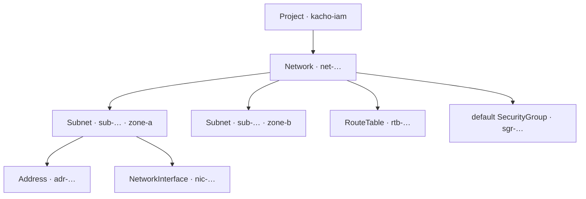

import { DICTIONARY } from '@site/src/constants/dictionary'
import { TYPES } from '@site/src/constants/types'
import { RESTRICTIONS } from '@site/src/constants/restrictions'
import { Restrictions } from '@site/src/components/commonBlocks/Restrictions'
import { Codes } from '@site/src/components/commonBlocks/Codes'
import { StatusTable } from '@site/src/components/commonBlocks/StatusTable'
import { ApiOperation } from '@site/src/components/commonBlocks/ApiOperation'
import Tabs from '@theme/Tabs'
import TabItem from '@theme/TabItem'
import CodeBlock from '@theme/CodeBlock'
import dedent from 'ts-dedent'

# Network

**Network** — это изолированная виртуальная сеть проекта: единое адресное и
административное пространство, внутри которого живут все остальные сетевые ресурсы. Вы
заводите `Network`, когда вам нужен собственный сетевой периметр для приложения или
окружения — место, где вы сами контролируете адресацию (через подсети), маршрутизацию
(через таблицы маршрутов) и допустимый трафик (через группы безопасности), не пересекаясь
с другими проектами и окружениями.

Сети разных проектов полностью изолированы друг от друга, поэтому одну и ту же приватную
адресацию (например, `10.0.0.0/16`) можно безопасно использовать в `prod`, `staging` и
`dev` одновременно. `Network` — это контейнер верхнего уровня: подсети (`Subnet`), таблицы
маршрутизации (`RouteTable`) и группы безопасности (`SecurityGroup`) всегда принадлежат
конкретной сети. Чтобы вы могли начать работу сразу, **при создании сети автоматически
заводится default-`SecurityGroup`** — стартовый набор правил трафика, к которому по
умолчанию привязываются новые интерфейсы.

:::info Идентификатор и владелец
ID сети — префикс `net` + 17 символов crockford-base32 (например, `net-a1b2c3d4e5f6g7h8j`).
Сеть всегда принадлежит проекту `kacho-iam` (`projectId`, immutable). Зоны (`zoneId` у
подсетей) — отдельный домен `kacho-geo`; сама `Network` к зоне не привязана и охватывает
все зоны.
:::

## Поля ресурса

<table>
  <thead><tr><th>Поле</th><th>Тип</th><th>Описание</th></tr></thead>
  <tbody>
    <tr><td><code>id</code></td><td><code>{TYPES.string}</code></td><td>{DICTIONARY.id.short}</td></tr>
    <tr><td><code>projectId</code></td><td><code>{TYPES.string}</code></td><td>{DICTIONARY.projectId.short}</td></tr>
    <tr><td><code>name</code></td><td><code>{TYPES.string}</code></td><td>{DICTIONARY.name.short}</td></tr>
    <tr><td><code>description</code></td><td><code>{TYPES.string}</code></td><td>{DICTIONARY.description.short}</td></tr>
    <tr><td><code>labels</code></td><td><code>{TYPES.mapStringString}</code></td><td>{DICTIONARY.labels.short}</td></tr>
    <tr><td><code>createdAt</code></td><td><code>{TYPES.timestamp}</code></td><td>{DICTIONARY.createdAt.short}</td></tr>
    <tr><td><code>defaultSecurityGroupId</code></td><td><code>{TYPES.string}</code></td><td>id default-SG (output-only; устанавливается сервером при Create)</td></tr>
  </tbody>
</table>

---

## Get

<ApiOperation method="GET" endpoint="/vpc/v1/networks/{networkId}">

Возвращает сеть по идентификатору.

#### Пример запроса

<CodeBlock language="bash">
  {dedent`
    curl http://localhost:18080/vpc/v1/networks/{networkId} \\
      -H 'Authorization: Bearer <JWT>'
  `}
</CodeBlock>

#### Пример ответа

<CodeBlock language="json">
  {dedent`
    {
      "id": "{networkId}",
      "projectId": "{projectId}",
      "name": "prod-net",
      "description": "Продуктивная сеть",
      "labels": { "env": "prod" },
      "createdAt": "2026-06-06T14:27:00Z",
      "defaultSecurityGroupId": "{securityGroupId}"
    }
  `}
</CodeBlock>

<Codes codes={['invalidArgument', 'notFound', 'permissionDenied', 'internal']} />

</ApiOperation>

---

## List

<ApiOperation method="GET" endpoint="/vpc/v1/networks">

Список сетей проекта с фильтром и cursor-пагинацией.

#### Параметры запроса

<table>
  <thead><tr><th>Параметр</th><th>Обязательность</th><th>Тип</th><th>Описание</th></tr></thead>
  <tbody>
    <tr><td><code>projectId</code></td><td>да</td><td><code>{TYPES.string}</code></td><td>{DICTIONARY.projectId.short}</td></tr>
    <tr><td><code>filter</code></td><td>нет</td><td><code>{TYPES.string}</code></td><td>{DICTIONARY.filter.short}</td></tr>
    <tr><td><code>pageSize</code></td><td>нет</td><td><code>{TYPES.int64}</code></td><td>{DICTIONARY.pageSize.short}</td></tr>
    <tr><td><code>pageToken</code></td><td>нет</td><td><code>{TYPES.string}</code></td><td>{DICTIONARY.pageToken.short}</td></tr>
  </tbody>
</table>

#### Пример запроса

<CodeBlock language="bash">
  {dedent`
    curl 'http://localhost:18080/vpc/v1/networks?projectId={projectId}&filter=name%3D%22prod-net%22' \\
      -H 'Authorization: Bearer <JWT>'
  `}
</CodeBlock>

#### Пример ответа

<CodeBlock language="json">
  {dedent`
    {
      "networks": [
        { "id": "{networkId}", "projectId": "{projectId}", "name": "prod-net", "createdAt": "2026-06-06T14:27:00Z" }
      ],
      "nextPageToken": ""
    }
  `}
</CodeBlock>

<Restrictions items={[{ label: 'pagination', rules: RESTRICTIONS.pagination }]} />
<Codes codes={['invalidArgument', 'permissionDenied', 'internal']} />

</ApiOperation>

---

## Create

<ApiOperation method="POST" endpoint="/vpc/v1/networks" async>

Создает новую сеть. Возвращает `Operation` (async). В worker'е: вставка Network →
inline-создание default-`SecurityGroup` → запись событий в outbox.

#### Тело запроса

<table>
  <thead><tr><th>Параметр</th><th>Обязательность</th><th>Тип</th><th>Описание</th></tr></thead>
  <tbody>
    <tr><td><code>projectId</code></td><td><strong>да</strong></td><td><code>{TYPES.string}</code></td><td>{DICTIONARY.projectId.short}</td></tr>
    <tr><td><code>name</code></td><td>нет</td><td><code>{TYPES.string}</code></td><td>{DICTIONARY.name.short}</td></tr>
    <tr><td><code>description</code></td><td>нет</td><td><code>{TYPES.string}</code></td><td>{DICTIONARY.description.short}</td></tr>
    <tr><td><code>labels</code></td><td>нет</td><td><code>{TYPES.mapStringString}</code></td><td>{DICTIONARY.labels.short}</td></tr>
  </tbody>
</table>

#### Пример запроса

<CodeBlock language="bash">
  {dedent`
    curl -X POST http://localhost:18080/vpc/v1/networks \\
      -H 'Authorization: Bearer <JWT>' \\
      -H 'Content-Type: application/json' \\
      -d '{
        "projectId": "{projectId}",
        "name": "prod-net",
        "labels": { "env": "prod" }
      }'
  `}
</CodeBlock>

#### Пример ответа (Operation)

<CodeBlock language="json">
  {dedent`
    {
      "id": "{operationId}",
      "description": "Create network prod-net",
      "createdAt": "2026-06-06T14:27:00Z",
      "done": false,
      "metadata": {
        "@type": "type.googleapis.com/kacho.cloud.vpc.v1.CreateNetworkMetadata",
        "networkId": "{networkId}"
      }
    }
  `}
</CodeBlock>

:::tip Опрос результата
Поллите <code>GET /operations/&#123;operationId&#125;</code> до <code>done: true</code>; затем <code>response</code>
содержит созданный <code>Network</code>, либо <code>error</code> — <code>google.rpc.Status</code>.
См. [Операции](/architecture/operations).
:::

<Restrictions items={[
  { label: 'projectId', rules: RESTRICTIONS.projectId },
  { label: 'name', rules: RESTRICTIONS.name },
  { label: 'labels', rules: RESTRICTIONS.labels },
]} />
<Codes codes={['invalidArgument', 'alreadyExists', 'notFound', 'unavailable', 'permissionDenied', 'internal']} />

</ApiOperation>

---

## Update

<ApiOperation method="PATCH" endpoint="/vpc/v1/networks/{networkId}" async>

Изменяет mutable-поля сети (`name`, `description`, `labels`). Поле `projectId` — immutable.

#### Тело запроса

<table>
  <thead><tr><th>Параметр</th><th>Обязательность</th><th>Тип</th><th>Описание</th></tr></thead>
  <tbody>
    <tr><td><code>updateMask</code></td><td>нет</td><td><code>{TYPES.fieldMask}</code></td><td>{DICTIONARY.updateMask.short}</td></tr>
    <tr><td><code>name</code></td><td>нет</td><td><code>{TYPES.string}</code></td><td>{DICTIONARY.name.short}</td></tr>
    <tr><td><code>description</code></td><td>нет</td><td><code>{TYPES.string}</code></td><td>{DICTIONARY.description.short}</td></tr>
    <tr><td><code>labels</code></td><td>нет</td><td><code>{TYPES.mapStringString}</code></td><td>{DICTIONARY.labels.short}</td></tr>
  </tbody>
</table>

#### Пример запроса

<CodeBlock language="bash">
  {dedent`
    curl -X PATCH http://localhost:18080/vpc/v1/networks/{networkId} \\
      -H 'Authorization: Bearer <JWT>' \\
      -H 'Content-Type: application/json' \\
      -d '{
        "updateMask": "description",
        "description": "Прод-сеть (обновлено)"
      }'
  `}
</CodeBlock>

<Restrictions items={[{ label: 'updateMask', rules: RESTRICTIONS.updateMask }]} />
<Codes codes={['invalidArgument', 'notFound', 'permissionDenied', 'internal']} />

</ApiOperation>

---

## Delete

<ApiOperation method="DELETE" endpoint="/vpc/v1/networks/{networkId}" async>

Удаляет сеть (hard-delete). Worker удаляет default-SG и саму сеть атомарно, в одной
writer-транзакции вместе с outbox-событиями. **Непустая сеть**
(есть Subnet / не-default SG / RouteTable) → `FAILED_PRECONDITION "network is not empty"`.

#### Пример запроса

<CodeBlock language="bash">
  {dedent`
    curl -X DELETE http://localhost:18080/vpc/v1/networks/{networkId} \\
      -H 'Authorization: Bearer <JWT>'
  `}
</CodeBlock>

#### Пример ответа (Operation, response = Empty)

<CodeBlock language="json">
  {dedent`
    {
      "id": "{operationId}",
      "description": "Delete network {networkId}",
      "done": false,
      "metadata": { "@type": "type.googleapis.com/kacho.cloud.vpc.v1.DeleteNetworkMetadata", "networkId": "{networkId}" }
    }
  `}
</CodeBlock>

<Codes codes={['invalidArgument', 'notFound', 'failedPrecondition', 'permissionDenied', 'internal']} />

</ApiOperation>

---

## ListSubnets

<ApiOperation method="GET" endpoint="/vpc/v1/networks/{networkId}/subnets">

Список подсетей (`Subnet`), принадлежащих указанной сети, с cursor-пагинацией. Удобный
дочерний list-RPC: фильтрует по `networkId` без необходимости передавать `projectId`.

#### Параметры запроса

<table>
  <thead><tr><th>Параметр</th><th>Обязательность</th><th>Тип</th><th>Описание</th></tr></thead>
  <tbody>
    <tr><td><code>networkId</code></td><td><strong>да</strong></td><td><code>{TYPES.string}</code></td><td>{DICTIONARY.networkId.short} (path-параметр)</td></tr>
    <tr><td><code>pageSize</code></td><td>нет</td><td><code>{TYPES.int64}</code></td><td>{DICTIONARY.pageSize.short}</td></tr>
    <tr><td><code>pageToken</code></td><td>нет</td><td><code>{TYPES.string}</code></td><td>{DICTIONARY.pageToken.short}</td></tr>
  </tbody>
</table>

#### Пример запроса

<CodeBlock language="bash">
  {dedent`
    curl http://localhost:18080/vpc/v1/networks/{networkId}/subnets \\
      -H 'Authorization: Bearer <JWT>'
  `}
</CodeBlock>

#### Пример ответа

<CodeBlock language="json">
  {dedent`
    {
      "subnets": [
        { "id": "{subnetId}", "networkId": "{networkId}", "zoneId": "zone-a", "name": "prod-subnet-a", "v4CidrBlocks": ["10.0.0.0/24"] }
      ],
      "nextPageToken": ""
    }
  `}
</CodeBlock>

<Restrictions items={[
  { label: 'networkId', rules: RESTRICTIONS.resourceId },
  { label: 'pagination', rules: RESTRICTIONS.pagination },
]} />
<Codes codes={['invalidArgument', 'notFound', 'permissionDenied', 'internal']} />

</ApiOperation>

---

## ListSecurityGroups

<ApiOperation method="GET" endpoint="/vpc/v1/networks/{networkId}/security_groups">

Список групп безопасности (`SecurityGroup`) указанной сети, включая default-SG, с
cursor-пагинацией.

#### Параметры запроса

<table>
  <thead><tr><th>Параметр</th><th>Обязательность</th><th>Тип</th><th>Описание</th></tr></thead>
  <tbody>
    <tr><td><code>networkId</code></td><td><strong>да</strong></td><td><code>{TYPES.string}</code></td><td>{DICTIONARY.networkId.short} (path-параметр)</td></tr>
    <tr><td><code>pageSize</code></td><td>нет</td><td><code>{TYPES.int64}</code></td><td>{DICTIONARY.pageSize.short}</td></tr>
    <tr><td><code>pageToken</code></td><td>нет</td><td><code>{TYPES.string}</code></td><td>{DICTIONARY.pageToken.short}</td></tr>
  </tbody>
</table>

#### Пример запроса

<CodeBlock language="bash">
  {dedent`
    curl http://localhost:18080/vpc/v1/networks/{networkId}/security_groups \\
      -H 'Authorization: Bearer <JWT>'
  `}
</CodeBlock>

#### Пример ответа

<CodeBlock language="json">
  {dedent`
    {
      "securityGroups": [
        { "id": "{securityGroupId}", "networkId": "{networkId}", "name": "default-sg-{net8}" }
      ],
      "nextPageToken": ""
    }
  `}
</CodeBlock>

<Restrictions items={[
  { label: 'networkId', rules: RESTRICTIONS.resourceId },
  { label: 'pagination', rules: RESTRICTIONS.pagination },
]} />
<Codes codes={['invalidArgument', 'notFound', 'permissionDenied', 'internal']} />

</ApiOperation>

---

## ListRouteTables

<ApiOperation method="GET" endpoint="/vpc/v1/networks/{networkId}/route_tables">

Список таблиц маршрутов (`RouteTable`) указанной сети с cursor-пагинацией.

#### Параметры запроса

<table>
  <thead><tr><th>Параметр</th><th>Обязательность</th><th>Тип</th><th>Описание</th></tr></thead>
  <tbody>
    <tr><td><code>networkId</code></td><td><strong>да</strong></td><td><code>{TYPES.string}</code></td><td>{DICTIONARY.networkId.short} (path-параметр)</td></tr>
    <tr><td><code>pageSize</code></td><td>нет</td><td><code>{TYPES.int64}</code></td><td>{DICTIONARY.pageSize.short}</td></tr>
    <tr><td><code>pageToken</code></td><td>нет</td><td><code>{TYPES.string}</code></td><td>{DICTIONARY.pageToken.short}</td></tr>
  </tbody>
</table>

#### Пример запроса

<CodeBlock language="bash">
  {dedent`
    curl http://localhost:18080/vpc/v1/networks/{networkId}/route_tables \\
      -H 'Authorization: Bearer <JWT>'
  `}
</CodeBlock>

#### Пример ответа

<CodeBlock language="json">
  {dedent`
    {
      "routeTables": [
        { "id": "{routeTableId}", "networkId": "{networkId}", "name": "rt-main" }
      ],
      "nextPageToken": ""
    }
  `}
</CodeBlock>

<Restrictions items={[
  { label: 'networkId', rules: RESTRICTIONS.resourceId },
  { label: 'pagination', rules: RESTRICTIONS.pagination },
]} />
<Codes codes={['invalidArgument', 'notFound', 'permissionDenied', 'internal']} />

</ApiOperation>

---

## ListOperations

<ApiOperation method="GET" endpoint="/vpc/v1/networks/{networkId}/operations">

Список операций (LRO) над указанной сетью с cursor-пагинацией.

#### Параметры запроса

<table>
  <thead><tr><th>Параметр</th><th>Обязательность</th><th>Тип</th><th>Описание</th></tr></thead>
  <tbody>
    <tr><td><code>networkId</code></td><td><strong>да</strong></td><td><code>{TYPES.string}</code></td><td>{DICTIONARY.networkId.short} (path-параметр)</td></tr>
    <tr><td><code>pageSize</code></td><td>нет</td><td><code>{TYPES.int64}</code></td><td>{DICTIONARY.pageSize.short}</td></tr>
    <tr><td><code>pageToken</code></td><td>нет</td><td><code>{TYPES.string}</code></td><td>{DICTIONARY.pageToken.short}</td></tr>
  </tbody>
</table>

#### Пример запроса

<CodeBlock language="bash">
  {dedent`
    curl http://localhost:18080/vpc/v1/networks/{networkId}/operations \\
      -H 'Authorization: Bearer <JWT>'
  `}
</CodeBlock>

<Restrictions items={[
  { label: 'networkId', rules: RESTRICTIONS.resourceId },
  { label: 'pagination', rules: RESTRICTIONS.pagination },
]} />
<Codes codes={['invalidArgument', 'notFound', 'permissionDenied', 'internal']} />

</ApiOperation>

---

## Сценарии использования

- **Сетевой периметр окружения.** Заводите отдельную `Network` под каждое окружение
  (`prod` / `staging` / `dev`) — за счет изоляции одну и ту же приватную адресацию можно
  переиспользовать без конфликтов, а доступ разграничивать на уровне проекта `kacho-iam`.
- **Мульти-зональное приложение.** Одна `Network` охватывает все зоны: создайте в ней по
  подсети на зону (`Subnet` с разными `zoneId`) — получите отказоустойчивую раскладку
  ресурсов внутри единого адресного пространства и общих групп безопасности.
- **Инвентаризация сети.** Дочерние list-RPC (`ListSubnets`, `ListSecurityGroups`,
  `ListRouteTables`) дают срез содержимого сети без необходимости фильтровать по проекту —
  удобно для дашбордов и аудита.
- **Отслеживание провижининга.** `ListOperations` показывает историю асинхронных операций
  над сетью; используйте его для диагностики «зависших» Create/Delete.

## Подводные камни

:::caution Удаление непустой сети
`Delete` отклоняется с `FAILED_PRECONDITION "network is not empty"`, пока в сети есть хотя
бы один `Subnet`, не-default `SecurityGroup` или `RouteTable` (FK `ON DELETE RESTRICT`).
Default-`SecurityGroup` при этом не считается препятствием — он удаляется вместе с сетью в
одной транзакции. Корректный порядок зачистки — снизу вверх:
`NetworkInterface → Address → Subnet` (а также не-default SG и RouteTable) `→ Network`.
:::

:::note Default-SecurityGroup — output-only
Поле `defaultSecurityGroupId` заполняется сервером в момент `Create` (default-SG создается
inline в worker'е, в той же writer-транзакции) и не принимается на вход. Сам default-SG
виден в выдаче `ListSecurityGroups` и доступен через API `SecurityGroup`.
:::

:::note Create и Update — асинхронные
Мутации возвращают `Operation` сразу, до фактического применения. Сеть и ее default-SG
появляются только после `done: true`. Поллите `GET /operations/{operationId}` либо
дочерние list-RPC — отдельного Watch-механизма в API нет.
:::

## Рекомендации

- **Метки вместо «говорящих» имен.** Размечайте сети через `labels` (`env`, `team`,
  `tier`) — фильтр `List` и поиск в UI опираются на них, а имя остается человекочитаемым.
- **Одна сеть на изоляционную границу.** Не дробите окружение на множество сетей без
  необходимости: маршрутизация и группы безопасности живут внутри одной `Network`, поэтому
  единый периметр проще в эксплуатации.
- **Чистите снизу вверх.** Перед удалением сети сначала освободите адреса и интерфейсы,
  затем подсети, маршруты и пользовательские группы безопасности — это избавит от серии
  `FAILED_PRECONDITION`.
