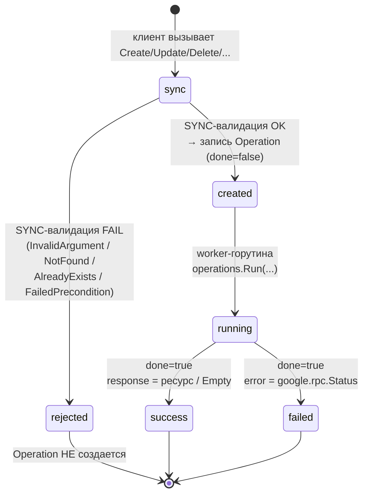
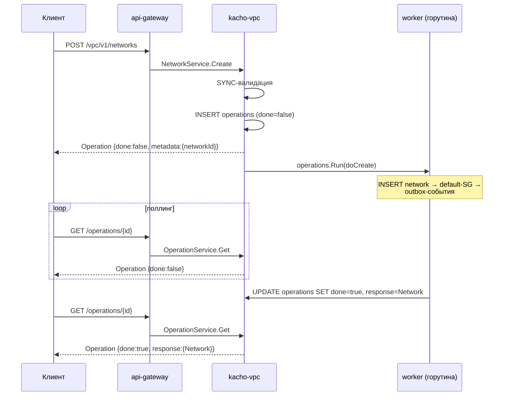

import { DICTIONARY } from '@site/src/constants/dictionary'
import { TYPES } from '@site/src/constants/types'
import { Codes } from '@site/src/components/commonBlocks/Codes'
import { ApiOperation } from '@site/src/components/commonBlocks/ApiOperation'
import CodeBlock from '@theme/CodeBlock'
import dedent from 'ts-dedent'

# Operations (LRO)

## Зачем нужна модель Operation

Изменение сетевого ресурса — это не мгновенный факт, а **намерение**, которое платформа
исполняет: создать сеть с default-SG, выделить адрес, перепрограммировать правила. Чтобы клиент
не блокировался на время этого исполнения и при этом всегда мог узнать «что в итоге получилось»,
Kachō вводит единую абстракцию — **Operation** (Long Running Operation, LRO). Мутирующий RPC
сразу возвращает «квитанцию» с идентификатором, а результат (или ошибку) клиент забирает позже,
опрашивая операцию. Эта квитанция — durable: она переживает рестарт сервиса, повторное чтение
идемпотентно, а в `metadata` сразу лежит id создаваемого ресурса. Так одна модель закрывает
сразу несколько задач: неблокирующий клиент, наблюдаемость хода работы и устойчивый к сбоям
контракт «запросил → отследил → получил итог».

**Operation** — асинхронная долгоиграющая операция. Каждая **мутация** в Kachō VPC
(`Create` / `Update` / `Delete`, а также ресурс-специфичные `AddCidrBlocks` / `RemoveCidrBlocks` /
`UpdateRules` / …) выполняется **не синхронно**: RPC сразу возвращает `Operation`-envelope с
`done: false`, а реальная работа идет в worker-горутине. Клиент **поллит** статус операции по ее
`id`, пока не получит `done: true`.

:::note Исключение — admin-ресурс AddressPool
[`AddressPool`](/api/address-pool) (internal admin-API) мутирует **синхронно** и `Operation`
не использует — у его коротких метаданных-операций нет асинхронной фазы. Async-модель ниже
относится к tenant-ресурсам VPC (Network / Subnet / Address / RouteTable / SecurityGroup /
Gateway / NetworkInterface).
:::

:::info Почему так
Синхронный возврат ресурса из мутирующего RPC **запрещен** конвенциями Kachō. Единая
async-модель дает устойчивый контракт: клиент не блокируется на длинных операциях,
повторный опрос идемпотентен, а сама запись об операции (вместе с результатом или ошибкой)
переживает рестарт сервиса — она хранится в таблице `operations` базы `kacho_vpc`.
:::

## Структура Operation

`Operation` (`kacho.cloud.operation.v1.Operation`) — плоский envelope с полем-результатом
в виде `oneof`:

<table>
  <thead><tr><th>Поле</th><th>Тип</th><th>Описание</th></tr></thead>
  <tbody>
    <tr><td><code>id</code></td><td><code>{TYPES.string}</code></td><td>Идентификатор операции. Для VPC использует выделенный префикс <code>enp</code> (декаплен от префиксов ресурсов; по нему api-gateway маршрутизирует <code>OperationService.Get</code> в backend VPC)</td></tr>
    <tr><td><code>description</code></td><td><code>{TYPES.string}</code></td><td>Человеко-читаемое описание (например <code>Create network prod-net</code>; ≤256 символов)</td></tr>
    <tr><td><code>createdAt</code></td><td><code>{TYPES.timestamp}</code></td><td>Время постановки операции (truncate до секунд)</td></tr>
    <tr><td><code>done</code></td><td><code>{TYPES.bool}</code></td><td><code>false</code> — операция еще выполняется; <code>true</code> — завершена, выставлен ровно один из <code>error</code> / <code>response</code></td></tr>
    <tr><td><code>metadata</code></td><td><code>google.protobuf.Any</code></td><td>Сервис-специфичная метадата (как правило id целевого ресурса — см. ниже). Доступна сразу, еще до завершения</td></tr>
    <tr><td><code>error</code></td><td><code>google.rpc.Status</code></td><td>Результат при неудаче: <code>&#123;code, message, details[]&#125;</code>. Часть <code>oneof result</code></td></tr>
    <tr><td><code>response</code></td><td><code>google.protobuf.Any</code></td><td>Результат при успехе: целевой ресурс (для Create/Update) либо <code>google.protobuf.Empty</code> (для Delete). Часть <code>oneof result</code></td></tr>
  </tbody>
</table>

:::note Инвариант oneof result
Пока <code>done: false</code> — **ни** <code>error</code>, **ни** <code>response</code> не заполнены
(если только не зафиксирован ранний сбой). При <code>done: true</code> — выставлен **ровно один**
из них. Клиент сначала проверяет <code>done</code>, затем — какая ветвь <code>oneof</code> заполнена.
:::

Поля `createdBy` / `principalType` / `principalId` / `principalDisplayName` идентифицируют
субъекта, инициировавшего операцию (заполняются auth-интерцептором). `modifiedAt` —
время последнего изменения записи (выставляется при переводе в `done`).

## Жизненный цикл

Важно: **синхронные** ошибки (формат id, regex имени, host-биты CIDR, immutable-поле в
`update_mask`, дубль `(project_id, name)`, несуществующий parent-ресурс в БД VPC, CIDR overlap)
возвращаются **сразу как gRPC-ошибка** — `Operation` при этом **не создается**. **Асинхронные**
ошибки (несуществующий project, недоступность peer-сервиса, а также DB-backstop sync-проверок
при гонке — FK-violation / UNIQUE / EXCLUDE) фиксируются **внутри** уже созданной операции —
в поле `error` при `done: true`.

## OperationService.Get

<ApiOperation method="GET" endpoint="/operations/{operationId}">

Возвращает текущее состояние операции по ее идентификатору. Это **синхронный read** — основа
паттерна поллинга. Маршрутизация в нужный backend идет по 3-символьному префиксу `id`
(`enp…` → kacho-vpc).

#### Параметры пути

<table>
  <thead><tr><th>Параметр</th><th>Обязательность</th><th>Тип</th><th>Описание</th></tr></thead>
  <tbody>
    <tr><td><code>operationId</code></td><td><strong>да</strong></td><td><code>{TYPES.string}</code></td><td>Идентификатор операции (из ответа мутирующего RPC)</td></tr>
  </tbody>
</table>

#### Пример запроса

<CodeBlock language="bash">
  {dedent`
    curl http://localhost:18080/operations/{operationId} \\
      -H 'Authorization: Bearer <JWT>'
  `}
</CodeBlock>

#### Пример ответа — операция выполняется

<CodeBlock language="json">
  {dedent`
    {
      "id": "{operationId}",
      "description": "Create network prod-net",
      "createdAt": "2026-06-06T14:27:00Z",
      "done": false,
      "metadata": {
        "@type": "type.googleapis.com/kacho.cloud.vpc.v1.CreateNetworkMetadata",
        "networkId": "{networkId}"
      }
    }
  `}
</CodeBlock>

#### Пример ответа — операция завершена успешно

<CodeBlock language="json">
  {dedent`
    {
      "id": "{operationId}",
      "description": "Create network prod-net",
      "createdAt": "2026-06-06T14:27:00Z",
      "modifiedAt": "2026-06-06T14:27:01Z",
      "done": true,
      "metadata": {
        "@type": "type.googleapis.com/kacho.cloud.vpc.v1.CreateNetworkMetadata",
        "networkId": "{networkId}"
      },
      "response": {
        "@type": "type.googleapis.com/kacho.cloud.vpc.v1.Network",
        "id": "{networkId}",
        "projectId": "{projectId}",
        "name": "prod-net",
        "createdAt": "2026-06-06T14:27:01Z",
        "defaultSecurityGroupId": "{securityGroupId}"
      }
    }
  `}
</CodeBlock>

#### Пример ответа — операция завершена с ошибкой

<CodeBlock language="json">
  {dedent`
    {
      "id": "{operationId}",
      "description": "Create subnet sub-a",
      "createdAt": "2026-06-06T14:30:00Z",
      "modifiedAt": "2026-06-06T14:30:00Z",
      "done": true,
      "metadata": {
        "@type": "type.googleapis.com/kacho.cloud.vpc.v1.CreateSubnetMetadata",
        "subnetId": "{subnetId}"
      },
      "error": {
        "code": 5,
        "message": "Project with id {projectId} not found",
        "details": []
      }
    }
  `}
</CodeBlock>

<Codes codes={['invalidArgument', 'notFound', 'permissionDenied', 'internal']} />

</ApiOperation>

## OperationService.Cancel

<ApiOperation method="POST" endpoint="/operations/{operationId}:cancel">

Запрашивает отмену операции, которая еще выполняется, и возвращает ее обновленное состояние.
Это **best-effort**: отменить можно только операцию с `done: false` — попытка отменить уже
завершенную операцию отклоняется. Маршрутизация в backend — по тому же 3-символьному префиксу
`id` (`enp…` → kacho-vpc).

#### Параметры пути

<table>
  <thead><tr><th>Параметр</th><th>Обязательность</th><th>Тип</th><th>Описание</th></tr></thead>
  <tbody>
    <tr><td><code>operationId</code></td><td><strong>да</strong></td><td><code>{TYPES.string}</code></td><td>Идентификатор отменяемой операции</td></tr>
  </tbody>
</table>

#### Пример запроса

<CodeBlock language="bash">
  {dedent`
    curl -X POST http://localhost:18080/operations/{operationId}:cancel \\
      -H 'Authorization: Bearer <JWT>'
  `}
</CodeBlock>

:::caution Отмена уже завершенной операции
Операция в состоянии `done: true` неотменяема — повторный `Cancel` вернет
`FAILED_PRECONDITION "operation <id> already completed"`. Несуществующий `id` → `NOT_FOUND`.
:::

<Codes codes={['invalidArgument', 'notFound', 'failedPrecondition', 'internal']} />

</ApiOperation>

## Паттерн поллинга

Клиент опрашивает `GET /operations/{operationId}` с небольшим интервалом, пока не увидит
`done: true`, после чего читает результат из соответствующей ветви `oneof`.

<CodeBlock language="bash">
  {dedent`
    OP={operationId}
    # Поллим, пока done != true
    until curl -s http://localhost:18080/operations/$OP \\
            -H 'Authorization: Bearer <JWT>' | grep -q '"done": *true'; do
      sleep 1
    done
    # Готово — забираем финальное состояние (response или error)
    curl -s http://localhost:18080/operations/$OP -H 'Authorization: Bearer <JWT>'
  `}
</CodeBlock>

:::tip Рекомендации по поллингу
- Интервал **2–5 секунд**; для большинства VPC-операций результат готов в течение секунды.
- Операция **идемпотентна на чтение** — повторный `Get` после `done: true` всегда отдает тот же финальный результат.
- Альтернатива поллингу одной операции — `List`-poll самого ресурса (2–5 сек) или `ListOperations` по ресурсу (см. ниже). Server-streaming `Watch` в публичном API **не существует** — поллинг и есть штатный механизм.
:::

## Метадата операции

Поле `metadata` (тип `google.protobuf.Any`) заполняется **сразу** при постановке операции и
несет id целевого ресурса — так клиент узнает `id` еще **до** завершения `Create`. Тип
метадаты — `Create<Res>Metadata` / `Update<Res>Metadata` / `Delete<Res>Metadata` и т.п.

<table>
  <thead><tr><th>Тип метадаты (<code>@type</code>)</th><th>Поле</th></tr></thead>
  <tbody>
    <tr><td><code>CreateNetworkMetadata</code></td><td><code>networkId</code></td></tr>
    <tr><td><code>CreateSubnetMetadata</code></td><td><code>subnetId</code></td></tr>
    <tr><td><code>CreateAddressMetadata</code></td><td><code>addressId</code></td></tr>
    <tr><td><code>CreateSecurityGroupMetadata</code></td><td><code>securityGroupId</code></td></tr>
    <tr><td><code>DeleteNetworkMetadata</code></td><td><code>networkId</code></td></tr>
  </tbody>
</table>

## Результат операции (oneof result)

Содержимое `response` зависит от типа исходной операции:

<table>
  <thead><tr><th>Операция</th><th><code>response</code> (<code>@type</code>)</th></tr></thead>
  <tbody>
    <tr><td><code>Create&lt;Res&gt;</code></td><td>Целевой ресурс — например <code>vpc.v1.Network</code></td></tr>
    <tr><td><code>Update&lt;Res&gt;</code></td><td>Обновленный целевой ресурс</td></tr>
    <tr><td><code>Delete&lt;Res&gt;</code></td><td><code>google.protobuf.Empty</code> — данных нет</td></tr>
  </tbody>
</table>

:::note Delete → response = Empty
Для всех Delete-операций `response` — это `google.protobuf.Empty` (`{}`): сам удаленный ресурс
в ответе не возвращается, а его id остается доступен в `metadata`. При неуспехе (например
непустая сеть) вместо `response` заполняется `error` с `FAILED_PRECONDITION "network is not empty"`.
:::

#### Пример ответа Delete — успех

<CodeBlock language="json">
  {dedent`
    {
      "id": "{operationId}",
      "description": "Delete network {networkId}",
      "done": true,
      "metadata": {
        "@type": "type.googleapis.com/kacho.cloud.vpc.v1.DeleteNetworkMetadata",
        "networkId": "{networkId}"
      },
      "response": {
        "@type": "type.googleapis.com/google.protobuf.Empty"
      }
    }
  `}
</CodeBlock>

## ListOperations по ресурсу

Глобального «списка всех операций» нет — операции перечисляются **в контексте конкретного
ресурса**. Каждый сервис экспонирует `ListOperations` под path-ом своего ресурса:

<table>
  <thead><tr><th>Ресурс</th><th>REST</th></tr></thead>
  <tbody>
    <tr><td>Network</td><td><code>GET /vpc/v1/networks/&#123;networkId&#125;/operations</code></td></tr>
    <tr><td>Subnet</td><td><code>GET /vpc/v1/subnets/&#123;subnetId&#125;/operations</code></td></tr>
    <tr><td>Address</td><td><code>GET /vpc/v1/addresses/&#123;addressId&#125;/operations</code></td></tr>
    <tr><td>RouteTable</td><td><code>GET /vpc/v1/routeTables/&#123;routeTableId&#125;/operations</code></td></tr>
    <tr><td>SecurityGroup</td><td><code>GET /vpc/v1/securityGroups/&#123;securityGroupId&#125;/operations</code></td></tr>
    <tr><td>Gateway</td><td><code>GET /vpc/v1/gateways/&#123;gatewayId&#125;/operations</code></td></tr>
    <tr><td>NetworkInterface</td><td><code>GET /vpc/v1/networkInterfaces/&#123;networkInterfaceId&#125;/operations</code></td></tr>
  </tbody>
</table>

Эти методы поддерживают cursor-пагинацию (`pageSize` / `pageToken`), как и обычный `List`.

## Полный цикл: Create → poll → done

Сквозной пример создания сети с опросом до завершения:

#### 1. Поставить операцию (Create)

<CodeBlock language="bash">
  {dedent`
    curl -X POST http://localhost:18080/vpc/v1/networks \\
      -H 'Authorization: Bearer <JWT>' \\
      -H 'Content-Type: application/json' \\
      -d '{ "projectId": "{projectId}", "name": "prod-net" }'
  `}
</CodeBlock>

Ответ — `Operation` с `done: false`; `metadata.networkId` уже известен:

<CodeBlock language="json">
  {dedent`
    {
      "id": "{operationId}",
      "description": "Create network prod-net",
      "done": false,
      "metadata": {
        "@type": "type.googleapis.com/kacho.cloud.vpc.v1.CreateNetworkMetadata",
        "networkId": "{networkId}"
      }
    }
  `}
</CodeBlock>

#### 2. Опрашивать операцию до `done: true`

<CodeBlock language="bash">
  {dedent`
    curl http://localhost:18080/operations/{operationId} \\
      -H 'Authorization: Bearer <JWT>'
  `}
</CodeBlock>

#### 3. Финальный результат — `response` содержит созданный Network

<CodeBlock language="json">
  {dedent`
    {
      "id": "{operationId}",
      "description": "Create network prod-net",
      "done": true,
      "metadata": {
        "@type": "type.googleapis.com/kacho.cloud.vpc.v1.CreateNetworkMetadata",
        "networkId": "{networkId}"
      },
      "response": {
        "@type": "type.googleapis.com/kacho.cloud.vpc.v1.Network",
        "id": "{networkId}",
        "projectId": "{projectId}",
        "name": "prod-net",
        "defaultSecurityGroupId": "{securityGroupId}"
      }
    }
  `}
</CodeBlock>

:::tip Дальше
После `done: true` целевой ресурс доступен и через обычный `GET /vpc/v1/networks/{networkId}`
(id берется из `metadata`). Подробнее о самом ресурсе — [Network](/api/network).
:::

## Подводные камни и рекомендации

:::caution Что важно знать
- **Сначала проверяйте `done`, потом ветвь `oneof`.** Пока `done: false`, обращаться к `response`
  бессмысленно — он не заполнен; читать результат можно только после `done: true`.
- **Sync-ошибки и async-ошибки приходят по-разному.** Ошибки валидации (формат id, regex имени,
  host-биты CIDR, immutable-поле в `updateMask`, дубль `(projectId, name)`, CIDR overlap)
  возвращаются **сразу как gRPC-ошибка**, и `Operation` при этом не создается. Ошибки, всплывшие
  уже во время исполнения (несуществующий project, недоступность peer-сервиса, DB-backstop при
  гонке), попадают **в `error` готовой операции** при `done: true`. Обрабатывайте оба пути.
- **`metadata` доступна сразу, `response` — нет.** id создаваемого ресурса известен из `metadata`
  еще до завершения, поэтому не нужно «угадывать» его из `response`.
- **`Delete` не возвращает удаленный ресурс.** Успешный `response` для Delete — это
  `google.protobuf.Empty` (`{}`); сам ресурс уже не существует, но его id остается в `metadata`.
- **`Cancel` — best-effort и только для in-flight.** Завершенную операцию отменить нельзя
  (`FAILED_PRECONDITION`); большинство VPC-операций завершаются за доли секунды, так что отмена
  обычно не успевает примениться.
:::

:::tip Рекомендации
- Интервал поллинга — **2–5 секунд**; не делайте busy-loop без паузы.
- Не храните результат «навсегда» в клиенте — перечитайте операцию: чтение после `done: true`
  всегда возвращает один и тот же финальный результат (идемпотентно).
- Для in-flight-операций конкретного ресурса используйте `ListOperations` по его path-у
  (см. выше) — это удобнее, чем хранить список id у себя.
- Server-streaming `Watch` в публичном API **отсутствует** — поллинг `Get` (или `List` ресурса
  каждые 2–5 секунд) и есть штатный механизм отслеживания.
:::
