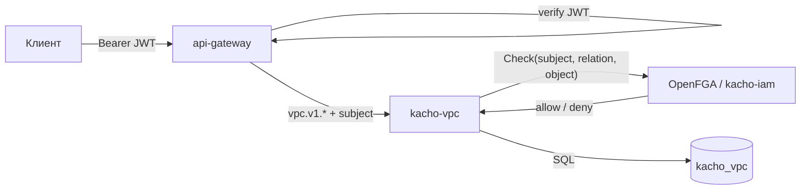

import { Codes } from '@site/src/components/commonBlocks/Codes'
import { Restrictions } from '@site/src/components/commonBlocks/Restrictions'
import { RESTRICTIONS } from '@site/src/constants/restrictions'
import CodeBlock from '@theme/CodeBlock'
import dedent from 'ts-dedent'

# Обзор API

Эта страница описывает **конвенции**, общие для всего публичного API Kachō VPC: REST-пути и
suffix-actions, формат JSON, аутентификацию и авторизацию, асинхронную модель `Operation`, формат
ошибок, дисциплину `update_mask`, пагинацию, фильтрацию, формат идентификаторов и точность
временных меток. Конкретные поля и операции каждого ресурса — на отдельных страницах раздела
(см. [Network](/api/network), [Subnet](/api/subnet) и др.).

:::info Единый контракт — gRPC, REST — проекция
Источник истины — Protocol Buffers в `kacho-proto`. REST-поверхность строится через
**grpc-gateway**: каждый RPC аннотирован `google.api.http`. Семантика (коды ошибок, валидация,
async) одинакова для gRPC и REST; примеры ниже — в REST-форме (через `api-gateway`).
:::

:::tip Сначала — практика
Если вы только знакомитесь с сервисом, начните со сквозного примера в разделе
[Быстрый старт](/getting-started): он проходит весь путь от создания сети до настройки
доступа. Эта страница — справочник по конвенциям, общим для всех ресурсов.
:::

## Ресурсы и их назначение

Kachō VPC управляет **8 типами ресурсов** (7 публичных + admin-only `AddressPool`). Все —
плоские (flat): domain-поля на верхнем уровне сообщения, без K8s-envelope. Каждый ресурс
project-level (обязательный `projectId`), у каждого — свой 3-символьный ID-префикс.

<table>
  <thead><tr><th>Ресурс</th><th>Префикс</th><th>Бизнес-назначение</th><th>Поверхность</th></tr></thead>
  <tbody>
    <tr><td><strong>Network</strong></td><td><code>net</code></td><td>Изолированное сетевое пространство проекта — контейнер для подсетей, маршрутов и групп безопасности</td><td>public</td></tr>
    <tr><td><strong>Subnet</strong></td><td><code>sub</code></td><td>Адресный диапазон (CIDR) в конкретной зоне; из него выделяются внутренние адреса</td><td>public</td></tr>
    <tr><td><strong>Address</strong></td><td><code>adr</code></td><td>Выделенный IP — внутренний (из подсети) или внешний (из пула); основа адресации нагрузок</td><td>public</td></tr>
    <tr><td><strong>RouteTable</strong></td><td><code>rtb</code></td><td>Набор маршрутов сети; ассоциируется с подсетями (явно или авто)</td><td>public</td></tr>
    <tr><td><strong>SecurityGroup</strong></td><td><code>sgr</code></td><td>Правила сетевого доступа (ingress/egress) к нагрузке; принадлежит сети</td><td>public</td></tr>
    <tr><td><strong>Gateway</strong></td><td><code>gtw</code></td><td>Шлюз shared-egress на уровне проекта</td><td>public</td></tr>
    <tr><td><strong>NetworkInterface</strong></td><td><code>nic</code></td><td>Сетевой интерфейс нагрузки: связывает адрес(а), группы безопасности и MAC (≤1 IPv4 / ≤1 IPv6)</td><td>public</td></tr>
    <tr><td><strong>AddressPool</strong></td><td><code>apl</code></td><td>Глобальный пул CIDR для аллокации внешних адресов — администрирование IPAM</td><td><strong>internal</strong></td></tr>
  </tbody>
</table>

Постраничный справочник: [Network](/api/network), [Subnet](/api/subnet),
[Address](/api/address), [RouteTable](/api/route-table),
[SecurityGroup](/api/security-group), [Gateway](/api/gateway),
[NetworkInterface](/api/network-interface), [AddressPool](/api/address-pool).

## Два порта: public (9090) и internal (9091)

Сервис слушает **два независимых listener'а** с разной поверхностью и доверительной
границей:

<table>
  <thead><tr><th>Порт</th><th>Listener</th><th>Кто ходит</th><th>Что доступно</th></tr></thead>
  <tbody>
    <tr><td><code>:9090</code></td><td>public</td><td>Tenant-клиенты через <code>api-gateway</code> (TLS + JWT)</td><td>Публичные сервисы 7 ресурсов (CRUD + read). Tenant-facing «намерение и результат»</td></tr>
    <tr><td><code>:9091</code></td><td>internal</td><td>Peer-сервисы и admin-UI (cluster-internal)</td><td><code>Internal*</code>-сервисы: IPAM (allocate/free), <code>AddressPool</code>, internal-read; инфра-проекции</td></tr>
  </tbody>
</table>

`Internal*`-сервисы **не публикуются** на external endpoint — даже их REST-проекция в
`api-gateway` доступна только на cluster-internal mux. Так инфра-чувствительные данные
(placement, физическая привязка) и admin-операции не попадают на публичную поверхность.
Подробнее — [Авторизация и приватность](/architecture/authz).

## REST-пути и suffix-actions

Все ресурсы доступны по единому шаблону пути `/<service>/v1/<resource>` (для VPC — префикс
`/vpc/v1/`). Стандартные CRUD-операции мапятся на HTTP-методы; «глагольные» операции, не
укладывающиеся в CRUD (`AddCidrBlocks`, `RemoveCidrBlocks`, `UpdateRules`, …), оформляются
как **suffix-action** через `:verb` на пути ресурса.

<table>
  <thead><tr><th>Операция</th><th>HTTP-метод</th><th>Шаблон пути</th><th>Тип</th></tr></thead>
  <tbody>
    <tr><td><code>Get</code></td><td><code>GET</code></td><td><code>/vpc/v1/networks/&#123;id&#125;</code></td><td>sync</td></tr>
    <tr><td><code>List</code></td><td><code>GET</code></td><td><code>/vpc/v1/networks</code></td><td>sync</td></tr>
    <tr><td><code>Create</code></td><td><code>POST</code></td><td><code>/vpc/v1/networks</code></td><td><strong>async → Operation</strong></td></tr>
    <tr><td><code>Update</code></td><td><code>PATCH</code></td><td><code>/vpc/v1/networks/&#123;id&#125;</code></td><td><strong>async → Operation</strong></td></tr>
    <tr><td><code>Delete</code></td><td><code>DELETE</code></td><td><code>/vpc/v1/networks/&#123;id&#125;</code></td><td><strong>async → Operation</strong></td></tr>
    <tr><td>дочерний список</td><td><code>GET</code></td><td><code>/vpc/v1/networks/&#123;id&#125;/subnets</code></td><td>sync</td></tr>
  </tbody>
</table>

:::note Suffix-action vs sub-resource
`:verb` (двоеточие в конце пути) — **действие** над ресурсом (`...:add-cidr-blocks`),
тело которого описывает параметры действия. Сегмент после `/` (`.../subnets`, `.../operations`) —
**коллекция-ребенок** ресурса. Имя action — `kebab-case` там, где так задано в proto
(`:add-cidr-blocks`), и `camelCase`/одно слово в остальных.
:::

## Формат JSON

Тело запроса и ответа — **JSON с camelCase-ключами** (`projectId`, `createdAt`, `v4CidrBlocks`,
`defaultSecurityGroupId`). Это grpc-gateway-проекция proto-полей (которые в `.proto` —
`snake_case`). Перечисления (`status`, `kind`) сериализуются как строковые константы
(`ACTIVE`, `EXTERNAL_PUBLIC`). Временные метки — RFC 3339 (`2026-06-06T14:27:00Z`).

<CodeBlock language="json">
  {dedent`
    {
      "id": "{networkId}",
      "projectId": "{projectId}",
      "name": "prod-net",
      "labels": { "env": "prod" },
      "createdAt": "2026-06-06T14:27:00Z"
    }
  `}
</CodeBlock>

## Аутентификация

Все внешние запросы проходят через **`api-gateway`**, который проверяет **JWT** в заголовке
`Authorization: Bearer <token>`. Отсутствующий или невалидный токен → `UNAUTHENTICATED` (HTTP
`401`) — до того, как запрос дойдет до доменного сервиса. Из валидного токена извлекается
субъект (account / service-account), который далее используется для авторизации.

<CodeBlock language="bash">
  {dedent`
    curl http://localhost:18080/vpc/v1/networks/{networkId} \\
      -H 'Authorization: Bearer <JWT>'
  `}
</CodeBlock>

:::note Internal-поверхность — без JWT-gate
`Internal*`-сервисы (IPAM `InternalAddressService`, `InternalAddressPoolService`,
`InternalNetworkService`) живут на cluster-internal listener (`:9091`) и не публикуются на
external TLS endpoint. Они предназначены для peer-сервисов / admin-UI, см.
[Авторизация и приватность](/architecture/authz).
:::

## Авторизация

Авторизация — **per-RPC, ReBAC** через **OpenFGA** (relation-based на ресурсах и проектах).
Интерсептор перед выполнением метода проверяет, что субъект имеет нужное отношение (`relation`)
на целевой ресурс или его проект (`viewer` для чтения, `editor` для мутаций). Если
отношения нет → `PERMISSION_DENIED` (HTTP `403`). Проверка идет к `kacho-iam` (RPC
`InternalIAMService.Check`; OpenFGA tuples живут там); недоступность peer-сервиса на
request-path — `UNAVAILABLE` (fail-closed для мутаций).

## Асинхронные операции (Operation)

**Каждая мутация** (`Create` / `Update` / `Delete` и suffix-actions
`AddCidrBlocks` / `RemoveCidrBlocks` / `UpdateRules` / …) **синхронно возвращает
`Operation`**, а не сам ресурс. Реальная работа выполняется в worker-горутине; клиент **поллит**
`OperationService.Get(id)` до `done: true`.

<CodeBlock language="json">
  {dedent`
    {
      "id": "{operationId}",
      "description": "Create network prod-net",
      "createdAt": "2026-06-06T14:27:00Z",
      "done": false,
      "metadata": {
        "@type": "type.googleapis.com/kacho.cloud.vpc.v1.CreateNetworkMetadata",
        "networkId": "{networkId}"
      }
    }
  `}
</CodeBlock>

Когда `done: true`, в `Operation` заполнено ровно одно из полей `oneof result`:

<table>
  <thead><tr><th>Поле</th><th>Тип</th><th>Содержимое</th></tr></thead>
  <tbody>
    <tr><td><code>response</code></td><td><code>google.protobuf.Any</code></td><td>Результат (созданный/измененный ресурс; для <code>Delete</code> — <code>google.protobuf.Empty</code>)</td></tr>
    <tr><td><code>error</code></td><td><code>google.rpc.Status</code></td><td>Ошибка (если операция завершилась неудачей)</td></tr>
  </tbody>
</table>

`metadata` (`google.protobuf.Any`, например `{networkId}`) — отдельное поле вне `oneof result`,
заполнено с момента создания операции.

:::tip Опрос результата
Поллите <code>GET /operations/&#123;operationId&#125;</code> с интервалом 2–5 с до <code>done: true</code>.
Префикс id операции маршрутизирует запрос в нужный backend (все VPC-операции — префикс <code>enp</code>).
Подробнее о механике LRO — [Операции (Operations)](/architecture/operations).
:::

## Формат ошибок

Ошибки возвращаются в формате **`google.rpc.Status`** — `{code, message, details[]}` — единообразно
для gRPC и REST. `code` — числовой gRPC-код (REST мапит его на HTTP-статус), `message` — текст в
стабильной формулировке Kachō (`"<Resource> %s not found"`, `"Illegal argument …"`,
`"network is not empty"`; тексты — часть контракта, меняются только осознанно через тикет),
`details[]` — массив структурированных деталей (обычно пустой).

<CodeBlock language="json">
  {dedent`
    {
      "code": 5,
      "message": "Network {networkId} not found",
      "details": []
    }
  `}
</CodeBlock>

Для **синхронных** ошибок (валидация формата, авторизация, неизвестное поле mask) статус приходит
сразу в HTTP-ответе мутации. Для **асинхронных** ошибок (FK / state-инварианты в worker'е) мутация
возвращает `Operation` с HTTP `200`, а ошибка появляется в `operation.error` после `done: true`.

<Codes codes={['invalidArgument', 'notFound', 'alreadyExists', 'failedPrecondition', 'unavailable', 'unauthenticated', 'permissionDenied', 'internal']} />

## Дисциплина update_mask

Каждый `Update`-RPC принимает `updateMask` (`google.protobuf.FieldMask`) — список изменяемых полей.

<table>
  <thead><tr><th>Случай</th><th>Поведение</th></tr></thead>
  <tbody>
    <tr><td>mask содержит <strong>известное mutable</strong>-поле</td><td>поле применяется (валидируется по тем же правилам, что и при Create)</td></tr>
    <tr><td>mask содержит <strong>неизвестное</strong> поле</td><td><code>INVALID\_ARGUMENT</code></td></tr>
    <tr><td>mask содержит <strong>hard-immutable</strong>-поле</td><td><code>INVALID\_ARGUMENT</code> (<code>"&lt;field&gt; is immutable after &lt;Resource&gt;.Create"</code>)</td></tr>
    <tr><td>mask <strong>пустой / отсутствует</strong></td><td>full-PATCH: применяются все mutable-поля; immutable из тела <strong>silently игнорируются</strong></td></tr>
  </tbody>
</table>

Hard-immutable-поля зависят от ресурса: `project_id`,
`Subnet.network_id` / `Subnet.zone_id`, `Address.*_address_spec`. Полный перечень — на странице
ресурса.

<Restrictions items={[{ label: 'updateMask', rules: RESTRICTIONS.updateMask }]} />

## Пагинация — cursor-based

`List`-RPC используют **курсорную** пагинацию по `(createdAt, id)` (ASC). Запрос принимает
`pageSize` и `pageToken`; ответ возвращает `nextPageToken` (пустая строка — последняя страница).
`pageToken` — opaque base64 от `{created_at, id}`; передавать его как есть, не парсить.

<CodeBlock language="bash">
  {dedent`
    # первая страница
    curl 'http://localhost:18080/vpc/v1/networks?projectId={projectId}&pageSize=50' \\
      -H 'Authorization: Bearer <JWT>'
    # следующая страница — подставить nextPageToken из ответа
    curl 'http://localhost:18080/vpc/v1/networks?projectId={projectId}&pageSize=50&pageToken=<nextPageToken>' \\
      -H 'Authorization: Bearer <JWT>'
  `}
</CodeBlock>

<Restrictions items={[{ label: 'pagination', rules: RESTRICTIONS.pagination }]} />

## Фильтрация

`List`-RPC принимают `filter` в синтаксисе фильтрации Kachō. В текущей фазе поддерживается
единственный предикат — `name="<value>"` (точное совпадение по имени). Значение нужно URL-кодировать.

<CodeBlock language="bash">
  {dedent`
    curl 'http://localhost:18080/vpc/v1/networks?projectId={projectId}&filter=name%3D%22prod-net%22' \\
      -H 'Authorization: Bearer <JWT>'
  `}
</CodeBlock>

## Формат идентификаторов

Идентификатор ресурса — `TEXT`: **3-символьный префикс** + **17-символьный crockford-base32**
(итого 20 символов), генерируется сервером (output-only). Префикс кодирует тип ресурса;
по префиксу **id операции** api-gateway маршрутизирует `OperationService.Get(id)` в нужный
backend (остальные RPC маршрутизируются по REST-пути).

<table>
  <thead><tr><th>Префикс</th><th>Ресурс</th><th>Пример</th></tr></thead>
  <tbody>
    <tr><td><code>net</code></td><td>Network</td><td><code>net0am5d8q1w4e7r2t6y</code></td></tr>
    <tr><td><code>sub</code></td><td>Subnet</td><td><code>subq2m8c0r5v7w1k3j9p</code></td></tr>
    <tr><td><code>adr</code></td><td>Address</td><td><code>adr7t4w9e2x5h8mz0c3v</code></td></tr>
    <tr><td><code>rtb</code></td><td>RouteTable</td><td><code>rtb2j8k4n6p9r3s5t7w1</code></td></tr>
    <tr><td><code>sgr</code></td><td>SecurityGroup</td><td><code>sgr5c7e9g2h4j6k8m0n3</code></td></tr>
    <tr><td><code>gtw</code></td><td>Gateway</td><td><code>gtw8d0f2h4j6k8m1p3r5</code></td></tr>
    <tr><td><code>nic</code></td><td>NetworkInterface</td><td><code>nic3v5x7z9b1d4f6h8j0</code></td></tr>
    <tr><td><code>apl</code></td><td>AddressPool <em>(internal/admin)</em></td><td><code>apl0m7r4x2h9wb6n5t1c</code></td></tr>
    <tr><td><code>enp</code></td><td>Operation (VPC)</td><td><code>enpk3xe746h019hnz182</code></td></tr>
    <tr><td><code>prj</code></td><td>Project (домен kacho-iam; ссылка)</td><td><code>prj9j6y00msn65vcfdq3</code></td></tr>
  </tbody>
</table>

:::note Валидация id
Любой id-принимающий RPC первым делом проверяет **формат**: нераспознанный 3-символьный префикс →
синхронный `INVALID_ARGUMENT` (<code>"invalid &lt;res&gt; id '&lt;X&gt;'"</code>). Корректный по
формату, но несуществующий id (известный префикс) → `NOT_FOUND`. Семантика family-agnostic:
`enp...`, переданный как subnet-id, проходит проверку префикса, затем `NOT_FOUND` на чтении.
:::

<Restrictions items={[{ label: 'resourceId', rules: RESTRICTIONS.resourceId }]} />

## Точность временных меток

Все `createdAt` в proto-ответе **усечены до секунд** (`Truncate(time.Second)`) — это
конвенция Kachō. БД хранит микросекунды, но клиент видит только секундную точность
(`2026-06-06T14:27:00Z`, без долей).

## Публичные сервисы и их RPC

Ниже — карта всех **публичных** сервисов VPC и их методов с REST-маппингом. Мутации (выделены
жирным) возвращают `Operation`. `Internal*`-сервисы (IPAM `InternalAddressService`,
`InternalAddressPoolService`, `InternalNetworkService`) сюда не входят — они доступны только на
cluster-internal listener.

### NetworkService

<table>
  <thead><tr><th>RPC</th><th>REST</th><th>Тип</th></tr></thead>
  <tbody>
    <tr><td><code>Get</code></td><td><code>GET /vpc/v1/networks/&#123;id&#125;</code></td><td>sync</td></tr>
    <tr><td><code>List</code></td><td><code>GET /vpc/v1/networks</code></td><td>sync</td></tr>
    <tr><td><strong>Create</strong></td><td><code>POST /vpc/v1/networks</code></td><td>async</td></tr>
    <tr><td><strong>Update</strong></td><td><code>PATCH /vpc/v1/networks/&#123;id&#125;</code></td><td>async</td></tr>
    <tr><td><strong>Delete</strong></td><td><code>DELETE /vpc/v1/networks/&#123;id&#125;</code></td><td>async</td></tr>
    <tr><td><code>ListSubnets</code></td><td><code>GET /vpc/v1/networks/&#123;id&#125;/subnets</code></td><td>sync</td></tr>
    <tr><td><code>ListSecurityGroups</code></td><td><code>GET /vpc/v1/networks/&#123;id&#125;/security_groups</code></td><td>sync</td></tr>
    <tr><td><code>ListRouteTables</code></td><td><code>GET /vpc/v1/networks/&#123;id&#125;/route_tables</code></td><td>sync</td></tr>
    <tr><td><code>ListOperations</code></td><td><code>GET /vpc/v1/networks/&#123;id&#125;/operations</code></td><td>sync</td></tr>
  </tbody>
</table>

### SubnetService

<table>
  <thead><tr><th>RPC</th><th>REST</th><th>Тип</th></tr></thead>
  <tbody>
    <tr><td><code>Get</code></td><td><code>GET /vpc/v1/subnets/&#123;id&#125;</code></td><td>sync</td></tr>
    <tr><td><code>List</code></td><td><code>GET /vpc/v1/subnets</code></td><td>sync</td></tr>
    <tr><td><strong>Create</strong></td><td><code>POST /vpc/v1/subnets</code></td><td>async</td></tr>
    <tr><td><strong>Update</strong></td><td><code>PATCH /vpc/v1/subnets/&#123;id&#125;</code></td><td>async</td></tr>
    <tr><td><strong>AddCidrBlocks</strong></td><td><code>POST /vpc/v1/subnets/&#123;id&#125;:add-cidr-blocks</code></td><td>async</td></tr>
    <tr><td><strong>RemoveCidrBlocks</strong></td><td><code>POST /vpc/v1/subnets/&#123;id&#125;:remove-cidr-blocks</code></td><td>async</td></tr>
    <tr><td><strong>Delete</strong></td><td><code>DELETE /vpc/v1/subnets/&#123;id&#125;</code></td><td>async</td></tr>
    <tr><td><code>ListUsedAddresses</code></td><td><code>GET /vpc/v1/subnets/&#123;id&#125;/addresses</code></td><td>sync</td></tr>
    <tr><td><code>ListOperations</code></td><td><code>GET /vpc/v1/subnets/&#123;id&#125;/operations</code></td><td>sync</td></tr>
  </tbody>
</table>

:::note Управление CIDR подсети
Набор CIDR-блоков подсети меняется не через `Update` (там они soft-immutable, no-op), а через
suffix-actions `:add-cidr-blocks` / `:remove-cidr-blocks`.
:::

### AddressService

<table>
  <thead><tr><th>RPC</th><th>REST</th><th>Тип</th></tr></thead>
  <tbody>
    <tr><td><code>Get</code></td><td><code>GET /vpc/v1/addresses/&#123;id&#125;</code></td><td>sync</td></tr>
    <tr><td><code>GetByValue</code></td><td><code>GET /vpc/v1/addresses:byValue</code></td><td>sync</td></tr>
    <tr><td><code>List</code></td><td><code>GET /vpc/v1/addresses</code></td><td>sync</td></tr>
    <tr><td><code>ListBySubnet</code></td><td><code>GET /vpc/v1/addresses:bySubnet</code></td><td>sync</td></tr>
    <tr><td><strong>Create</strong></td><td><code>POST /vpc/v1/addresses</code></td><td>async</td></tr>
    <tr><td><strong>Update</strong></td><td><code>PATCH /vpc/v1/addresses/&#123;id&#125;</code></td><td>async</td></tr>
    <tr><td><strong>Delete</strong></td><td><code>DELETE /vpc/v1/addresses/&#123;id&#125;</code></td><td>async</td></tr>
    <tr><td><code>ListOperations</code></td><td><code>GET /vpc/v1/addresses/&#123;id&#125;/operations</code></td><td>sync</td></tr>
  </tbody>
</table>

:::note byValue / bySubnet
`GetByValue` и `ListBySubnet` — read-RPC для ref-валидации в peer-сервисах (Compute ищет
ephemeral Address по значению / подсети). REST использует suffix-query (`:byValue`, `:bySubnet`)
вместо path-id, т.к. ключ поиска — не id ресурса.
:::

### RouteTableService

<table>
  <thead><tr><th>RPC</th><th>REST</th><th>Тип</th></tr></thead>
  <tbody>
    <tr><td><code>Get</code></td><td><code>GET /vpc/v1/routeTables/&#123;id&#125;</code></td><td>sync</td></tr>
    <tr><td><code>List</code></td><td><code>GET /vpc/v1/routeTables</code></td><td>sync</td></tr>
    <tr><td><strong>Create</strong></td><td><code>POST /vpc/v1/routeTables</code></td><td>async</td></tr>
    <tr><td><strong>Update</strong></td><td><code>PATCH /vpc/v1/routeTables/&#123;id&#125;</code></td><td>async</td></tr>
    <tr><td><strong>Delete</strong></td><td><code>DELETE /vpc/v1/routeTables/&#123;id&#125;</code></td><td>async</td></tr>
    <tr><td><strong>AddRoutes</strong></td><td><code>POST /vpc/v1/routeTables/&#123;id&#125;:add-routes</code></td><td>async</td></tr>
    <tr><td><strong>RemoveRoutes</strong></td><td><code>POST /vpc/v1/routeTables/&#123;id&#125;:remove-routes</code></td><td>async</td></tr>
    <tr><td><strong>UpdateRoute</strong></td><td><code>POST /vpc/v1/routeTables/&#123;id&#125;:update-route</code></td><td>async</td></tr>
    <tr><td><code>ListOperations</code></td><td><code>GET /vpc/v1/routeTables/&#123;id&#125;/operations</code></td><td>sync</td></tr>
  </tbody>
</table>

### SecurityGroupService

<table>
  <thead><tr><th>RPC</th><th>REST</th><th>Тип</th></tr></thead>
  <tbody>
    <tr><td><code>Get</code></td><td><code>GET /vpc/v1/securityGroups/&#123;id&#125;</code></td><td>sync</td></tr>
    <tr><td><code>List</code></td><td><code>GET /vpc/v1/securityGroups</code></td><td>sync</td></tr>
    <tr><td><strong>Create</strong></td><td><code>POST /vpc/v1/securityGroups</code></td><td>async</td></tr>
    <tr><td><strong>Update</strong></td><td><code>PATCH /vpc/v1/securityGroups/&#123;id&#125;</code></td><td>async</td></tr>
    <tr><td><strong>UpdateRules</strong></td><td><code>PATCH /vpc/v1/securityGroups/&#123;id&#125;/rules</code></td><td>async</td></tr>
    <tr><td><strong>UpdateRule</strong></td><td><code>PATCH /vpc/v1/securityGroups/&#123;id&#125;/rules/&#123;ruleId&#125;</code></td><td>async</td></tr>
    <tr><td><strong>Delete</strong></td><td><code>DELETE /vpc/v1/securityGroups/&#123;id&#125;</code></td><td>async</td></tr>
    <tr><td><code>ListOperations</code></td><td><code>GET /vpc/v1/securityGroups/&#123;id&#125;/operations</code></td><td>sync</td></tr>
  </tbody>
</table>

:::note Правила SG — отдельные RPC
Правила меняются через `UpdateRules` (заменить весь набор, OCC через `xmin`) или `UpdateRule`
(точечно одно правило по `ruleId`), а не через общий `Update`. Default-SG создается автоматически
при `Network.Create`.
:::

### GatewayService

<table>
  <thead><tr><th>RPC</th><th>REST</th><th>Тип</th></tr></thead>
  <tbody>
    <tr><td><code>Get</code></td><td><code>GET /vpc/v1/gateways/&#123;id&#125;</code></td><td>sync</td></tr>
    <tr><td><code>List</code></td><td><code>GET /vpc/v1/gateways</code></td><td>sync</td></tr>
    <tr><td><strong>Create</strong></td><td><code>POST /vpc/v1/gateways</code></td><td>async</td></tr>
    <tr><td><strong>Update</strong></td><td><code>PATCH /vpc/v1/gateways/&#123;id&#125;</code></td><td>async</td></tr>
    <tr><td><strong>Delete</strong></td><td><code>DELETE /vpc/v1/gateways/&#123;id&#125;</code></td><td>async</td></tr>
    <tr><td><code>ListOperations</code></td><td><code>GET /vpc/v1/gateways/&#123;id&#125;/operations</code></td><td>sync</td></tr>
  </tbody>
</table>

:::note Имя Gateway — strict
В отличие от остальных ресурсов (permissive-имя), `Gateway.name` подчиняется strict-контракту
(lowercase, без uppercase/underscore). См. <code>RESTRICTIONS.nameGateway</code> на странице
[Gateway](/api/gateway).
:::

### NetworkInterfaceService

<table>
  <thead><tr><th>RPC</th><th>REST</th><th>Тип</th></tr></thead>
  <tbody>
    <tr><td><code>Get</code></td><td><code>GET /vpc/v1/networkInterfaces/&#123;id&#125;</code></td><td>sync</td></tr>
    <tr><td><code>List</code></td><td><code>GET /vpc/v1/networkInterfaces</code></td><td>sync</td></tr>
    <tr><td><strong>Create</strong></td><td><code>POST /vpc/v1/networkInterfaces</code></td><td>async</td></tr>
    <tr><td><strong>Update</strong></td><td><code>PATCH /vpc/v1/networkInterfaces/&#123;id&#125;</code></td><td>async</td></tr>
    <tr><td><strong>Delete</strong></td><td><code>DELETE /vpc/v1/networkInterfaces/&#123;id&#125;</code></td><td>async</td></tr>
    <tr><td><code>ListOperations</code></td><td><code>GET /vpc/v1/networkInterfaces/&#123;id&#125;/operations</code></td><td>sync</td></tr>
  </tbody>
</table>

:::note Проекция NIC — lean, control-plane only
Публичный `NetworkInterface` несет только tenant-facing поля (`subnetId`, `v4AddressIds`,
`v6AddressIds`, `securityGroupIds`, `usedBy`, `macAddress`, `status`). Инфра-полей
(placement, физическая привязка) у `kacho-vpc` нет — они на публичной поверхности не
раскрываются.
:::

### OperationService

Кросс-доменный сервис для опроса асинхронных операций. Путь — **без** `/vpc`-префикса
(`/operations/...`): api-gateway маршрутизирует по префиксу id операции (VPC-операции — `enp`).

<table>
  <thead><tr><th>RPC</th><th>REST</th><th>Тип</th></tr></thead>
  <tbody>
    <tr><td><code>Get</code></td><td><code>GET /operations/&#123;id&#125;</code></td><td>sync</td></tr>
    <tr><td><strong>Cancel</strong></td><td><code>POST /operations/&#123;id&#125;:cancel</code></td><td>sync</td></tr>
  </tbody>
</table>

:::tip Дальше
Конкретные поля, тела запросов, примеры и ресурс-специфичные коды ошибок — на страницах ресурсов:
[Network](/api/network), [Subnet](/api/subnet), [Address](/api/address),
[RouteTable](/api/route-table), [SecurityGroup](/api/security-group), [Gateway](/api/gateway),
[NetworkInterface](/api/network-interface).
:::
