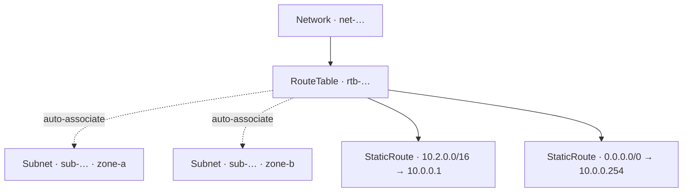

import { DICTIONARY } from '@site/src/constants/dictionary'
import { TYPES } from '@site/src/constants/types'
import { RESTRICTIONS } from '@site/src/constants/restrictions'
import { Restrictions } from '@site/src/components/commonBlocks/Restrictions'
import { Codes } from '@site/src/components/commonBlocks/Codes'
import { ApiOperation } from '@site/src/components/commonBlocks/ApiOperation'
import CodeBlock from '@theme/CodeBlock'
import dedent from 'ts-dedent'

# RouteTable

**RouteTable** — это таблица маршрутов сети: декларативный набор статических правил
«куда направить трафик к такому-то диапазону адресов». Вы заводите `RouteTable`, когда
дефолтной внутрисетевой связности уже недостаточно — нужно увести трафик к определенным
префиксам через конкретный next-hop: на egress-шлюз для выхода в интернет, на сетевой
прибор, в соседний сегмент. Это инструмент, которым вы централизованно описываете
*политику маршрутизации* проекта, не трогая сами подсети и интерфейсы.

Главное удобство абстракции — **автоматическая ассоциация с подсетями**. Вам не нужно
вручную «привязывать» каждую подсеть к таблице: подсети сети подхватывают таблицу
маршрутов на уровне платформы. Создали таблицу — ее получают все подсети сети, у которых
еще не задана своя таблица; создаете новую подсеть — она автоматически наследует таблицу
сети. Так маршрутная политика остается консистентной по всей сети без ручного связывания.

:::info Идентификатор, владелец и сеть
ID таблицы маршрутов — префикс `rtb` + 17 символов crockford-base32 (например,
`rtb-a1b2c3d4e5f6g7h8j`). Таблица всегда принадлежит проекту (`projectId`) и **ровно одной
сети** (`networkId`, immutable после `Create`). Сеть-владелец задается при создании и не
меняется: маршрутная политика существует только в контексте своей сети.
:::

## Автоассоциация с подсетями

Связь `RouteTable ↔ Subnet` поддерживается платформой, а не задается вами поштучно:

- при создании `RouteTable` ее подхватывают все подсети сети, у которых таблица еще не
  назначена;
- при создании новой `Subnet` ей назначается таблица маршрутов ее сети (если она есть);
- при удалении `RouteTable` ассоциация с подсетями снимается автоматически — поле таблицы
  у подсети обнуляется, подсеть продолжает работать с дефолтной внутрисетевой связностью.

:::tip Переопределение на уровне подсети
Если отдельной подсети нужна иная политика, привяжите ее к другой таблице через
[`Subnet.Update`](/api/subnet). Явно заданная подсети таблица имеет приоритет и не
перезаписывается автоассоциацией.
:::

## Поля ресурса

<table>
  <thead><tr><th>Поле</th><th>Тип</th><th>Описание</th></tr></thead>
  <tbody>
    <tr><td><code>id</code></td><td><code>{TYPES.string}</code></td><td>{DICTIONARY.id.short}</td></tr>
    <tr><td><code>projectId</code></td><td><code>{TYPES.string}</code></td><td>{DICTIONARY.projectId.short}</td></tr>
    <tr><td><code>networkId</code></td><td><code>{TYPES.string}</code></td><td>{DICTIONARY.networkId.short} (immutable после Create)</td></tr>
    <tr><td><code>name</code></td><td><code>{TYPES.string}</code></td><td>{DICTIONARY.name.short}</td></tr>
    <tr><td><code>description</code></td><td><code>{TYPES.string}</code></td><td>{DICTIONARY.description.short}</td></tr>
    <tr><td><code>labels</code></td><td><code>{TYPES.mapStringString}</code></td><td>{DICTIONARY.labels.short}</td></tr>
    <tr><td><code>staticRoutes</code></td><td><code>StaticRoute[]</code></td><td>Список статических маршрутов (см. ниже)</td></tr>
    <tr><td><code>createdAt</code></td><td><code>{TYPES.timestamp}</code></td><td>{DICTIONARY.createdAt.short}</td></tr>
  </tbody>
</table>

### Объект `StaticRoute`

<table>
  <thead><tr><th>Поле</th><th>Тип</th><th>Описание</th></tr></thead>
  <tbody>
    <tr><td><code>destinationPrefix</code></td><td><code>{TYPES.string}</code></td><td>Префикс назначения в нотации CIDR с нулевыми host-битами (например <code>10.2.0.0/16</code>); host-биты ≠ 0 → <code>INVALID_ARGUMENT</code></td></tr>
    <tr><td><code>nextHopAddress</code></td><td><code>{TYPES.string}</code></td><td>IP-адрес next-hop (IPv4 или IPv6). Обязателен: маршрут без next-hop отклоняется с <code>INVALID_ARGUMENT</code></td></tr>
    <tr><td><code>gatewayId</code></td><td><code>{TYPES.string}</code></td><td>id <code>Gateway</code> в роли next-hop — альтернатива <code>nextHopAddress</code> (oneof <code>nextHop</code>): next-hop задается ровно одним из двух способов</td></tr>
    <tr><td><code>labels</code></td><td><code>{TYPES.mapStringString}</code></td><td>Метки маршрута key→value (≤64 пар)</td></tr>
  </tbody>
</table>

:::note Next-hop — `oneof`
В каждом маршруте next-hop задается **ровно одним** способом: либо `nextHopAddress`
(IP-адрес), либо `gatewayId` (ссылка на [`Gateway`](/api/gateway) той же сети). `gatewayId`
валидируется на запись — несуществующий шлюз отклоняется.
:::

---

## Get

<ApiOperation method="GET" endpoint="/vpc/v1/routeTables/{routeTableId}">

Возвращает таблицу маршрутов по идентификатору. Синхронный вызов. Несуществующая таблица →
`NOT_FOUND "Route table %s not found"`; малформированный id (нераспознанный префикс) →
sync `INVALID_ARGUMENT "invalid route table id '<X>'"`.

#### Пример запроса

<CodeBlock language="bash">
  {dedent`
    curl http://localhost:18080/vpc/v1/routeTables/{routeTableId} \\
      -H 'Authorization: Bearer <JWT>'
  `}
</CodeBlock>

#### Пример ответа

<CodeBlock language="json">
  {dedent`
    {
      "id": "{routeTableId}",
      "projectId": "{projectId}",
      "networkId": "{networkId}",
      "name": "prod-rt",
      "description": "Маршруты прод-сети",
      "labels": { "env": "prod" },
      "staticRoutes": [
        { "destinationPrefix": "10.2.0.0/16", "nextHopAddress": "10.0.0.1" },
        { "destinationPrefix": "0.0.0.0/0", "nextHopAddress": "10.0.0.254" }
      ],
      "createdAt": "2026-06-06T14:27:00Z"
    }
  `}
</CodeBlock>

<Restrictions items={[{ label: 'resourceId', rules: RESTRICTIONS.resourceId }]} />
<Codes codes={['invalidArgument', 'notFound', 'permissionDenied', 'internal']} />

</ApiOperation>

---

## List

<ApiOperation method="GET" endpoint="/vpc/v1/routeTables">

Список таблиц маршрутов проекта с фильтром и cursor-пагинацией. Синхронный вызов;
результат фильтруется по правам вызывающего. `projectId` обязателен.

#### Параметры запроса

<table>
  <thead><tr><th>Параметр</th><th>Обязательность</th><th>Тип</th><th>Описание</th></tr></thead>
  <tbody>
    <tr><td><code>projectId</code></td><td><strong>да</strong></td><td><code>{TYPES.string}</code></td><td>{DICTIONARY.projectId.short}</td></tr>
    <tr><td><code>filter</code></td><td>нет</td><td><code>{TYPES.string}</code></td><td>{DICTIONARY.filter.short}</td></tr>
    <tr><td><code>pageSize</code></td><td>нет</td><td><code>{TYPES.int64}</code></td><td>{DICTIONARY.pageSize.short}</td></tr>
    <tr><td><code>pageToken</code></td><td>нет</td><td><code>{TYPES.string}</code></td><td>{DICTIONARY.pageToken.short}</td></tr>
  </tbody>
</table>

#### Пример запроса

<CodeBlock language="bash">
  {dedent`
    curl 'http://localhost:18080/vpc/v1/routeTables?projectId={projectId}&filter=name%3D%22prod-rt%22' \\
      -H 'Authorization: Bearer <JWT>'
  `}
</CodeBlock>

#### Пример ответа

<CodeBlock language="json">
  {dedent`
    {
      "routeTables": [
        {
          "id": "{routeTableId}",
          "projectId": "{projectId}",
          "networkId": "{networkId}",
          "name": "prod-rt",
          "createdAt": "2026-06-06T14:27:00Z"
        }
      ],
      "nextPageToken": ""
    }
  `}
</CodeBlock>

<Restrictions items={[
  { label: 'projectId', rules: RESTRICTIONS.projectId },
  { label: 'pagination', rules: RESTRICTIONS.pagination },
]} />
<Codes codes={['invalidArgument', 'permissionDenied', 'internal']} />

</ApiOperation>

---

## Create

<ApiOperation method="POST" endpoint="/vpc/v1/routeTables" async>

Создает таблицу маршрутов в указанной сети. **Асинхронный**: возвращает `Operation`,
`response` = созданная `RouteTable`. Несуществующая сеть отклоняется синхронно —
`NOT_FOUND "Network %s not found"`. После вставки таблицы платформа автоматически
ассоциирует с ней подходящие подсети сети.

#### Тело запроса

<table>
  <thead><tr><th>Параметр</th><th>Обязательность</th><th>Тип</th><th>Описание</th></tr></thead>
  <tbody>
    <tr><td><code>projectId</code></td><td><strong>да</strong></td><td><code>{TYPES.string}</code></td><td>{DICTIONARY.projectId.short}</td></tr>
    <tr><td><code>networkId</code></td><td><strong>да</strong></td><td><code>{TYPES.string}</code></td><td>{DICTIONARY.networkId.short}</td></tr>
    <tr><td><code>name</code></td><td>нет</td><td><code>{TYPES.string}</code></td><td>{DICTIONARY.name.short}</td></tr>
    <tr><td><code>description</code></td><td>нет</td><td><code>{TYPES.string}</code></td><td>{DICTIONARY.description.short}</td></tr>
    <tr><td><code>labels</code></td><td>нет</td><td><code>{TYPES.mapStringString}</code></td><td>{DICTIONARY.labels.short}</td></tr>
    <tr><td><code>staticRoutes</code></td><td>нет</td><td><code>StaticRoute[]</code></td><td>Начальный список статических маршрутов</td></tr>
  </tbody>
</table>

#### Пример запроса

<CodeBlock language="bash">
  {dedent`
    curl -X POST http://localhost:18080/vpc/v1/routeTables \\
      -H 'Authorization: Bearer <JWT>' \\
      -H 'Content-Type: application/json' \\
      -d '{
        "projectId": "{projectId}",
        "networkId": "{networkId}",
        "name": "prod-rt",
        "labels": { "env": "prod" },
        "staticRoutes": [
          { "destinationPrefix": "10.2.0.0/16", "nextHopAddress": "10.0.0.1" }
        ]
      }'
  `}
</CodeBlock>

#### Пример ответа (Operation)

<CodeBlock language="json">
  {dedent`
    {
      "id": "{operationId}",
      "description": "Create route table prod-rt",
      "createdAt": "2026-06-06T14:27:00Z",
      "done": false,
      "metadata": {
        "@type": "type.googleapis.com/kacho.cloud.vpc.v1.CreateRouteTableMetadata",
        "routeTableId": "{routeTableId}"
      }
    }
  `}
</CodeBlock>

:::tip Опрос результата
Поллите <code>GET /operations/&#123;operationId&#125;</code> до <code>done: true</code>; затем <code>response</code>
содержит созданную <code>RouteTable</code>, либо <code>error</code> — <code>google.rpc.Status</code>.
См. [Операции](/architecture/operations).
:::

<Restrictions items={[
  { label: 'projectId', rules: RESTRICTIONS.projectId },
  { label: 'name', rules: RESTRICTIONS.name },
  { label: 'labels', rules: RESTRICTIONS.labels },
]} />
<Codes codes={['invalidArgument', 'alreadyExists', 'notFound', 'unavailable', 'permissionDenied', 'internal']} />

</ApiOperation>

---

## Update

<ApiOperation method="PATCH" endpoint="/vpc/v1/routeTables/{routeTableId}" async>

Изменяет mutable-поля таблицы маршрутов (`name`, `description`, `labels`, `staticRoutes`).
**Асинхронный**: возвращает `Operation`, `response` = обновленная `RouteTable`. Поля
`projectId` и `networkId` — immutable (в `updateMask` отклоняются с `INVALID_ARGUMENT`).

Передача `staticRoutes` означает **полную замену** списка маршрутов — это основной и
рекомендуемый способ менять маршруты: получите текущий список через `Get`, отредактируйте
его и отправьте целиком.

#### Тело запроса

<table>
  <thead><tr><th>Параметр</th><th>Обязательность</th><th>Тип</th><th>Описание</th></tr></thead>
  <tbody>
    <tr><td><code>updateMask</code></td><td>нет</td><td><code>{TYPES.fieldMask}</code></td><td>{DICTIONARY.updateMask.short}</td></tr>
    <tr><td><code>name</code></td><td>нет</td><td><code>{TYPES.string}</code></td><td>{DICTIONARY.name.short}</td></tr>
    <tr><td><code>description</code></td><td>нет</td><td><code>{TYPES.string}</code></td><td>{DICTIONARY.description.short}</td></tr>
    <tr><td><code>labels</code></td><td>нет</td><td><code>{TYPES.mapStringString}</code></td><td>{DICTIONARY.labels.short}</td></tr>
    <tr><td><code>staticRoutes</code></td><td>нет</td><td><code>StaticRoute[]</code></td><td>Полный новый список маршрутов (заменяет текущий)</td></tr>
  </tbody>
</table>

#### Пример запроса

<CodeBlock language="bash">
  {dedent`
    curl -X PATCH http://localhost:18080/vpc/v1/routeTables/{routeTableId} \\
      -H 'Authorization: Bearer <JWT>' \\
      -H 'Content-Type: application/json' \\
      -d '{
        "updateMask": "staticRoutes",
        "staticRoutes": [
          { "destinationPrefix": "10.2.0.0/16", "nextHopAddress": "10.0.0.1" },
          { "destinationPrefix": "0.0.0.0/0", "nextHopAddress": "10.0.0.254" }
        ]
      }'
  `}
</CodeBlock>

<Restrictions items={[{ label: 'updateMask', rules: RESTRICTIONS.updateMask }]} />
<Codes codes={['invalidArgument', 'notFound', 'permissionDenied', 'internal']} />

</ApiOperation>

:::caution Полная замена, не патч маршрутов
`staticRoutes` в `Update` заменяет список **целиком**. Чтобы добавить или удалить один
маршрут, не потеряв остальные, сначала прочитайте текущий список (`Get`), внесите правку и
отправьте полный набор. Передача `staticRoutes: []` очищает все маршруты.
:::

---

## AddRoutes

<ApiOperation method="POST" endpoint="/vpc/v1/routeTables/{routeTableId}:add-routes" async>

Гранулярное добавление маршрутов: добавляет переданные `routes[]` к существующему списку,
не затрагивая остальные. **Асинхронный** verb-RPC; ответ `Operation` → `response` =
родительская `RouteTable` с обновленным `staticRoutes[]`. Идентификатор каждому маршруту
присваивает сервер (входящий id игнорируется).

#### Тело запроса

<table>
  <thead><tr><th>Параметр</th><th>Обязательность</th><th>Тип</th><th>Описание</th></tr></thead>
  <tbody>
    <tr><td><code>routeTableId</code></td><td><strong>да</strong> (path)</td><td><code>{TYPES.string}</code></td><td>Идентификатор RouteTable</td></tr>
    <tr><td><code>routes</code></td><td>нет</td><td><code>StaticRoute[]</code></td><td>Маршруты для добавления (id присваивается сервером)</td></tr>
  </tbody>
</table>

#### Пример запроса

<CodeBlock language="bash">
  {dedent`
    curl -X POST 'http://localhost:18080/vpc/v1/routeTables/{routeTableId}:add-routes' \\
      -H 'Authorization: Bearer <JWT>' \\
      -H 'Content-Type: application/json' \\
      -d '{
        "routes": [
          { "destinationPrefix": "192.168.0.0/16", "nextHopAddress": "10.0.0.5" }
        ]
      }'
  `}
</CodeBlock>

<Restrictions items={[{ label: 'resourceId', rules: RESTRICTIONS.resourceId }]} />
<Codes codes={['invalidArgument', 'notFound', 'permissionDenied', 'internal']} />

</ApiOperation>

---

## RemoveRoutes

<ApiOperation method="POST" endpoint="/vpc/v1/routeTables/{routeTableId}:remove-routes" async>

Удаляет маршруты по их идентификаторам (`routeIds[]`), оставляя остальные нетронутыми.
**Асинхронный** verb-RPC; ответ `Operation` → `response` = родительская `RouteTable`.

#### Тело запроса

<table>
  <thead><tr><th>Параметр</th><th>Обязательность</th><th>Тип</th><th>Описание</th></tr></thead>
  <tbody>
    <tr><td><code>routeTableId</code></td><td><strong>да</strong> (path)</td><td><code>{TYPES.string}</code></td><td>Идентификатор RouteTable</td></tr>
    <tr><td><code>routeIds</code></td><td>нет</td><td><code>{TYPES.stringArray}</code></td><td>id маршрутов (<code>StaticRoute.id</code>) для удаления</td></tr>
  </tbody>
</table>

#### Пример запроса

<CodeBlock language="bash">
  {dedent`
    curl -X POST 'http://localhost:18080/vpc/v1/routeTables/{routeTableId}:remove-routes' \\
      -H 'Authorization: Bearer <JWT>' \\
      -H 'Content-Type: application/json' \\
      -d '{ "routeIds": ["{routeId}"] }'
  `}
</CodeBlock>

<Restrictions items={[{ label: 'resourceId', rules: RESTRICTIONS.resourceId }]} />
<Codes codes={['invalidArgument', 'notFound', 'permissionDenied', 'internal']} />

</ApiOperation>

---

## UpdateRoute

<ApiOperation method="POST" endpoint="/vpc/v1/routeTables/{routeTableId}:update-route" async>

Точечно заменяет содержимое одного маршрута по его `routeId` (id берется из `routeId`,
поле `route.id` во входе игнорируется). **Асинхронный** verb-RPC; ответ `Operation` →
`response` = родительская `RouteTable`.

#### Тело запроса

<table>
  <thead><tr><th>Параметр</th><th>Обязательность</th><th>Тип</th><th>Описание</th></tr></thead>
  <tbody>
    <tr><td><code>routeTableId</code></td><td><strong>да</strong> (path)</td><td><code>{TYPES.string}</code></td><td>Идентификатор RouteTable</td></tr>
    <tr><td><code>routeId</code></td><td><strong>да</strong></td><td><code>{TYPES.string}</code></td><td>id обновляемого маршрута</td></tr>
    <tr><td><code>route</code></td><td>нет</td><td><code>StaticRoute</code></td><td>Новое содержимое маршрута</td></tr>
  </tbody>
</table>

#### Пример запроса

<CodeBlock language="bash">
  {dedent`
    curl -X POST 'http://localhost:18080/vpc/v1/routeTables/{routeTableId}:update-route' \\
      -H 'Authorization: Bearer <JWT>' \\
      -H 'Content-Type: application/json' \\
      -d '{
        "routeId": "{routeId}",
        "route": { "destinationPrefix": "10.2.0.0/16", "nextHopAddress": "10.0.0.9" }
      }'
  `}
</CodeBlock>

<Restrictions items={[{ label: 'resourceId', rules: RESTRICTIONS.resourceId }]} />
<Codes codes={['invalidArgument', 'notFound', 'permissionDenied', 'internal']} />

</ApiOperation>

:::note Гранулярные verb-RPC и полная замена через `Update`
`:add-routes` / `:remove-routes` / `:update-route` — гранулярные операции над отдельными
маршрутами (стиль verb-RPC, как у [`Subnet`](/api/subnet) `:addCidrBlocks`). Каждая
возвращает `Operation` → обновленную `RouteTable`. Когда нужно переопределить весь набор
разом — используйте `Update` с полным списком `staticRoutes`. Обе модели согласованы: и
verb-RPC, и `Update` оперируют одним и тем же `staticRoutes[]`.
:::

---

## Delete

<ApiOperation method="DELETE" endpoint="/vpc/v1/routeTables/{routeTableId}" async>

Удаляет таблицу маршрутов. **Асинхронный**: возвращает `Operation`, `response` = `Empty`.
Удаление **не блокируется** ассоциированными подсетями: их ссылка на таблицу обнуляется
автоматически, и подсети продолжают работать с дефолтной внутрисетевой связностью.

#### Пример запроса

<CodeBlock language="bash">
  {dedent`
    curl -X DELETE http://localhost:18080/vpc/v1/routeTables/{routeTableId} \\
      -H 'Authorization: Bearer <JWT>'
  `}
</CodeBlock>

#### Пример ответа (Operation, response = Empty)

<CodeBlock language="json">
  {dedent`
    {
      "id": "{operationId}",
      "description": "Delete route table {routeTableId}",
      "done": false,
      "metadata": {
        "@type": "type.googleapis.com/kacho.cloud.vpc.v1.DeleteRouteTableMetadata",
        "routeTableId": "{routeTableId}"
      }
    }
  `}
</CodeBlock>

<Restrictions items={[{ label: 'resourceId', rules: RESTRICTIONS.resourceId }]} />
<Codes codes={['invalidArgument', 'notFound', 'permissionDenied', 'internal']} />

</ApiOperation>

---

## ListOperations

<ApiOperation method="GET" endpoint="/vpc/v1/routeTables/{routeTableId}/operations">

Список операций (LRO) указанной таблицы маршрутов с cursor-пагинацией. Синхронный вызов.
Полезен, чтобы проследить историю изменений (`Create`/`Update`/`Add`/`Remove`/`Delete`)
конкретной таблицы.

#### Параметры запроса

<table>
  <thead><tr><th>Параметр</th><th>Обязательность</th><th>Тип</th><th>Описание</th></tr></thead>
  <tbody>
    <tr><td><code>routeTableId</code></td><td><strong>да</strong> (path)</td><td><code>{TYPES.string}</code></td><td>Идентификатор RouteTable</td></tr>
    <tr><td><code>pageSize</code></td><td>нет</td><td><code>{TYPES.int64}</code></td><td>{DICTIONARY.pageSize.short}</td></tr>
    <tr><td><code>pageToken</code></td><td>нет</td><td><code>{TYPES.string}</code></td><td>{DICTIONARY.pageToken.short}</td></tr>
  </tbody>
</table>

#### Пример запроса

<CodeBlock language="bash">
  {dedent`
    curl http://localhost:18080/vpc/v1/routeTables/{routeTableId}/operations \\
      -H 'Authorization: Bearer <JWT>'
  `}
</CodeBlock>

<Restrictions items={[{ label: 'pagination', rules: RESTRICTIONS.pagination }]} />
<Codes codes={['invalidArgument', 'notFound', 'permissionDenied', 'internal']} />

</ApiOperation>

---

## Сценарии использования

- **Выход в интернет.** Заведите `RouteTable` с дефолтным маршрутом `0.0.0.0/0` на
  egress-[`Gateway`](/api/gateway) (`gatewayId`) или на адрес сетевого прибора
  (`nextHopAddress`) — все подсети сети без собственной таблицы автоматически получат этот
  выход.
- **Сегментация трафика.** Направьте трафик к конкретным префиксам (`10.2.0.0/16`,
  `192.168.0.0/16`) через разные next-hop, описав внутреннюю топологию проекта одной
  декларацией.
- **Исключение для подсети.** Большинство подсетей живет с сетевой таблицей по умолчанию,
  а отдельной подсети нужна своя политика — назначьте ей другую таблицу через
  [`Subnet.Update`](/api/subnet), не трогая остальные.
- **Поэтапная правка маршрутов.** Добавляйте/убирайте отдельные маршруты через
  `:add-routes` / `:remove-routes`, а крупную перенастройку делайте полной заменой через
  `Update`.

## Что важно знать (corner cases)

- **`networkId` immutable.** Перенести таблицу в другую сеть нельзя — создайте новую
  таблицу в целевой сети.
- **`Update(staticRoutes)` — полная замена.** Частая ошибка — отправить один маршрут и
  обнулить остальные. Для точечных правок используйте verb-RPC или паттерн
  read-modify-write поверх `Update`.
- **`destinationPrefix` требует нулевых host-битов.** `10.2.0.5/16` отклоняется — правильно
  `10.2.0.0/16`.
- **Next-hop обязателен и ровно один.** Маршрут без `nextHopAddress`/`gatewayId` либо с
  обоими сразу — `INVALID_ARGUMENT`.
- **Удаление таблицы безопасно для подсетей.** Ассоциация снимается автоматически; подсеть
  не ломается, а возвращается к дефолтной связности.
- **Мутации асинхронны.** `Create`/`Update`/`Delete` и все verb-RPC возвращают `Operation`;
  ориентируйтесь на `done`/`response`, а не на немедленный ответ.

## Рекомендации (best practices)

- Держите **одну таблицу на сеть** как базовую политику и полагайтесь на автоассоциацию —
  это минимизирует ручное связывание и расхождения между подсетями.
- Переопределяйте политику на уровне подсети только там, где это действительно нужно;
  явная привязка подсети «перевешивает» автоассоциацию.
- Снабжайте маршруты осмысленными `labels` (назначение, владелец) — это упрощает аудит
  больших таблиц.
- Для рискованных изменений сверяйте результат `Operation.response` и при необходимости
  поднимайте историю через `ListOperations`.
