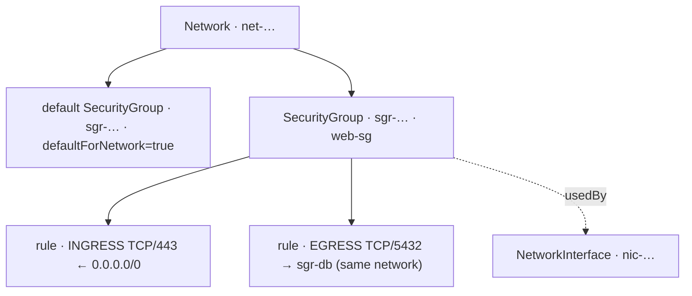

import { DICTIONARY } from '@site/src/constants/dictionary'
import { TYPES } from '@site/src/constants/types'
import { RESTRICTIONS } from '@site/src/constants/restrictions'
import { Restrictions } from '@site/src/components/commonBlocks/Restrictions'
import { Codes } from '@site/src/components/commonBlocks/Codes'
import { ApiOperation } from '@site/src/components/commonBlocks/ApiOperation'
import Tabs from '@theme/Tabs'
import TabItem from '@theme/TabItem'
import CodeBlock from '@theme/CodeBlock'
import dedent from 'ts-dedent'

# SecurityGroup

**SecurityGroup** — это группа безопасности: распределенный stateful-firewall, выраженный
как набор allow-правил (`rules[]`) для входящего (`INGRESS`) и исходящего (`EGRESS`)
трафика. Вы описываете в терминах бизнеса, *кому и куда разрешено ходить* — «принимать
HTTPS из интернета», «ходить в БД только из app-подсети», — а платформа применяет эту
политику к сетевым интерфейсам ([`NetworkInterface`](/api/network-interface)), к которым
группа привязана. Это основной инструмент контроля доступа на сетевом уровне внутри
проекта.

Модель — **allow-only и stateful**: вы перечисляете, что *разрешено*, а ответный трафик
для разрешенного соединения проходит автоматически (не нужно зеркальное правило в обратную
сторону). Группа принадлежит проекту (`projectId`) и **ровно одной сети** (`networkId`).
Чтобы можно было начать работу сразу, **при создании сети автоматически заводится
default-`SecurityGroup`** этой сети (см. [Network](/api/network)) — стартовая политика, к
которой по умолчанию привязываются новые интерфейсы.

:::info Идентификатор и владелец
ID группы — префикс `sgr` + 17 символов crockford-base32 (например,
`sgr-a1b2c3d4e5f6g7h8j`). Группа всегда принадлежит проекту (`projectId`) и сети
(`networkId`); оба заданы при `Create` и неизменны.
:::

:::caution networkId — обязателен и immutable
`networkId` указывается при `Create` и **не меняется** после (его нет в `update_mask`). Причина:
правила вида «разрешить трафик от другой SG» (SG-target) валидны **только внутри одной сети** —
группы безопасности в разных сетях физически изолированы и не «видят» друг друга. Поэтому
SG-target правило может ссылаться лишь на SG **той же** сети.
:::

## Поля ресурса

<table>
  <thead><tr><th>Поле</th><th>Тип</th><th>Описание</th></tr></thead>
  <tbody>
    <tr><td><code>id</code></td><td><code>{TYPES.string}</code></td><td>{DICTIONARY.id.short}</td></tr>
    <tr><td><code>projectId</code></td><td><code>{TYPES.string}</code></td><td>{DICTIONARY.projectId.short}</td></tr>
    <tr><td><code>networkId</code></td><td><code>{TYPES.string}</code></td><td>{DICTIONARY.networkId.short} (<strong>обязателен, immutable</strong>)</td></tr>
    <tr><td><code>name</code></td><td><code>{TYPES.string}</code></td><td>{DICTIONARY.name.short}</td></tr>
    <tr><td><code>description</code></td><td><code>{TYPES.string}</code></td><td>{DICTIONARY.description.short}</td></tr>
    <tr><td><code>labels</code></td><td><code>{TYPES.mapStringString}</code></td><td>{DICTIONARY.labels.short}</td></tr>
    <tr><td><code>rules</code></td><td><code>SecurityGroupRule[]</code></td><td>Список правил (см. «Правило» ниже); output-only — мутируется через <code>UpdateRules</code>/<code>UpdateRule</code></td></tr>
    <tr><td><code>defaultForNetwork</code></td><td><code>{TYPES.bool}</code></td><td>Признак default-SG сети (output-only; <code>true</code> у SG, авто-созданной при <code>Network.Create</code>)</td></tr>
    <tr><td><code>usedBy</code></td><td><code>&#123;TYPES.reference&#125;[]</code></td><td>Потребители SG (output-only, derived-on-read): <code>NetworkInterface</code> (его <code>securityGroupIds</code> содержит эту SG) + <code>Network</code> (его <code>defaultSecurityGroupId</code> == эта SG)</td></tr>
    <tr><td><code>createdAt</code></td><td><code>{TYPES.timestamp}</code></td><td>{DICTIONARY.createdAt.short}</td></tr>
  </tbody>
</table>

### Правило (`SecurityGroupRule`)

<table>
  <thead><tr><th>Поле</th><th>Тип</th><th>Описание</th></tr></thead>
  <tbody>
    <tr><td><code>id</code></td><td><code>{TYPES.string}</code></td><td>Идентификатор правила (resource-id формат; генерируется сервером при создании правила)</td></tr>
    <tr><td><code>description</code></td><td><code>{TYPES.string}</code></td><td>Описание правила (≤256)</td></tr>
    <tr><td><code>labels</code></td><td><code>{TYPES.mapStringString}</code></td><td>Метки правила key→value</td></tr>
    <tr><td><code>direction</code></td><td><code>Direction</code></td><td><strong>Обязательно.</strong> Направление трафика: <code>INGRESS</code> | <code>EGRESS</code></td></tr>
    <tr><td><code>ports</code></td><td><code>PortRange</code></td><td>Диапазон портов <code>&#123;fromPort, toPort&#125;</code> (0..65535). Пусто = любой порт</td></tr>
    <tr><td><code>protocolName</code></td><td><code>{TYPES.string}</code></td><td>Имя протокола (<code>TCP</code>/<code>UDP</code>/<code>ICMP</code>, IANA). Oneof <code>protocol</code> с <code>protocolNumber</code>; пусто = любой</td></tr>
    <tr><td><code>protocolNumber</code></td><td><code>{TYPES.int64}</code></td><td>Номер протокола (IANA). Альтернатива <code>protocolName</code></td></tr>
    <tr><td><code>cidrBlocks</code></td><td><code>{TYPES.cidrSpec}</code></td><td>Target = CIDR-блоки <code>&#123;v4CidrBlocks[], v6CidrBlocks[]&#125;</code>. Oneof <code>target</code> — ровно один из трех</td></tr>
    <tr><td><code>securityGroupId</code></td><td><code>{TYPES.string}</code></td><td>Target = другая SG (<strong>только same-network</strong>). Oneof <code>target</code></td></tr>
    <tr><td><code>predefinedTarget</code></td><td><code>{TYPES.string}</code></td><td>Target = предопределенная цель. Oneof <code>target</code></td></tr>
  </tbody>
</table>

:::note Target правила — `exactly_one`
В каждом правиле задается **ровно один** target: `cidrBlocks` **или** `securityGroupId` **или**
`predefinedTarget`. Нарушение → `InvalidArgument`. Для SG-target — целевая SG обязана принадлежать
**той же** сети (`network_id`), иначе правило отвергается (`InvalidArgument`).
:::

---

## Get

<ApiOperation method="GET" endpoint="/vpc/v1/securityGroups/{securityGroupId}">

Возвращает группу безопасности по идентификатору.

#### Пример запроса

<CodeBlock language="bash">
  {dedent`
    curl http://localhost:18080/vpc/v1/securityGroups/{securityGroupId} \\
      -H 'Authorization: Bearer <JWT>'
  `}
</CodeBlock>

#### Пример ответа

<CodeBlock language="json">
  {dedent`
    {
      "id": "{securityGroupId}",
      "projectId": "{projectId}",
      "networkId": "{networkId}",
      "name": "web-sg",
      "description": "Доступ к web-серверам",
      "labels": { "env": "prod" },
      "defaultForNetwork": false,
      "rules": [
        {
          "id": "{ruleId}",
          "direction": "INGRESS",
          "protocolName": "TCP",
          "ports": { "fromPort": "443", "toPort": "443" },
          "cidrBlocks": { "v4CidrBlocks": ["0.0.0.0/0"], "v6CidrBlocks": [] }
        }
      ],
      "createdAt": "2026-06-06T14:27:00Z"
    }
  `}
</CodeBlock>

:::info NotFound
Несуществующая SG → `NOT_FOUND` со стабильным текстом `Security group SecurityGroup.Id(value=<id>) not found`
(формулировка — часть контракта Kachō, меняется только осознанно через тикет).
:::

<Codes codes={['invalidArgument', 'notFound', 'permissionDenied', 'internal']} />

</ApiOperation>

---

## List

<ApiOperation method="GET" endpoint="/vpc/v1/securityGroups">

Список групп безопасности проекта с фильтром и cursor-пагинацией.

#### Параметры запроса

<table>
  <thead><tr><th>Параметр</th><th>Обязательность</th><th>Тип</th><th>Описание</th></tr></thead>
  <tbody>
    <tr><td><code>projectId</code></td><td><strong>да</strong></td><td><code>{TYPES.string}</code></td><td>{DICTIONARY.projectId.short}</td></tr>
    <tr><td><code>filter</code></td><td>нет</td><td><code>{TYPES.string}</code></td><td>{DICTIONARY.filter.short}</td></tr>
    <tr><td><code>pageSize</code></td><td>нет</td><td><code>{TYPES.int64}</code></td><td>{DICTIONARY.pageSize.short}</td></tr>
    <tr><td><code>pageToken</code></td><td>нет</td><td><code>{TYPES.string}</code></td><td>{DICTIONARY.pageToken.short}</td></tr>
  </tbody>
</table>

#### Пример запроса

<CodeBlock language="bash">
  {dedent`
    curl 'http://localhost:18080/vpc/v1/securityGroups?projectId={projectId}&filter=name%3D%22web-sg%22' \\
      -H 'Authorization: Bearer <JWT>'
  `}
</CodeBlock>

#### Пример ответа

<CodeBlock language="json">
  {dedent`
    {
      "securityGroups": [
        { "id": "{securityGroupId}", "projectId": "{projectId}", "networkId": "{networkId}", "name": "web-sg", "createdAt": "2026-06-06T14:27:00Z" }
      ],
      "nextPageToken": ""
    }
  `}
</CodeBlock>

<Restrictions items={[{ label: 'pagination', rules: RESTRICTIONS.pagination }]} />
<Codes codes={['invalidArgument', 'permissionDenied', 'internal']} />

</ApiOperation>

---

## Create

<ApiOperation method="POST" endpoint="/vpc/v1/securityGroups" async>

Создает группу безопасности в указанной сети. Возвращает `Operation` (async). `networkId`
обязателен и immutable. Правила задаются на старте через `ruleSpecs[]` (либо позже — через
`UpdateRules`); каждому правилу сервер генерирует `id`.

#### Тело запроса

<table>
  <thead><tr><th>Параметр</th><th>Обязательность</th><th>Тип</th><th>Описание</th></tr></thead>
  <tbody>
    <tr><td><code>projectId</code></td><td><strong>да</strong></td><td><code>{TYPES.string}</code></td><td>{DICTIONARY.projectId.short}</td></tr>
    <tr><td><code>networkId</code></td><td><strong>да</strong></td><td><code>{TYPES.string}</code></td><td>{DICTIONARY.networkId.short} (immutable)</td></tr>
    <tr><td><code>name</code></td><td>нет</td><td><code>{TYPES.string}</code></td><td>{DICTIONARY.name.short}</td></tr>
    <tr><td><code>description</code></td><td>нет</td><td><code>{TYPES.string}</code></td><td>{DICTIONARY.description.short}</td></tr>
    <tr><td><code>labels</code></td><td>нет</td><td><code>{TYPES.mapStringString}</code></td><td>{DICTIONARY.labels.short}</td></tr>
    <tr><td><code>ruleSpecs</code></td><td>нет</td><td><code>SecurityGroupRuleSpec[]</code></td><td>Начальный набор правил (<code>direction</code> + oneof <code>target</code> + опц. <code>ports</code>/<code>protocol</code>)</td></tr>
  </tbody>
</table>

#### Пример запроса

<CodeBlock language="bash">
  {dedent`
    curl -X POST http://localhost:18080/vpc/v1/securityGroups \\
      -H 'Authorization: Bearer <JWT>' \\
      -H 'Content-Type: application/json' \\
      -d '{
        "projectId": "{projectId}",
        "networkId": "{networkId}",
        "name": "web-sg",
        "labels": { "env": "prod" },
        "ruleSpecs": [
          {
            "direction": "INGRESS",
            "protocolName": "TCP",
            "ports": { "fromPort": 443, "toPort": 443 },
            "cidrBlocks": { "v4CidrBlocks": ["0.0.0.0/0"] }
          }
        ]
      }'
  `}
</CodeBlock>

#### Пример ответа (Operation)

<CodeBlock language="json">
  {dedent`
    {
      "id": "{operationId}",
      "description": "Create security group web-sg",
      "createdAt": "2026-06-06T14:27:00Z",
      "done": false,
      "metadata": {
        "@type": "type.googleapis.com/kacho.cloud.vpc.v1.CreateSecurityGroupMetadata",
        "securityGroupId": "{securityGroupId}"
      }
    }
  `}
</CodeBlock>

:::tip Опрос результата
Поллите <code>GET /operations/&#123;operationId&#125;</code> до <code>done: true</code>; затем <code>response</code>
содержит созданный <code>SecurityGroup</code>, либо <code>error</code> — <code>google.rpc.Status</code>.
См. [Операции](/architecture/operations).
:::

<Restrictions items={[
  { label: 'projectId', rules: RESTRICTIONS.projectId },
  { label: 'name', rules: RESTRICTIONS.name },
  { label: 'labels', rules: RESTRICTIONS.labels },
]} />
<Codes codes={['invalidArgument', 'alreadyExists', 'notFound', 'unavailable', 'permissionDenied', 'internal']} />

</ApiOperation>

---

## Update

<ApiOperation method="PATCH" endpoint="/vpc/v1/securityGroups/{securityGroupId}" async>

Изменяет mutable-поля SG (`name`, `description`, `labels`) и при передаче `ruleSpecs` — **полностью
заменяет** набор правил. `networkId` и `projectId` — immutable.

#### Тело запроса

<table>
  <thead><tr><th>Параметр</th><th>Обязательность</th><th>Тип</th><th>Описание</th></tr></thead>
  <tbody>
    <tr><td><code>updateMask</code></td><td>нет</td><td><code>{TYPES.fieldMask}</code></td><td>{DICTIONARY.updateMask.short}</td></tr>
    <tr><td><code>name</code></td><td>нет</td><td><code>{TYPES.string}</code></td><td>{DICTIONARY.name.short}</td></tr>
    <tr><td><code>description</code></td><td>нет</td><td><code>{TYPES.string}</code></td><td>{DICTIONARY.description.short}</td></tr>
    <tr><td><code>labels</code></td><td>нет</td><td><code>{TYPES.mapStringString}</code></td><td>{DICTIONARY.labels.short}</td></tr>
    <tr><td><code>ruleSpecs</code></td><td>нет</td><td><code>SecurityGroupRuleSpec[]</code></td><td>Новый список правил — <strong>полностью заменяет</strong> существующий</td></tr>
  </tbody>
</table>

#### Пример запроса

<CodeBlock language="bash">
  {dedent`
    curl -X PATCH http://localhost:18080/vpc/v1/securityGroups/{securityGroupId} \\
      -H 'Authorization: Bearer <JWT>' \\
      -H 'Content-Type: application/json' \\
      -d '{
        "updateMask": "description",
        "description": "Web-SG (обновлено)"
      }'
  `}
</CodeBlock>

<Restrictions items={[{ label: 'updateMask', rules: RESTRICTIONS.updateMask }]} />
<Codes codes={['invalidArgument', 'notFound', 'permissionDenied', 'internal']} />

</ApiOperation>

---

## Delete

<ApiOperation method="DELETE" endpoint="/vpc/v1/securityGroups/{securityGroupId}" async>

Удаляет группу безопасности (hard-delete). Default-SG сети защищена: попытка удалить →
sync `FAILED_PRECONDITION` со стабильным текстом `default security group cannot be deleted`.
Удалять ее вручную не нужно — она удаляется автоматически вместе с сетью при
`Network.Delete` (в одной транзакции). Использование SG сетевыми интерфейсами удаление
**не блокирует** — перед удалением проверьте `usedBy` и открепите SG от NIC, чтобы не
оставить недействительные ссылки в `NIC.securityGroupIds`.

#### Пример запроса

<CodeBlock language="bash">
  {dedent`
    curl -X DELETE http://localhost:18080/vpc/v1/securityGroups/{securityGroupId} \\
      -H 'Authorization: Bearer <JWT>'
  `}
</CodeBlock>

#### Пример ответа (Operation, response = Empty)

<CodeBlock language="json">
  {dedent`
    {
      "id": "{operationId}",
      "description": "Delete security group {securityGroupId}",
      "done": false,
      "metadata": {
        "@type": "type.googleapis.com/kacho.cloud.vpc.v1.DeleteSecurityGroupMetadata",
        "securityGroupId": "{securityGroupId}"
      }
    }
  `}
</CodeBlock>

<Codes codes={['invalidArgument', 'notFound', 'failedPrecondition', 'permissionDenied', 'internal']} />

</ApiOperation>

---

## UpdateRules

<ApiOperation method="PATCH" endpoint="/vpc/v1/securityGroups/{securityGroupId}/rules" async>

Инкрементально меняет правила группы: удаляет правила по `deletionRuleIds` и добавляет новые из
`additionRuleSpecs`. В отличие от `Update`, не заменяет весь набор целиком. Ответ Operation →
`response` = родительский `SecurityGroup` с обновленным `rules[]`.

#### Тело запроса

<table>
  <thead><tr><th>Параметр</th><th>Обязательность</th><th>Тип</th><th>Описание</th></tr></thead>
  <tbody>
    <tr><td><code>deletionRuleIds</code></td><td>нет</td><td><code>{TYPES.stringArray}</code></td><td>Список id правил для удаления</td></tr>
    <tr><td><code>additionRuleSpecs</code></td><td>нет</td><td><code>SecurityGroupRuleSpec[]</code></td><td>Новые правила (каждому сервер генерирует <code>id</code>)</td></tr>
  </tbody>
</table>

#### Пример запроса

<CodeBlock language="bash">
  {dedent`
    curl -X PATCH http://localhost:18080/vpc/v1/securityGroups/{securityGroupId}/rules \\
      -H 'Authorization: Bearer <JWT>' \\
      -H 'Content-Type: application/json' \\
      -d '{
        "deletionRuleIds": ["{ruleId}"],
        "additionRuleSpecs": [
          {
            "direction": "EGRESS",
            "protocolName": "TCP",
            "ports": { "fromPort": 5432, "toPort": 5432 },
            "securityGroupId": "{targetSecurityGroupId}"
          }
        ]
      }'
  `}
</CodeBlock>

:::note SG-target — same-network
`securityGroupId` в `additionRuleSpecs[].target` обязан указывать на существующую SG **той же**
сети (`network_id`). Cross-network → `InvalidArgument` со стабильным текстом
`security group rule can only reference a security group in the same network`; несуществующая
target-SG → `InvalidArgument` (`security group rule references a non-existent security group`).
Несуществующие id в `deletionRuleIds[]` молча игнорируются (no-op, не ошибка).
:::

<Codes codes={['invalidArgument', 'notFound', 'failedPrecondition', 'permissionDenied', 'internal']} />

</ApiOperation>

---

## UpdateRule

<ApiOperation method="PATCH" endpoint="/vpc/v1/securityGroups/{securityGroupId}/rules/{ruleId}" async>

Точечно обновляет одно правило (`description`, `labels`) по его `ruleId`. Ответ Operation →
`response` = родительский `SecurityGroup` (не отдельное правило). Малформированный `ruleId` →
sync `InvalidArgument` (`Invalid rule id <id>`); корректный по формату, но отсутствующий в SG →
`NotFound` (`SecurityGroupRule <ruleId> not found in SecurityGroup <securityGroupId>`).

#### Тело запроса

<table>
  <thead><tr><th>Параметр</th><th>Обязательность</th><th>Тип</th><th>Описание</th></tr></thead>
  <tbody>
    <tr><td><code>ruleId</code></td><td><strong>да</strong> (path)</td><td><code>{TYPES.string}</code></td><td>Идентификатор правила (resource-id формат)</td></tr>
    <tr><td><code>updateMask</code></td><td>нет</td><td><code>{TYPES.fieldMask}</code></td><td>{DICTIONARY.updateMask.short}</td></tr>
    <tr><td><code>description</code></td><td>нет</td><td><code>{TYPES.string}</code></td><td>Новое описание правила</td></tr>
    <tr><td><code>labels</code></td><td>нет</td><td><code>{TYPES.mapStringString}</code></td><td>Новый набор меток правила (полностью заменяет существующий)</td></tr>
  </tbody>
</table>

#### Пример запроса

<CodeBlock language="bash">
  {dedent`
    curl -X PATCH http://localhost:18080/vpc/v1/securityGroups/{securityGroupId}/rules/{ruleId} \\
      -H 'Authorization: Bearer <JWT>' \\
      -H 'Content-Type: application/json' \\
      -d '{
        "updateMask": "description",
        "description": "HTTPS из интернета"
      }'
  `}
</CodeBlock>

#### Пример ответа (Operation)

<CodeBlock language="json">
  {dedent`
    {
      "id": "{operationId}",
      "description": "Update rule {ruleId} of security group {securityGroupId}",
      "done": false,
      "metadata": {
        "@type": "type.googleapis.com/kacho.cloud.vpc.v1.UpdateSecurityGroupRuleMetadata",
        "securityGroupId": "{securityGroupId}",
        "ruleId": "{ruleId}"
      }
    }
  `}
</CodeBlock>

<Restrictions items={[{ label: 'updateMask', rules: RESTRICTIONS.updateMask }]} />
<Codes codes={['invalidArgument', 'notFound', 'permissionDenied', 'internal']} />

</ApiOperation>

---

## ListOperations

<ApiOperation method="GET" endpoint="/vpc/v1/securityGroups/{securityGroupId}/operations">

Список операций (LRO) указанной группы безопасности с cursor-пагинацией.

#### Параметры запроса

<table>
  <thead><tr><th>Параметр</th><th>Обязательность</th><th>Тип</th><th>Описание</th></tr></thead>
  <tbody>
    <tr><td><code>securityGroupId</code></td><td><strong>да</strong> (path)</td><td><code>{TYPES.string}</code></td><td>Идентификатор SecurityGroup</td></tr>
    <tr><td><code>pageSize</code></td><td>нет</td><td><code>{TYPES.int64}</code></td><td>{DICTIONARY.pageSize.short}</td></tr>
    <tr><td><code>pageToken</code></td><td>нет</td><td><code>{TYPES.string}</code></td><td>{DICTIONARY.pageToken.short}</td></tr>
  </tbody>
</table>

#### Пример запроса

<CodeBlock language="bash">
  {dedent`
    curl http://localhost:18080/vpc/v1/securityGroups/{securityGroupId}/operations \\
      -H 'Authorization: Bearer <JWT>'
  `}
</CodeBlock>

<Restrictions items={[{ label: 'pagination', rules: RESTRICTIONS.pagination }]} />
<Codes codes={['invalidArgument', 'notFound', 'permissionDenied', 'internal']} />

</ApiOperation>

---

## Update vs UpdateRules vs UpdateRule

Три способа менять правила — выбирайте по характеру изменения:

| Метод | Семантика правил | Когда применять |
|---|---|---|
| `Update` (`updateMask=ruleSpecs`) | **Полная замена** всего набора `ruleSpecs[]` | Переопределить политику целиком, привести к декларативному эталону (GitOps) |
| `UpdateRules` | **Инкрементально**: удалить по `deletionRuleIds`, добавить `additionRuleSpecs` | Точечно дописать/убрать правила, не пересобирая остальные |
| `UpdateRule` | Точечно одно правило (`description`, `labels`) по `ruleId` | Поправить метаданные конкретного правила |

:::tip Декларативно или инкрементально
Если у вас есть «источник истины» для всего набора правил (файл/манифест) — используйте
`Update` с полным `ruleSpecs`. Если вы оперируете дельтами поверх живой группы —
`UpdateRules`. Смешивать модели на одну группу не нужно: выберите одну под свой процесс.
:::

## Сценарии использования

- **Публичный web-сервис.** Группа с `INGRESS TCP/443` из `0.0.0.0/0` + `INGRESS TCP/80`,
  привязанная к интерфейсам фронтенда.
- **Трехзвенка с SG-target.** БД-группа разрешает `INGRESS TCP/5432` **от** app-группы
  (target = `securityGroupId`), а не от CIDR — связь следует за интерфейсами, а не за
  адресами, и остается валидной при пересоздании инстансов.
- **Старт на default-SG.** Новые интерфейсы по умолчанию попадают в default-группу сети —
  доработайте ее правила вместо создания новой группы для простых случаев.
- **Аудит использования.** Перед изменением/удалением группы посмотрите `usedBy`, чтобы
  понять, какие интерфейсы и сети затронет правка.

## Что важно знать (corner cases)

- **`networkId` immutable.** Группа живет в одной сети; перенести нельзя — создайте новую в
  целевой сети.
- **SG-target только same-network.** Правило с `securityGroupId` обязано ссылаться на
  группу **той же** сети; cross-network и несуществующая target-SG → `INVALID_ARGUMENT`.
- **Ровно один target на правило.** В каждом правиле задается **один** из `cidrBlocks` /
  `securityGroupId` / `predefinedTarget`; ноль или несколько → `INVALID_ARGUMENT`.
- **default-SG нельзя удалить вручную.** Попытка → `FAILED_PRECONDITION
  "default security group cannot be deleted"`; она удаляется автоматически вместе с сетью
  при `Network.Delete`.
- **Удаление SG не блокируется интерфейсами.** Использование группой интерфейсами не мешает
  ее удалить — перед удалением проверьте `usedBy` и открепите SG от NIC, иначе в
  `NIC.securityGroupIds` останутся недействительные ссылки.
- **id правил генерирует сервер.** В `ruleSpecs`/`additionRuleSpecs` id не передается;
  получите его из ответной `SecurityGroup` для последующих `UpdateRules`/`UpdateRule`.
- **`Update(ruleSpecs)` — полная замена.** Передача неполного списка сотрет остальные
  правила; для дельт используйте `UpdateRules`.

## Рекомендации (best practices)

- Предпочитайте **SG-target** правила вместо CIDR для трафика между своими ресурсами —
  политика следует за интерфейсами и переживает смену адресов.
- Держите правила **минимально широкими**: конкретный протокол и диапазон портов вместо
  «любой порт/любой протокол».
- Снабжайте правила `description`/`labels` (назначение, тикет владельца процесса) — это
  ключ к аудиту больших групп.
- Перед удалением или существенной правкой сверяйтесь с `usedBy` и при необходимости
  поднимайте историю изменений через `ListOperations`.
