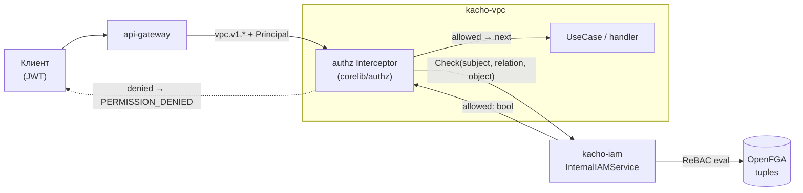
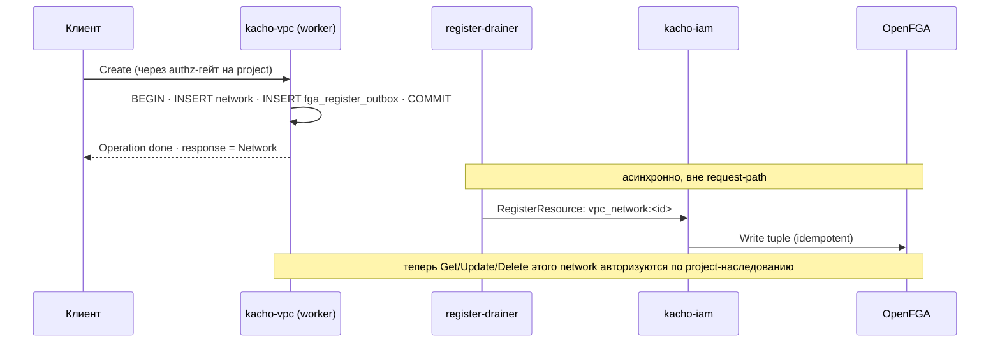
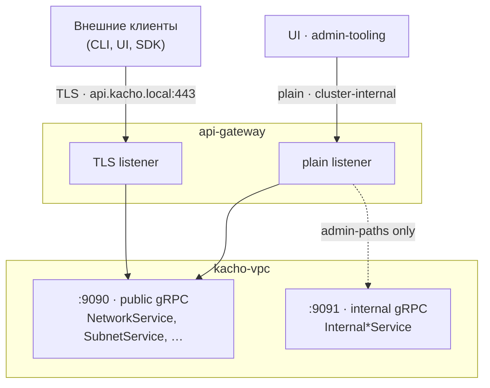

import { Codes } from '@site/src/components/commonBlocks/Codes'

# Авторизация и приватность

Kachō VPC защищен на двух взаимодополняющих уровнях:

1. **Авторизация (authz)** — на каждый RPC проверяется, что вызывающий субъект имеет нужное
   отношение (relation) на ресурс или проект. Модель — **ReBAC** (relationship-based access
   control) поверх **OpenFGA**, проверка идет через `kacho-iam`.
2. **Приватность данных** — инфраструктурно-чувствительные поля (placement,
   underlay-идентификаторы, host-интерфейсы) **никогда** не покидают internal-поверхность. Публичный API показывает только
   tenant-facing «намерение + результат».

:::info Защита в глубину (defense-in-depth)
Эти два уровня независимы. Даже если authz-гейт скомпрометирован (или tenant имеет легитимный
read к своим ресурсам), он **не** должен узнать физическую топологию: на каком гипервизоре лежит
интерфейс, какие у него underlay-идентификаторы, какой host-интерфейс. Это разведданные для
lateral movement — и они
структурно недоступны на публичной поверхности.
:::

---

## Per-RPC authz-гейт

Авторизация реализована как **gRPC unary + stream interceptor** (из `kacho-corelib/authz`),
включенный в каждый доменный сервис. Перед вызовом бизнес-логики interceptor выясняет тройку
**subject — relation — object** и делает один `Check` к `kacho-iam`.



### Subject — кто вызывает

Субъект извлекается из **Principal**, который api-gateway кладет в контекст после валидации JWT
(`operations.PrincipalFromContext`). Это либо пользователь, либо service-account:

<table>
  <thead><tr><th>Тип субъекта</th><th>FGA-форма</th><th>Источник</th></tr></thead>
  <tbody>
    <tr><td><strong>Пользователь</strong></td><td><code>user:&#123;user\_id&#125;</code></td><td>JWT (вход через IAM)</td></tr>
    <tr><td><strong>Service-account</strong></td><td><code>service\_account:&#123;sa\_id&#125;</code></td><td>JWT, выписанный на SA</td></tr>
  </tbody>
</table>

Пустой / отсутствующий Principal на non-internal RPC → отказ (`Denied`). Аутентификация JWT
(подпись, срок, DPoP-binding) — ответственность api-gateway; в kacho-vpc приходит уже
проверенный Principal.

### Relation — что делается

Relation выводится из gRPC-метода (verb-taxonomy). Для VPC это, как правило, `viewer` для
чтения и `editor` для мутаций:

<table>
  <thead><tr><th>RPC</th><th>Relation</th><th>Семантика</th></tr></thead>
  <tbody>
    <tr><td><code>Get</code> / <code>List</code></td><td><code>viewer</code></td><td>Чтение ресурса / списка</td></tr>
    <tr><td><code>Create</code></td><td><code>editor</code></td><td>Проверяется на <strong>родителе</strong> (project / network)</td></tr>
    <tr><td><code>Update</code> / <code>Delete</code></td><td><code>editor</code></td><td>Изменение / удаление</td></tr>
    <tr><td><code>AddCidrBlocks</code> / <code>UpdateRules</code> / …</td><td><code>editor</code></td><td>Ресурс-специфичные мутации</td></tr>
  </tbody>
</table>

:::note `editor` ⊇ `viewer`
В FGA-модели отношение `editor` наследует `viewer`: тот, кто может править ресурс, может его и
читать. Поэтому отдельную проверку «editor → также viewer» делать не нужно.
:::

### Object — на чем проверяется

Объект `Check` формируется из запроса (`FormatObject` → `<type>:<id>`):

<table>
  <thead><tr><th>Класс RPC</th><th>Object</th><th>Почему</th></tr></thead>
  <tbody>
    <tr><td><code>GetNetworkRequest&#123;networkId&#125;</code></td><td><code>vpc\_network:&#123;id&#125;</code></td><td>Проверяем сам ресурс</td></tr>
    <tr><td><code>CreateSubnetRequest&#123;networkId, projectId&#125;</code></td><td><code>vpc\_network:&#123;id&#125;</code> / <code>project:&#123;id&#125;</code></td><td>Ресурса еще нет — проверяем <strong>родителя</strong></td></tr>
    <tr><td><code>ListNetworksRequest&#123;projectId&#125;</code></td><td><code>project:&#123;id&#125;</code></td><td>Право на список — на проекте</td></tr>
  </tbody>
</table>

---

## Hierarchy-tuples — как ресурс становится «авторизуемым»

OpenFGA вычисляет `viewer`/`editor` на ресурсе через **наследование от проекта**. Чтобы это
сработало, у каждого ресурса должен быть **hierarchy-tuple**, связывающий его с проектом:

```text
vpc_network:{networkId}#project@project:{projectId}
└───── object ─────┘ └─rel─┘ └───── subject ─────┘
```

Читается как: «у объекта `vpc_network:net…` отношение `project` указывает на `project:prj…`».
Дальше FGA-модель разворачивает: `viewer` на network = `viewer` на его project ∪ прямые
binding'и.

**kacho-vpc в OpenFGA напрямую не ходит.** Намерение «зарегистрировать owner-tuple» worker на
Create пишет строкой в transactional-outbox `fga_register_outbox` — **в той же writer-TX**, что
вставляет ресурс (один commit, без dual-write). Отдельный register-drainer применяет каждое
намерение через `kacho-iam.InternalIAMService.RegisterResource` (на Delete — `UnregisterResource`):
idempotent, at-least-once, retry на `Unavailable`. Так tuple durable и не теряется при
transient-сбое FGA — иначе пользователь создал бы ресурс и не увидел его (per-resource Check = DENY).



:::tip NoPath → NOT_FOUND, а не PERMISSION_DENIED
Между коммитом ресурса и применением owner-tuple drainer'ом есть короткое окно. Если `Check`
приходит, когда tuple еще не записан, `kacho-iam` возвращает «нет пути к объекту». Interceptor
трактует это как **pass-through**: запрос идет в handler, который вернет `NOT_FOUND` из БД (если
ресурса правда нет) или нормальный ответ. Это сознательное решение — не маскировать «ресурс
существует, но нет tuple» как `403`.
:::

---

## Кэш, инвалидация и fail-policy

`Check` к `kacho-iam` стоит на hot-path каждого RPC, поэтому результат кэшируется.

<table>
  <thead><tr><th>Аспект</th><th>Поведение</th></tr></thead>
  <tbody>
    <tr><td><strong>Кэш</strong></td><td>TTL 5 с, <em>только положительные</em> решения (allowed), per-subject LRU</td></tr>
    <tr><td><strong>Инвалидация</strong></td><td><code>pg\_notify('kacho\_iam\_subjects', subject\_id)</code> → немедленный сброс по субъекту (revoke ≤ 10 с)</td></tr>
    <tr><td><strong>Mutation fail-mode</strong></td><td><strong>fail-closed</strong>: <code>kacho-iam</code> недоступен → <code>UNAVAILABLE</code> (мутацию не пропускаем)</td></tr>
    <tr><td><strong>Read fail-mode</strong></td><td>конфигурируемо: по умолчанию closed; опционально fail-open-logged для чтений</td></tr>
    <tr><td><strong>Breakglass</strong></td><td><code>KACHO\_VPC\_AUTHZ\_\_BREAKGLASS=true</code> → bypass + WARN (только dev / emergency)</td></tr>
  </tbody>
</table>

:::caution Production fail-closed по умолчанию
Любой развернутый стенд работает в **production-mode**: анонимный запрос (без валидного
Principal) — `PermissionDenied`, межсервисный транспорт — mTLS. Послабления (`dev`-mode, в котором
caller без AuthN-headers трактуется как admin, и breakglass-bypass) допустимы **только** локально —
в unit/integration-фикстурах и при разработке, **никогда** на кластере. Это инвариант: authN+authZ
энфорсятся на каждом RPC обоих listener'ов (public `:9090` и internal `:9091`) — internal-периметр
не считается доверенным.
:::

### Коды ошибок authz-гейта

<Codes codes={['unauthenticated', 'permissionDenied', 'unavailable', 'notFound']} />

---

## Public vs internal listener

kacho-vpc слушает **два** порта. Это физическая граница приватности — не только логическая.



<table>
  <thead><tr><th></th><th>Public (<code>:9090</code>)</th><th>Internal (<code>:9091</code>)</th></tr></thead>
  <tbody>
    <tr><td><strong>Сервисы</strong></td><td><code>NetworkService</code>, <code>SubnetService</code>, <code>AddressService</code>, <code>RouteTableService</code>, <code>SecurityGroupService</code>, <code>GatewayService</code>, <code>NetworkInterfaceService</code></td><td><code>Internal\*Service</code> (AddressPool, Address-allocate, Network admin)</td></tr>
    <tr><td><strong>REST через api-gateway</strong></td><td>да — оба listener'а (TLS + plain)</td><td>выборочно — <strong>только</strong> plain (cluster-internal) listener</td></tr>
    <tr><td><strong>На external TLS endpoint</strong></td><td>да</td><td><strong>нет</strong> (запрет публикации Internal* наружу)</td></tr>
    <tr><td><strong>Назначение</strong></td><td>tenant-facing CRUD + Operations</td><td>admin-UI, IPAM, peer-сервисы</td></tr>
  </tbody>
</table>

:::warning Internal* НЕ публикуется на external TLS endpoint
`Internal*`-методы могут быть проброшены через api-gateway REST на **cluster-internal** listener
(для UI / admin-tooling / port-forward), но на advertised external TLS endpoint
(`api.kacho.local:443`, для внешних клиентов) эти пути **должны** отвечать `404`. Admin-only пути
(`/vpc/v1/addressPools*`, `…/addressPoolBinding`) фильтруются на
TLS-listener'е. Любой новый admin-RPC добавляется **только** в `Internal*`-сервис, а не в публичный.
:::

---

## Инфра-чувствительные данные — только на Internal*-API

Раскрытие инфраструктурного слоя помогает картировать и таргетировать физику. Поэтому
такие данные принципиально живут **исключительно** в `Internal*`-проекциях ресурсов и **никогда** не
попадают в публичный ответ. `kacho-vpc` — control-plane-only: его ресурсы tenant-facing и lean, а
немногие инфра-чувствительные поля вынесены в **отдельную internal-проекцию**.

<table>
  <thead><tr><th>Категория</th><th>Пример в kacho-vpc</th><th>Где доступно</th></tr></thead>
  <tbody>
    <tr><td><strong>Числовой инфра-идентификатор</strong></td><td><code>networks.vrf\_id</code> — VRF tenancy-домена data-plane</td><td>internal-only (<code>InternalNetworkService.GetNetwork</code>)</td></tr>
    <tr><td><strong>Placement / физика</strong></td><td>привязка ресурса к узлу, транспортные/маршрутные id, имена host-интерфейсов</td><td>data-plane / internal-only (в публичном API <code>kacho-vpc</code> отсутствуют)</td></tr>
  </tbody>
</table>

### Публичная проекция ресурсов kacho-vpc

Ресурсы `kacho-vpc` — чисто control-plane (lean, tenant-facing). Инфра-полей в **публичной**
проекции нет:

<table>
  <thead><tr><th>Ресурс</th><th>Публичная проекция</th><th>Internal-only</th></tr></thead>
  <tbody>
    <tr><td><code>Network</code></td><td><code>id</code>, <code>name</code>, <code>projectId</code>, <code>labels</code>, <code>createdAt</code>, <code>defaultSecurityGroupId</code></td><td><code>vrf\_id</code> (через <code>InternalNetworkService.GetNetwork</code>)</td></tr>
    <tr><td><code>NetworkInterface</code></td><td><code>id</code>, <code>name</code>, <code>subnetId</code>, <code>v4/v6AddressIds</code>, <code>securityGroupIds</code>, <code>usedBy</code>, <code>macAddress</code>, <code>status</code></td><td>— (инфра-полей нет)</td></tr>
  </tbody>
</table>

:::tip Почему именно так
Tenant сети A не должен иметь возможности вывести «мой инстанс и инстанс tenant'а B лежат на одном
физическом хосте». Placement дает именно такую разведку — поэтому его место исключительно на
internal-поверхности, а не в публичном API. Это структурная гарантия, а не фильтр, который можно
забыть включить.
:::

---

## Чек-лист приватности при добавлении поля / RPC

<table>
  <thead><tr><th>Вопрос</th><th>Действие</th></tr></thead>
  <tbody>
    <tr><td>Поле раскрывает placement / физическую инфраструктуру / числовой инфра-id?</td><td>→ только в <code>Internal\*</code>-проекции, не в публичном сообщении</td></tr>
    <tr><td>RPC нужен admin-UI и его нет в публичном API ресурса?</td><td>→ добавить в <code>Internal\*</code>-сервис на <code>:9091</code>, не расширять публичный</td></tr>
    <tr><td>Новый admin-путь проброшен через api-gateway REST?</td><td>→ добавить в TLS-фильтр (404 на external endpoint)</td></tr>
    <tr><td>Новый ресурс с CRUD?</td><td>→ worker на Create пишет intent в <code>fga\_register\_outbox</code> (в той же TX); drainer регистрирует hierarchy-tuple <code>vpc\_&lt;type&gt;:&lt;id&gt;#project@project:&lt;pid&gt;</code> через <code>kacho-iam.RegisterResource</code></td></tr>
    <tr><td>Новый RPC?</td><td>→ замапить relation (<code>viewer</code>/<code>editor</code>) и object-extractor в authz-RPCMap</td></tr>
  </tbody>
</table>
