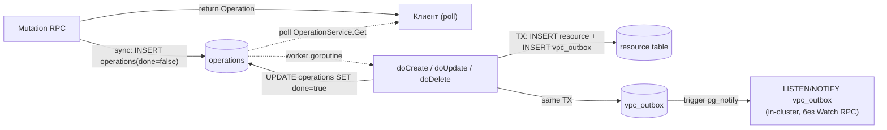

import { Codes } from '@site/src/components/commonBlocks/Codes'
import { DbSchemaDiagram } from '@site/src/components/commonBlocks/DbSchemaDiagram/DbSchemaDiagram'
import { DATABASE_SCHEMA_DIAGRAM } from '@site/src/constants/database-schema'

# Модель данных

Kachō VPC хранит все состояние в PostgreSQL-схеме **`kacho_vpc`** (database-per-service:
сервис владеет только этой схемой и не делает cross-service FK). Схема — **flat**:
каждый ресурс — одна таблица с domain-полями на верхнем уровне, без K8s-envelope
(`resource_version` / `generation` / `deletion_timestamp` / `finalizers` / `spec` / `status`-JSONB).
Все id-колонки — `TEXT` (3-символьный префикс типа ресурса + 17 символов crockford-base32).

:::info Baseline + инкрементные миграции
Базовая схема создается squashed-baseline `0001_initial.sql`: все таблицы, CHECK / FK / UNIQUE /
EXCLUDE / generated-колонки / индексы / триггеры — inline в одном файле. Поверх применены
инкременты:

<table>
  <thead><tr><th>Миграция</th><th>Что добавляет</th></tr></thead>
  <tbody>
    <tr><td><code>0001</code></td><td>squashed baseline — вся схема <code>kacho\_vpc</code></td></tr>
    <tr><td><code>0002</code></td><td>drop неиспользуемых IPAM-таблиц (override + cloud-pool-selector)</td></tr>
    <tr><td><code>0003</code></td><td>drop <code>SecurityGroup.status</code></td></tr>
    <tr><td><code>0004</code></td><td><code>address\_pool\_cidrs</code> + EXCLUDE на пересечение CIDR пулов</td></tr>
    <tr><td><code>0005</code></td><td>FK <code>default\_security\_group\_id</code> (ON DELETE SET NULL) + partial UNIQUE «≤ 1 default-SG на сеть»</td></tr>
    <tr><td><code>0006</code></td><td><code>fga\_register\_outbox</code> — transactional-outbox для регистрации owner-tuple в FGA через kacho-iam</td></tr>
    <tr><td><code>0007</code></td><td><code>networks.vrf\_id</code> — sequence-backed уникальный VRF id (инфра-чувствительный, отдается только через internal-поверхность)</td></tr>
    <tr><td><code>0008</code></td><td>additive-колонки <code>resource\_kind</code> / <code>resource\_id</code> на <code>fga\_register\_outbox</code> (для reconciler/observability)</td></tr>
    <tr><td><code>0009</code></td><td>additive nullable <code>operations.account\_id</code> (общий LRO-writer corelib)</td></tr>
  </tbody>
</table>

Версионирование — Goose; новая миграция = новый файл с инкрементным номером
(следующий — `0010_*`). Редактировать примененную миграцию запрещено.
:::

## ER-диаграмма

Ниже — все основные таблицы схемы `kacho_vpc` с PK / FK. Soft-ref-связи (по id, без FK —
например `network_interfaces.v4_address_ids[]`) показаны пунктиром.

<DbSchemaDiagram {...DATABASE_SCHEMA_DIAGRAM} />

:::note Владелец ресурса — `projectId`
Все ресурсы привязаны к проекту: в публичном API поле `projectId`, на уровне БД колонка
`project_id`. Это id владельца ресурса — cross-service-ссылка на `kacho-iam` без FK (см. ниже).
Иерархия владения — **Account → Project**; ресурс всегда живет в проекте.
:::

## Таблицы схемы

<table>
  <thead>
    <tr><th>Таблица</th><th>Ресурс / назначение</th><th>PK</th><th>Уникальность</th></tr>
  </thead>
  <tbody>
    <tr><td><code>networks</code></td><td>Network (VPC-контейнер)</td><td><code>id</code></td><td>non-partial <code>UNIQUE (project\_id, name)</code></td></tr>
    <tr><td><code>subnets</code></td><td>Subnet (подсеть в зоне)</td><td><code>id</code></td><td>partial <code>UNIQUE … WHERE name&lt;&gt;''</code></td></tr>
    <tr><td><code>addresses</code></td><td>Address (internal / external IP)</td><td><code>id</code></td><td>partial <code>UNIQUE</code> + per-pool/subnet IP-dedup</td></tr>
    <tr><td><code>address\_references</code></td><td>1↔1 backref «кто использует адрес»</td><td><code>address\_id</code></td><td>—</td></tr>
    <tr><td><code>route\_tables</code></td><td>RouteTable</td><td><code>id</code></td><td>partial <code>UNIQUE</code></td></tr>
    <tr><td><code>security\_groups</code></td><td>SecurityGroup + правила (jsonb)</td><td><code>id</code></td><td>partial <code>UNIQUE</code></td></tr>
    <tr><td><code>gateways</code></td><td>Gateway (shared egress)</td><td><code>id</code></td><td>partial <code>UNIQUE</code></td></tr>
    <tr><td><code>network\_interfaces</code></td><td>NetworkInterface (first-class NIC, отдельно от Instance)</td><td><code>id</code></td><td>partial <code>UNIQUE</code> + <code>mac\_address</code> cloud-wide</td></tr>
    <tr><td><code>address\_pools</code></td><td><em>(admin)</em> глобальный пул CIDR для IPAM</td><td><code>id</code></td><td>partial <code>UNIQUE</code> на default-pool</td></tr>
    <tr><td><code>operations</code></td><td>Long-running async-операции (LRO)</td><td><code>id</code></td><td>—</td></tr>
    <tr><td><code>vpc\_outbox</code></td><td>Доменный транзакционный журнал событий + <code>pg\_notify</code> (in-cluster <code>LISTEN/NOTIFY</code>; Watch RPC не публикуется)</td><td><code>sequence\_no</code></td><td>—</td></tr>
    <tr><td><code>fga\_register\_outbox</code></td><td>Транзакционный outbox для регистрации owner-tuple в FGA (через kacho-iam)</td><td><code>id</code></td><td>—</td></tr>
  </tbody>
</table>

:::tip Полный список
Помимо перечисленных, IPAM добавляет вспомогательные таблицы: <code>address\_pool\_network\_default</code>, <code>address\_pool\_cidrs</code>, <code>address\_pool\_free\_ips</code>, <code>ipv6\_pool\_cursors</code>, <code>ipv6\_allocated\_ips</code>, <code>ipv6\_released\_offsets</code>. Полная ER-схема — в <code>docs/architecture/er-diagram.md</code> репозитория.
:::

## FK-контракт (within-service)

FK существуют **только внутри схемы `kacho_vpc`** (cross-service FK запрещены — database-per-service).
Политика `ON DELETE` определяет, что происходит при удалении родителя.

<table>
  <thead>
    <tr><th>FK</th><th>ON DELETE</th><th>Семантика</th></tr>
  </thead>
  <tbody>
    <tr><td><code>subnets.network\_id → networks</code></td><td><strong>RESTRICT</strong></td><td>Нельзя удалить Network с подсетями</td></tr>
    <tr><td><code>route\_tables.network\_id → networks</code></td><td>NO ACTION</td><td>RESTRICT-семантика (плюс service-guard)</td></tr>
    <tr><td><code>security\_groups.network\_id → networks</code></td><td><strong>RESTRICT</strong></td><td>Не-default SG блокирует удаление Network (<code>network is not empty</code>); колонка nullable (unbound SG)</td></tr>
    <tr><td><code>addresses.internal\_subnet\_id → subnets</code></td><td><strong>RESTRICT</strong></td><td>Internal-адрес (v4 ИЛИ v6) блокирует удаление подсети; через generated-колонку</td></tr>
    <tr><td><code>network\_interfaces.subnet\_id → subnets</code></td><td><strong>RESTRICT</strong></td><td>NIC жестко блокирует свою подсеть</td></tr>
    <tr><td><code>subnets.route\_table\_id → route\_tables</code></td><td><strong>SET NULL</strong></td><td>RT.Delete обнуляет привязку подсети (без блокировки)</td></tr>
    <tr><td><code>networks.default\_security\_group\_id → security\_groups</code></td><td><strong>SET NULL</strong></td><td>Удаление default-SG обнуляет ссылку сети (миграция 0005); колонка nullable</td></tr>
    <tr><td><code>address\_references.address\_id → addresses</code></td><td><strong>CASCADE</strong></td><td>Удаление Address авточистит backref</td></tr>
    <tr><td><code>address\_pool\_network\_default.network\_id → networks</code></td><td><strong>CASCADE</strong></td><td>Удаление Network чистит network-default-привязку пула</td></tr>
    <tr><td><code>address\_pool\_network\_default.pool\_id → address\_pools</code></td><td><strong>RESTRICT</strong></td><td>Нельзя удалить pool, привязанный как network-default</td></tr>
    <tr><td><code>address\_pool\_&#123;cidrs,free\_ips&#125;.pool\_id / ipv6\_&#42;.pool\_id → address\_pools</code></td><td><strong>CASCADE</strong></td><td>Удаление pool чистит служебные IPAM-строки (CIDR, freelist, v6-курсоры)</td></tr>
  </tbody>
</table>

:::tip Порядок удаления — снизу вверх
RESTRICT-цепочка требует удалять детей раньше родителей:
**`NetworkInterface → Address → Subnet → Network`**. Сначала detach NIC и освобождение адресов,
затем удаление подсетей, затем — сети (default-SG удаляется worker'ом автоматически перед Network).
Удаление непустого родителя → <code>FAILED\_PRECONDITION</code>.
:::

`default_security_group_id` на `networks` — nullable FK **`ON DELETE SET NULL`** (миграция `0005`);
partial UNIQUE `security_groups_one_default_per_network` гарантирует ≤ 1 default-SG на сеть.

## Within-service инварианты на DB-уровне

Все ссылочные зависимости и инварианты внутри `kacho_vpc` зафиксированы на уровне БД — а не
software-side `Get → check → Update` (TOCTOU запрещен). Это race-proof backstop поверх
service-валидации.

<table>
  <thead>
    <tr><th>Инвариант</th><th>DB-механизм</th><th>SQLSTATE → gRPC</th></tr>
  </thead>
  <tbody>
    <tr>
      <td>Имя уникально в проекте</td>
      <td><code>UNIQUE (project\_id, name)</code> — для <code>networks</code> non-partial; для остальных 6 — partial <code>WHERE name&lt;&gt;''</code></td>
      <td><code>23505</code> → ALREADY_EXISTS</td>
    </tr>
    <tr>
      <td>CIDR-блоки подсетей не пересекаются в пределах сети</td>
      <td><code>EXCLUDE USING gist (network\_id WITH =, v4\_cidr\_primary inet\_ops WITH &&)</code> — constraint <code>subnets\_no\_overlap\_v4</code> / <code>\_v6</code> по generated-колонке</td>
      <td><code>23P01</code> → FAILED_PRECONDITION (<code>Subnet CIDRs can not overlap</code>)</td>
    </tr>
    <tr>
      <td>CIDR-блоки AddressPool не пересекаются в пределах <code>kind</code></td>
      <td><code>EXCLUDE USING gist (kind WITH =, block inet\_ops WITH &&)</code> на <code>address\_pool\_cidrs</code> (миграция 0004)</td>
      <td><code>23P01</code> → FAILED_PRECONDITION</td>
    </tr>
    <tr>
      <td>Один внешний IP назначен максимум одному Address</td>
      <td>partial <code>UNIQUE (external\_ipv4-&gt;&gt;'address\_pool\_id', external\_ipv4-&gt;&gt;'address') WHERE … &lt;&gt; ''</code></td>
      <td><code>23505</code> → FAILED_PRECONDITION</td>
    </tr>
    <tr>
      <td>≤ 1 IPv4 и ≤ 1 IPv6 на NIC (cardinality)</td>
      <td><code>CHECK (jsonb\_array\_length(v4\_address\_ids) &lt;= 1)</code> + симметрично v6</td>
      <td><code>23514</code> → INVALID_ARGUMENT</td>
    </tr>
    <tr>
      <td>Один default-pool на <code>(zone\_id, kind)</code></td>
      <td>partial <code>UNIQUE (COALESCE(zone\_id,''), kind) WHERE is\_default</code></td>
      <td><code>23505</code> → FAILED_PRECONDITION</td>
    </tr>
    <tr>
      <td>Существование родителя</td>
      <td><code>FK REFERENCES</code> (см. таблицу выше)</td>
      <td><code>23503</code> → FAILED_PRECONDITION</td>
    </tr>
  </tbody>
</table>

### Атомарный CAS на смену владельца NIC

Установка владельца NIC (`used_by` — кто использует интерфейс) не делается через
software-проверку «свободен ли» — это привело бы к second-writer-wins race. Вместо этого —
**single-statement compare-and-swap** на одной строке (защищен row-level lock'ом Postgres):

```sql
UPDATE network_interfaces
   SET used_by_id = $new, used_by_type = $type, used_by_name = $name
 WHERE id = $id
   AND (used_by_id = '' OR used_by_id = $new)   -- CAS: либо свободно, либо уже наш
RETURNING id;
```

0 строк из `RETURNING` → `ErrFailedPrecondition` → gRPC `FAILED_PRECONDITION`. Идемпотентная
повторная установка того же владельца проходит. Partial `UNIQUE` тут **не** ставится — он ложно
ловил бы нормальный multi-NIC-инстанс (один Compute.Instance имеет N интерфейсов).

:::note Read-modify-write через `xmin` (OCC)
Для сценариев read-modify-write без отдельной колонки версии (например `SecurityGroup.UpdateRules`)
используется системная колонка Postgres <code>xmin::text</code> как snapshot-версия строки:
<code>UPDATE … WHERE id=$1 AND xmin::text=$2</code>. Zero-overhead, без миграции.
:::

## Generated-колонки и сгенерированные значения

<table>
  <thead>
    <tr><th>Колонка</th><th>Таблица</th><th>Как вычисляется</th></tr>
  </thead>
  <tbody>
    <tr><td><code>v4\_cidr\_primary</code> / <code>v6\_cidr\_primary</code></td><td><code>subnets</code></td><td><code>GENERATED STORED</code> из первого элемента CIDR-массива; используется только EXCLUDE-constraint'ами</td></tr>
    <tr><td><code>internal\_subnet\_id</code></td><td><code>addresses</code></td><td><code>GENERATED STORED</code> из <code>internal\_ipv4-&gt;&gt;'subnet\_id'</code> <strong>ИЛИ</strong> <code>internal\_ipv6-&gt;&gt;'subnet\_id'</code>; несет FK на <code>subnets</code></td></tr>
    <tr><td><code>mac\_address</code></td><td><code>network\_interfaces</code></td><td>output-only, аллоцируется сервером (префикс <code>0e:</code> + 40 бит <code>crypto/rand</code>), cloud-wide UNIQUE</td></tr>
    <tr><td><code>id</code></td><td>все</td><td><code>ids.NewID(prefix)</code> — crockford-base32 (генерируется в Go, не в SQL)</td></tr>
  </tbody>
</table>

## CHECK-constraints (DB — последний рубеж)

Все 7 публичных ресурсов несут DB-level `CHECK` поверх `domain.Validate` (защита от внешних
writers / багов в app-коде):

<table>
  <thead><tr><th>Поле</th><th>CHECK</th></tr></thead>
  <tbody>
    <tr><td><code>name</code></td><td>regex <code>^(&#91;a-zA-Z&#93;(&#91;-\_a-zA-Z0-9&#93;&#123;0,61&#125;&#91;a-zA-Z0-9&#93;)?)?$</code> (0–63 байта; empty / uppercase / underscore разрешены)</td></tr>
    <tr><td><code>description</code></td><td><code>length(description) &lt;= 256</code></td></tr>
    <tr><td><code>labels</code></td><td><code>kacho\_labels\_valid(labels)</code> — ≤ 64 пар, key-regex, value ≤ 63</td></tr>
    <tr><td><code>status</code> (NIC)</td><td>enum-проверка набора значений NetworkInterface; у SecurityGroup поля <code>status</code> нет (снято миграцией 0003)</td></tr>
    <tr><td><code>mac\_address</code></td><td>regex <code>^[0-9a-f]&#123;2&#125;(:[0-9a-f]&#123;2&#125;)&#123;5&#125;$</code> (lowercase, colon-separated)</td></tr>
  </tbody>
</table>

Все нарушения CHECK маппятся (SQLSTATE `23514`) в `service.ErrInvalidArg`:

<Codes codes={['invalidArgument', 'alreadyExists', 'failedPrecondition', 'internal']} />

## Operations и Outbox

Две инфраструктурные таблицы обслуживают асинхронный контракт и события.

<table>
  <thead><tr><th>Таблица</th><th>Роль</th></tr></thead>
  <tbody>
    <tr><td><code>operations</code></td><td>LRO-envelope: каждая мутация создает строку (<code>done=false</code>), worker-горутина переводит в <code>done=true</code> с <code>response</code> (созданный ресурс) либо <code>error</code> (<code>google.rpc.Status</code>). Без FK на ресурсы — <code>resource\_id</code> хранится как plain TEXT (ресурс может быть удален до завершения op). Подробнее — <a href="/architecture/operations">Операции</a>.</td></tr>
    <tr><td><code>vpc\_outbox</code></td><td>Транзакционный outbox-журнал: каждая успешная мутация пишет событие в outbox <strong>в той же TX</strong>, что и сам ресурс. Триггер <code>vpc\_outbox\_notify\_trg</code> делает <code>pg\_notify('vpc\_outbox', sequence\_no::text)</code> — in-cluster <code>LISTEN/NOTIFY</code>-канал. Публичного Watch RPC в Kachō нет: клиенты наблюдают изменения через polling <code>List</code> / <code>OperationService.Get</code>.</td></tr>
  </tbody>
</table>



## Cross-service ссылки (no FK)

Колонки, ссылающиеся на ресурсы **других** сервисов, хранятся как `TEXT` без FK
(database-per-service запрещает cross-DB FK). Целостность — через валидацию на request-path
(вызов owner-сервиса в worker'е) + грациозное переживание dangling-ref на чтении.

<table>
  <thead><tr><th>Колонка</th><th>Owner-сервис</th><th>Валидация</th></tr></thead>
  <tbody>
    <tr><td><code>&#42;.project\_id</code> (все ресурсы)</td><td><code>kacho-iam</code></td><td><code>ProjectService.Get</code> на Create</td></tr>
    <tr><td><code>subnets.zone\_id</code></td><td><code>kacho-geo</code></td><td><code>geo.v1.ZoneService.Get</code> на Create (TTL-кэш положительного результата)</td></tr>
    <tr><td><code>addresses.external\_ipv4/6-&gt;&gt;'zone\_id'</code></td><td><code>kacho-geo</code></td><td><code>geo.v1.ZoneService.Get</code> (graceful dangling на чтении)</td></tr>
    <tr><td><code>address\_pools.zone\_id</code></td><td><code>kacho-geo</code></td><td><code>geo.v1.ZoneService.Get</code></td></tr>
    <tr><td><code>network\_interfaces.used\_by\_id</code></td><td>обычно <code>kacho-compute.instances</code></td><td>denormalized mirror (без peer-вызова)</td></tr>
  </tbody>
</table>

:::info Schema location
Все user-таблицы, <code>goose\_db\_version</code> и user-функции (<code>kacho\_labels\_valid</code> +
trigger-функции) живут в схеме <code>kacho\_vpc</code> (не <code>public</code>). Extension
<code>btree\_gist</code> — в <code>public</code> (extension-owned). Каждое соединение устанавливает
<code>search\_path TO kacho\_vpc, public</code> через libpq-параметр
<code>options=-c search\_path=kacho\_vpc,public</code>.
:::

:::note Инфра-чувствительное поле `networks.vrf_id`
Колонка <code>networks.vrf\_id</code> (миграция <code>0007</code>, sequence-backed, cloud-wide
UNIQUE) — SRv6 VRF-идентификатор tenancy-домена data-plane. Это <strong>инфра-чувствительное</strong>
поле: оно не входит в публичную проекцию <code>Network</code> и отдается <strong>только</strong>
через internal-поверхность (<code>InternalNetworkService.GetNetwork</code>, <code>:9091</code>). См.
[Авторизация и приватность](/architecture/authz).
:::
