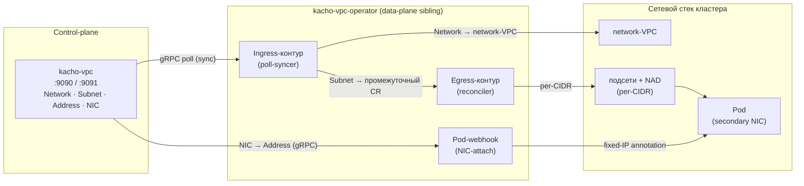
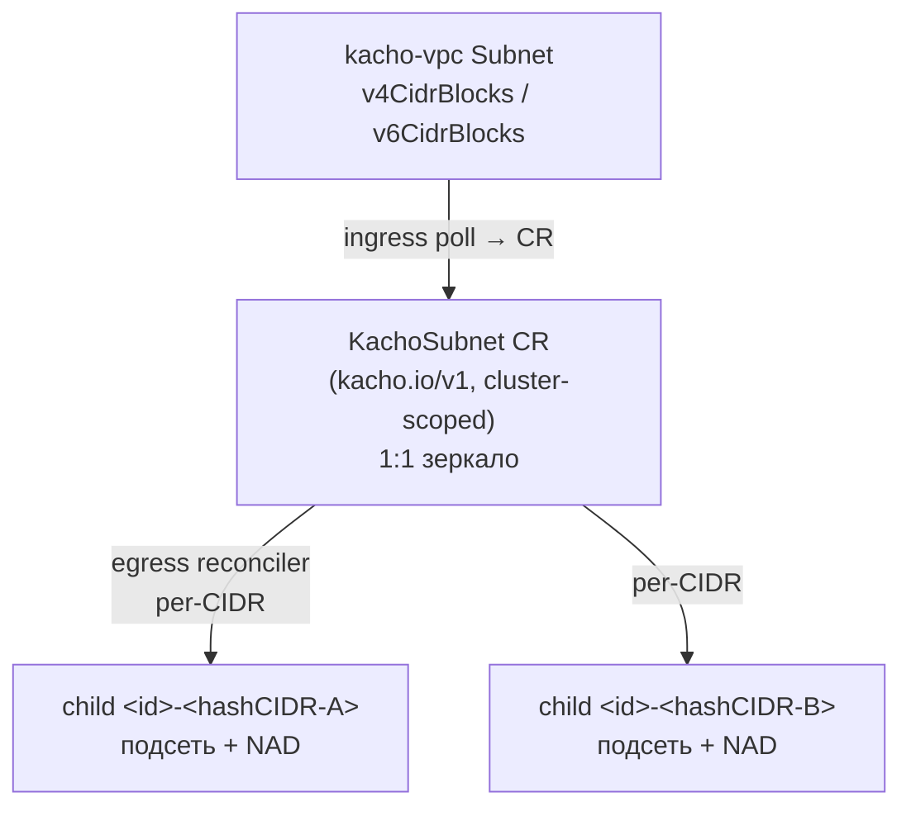
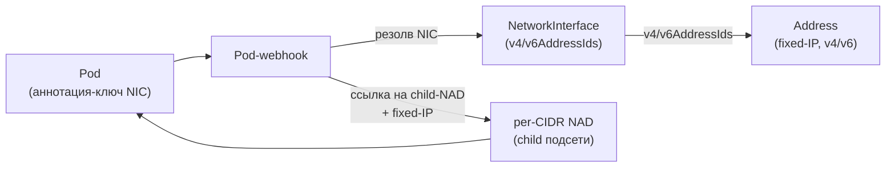

# Материализация ресурсов в data-plane

`kacho-vpc` — **control-plane only**: он хранит *намерение и состояние* сети (Network /
Subnet / Address / NetworkInterface / …) и не программирует сетевой стек напрямую. За
превращение control-plane-ресурсов в реальную сеть отвечает отдельный data-plane-компонент —
**`kacho-vpc-operator`**. Эта страница описывает, как намерение `kacho-vpc` становится
работающей сетью.

:::info Разделение control-plane ↔ data-plane
`kacho-vpc-operator` — самостоятельный sibling-компонент **вне build-графа** control-plane:
`kacho-vpc` его не импортирует и о нем не знает. Связь — однонаправленная: оператор
**читает** VPC-ресурсы из `kacho-vpc` по gRPC и **материализует** их в сетевой стек. Это
держит control-plane чистым (управление намерением) и позволяет менять реализацию
data-plane независимо.
:::

## Контур материализации

Оператор работает в кластере как два независимых контроллера и приводит реальную сеть к
состоянию, объявленному в `kacho-vpc`:

:::note Polling, не Watch
Оператор читает control-plane **поллингом** (`NetworkService` / `SubnetService.List` с
коротким интервалом) — публичного per-resource Watch RPC в Kachō нет (см.
[Особенности дизайна](/advanced/known-divergences)). Это согласуется с клиентской моделью
всего API: наблюдение за состоянием — через polling/Operations, а не server-streaming.
:::

## Маппинг ресурсов

| Control-plane ресурс | Материализация в data-plane | Кардинальность |
|---|---|---|
| **Network** | сетевой VPC кластера (имя = `id` сети, изолированный) | 1 Network → 1 VPC |
| **Subnet** | N×(подсеть + NAD) — по одной паре на CIDR-блок | 1 CIDR → 1 child-подсеть + 1 NAD |
| **NetworkInterface** | fixed-IP-аннотация на Pod (через webhook) | 1 NIC → 1 secondary-интерфейс пода |
| **Address** (internal, v4/v6) | конкретный IP, на который фиксируется data-plane | источник истины IPAM — `kacho-vpc` |

:::tip Одна семья на child: один CIDR = одна child-подсеть
Подсеть `kacho-vpc` может нести несколько CIDR-блоков (IPv4 и IPv6). Оператор материализует
**каждый CIDR в отдельную child-подсеть одного семейства** (`IPv4` либо `IPv6`), без
объединения в dual-stack-child. Это осознанное решение: per-CIDR-child делает удаление и
сверку поэлементными (убрали CIDR из Subnet → запрунилась ровно его child-пара), а IPv4 и
IPv6 живут как независимые единицы.
:::

## Промежуточный CRD `KachoSubnet`

Subnet не маппится напрямую в child-подсети — между control-plane и сетевым стеком стоит
**собственный CRD оператора `KachoSubnet`** (`kacho.io/v1`, cluster-scoped). Ingress-контур
зеркалит каждую Kachō Subnet в один `KachoSubnet`-объект 1:1; egress-контур
(controller-runtime Reconciler) материализует его в N×(child-подсеть + NAD).

Зачем промежуточный CR (а не прямой маппинг Subnet → подсеть):

| Решение | Почему так |
|---|---|
| **Промежуточный `KachoSubnet`** | дает контроллеру локальный desired-state в кластере: ownerRef-каскад, finalizer-teardown и поэлементный prune работают на k8s-объекте, а не на удаленном gRPC-ресурсе |
| **cluster-scoped** | его ownerRef должен каскадить и на cluster-scoped child-подсеть, и на namespaced NAD — namespaced-владелец не может владеть cluster-scoped зависимым объектом |
| **stable-by-immutable-id имена child'ов** | child именуется `<subnet-id>-<hash(canonical CIDR)>` — по **неизменяемому** id подсети, не по мутабельному `name`. Переименование Subnet в Kachō не осиротит и не пересоздаст уже работающую сеть |
| **один CIDR = один child** (single-family) | поэлементный prune: убрали CIDR из Subnet → запрунилась ровно его child-пара; соседние CIDR не задеты |

### Жизненный цикл и teardown

- **ownerRef + finalizer.** Каждый child получает `SetControllerReference(KachoSubnet)`;
  на самом `KachoSubnet` стоит finalizer. Удаление держит объект в `Terminating`, пока
  контроллер не снимет свои child'ы — затем k8s завершает каскад по ownerRef.
- **element-prune.** Egress на каждой сверке вычисляет desired-набор child'ов из валидных
  CIDR и удаляет child'ы, которых в нем нет (CIDR убрали из Subnet). Битый CIDR не порождает
  имени и не участвует в сверке — он не запрунит соседний валидный child.
- **in-use guard.** Child-подсеть с реальными pod-аллокациями не удаляется: оператор
  переводит `KachoSubnet` в degraded-состояние (`Ready=False`) и снимает finalizer лишь
  когда аллокации обнулятся — грациозная обработка dangling-ref вместо обрыва трафика.

## Привязка NIC к поду (webhook)

`NetworkInterface` материализуется на под **отдельным контуром** — pod-mutating-webhook'ом.
`kacho-vpc` остается источником истины IPAM: webhook не выдает IP сам, а резолвит уже
выделенный платформой адрес.

Шаги webhook'а при создании пода с привязкой к NIC:

1. По аннотации-ключу пода резолвится `NetworkInterface`, затем его `Address`-ресурсы
   (`v4AddressIds` / `v6AddressIds`).
2. Для каждого адреса определяется CIDR подсети, который его содержит, и берется
   соответствующий **per-CIDR child-NAD** (`<subnet-id>-<hashCIDR>`) — тот же расчет имени,
   что у egress-контура (общий код, без расхождения двух реализаций).
3. Под получает ссылку на child-NAD и **fixed-IP** из Kachō `Address` (dual-stack — оба
   семейства). Сетевой стек фиксируется на этот IP; источник истины IPAM — `kacho-vpc`.

:::note Guard-проверки webhook'а
Webhook доверяет namespace пода (k8s RBAC), а не аннотациям: проект из ключа должен
совпадать с namespace пода, а резолвленный NIC — реально принадлежать этому проекту и
подсети. Иначе под отклоняется. Несколько IP на VM — через несколько NIC в **разных**
подсетях (один NIC несет ≤ 1 IPv4 и ≤ 1 IPv6 — см. [NetworkInterface](/api/network-interface)).
:::

## Зональность и развитие

Geography (Region / Zone) — отдельный leaf-домен **kacho-geo**: `kacho-vpc` валидирует `zone_id`
подсетей и пулов через `geo.v1.ZoneService.Get` (см. [Обзор архитектуры](/architecture/overview)).
Материализация ресурсов в data-plane и multi-zone-связность развиваются независимо от control-plane
(оператор — sibling вне build-графа). Кратко о направлении — на странице
[Особенности дизайна](/advanced/known-divergences).

:::info Где живут инфра-чувствительные данные
Подробности материализации (привязка к узлам, транспортные/маршрутные идентификаторы,
имена интерфейсов узла) — это инфра-чувствительные данные: они **не** попадают в публичный
API ресурсов `kacho-vpc` и доступны только через internal-поверхность (`:9091`). Публичный
ресурс показывает только tenant-facing «намерение + результат» — см.
[Обзор архитектуры](/architecture/overview).
:::
