import { Codes } from '@site/src/components/commonBlocks/Codes'
import CodeBlock from '@theme/CodeBlock'
import dedent from 'ts-dedent'

# IPAM (управление IP-адресами)

**IPAM** (IP Address Management) — встроенная подсистема `kacho-vpc`, отвечающая за выделение
внутренних и внешних IP-адресов. Аллокация выполняется **inline в request-path** use-case-слоя
(`internal/apps/kacho/api/address/`): когда `AddressService.Create` отрабатывает в worker'е операции,
он in-process вызывает `InternalAddressService.Allocate*`. Внешней IPAM-зависимости нет —
вся логика и хранилище живут в схеме `kacho_vpc`.

:::info Аллокация — внутри Operation-worker'а
IPAM встроен прямо в `kacho-vpc`: allocate происходит синхронно внутри Operation-worker'а
`Address.Create` (in-process вызов `InternalAddressService`), а не в отдельном reconciler-сервисе.
Это убирает eventual-consistency лаг между созданием `Address` и появлением у него IP — к моменту
`done=true` адрес уже выделен и зафиксирован в той же writer-TX.
:::

## Обзор

<table>
  <thead>
    <tr><th>Понятие</th><th>Описание</th></tr>
  </thead>
  <tbody>
    <tr><td><strong>AddressPool</strong></td><td>Глобальный admin-ресурс — пул CIDR-блоков, из которого аллоцируются <strong>внешние</strong> IP. Не привязан к проекту; общий на всю инсталляцию</td></tr>
    <tr><td><strong>Внутренний IP</strong></td><td>Аллоцируется из CIDR-блоков подсети адреса (<code>Subnet.v4\_cidr\_blocks</code> / <code>v6\_cidr\_blocks</code>) — пул не нужен</td></tr>
    <tr><td><strong>Внешний IP</strong></td><td>Аллоцируется из <code>AddressPool</code>, выбранного 3-шаговым cascade-резолвом (network-default → zone-default → global-default, с family-фильтром)</td></tr>
    <tr><td><strong>InternalAddressService</strong></td><td>gRPC-сервис аллокации — <strong>internal-only</strong> (порт 9091). Вызывается in-process из <code>AddressService</code> и peer-сервисами (<code>kacho-compute</code>)</td></tr>
    <tr><td><strong>Двухфазный аллокатор</strong></td><td>Резолв пула/подсети → атомарная вставка IP (внешний v4 — freelist-pop, внутренний — retry на UNIQUE-коллизию)</td></tr>
    <tr><td><strong>Идемпотентность</strong></td><td>Повторный allocate на уже-выделенном адресе возвращает существующий IP с <code>alreadyAllocated=true</code></td></tr>
  </tbody>
</table>

:::note Internal-only поверхность
`InternalAddressService` и `InternalAddressPoolService` **не публикуются** на external TLS endpoint
(`api.kacho.local:443`). Они доступны только на cluster-internal listener (`:9091`) и частично
проброшены через api-gateway REST mux (`/vpc/v1/addressPools/...`) для UI/admin-tooling. Структура
аллокации — служебная и наружу для tenant-клиентов не выставляется. Подробнее — [Авторизация и
приватность](/architecture/authz).
:::

## AddressPool — глобальный admin-ресурс

`AddressPool` — **глобальный infrastructure-ресурс** (как Geography Region / Zone), а не
tenant-ресурс. Он не привязан к проекту: пулы общие на всю инсталляцию, `Address` из любого проекта
в заданной зоне берет IP из единого пула этой зоны. Это собственная сущность Kachō, управляемая
только администратором инсталляции через internal-поверхность.

<table>
  <thead>
    <tr><th>Поле</th><th>Назначение</th></tr>
  </thead>
  <tbody>
    <tr><td><code>id</code> / <code>name</code> / <code>labels</code></td><td>Идентификация пула (id-префикс <code>apl</code>)</td></tr>
    <tr><td><code>v4CidrBlocks</code></td><td>IPv4 CIDR-блоки пула (отдельно от v6)</td></tr>
    <tr><td><code>v6CidrBlocks</code></td><td>IPv6 CIDR-блоки пула (отдельно от v4)</td></tr>
    <tr><td><code>kind</code></td><td><code>EXTERNAL\_PUBLIC</code> (а также reserved-значения)</td></tr>
    <tr><td><code>zoneId</code></td><td>Зона пула (TEXT без FK; существование валидируется через kacho-geo — owner Geography)</td></tr>
    <tr><td><code>isDefault</code></td><td>Пул-по-умолчанию для пары <code>(zoneId, kind)</code> (ровно один; DB-level partial UNIQUE)</td></tr>
  </tbody>
</table>

:::tip Family-aware разделение CIDR
CIDR-блоки пула разделены по семействам: `v4CidrBlocks` и `v6CidrBlocks` вместо общего списка. Пул
явно становится v4-only, v6-only или dual-stack. Пул **не может стать пустым** —
`cardinality(v4) + cardinality(v6) > 0` обязательно (иначе `InvalidArgument`). На `Update`
CIDR-поля мутируются только при флагах `replaceV4CidrBlocks` / `replaceV6CidrBlocks` — массив в теле
без флага игнорируется.
:::

Управление — через `kacho.cloud.vpc.v1.InternalAddressPoolService` (gRPC, порт 9091), проброшено
через api-gateway на `/vpc/v1/addressPools/...`. Помимо CRUD (`Create` / `Get` / `List` /
`Update` / `Delete`) сервис несет `AddCidrBlocks` / `RemoveCidrBlocks` (расширение/сжатие пула),
`BindAsNetworkDefault` / `UnbindNetworkDefault` (привязка пула к сети как network-default),
`ListAddresses` и `GetUtilization` (наблюдаемость заполнения). Полное описание полей и операций —
на странице [AddressPool](/api/address-pool).

## Внутренний IP — `AllocateInternalIP`

<table>
  <thead><tr><th>RPC</th><th>Что делает</th></tr></thead>
  <tbody>
    <tr><td><code>AllocateInternalIP</code></td><td>Резолвит target-подсеть через <code>addresses.internal\_ipv4.subnet\_id</code>, перебирает все <code>subnet.v4\_cidr\_blocks</code> (random-pick + детерминированный sweep), атомарно вставляет под защитой UNIQUE <code>(subnet\_id, internal\_ip)</code></td></tr>
    <tr><td><code>AllocateInternalIPv6</code></td><td>То же для IPv6: подсеть из <code>internal\_ipv6.subnet\_id</code>, адрес из <code>subnet.v6\_cidr\_blocks</code> (random-from-prefix + retry)</td></tr>
  </tbody>
</table>

Пул для внутренних адресов не нужен — IP берется прямо из CIDR подсети. Retry на UNIQUE-коллизию
выполняется внутри сервиса; число попыток — фиксированная константа аллокатора. Если свободных IP
в подсети не осталось после max-retries — `ResourceExhausted`.

:::note Гонки исключены на DB-уровне
Аллокация защищена UNIQUE-constraint'ом, а не software-проверкой «есть ли свободный IP». Два
параллельных allocate, выбравших один IP, не пройдут оба: второй получит violation и сделает retry
с другим адресом. Это соответствует правилу «within-service инварианты — на DB-уровне».
:::

## Внешний IP — `AllocateExternalIP` (3-шаговый cascade)

`AllocateExternalIP` сначала **резолвит пул** (какой `AddressPool` использовать), затем аллоцирует
IP из его CIDR-блоков. Резолв — каскад из трех шагов, family-aware:

```mermaid
flowchart TD
  start(["AllocateExternalIP<br/>addressId · family ∈ &#123;v4, v6&#125; · zoneId · kind"])
  s1{"1 · network-default<br/>address_pool_network_default[networkId]"}
  s2{"2 · zone-default<br/>isDefault=true для (zone, kind)"}
  s3{"3 · global-default<br/>isDefault=true для (zone IS NULL, kind)"}
  ok(["pool resolved → аллоцировать IP"])
  fail(["ErrPoolNotResolved<br/>FAILED_PRECONDITION"])

  start --> s1
  s1 -->|"hit + family ok"| ok
  s1 -->|"miss / нет family"| s2
  s2 -->|"hit + family ok"| ok
  s2 -->|"miss / нет family"| s3
  s3 -->|"hit + family ok"| ok
  s3 -->|"miss / нет family"| fail
```

<table>
  <thead><tr><th>#</th><th>Шаг</th><th>Источник</th><th>Семантика</th></tr></thead>
  <tbody>
    <tr><td>1</td><td><strong>network-default</strong></td><td><code>address\_pool\_network\_default[networkId]</code></td><td>Явная привязка пула к сети адреса (высший приоритет; <code>BindAsNetworkDefault</code>)</td></tr>
    <tr><td>2</td><td><strong>zone-default</strong></td><td><code>isDefault=true</code> для <code>(zone, kind)</code></td><td>Пул-по-умолчанию зоны</td></tr>
    <tr><td>3</td><td><strong>global-default</strong></td><td><code>isDefault=true</code> для <code>(zone IS NULL, kind)</code></td><td>Глобальный пул-по-умолчанию (нет привязки к зоне)</td></tr>
  </tbody>
</table>

:::tip Family-фильтр на каждом шаге
На любом шаге пул **пропускается**, если его список CIDR для запрошенного family пуст:
`poolHasFamily(p, v4) := p.v4CidrBlocks ≠ {}`, симметрично для v6. Даже explicit network-default
**не форсирует** family-mismatch — cascade проваливается дальше. Если ни один шаг
не дал пула с нужным family — `ErrPoolNotResolved`.
:::

## Двухфазный аллокатор

Аллокация любого внешнего IP — две фазы: **резолв** (детерминированный поиск пула, отдельная
reader-транзакция) и **вставка** (атомарный freelist-pop в writer-транзакции). Фазы разделены,
чтобы резолв не держал writer-TX: вставка — один SQL-statement без retry-цикла и без contention
между параллельными аллокаторами.

```mermaid
flowchart LR
  subgraph phase1["Фаза 1 — резолв (reader-TX)"]
    r1["lookup address"]
    r2["idempotency:<br/>IP уже есть?"]
    r3["ResolvePoolForAddress<br/>(3-шаговый cascade)"]
  end
  subgraph phase2["Фаза 2 — вставка (writer-TX)"]
    a1["freelist-pop:<br/>FOR UPDATE SKIP LOCKED"]
    a2["DELETE FROM<br/>address_pool_free_ips<br/>RETURNING ip"]
    a3["UPDATE addresses<br/>SET external_ipv4 = ip"]
  end
  done(["IP + poolId<br/>alreadyAllocated"])
  exh(["пул исчерпан<br/>FAILED_PRECONDITION"])

  r1 --> r2
  r2 -->|"уже выделен"| done
  r2 -->|"нет"| r3
  r3 --> a1
  a1 -->|"строка есть"| a2
  a1 -->|"0 строк"| exh
  a2 --> a3
  a3 --> done
```

Шаги `AllocateExternalIP` (`internal/apps/kacho/api/address/allocate.go`):

1. **Lookup** адреса по `addressId` (reader-TX).
2. **Idempotency** — если `external_ipv4.address` уже заполнен, вернуть его с
   `alreadyAllocated=true` (повторный allocate безопасен).
3. **ResolvePoolForAddress** — 3-шаговый cascade (см. выше), до открытия writer-TX.
4. **Freelist-pop** в writer-TX: один SQL-statement — `FOR UPDATE SKIP LOCKED` →
   `DELETE FROM address_pool_free_ips … RETURNING` → `UPDATE addresses`. O(1) по числу IP в пуле;
   пустой freelist → `FailedPrecondition "address pool <id> exhausted"`.
5. Вернуть выделенный IP + `poolId` (для observability — какой пул сработал).

Внешний IPv6 — зеркальный путь: тот же cascade-резолв пула, аллокатор — sparse counter
(random-from-prefix + retry на UNIQUE-коллизию).

:::note Атомарность вместо software-refcheck
Каждый свободный IP существует в `address_pool_free_ips` ровно одной строкой;
`FOR UPDATE SKIP LOCKED` + `DELETE … RETURNING` гарантируют, что параллельные allocate забирают
**разные** строки без ожидания друг друга. Partial UNIQUE-индекс `addresses_external_pool_ip_uniq` на
`(addressPoolId, address)` остается DB-backstop'ом. Software-проверки «занят ли IP» нет —
within-service инварианты живут на DB-уровне.
:::

## Идемпотентность и контракт RPC

Мутация в каждом RPC `InternalAddressService` выполняется атомарно в одной writer-транзакции
(резолв пула для внешнего IP — отдельная reader-TX до нее), и все RPC **идемпотентны по
`address_id`**: повторный вызов на уже-выделенном адресе возвращает существующий IP без изменений
(`alreadyAllocated=true`), не порождая новой аллокации.

Ответ аллокации:

<CodeBlock language="json">
  {dedent`
    {
      "ip": "203.0.113.42",
      "poolId": "{addressPoolId}",
      "alreadyAllocated": false
    }
  `}
</CodeBlock>

Для внутренних адресов `poolId` пуст (пул не участвует). Помимо allocate, сервис ведет
referrer-tracking «кто использует адрес» (`SetAddressReference` / `GetAddressReference` /
`ClearAddressReference`, а также `MarkAddressEphemeralInUse` для эфемерных NIC-/NAT-адресов
`kacho-compute`) — это surfaced наружу через `SubnetService.ListUsedAddresses`.

## Коды ошибок

<Codes codes={['invalidArgument', 'notFound', 'failedPrecondition', 'unavailable', 'internal']} />

<table>
  <thead><tr><th>Сценарий</th><th>Код</th></tr></thead>
  <tbody>
    <tr><td>address или subnet не существует</td><td><code>NOT\_FOUND</code></td></tr>
    <tr><td>пул не разрешен cascade'ом (нет подходящего по zone/kind/family)</td><td><code>FAILED\_PRECONDITION</code> (<code>ErrPoolNotResolved</code>)</td></tr>
    <tr><td>freelist пула пуст</td><td><code>FAILED\_PRECONDITION</code> (<code>address pool &lt;id&gt; exhausted</code>)</td></tr>
    <tr><td>в подсети не осталось свободных IP после max-retries</td><td><code>RESOURCE\_EXHAUSTED</code></td></tr>
    <tr><td>пустой <code>address\_id</code> / <code>referrer\_\*</code></td><td><code>INVALID\_ARGUMENT</code></td></tr>
  </tbody>
</table>

## Связанные страницы

<table>
  <thead><tr><th>Страница</th><th>О чем</th></tr></thead>
  <tbody>
    <tr><td><a href="/api/address">Address</a></td><td>Tenant-ресурс IP-адреса (внутренний/внешний); inline-allocate при Create</td></tr>
    <tr><td><a href="/api/address-pool">AddressPool</a></td><td>Admin-ресурс пула — поля и операции <code>InternalAddressPoolService</code></td></tr>
    <tr><td><a href="/architecture/operations">Операции</a></td><td>Механика async LRO — allocate происходит в worker'е <code>Address.Create</code></td></tr>
    <tr><td><a href="/architecture/authz">Авторизация и приватность</a></td><td>Почему IPAM-поверхность — internal-only</td></tr>
  </tbody>
</table>
