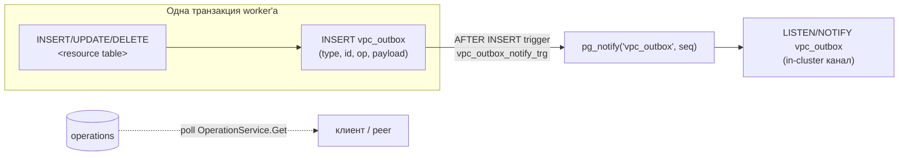
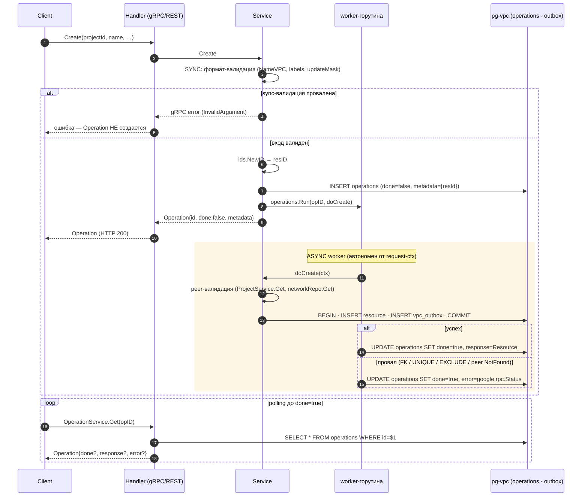

import { Codes } from '@site/src/components/commonBlocks/Codes'
import { ApiOperation } from '@site/src/components/commonBlocks/ApiOperation'
import CodeBlock from '@theme/CodeBlock'
import dedent from 'ts-dedent'

# Long-Running Operations (LRO)

Все **мутации** в Kachō VPC (`Create` / `Update` / `Delete`, а также ресурс-специфичные
`AddCidrBlocks` / `RemoveCidrBlocks` / `UpdateRules` / …)
**асинхронны**: RPC не возвращает готовый ресурс, а отдает `Operation` — handle на фоновую задачу.
Реальная работа (валидация peer-сервисов, запись в БД, эмит событий) выполняется в worker-горутине,
а клиент **поллит** `OperationService.Get(id)` до `done=true`.

:::info Почему async
Единый контракт «мутация → Operation» — одна из конвенций Kachō: он развязывает быстрый ответ API
от длительной работы (межсервисные проверки, аллокация IP, inline-создание default-SG).
Sync-ответ ≈ единицы миллисекунд, фактическое изменение фиксируется фоном и наблюдается через
polling. Чтения (`Get` / `List`) — синхронны и `Operation` **не** возвращают.
:::

## Контракт `Operation`

`Operation` (`kacho.cloud.operation.v1.Operation`) — «плоский» конверт состояния задачи:

<table>
  <thead><tr><th>Поле</th><th>Тип</th><th>Описание</th></tr></thead>
  <tbody>
    <tr><td><code>id</code></td><td><code>string</code></td><td>Идентификатор операции (префикс <code>enp</code> — выделенный для Operation в kacho-vpc, декаплен от ресурсных <code>net</code>/<code>sub</code>/…)</td></tr>
    <tr><td><code>description</code></td><td><code>string</code></td><td>Человеко-читаемое описание (<code>"Create network prod-net"</code>)</td></tr>
    <tr><td><code>createdAt</code></td><td><code>timestamp</code></td><td>Время создания (truncate до секунд)</td></tr>
    <tr><td><code>done</code></td><td><code>bool</code></td><td><code>false</code> — в работе; <code>true</code> — завершена (доступен <code>response</code> или <code>error</code>)</td></tr>
    <tr><td><code>metadata</code></td><td><code>google.protobuf.Any</code></td><td>Метаданные задачи — обычно id целевого ресурса (<code>CreateNetworkMetadata&#123;networkId&#125;</code>)</td></tr>
    <tr><td><code>response</code></td><td><code>google.protobuf.Any</code></td><td><em>(oneof result)</em> Результат при успехе: целевой ресурс (Create/Update) или <code>Empty</code> (Delete)</td></tr>
    <tr><td><code>error</code></td><td><code>google.rpc.Status</code></td><td><em>(oneof result)</em> Ошибка при провале: <code>&#123;code, message, details[]&#125;</code></td></tr>
  </tbody>
</table>

:::note oneof result
Поля `response` и `error` — взаимоисключающие (`oneof result`). Пока `done=false` — **ни одно**
не установлено. При `done=true` установлено **ровно одно**: `response` (успех) либо `error` (провал).
Метаданные (`metadata`) известны сразу — `id` целевого ресурса возвращается в первом же ответе,
еще до завершения задачи.
:::

`metadata` несет id ресурса **до** того, как задача завершилась — клиент может сохранить его сразу
и затем поллить операцию. Для `Delete` `response` при успехе — `google.protobuf.Empty` (удалять
больше нечего, id уже в `metadata`).

## Два этапа: sync + async worker

Каждая мутация делится на **синхронную** и **асинхронную** фазы. Граница между ними — момент,
когда handler вернул `Operation` клиенту.

<table>
  <thead><tr><th>Фаза</th><th>Что делает</th><th>Ошибки</th></tr></thead>
  <tbody>
    <tr>
      <td><strong>SYNC</strong> (до ответа)</td>
      <td>Формат-валидация и санитизация входа (<code>NameVPC</code>, <code>labels</code>, <code>updateMask</code>, CIDR host-bits, oneof spec, <code>resourceId</code>-prefix), генерация id ресурса, создание <code>Operation</code> (<code>done=false</code>) в таблице <code>operations</code>, запуск worker-горутины</td>
      <td>Возвращаются <strong>синхронно</strong> как gRPC-status (<code>InvalidArgument</code> и т.п.) — <code>Operation</code> при этом <strong>не создается</strong></td>
    </tr>
    <tr>
      <td><strong>ASYNC</strong> (worker)</td>
      <td>Peer-валидация существования (<code>ProjectService.Get</code>, <code>networkRepo.Get</code>), <code>repo.Insert/Update/Delete</code>, эмит событий в <code>vpc\_outbox</code> — <strong>в той же транзакции</strong>, что и сам ресурс. По завершении — перевод <code>Operation</code> в <code>done=true</code> с <code>response</code> или <code>error</code></td>
      <td>Записываются в <code>Operation.error</code> (<code>google.rpc.Status</code>) — клиент видит их только после <code>done=true</code></td>
    </tr>
  </tbody>
</table>

:::tip Где искать ошибку
**Sync-ошибка** (плохой формат имени, неизвестное поле в `updateMask`, host-bits в CIDR,
нераспознанный id, несуществующий parent-ресурс в БД VPC, дубликат имени, пересечение CIDR)
приходит **сразу** в ответе на мутацию — `Operation` нет. **Async-ошибка**
(project не найден, недоступность peer-сервиса, непустая сеть, а также DB-backstop
sync-проверок при гонке — FK / UNIQUE / EXCLUDE) приходит **в `Operation.error`**
после `done=true`. Если мутация вернула `Operation` — значит sync-валидация прошла, и итог нужно
смотреть через polling.
:::

### Шаблон сервисного метода

Каноничная форма (упрощенно; реальные use-case'ы — в `internal/apps/kacho/api/<resource>/`):

<CodeBlock language="go">
  {dedent`
    func (s *Service) Create(ctx context.Context, req CreateReq) (*operations.Operation, error) {
        // 1. SYNC: формат-валидация + санитизация
        if err := corevalidate.NameVPC("name", req.Name); err != nil {
            return nil, err  // → InvalidArgument СРАЗУ, Operation не создается
        }

        // 2. Сгенерировать id ресурса + создать Operation (done=false)
        resID := ids.NewID(ids.PrefixNetwork)
        op, _ := operations.New(
            ids.PrefixOperationVPC,
            fmt.Sprintf("Create network %s", req.Name),
            &vpcv1.CreateNetworkMetadata{NetworkId: resID},
        )
        if err := s.opsRepo.Create(ctx, op); err != nil { return nil, err }

        // 3. ASYNC: worker-горутина (fire-and-trigger)
        operations.Run(ctx, s.opsRepo, op.ID, func(ctx context.Context) (*anypb.Any, error) {
            return s.doCreate(ctx, resID, req)  // peer-валидация → repo.Insert → outbox-emit
        })

        return &op, nil  // Operation возвращается клиенту немедленно
    }
  `}
</CodeBlock>

Внутри `doCreate` (worker):

<table>
  <thead><tr><th>Шаг</th><th>Действие</th><th>Исход при ошибке</th></tr></thead>
  <tbody>
    <tr><td>peer existence</td><td><code>projectClient.Get(projectId)</code> (+ <code>networkRepo.Get</code> для дочерних ресурсов)</td><td><code>NotFound "Project with id &lt;X&gt; not found"</code> / <code>"Network %s not found"</code></td></tr>
    <tr><td>insert + outbox</td><td><code>BEGIN</code> → <code>INSERT &lt;table&gt;</code> → <code>INSERT vpc\_outbox</code> → <code>COMMIT</code></td><td>FK <code>23503</code> → <code>FailedPrecondition</code>; UNIQUE <code>23505</code> → <code>AlreadyExists</code>; EXCLUDE <code>23P01</code> → <code>FailedPrecondition</code></td></tr>
    <tr><td>done</td><td><code>return anypb.New(resourceToProto(created))</code> — успех; <code>return nil, err</code> — провал</td><td>worker помечает <code>Operation</code> как <code>done=true</code> с <code>response</code> либо <code>error</code></td></tr>
  </tbody>
</table>

:::note Delete-response = Empty
По proto-опциям всех `Delete` RPC: `metadata = "DeleteXxxMetadata"`, `response = "google.protobuf.Empty"`.
Worker возвращает `anypb.New(&emptypb.Empty{})`; id удаленного ресурса уже лежит в `metadata`.
:::

## Транзакционный outbox + LISTEN/NOTIFY

Каждая успешная мутация в worker'е пишет событие в таблицу `vpc_outbox` **в той же транзакции**,
что и сам ресурс. Это гарантирует, что событие зафиксировано **тогда и только тогда**, когда
зафиксировано изменение ресурса (нет «потерянных» или «фантомных» событий — атомарность на уровне БД,
без брокера).

После `COMMIT` триггер `vpc_outbox_notify_trg` (AFTER INSERT) шлет `pg_notify('vpc_outbox', sequence_no)` —
`vpc_outbox` остается транзакционным журналом доменных событий с in-cluster `LISTEN/NOTIFY`-каналом.

:::info Наблюдение состояния — через polling, не Watch
Публичного per-resource Watch RPC в API Kachō нет. Клиенты (tenant-клиенты и peer-сервисы) узнают
о результате мутации **поллингом** `OperationService.Get(operationId)` до `done=true`, а текущее
состояние — периодическим `List`. Подробнее — [Архитектура](/architecture/overview).
:::

:::note Второй outbox — регистрация owner-tuple в FGA
Помимо доменного `vpc_outbox` (журнал событий) worker на Create/Delete пишет — **в той же
writer-TX** — строку-намерение в отдельную таблицу `fga_register_outbox`: «зарегистрировать /
снять owner-hierarchy-tuple ресурса в FGA». Отдельный register-drainer применяет каждое намерение
через `kacho-iam.InternalIAMService.RegisterResource` / `UnregisterResource` (idempotent,
at-least-once, retry на `Unavailable`). Так per-resource authz-Check разрешается по каскаду «от
проекта», а tuple durable и не теряется при transient-сбое FGA. Подробнее —
[Авторизация и приватность](/architecture/authz).
:::

## Опрос результата: `OperationService.Get`

Клиент опрашивает операцию по ее `id`, пока `done` не станет `true`.

<ApiOperation method="GET" endpoint="/operations/{operationId}">

Возвращает текущее состояние операции. Idempotent, sync, авторизация — `<exempt>` (доступна
инициатору без отдельного permission-чека).

#### Пример запроса

<CodeBlock language="bash">
  {dedent`
    curl http://localhost:18080/operations/{operationId} \\
      -H 'Authorization: Bearer <JWT>'
  `}
</CodeBlock>

#### Пример ответа — в работе

<CodeBlock language="json">
  {dedent`
    {
      "id": "{operationId}",
      "description": "Create network prod-net",
      "createdAt": "2026-06-06T14:27:00Z",
      "done": false,
      "metadata": {
        "@type": "type.googleapis.com/kacho.cloud.vpc.v1.CreateNetworkMetadata",
        "networkId": "{networkId}"
      }
    }
  `}
</CodeBlock>

#### Пример ответа — успех (`done: true`, `response`)

<CodeBlock language="json">
  {dedent`
    {
      "id": "{operationId}",
      "description": "Create network prod-net",
      "createdAt": "2026-06-06T14:27:00Z",
      "done": true,
      "metadata": {
        "@type": "type.googleapis.com/kacho.cloud.vpc.v1.CreateNetworkMetadata",
        "networkId": "{networkId}"
      },
      "response": {
        "@type": "type.googleapis.com/kacho.cloud.vpc.v1.Network",
        "id": "{networkId}",
        "projectId": "{projectId}",
        "name": "prod-net",
        "defaultSecurityGroupId": "{securityGroupId}"
      }
    }
  `}
</CodeBlock>

#### Пример ответа — провал (`done: true`, `error`)

<CodeBlock language="json">
  {dedent`
    {
      "id": "{operationId}",
      "description": "Create network prod-net",
      "done": true,
      "metadata": {
        "@type": "type.googleapis.com/kacho.cloud.vpc.v1.CreateNetworkMetadata",
        "networkId": "{networkId}"
      },
      "error": {
        "code": 6,
        "message": "Network with name prod-net already exists",
        "details": []
      }
    }
  `}
</CodeBlock>

<Codes codes={['invalidArgument', 'notFound', 'permissionDenied', 'internal']} />

</ApiOperation>

:::tip Стратегия polling
Опрашивайте `GET /operations/{id}` с интервалом **2–5 секунд** до `done: true`. Затем:
прочитайте `response` (успех) или `error` (провал). `error.code` — числовой gRPC-код
(`6 = ALREADY_EXISTS`, `5 = NOT_FOUND`, `9 = FAILED_PRECONDITION`, `3 = INVALID_ARGUMENT`).
Списки операций по ресурсу — через `ListOperations` (`GET /vpc/v1/networks/{id}/operations`).
:::

## Жизненный цикл операции (sequence)

Полный путь `Create` → `Operation` → worker → outbox → polling:

:::note Автономность worker'а
Worker **не наследует** deadline / cancel запроса (request-ctx отменяется сразу после возврата
`Operation` клиенту), но **наследует** observability-контекст (trace-span, request-id, logger) через
`baggage.Extract` — чтобы логи и трейсы worker'а оставались связаны с исходным запросом.
Panic в worker'е перехватывается (`recover`) и переводит операцию в `error`, не роняя процесс.
При graceful-shutdown сервис ждет дренажа активных worker'ов (`operations.Wait`).
:::

## Коды ошибок

Sync-фаза и async-фаза используют один и тот же набор gRPC-кодов; разница — **где** код доставлен
(в ответе на мутацию vs. в `Operation.error`):

<Codes codes={['invalidArgument', 'notFound', 'alreadyExists', 'failedPrecondition', 'unavailable', 'permissionDenied', 'internal']} />

<table>
  <thead><tr><th>Код</th><th>Фаза</th><th>Типичная причина в VPC</th></tr></thead>
  <tbody>
    <tr><td><code>INVALID\_ARGUMENT</code></td><td>sync</td><td>Плохой формат имени/labels, неизвестное поле в <code>updateMask</code>, immutable-поле в маске, CIDR host-bits ≠ 0, нераспознанный resource-id</td></tr>
    <tr><td><code>NOT\_FOUND</code></td><td>sync / async</td><td>Parent-ресурс в БД VPC не существует (<code>repo.Get</code>) — sync; Project не существует (<code>ProjectService.Get</code> в worker'е) — async</td></tr>
    <tr><td><code>ALREADY\_EXISTS</code></td><td>sync / async</td><td>Дубликат имени — sync-precheck; UNIQUE <code>(project\_id, name)</code> (SQLSTATE <code>23505</code>) — async DB-backstop при гонке</td></tr>
    <tr><td><code>FAILED\_PRECONDITION</code></td><td>sync / async</td><td>Пересечение CIDR — sync-precheck (+ EXCLUDE <code>23P01</code> async-backstop); непустая сеть (<code>"network is not empty"</code>), FK-блокировка (<code>23503</code>), <code>deletion\_protection</code> — async</td></tr>
    <tr><td><code>UNAVAILABLE</code></td><td>async</td><td>Peer-сервис (kacho-iam — проект; kacho-geo — зона) недоступен при валидации — fail-closed для мутаций (с retry)</td></tr>
    <tr><td><code>INTERNAL</code></td><td>обе</td><td>Непредвиденная ошибка / panic в worker'е — без утечки текста БД (<code>"internal database error"</code>)</td></tr>
  </tbody>
</table>

:::info Что переживает удаление ресурса
Строки `operations` **не** каскадятся при удалении ресурса. `ListOperations` для
Network/Subnet/Address/NetworkInterface отдает накопленную историю даже после `Delete` целевого
ресурса (precondition `repo.Get` снят). Сама `Operation` хранит финальное состояние навсегда —
повторный `Get` после `done=true` идемпотентен.
:::
