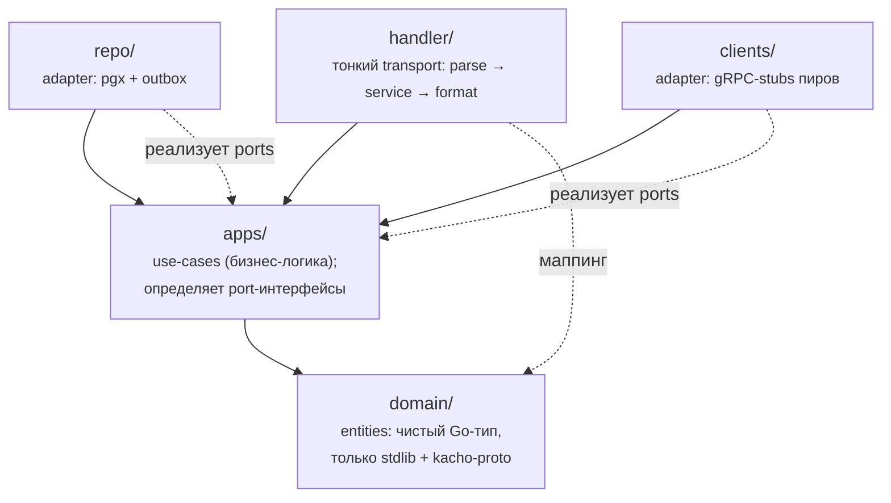
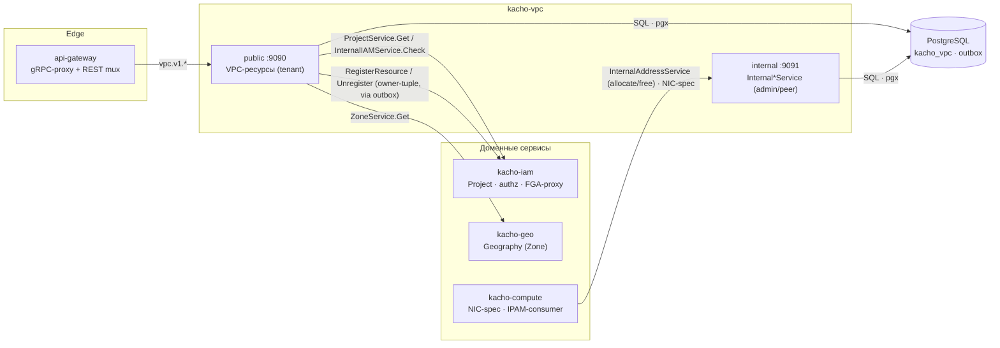
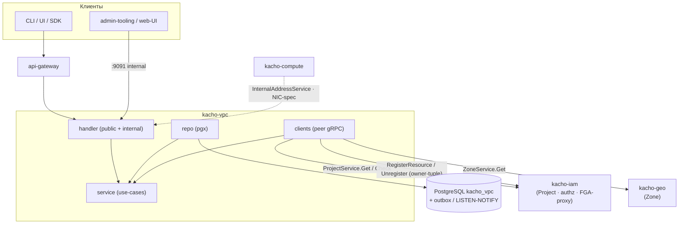

import { Codes } from '@site/src/components/commonBlocks/Codes'

# Обзор архитектуры

`kacho-vpc` — доменный **control-plane** сервис: он управляет *намерением и состоянием*
сетевой конфигурации (Network / Subnet / Address / RouteTable / SecurityGroup / Gateway /
NetworkInterface) и встроенным IPAM.

Сервис построен по **Clean Architecture** (Uncle Bob) и принципу **database-per-service**:
владеет единственной схемой `kacho_vpc`, с остальными доменами общается только по gRPC
(никаких cross-service FK и общих БД).

:::info Две поверхности API
`kacho-vpc` поднимает **два gRPC-listener'а**: публичный `:9090` (tenant-facing, проксируется
через `api-gateway`) и internal `:9091` (admin / peer-сервисы, cluster-internal).
Инфра-чувствительные данные (placement, числовые инфра-идентификаторы) живут **только** на `:9091`.
:::

## Clean Architecture: слои и dependency rule

Код организован в `internal/` по слоям. **Строгое правило зависимостей**: стрелки всегда
направлены внутрь — к `domain`; внешние слои знают о внутренних, но не наоборот.

<table>
  <thead>
    <tr><th>Слой</th><th>Каталог</th><th>Импортирует</th><th>Ответственность</th></tr>
  </thead>
  <tbody>
    <tr>
      <td><strong>domain</strong></td>
      <td><code>internal/domain/</code></td>
      <td>только stdlib + <code>kacho-proto</code></td>
      <td>Entities (плоские Go-структуры): <code>Network</code>, <code>Subnet</code>, <code>Address</code>, <code>NetworkInterface</code>, … Self-validating newtypes. Никаких <code>pgx</code> / grpc-stubs.</td>
    </tr>
    <tr>
      <td><strong>service</strong></td>
      <td><code>internal/apps/kacho/api/&lt;resource&gt;/</code></td>
      <td>только <code>domain</code></td>
      <td>Use-cases (бизнес-логика): валидация, оркестрация Operations, cascade-резолв IPAM. Здесь же <strong>определяются</strong> port-интерфейсы (<code>NetworkRepo</code>, <code>ProjectClient</code>, <code>ZoneRegistry</code>, …).</td>
    </tr>
    <tr>
      <td><strong>repo</strong></td>
      <td><code>internal/repo/</code></td>
      <td><code>pgx</code> + <code>domain</code></td>
      <td>Adapter: реализует port-интерфейсы из <code>service</code> на <code>pgx</code>; SQL-доступ + транзакционный outbox-emit.</td>
    </tr>
    <tr>
      <td><strong>clients</strong></td>
      <td><code>internal/clients/</code></td>
      <td>grpc-stubs + <code>domain</code></td>
      <td>Adapter: реализует peer-порты (<code>ProjectClient</code> → kacho-iam, <code>ZoneRegistry</code> → kacho-geo) поверх gRPC-стабов. Здесь же FGA-register-applier — drainer, применяющий owner-tuple через kacho-iam.</td>
    </tr>
    <tr>
      <td><strong>handler</strong></td>
      <td><code>internal/handler/</code></td>
      <td><code>service</code> + grpc-stubs</td>
      <td>Тонкий transport-слой: parse-request → <code>service.Foo()</code> → format-response. <strong>Никакой бизнес-логики.</strong> Public- и Internal-сервисы — раздельные handler-файлы.</td>
    </tr>
  </tbody>
</table>

:::note Что запрещено dependency rule
`domain/` и use-case-слой (`apps/`) **никогда** не импортируют `pgx`, grpc-stubs или sqlc-типы — это утечка
adapter в use-case. Бизнес-логика (валидация полей, ветвления по domain-state, расчеты) в
`handler/` запрещена. Глобальные синглтоны (`var globalPool`, `init()`-side-effects) вне `cmd/`
запрещены. **Признак утечки:** если service-тест требует Postgres — значит adapter протек в use-case.
:::

### Composition root: `cmd/`

Единственное место wiring (создание pgxpool, репозиториев, сервисов, handler'ов, gRPC-серверов) —
composition root. Бинарь разделен надвое — **сервер** и **мигратор** живут раздельно:

<table>
  <thead><tr><th>Бинарь</th><th>Точка входа</th><th>Назначение</th></tr></thead>
  <tbody>
    <tr>
      <td><code>kacho-vpc</code></td>
      <td><code>cmd/vpc/main.go</code></td>
      <td>Composition root рантайма: pgxpool, все repo / clients / services / handlers, поднятие <strong>двух</strong> gRPC-серверов — public <code>:9090</code> и internal <code>:9091</code>. Здесь же conditional-wiring (например, inline-создание default-SG при <code>KACHO\_VPC\_DEFAULT\_SG\_INLINE=true</code>).</td>
    </tr>
    <tr>
      <td><code>kacho-migrator</code></td>
      <td><code>cmd/migrator/</code></td>
      <td>Отдельный бинарь применения миграций (goose, embed.FS). Использует <code>cfg.MigrateDSN()</code> (без <code>pool\_max\_conns</code>). Запускается как init-job до старта сервера — миграции не вшиты в рантайм-бинарь.</td>
    </tr>
  </tbody>
</table>

## Database-per-service

`kacho-vpc` владеет единственной схемой **`kacho_vpc`** (StatefulSet `pg-vpc`). Все таблицы,
trigger-функции и `goose_db_version` живут в схеме `kacho_vpc` (не в `public`); каждое соединение
выставляет `search_path TO kacho_vpc, public`. Версионирование — Goose; на текущий момент
применены миграции `0001` (squashed baseline) … `0009`. Подробности — на странице
[Модель данных](/architecture/data-model).

:::tip Целостность — на уровне БД, не в коде
Все within-service ссылки и инварианты выражены **DB-конструкциями**, а не software-проверками
(запрет TOCTOU-гонок): `FK REFERENCES … ON DELETE RESTRICT` (Subnet → Network, NIC → Subnet),
partial `UNIQUE … WHERE name <> ''` (имя в проекте), `EXCLUDE USING gist` (CIDR no-overlap),
`CHECK` (cardinality ≤1 v4 / ≤1 v6 на NIC), атомарный `UPDATE … WHERE <CAS>` (attach/detach NIC),
`xmin::text`-OCC (UpdateRules). SQLSTATE маппится в gRPC-код в сервис-слое.
:::

**Никаких cross-service FK.** Ссылки на ресурсы чужих доменов (`project_id`, `zone_id`) хранятся
как обычные `TEXT`-колонки без FK; их существование проверяется на request-path вызовом API-владельца
(см. ниже), а уже сохраненные dangling-ref'ы переживаются грациозно.

## Кросс-доменные runtime-edges

Между доменами `kacho-vpc` ходит по gRPC напрямую (cluster-internal, не через api-gateway). Это
**runtime**-зависимости — `replace ../` в `go.mod` от них не меняются. Циклы запрещены: если A зовет B,
B не зовет A.

<table>
  <thead>
    <tr><th>Ребро</th><th>Направление</th><th>Назначение</th><th>Тип</th></tr>
  </thead>
  <tbody>
    <tr>
      <td><code>vpc → geo</code></td>
      <td>исходящее</td>
      <td><code>geo.v1.ZoneService.Get</code> — валидация <code>zone\_id</code> на Create (Geography — leaf-домен <strong>kacho-geo</strong>). Неизвестная зона → <code>InvalidArgument</code>; пир недоступен → <code>Unavailable</code> (fail-closed для мутаций). Положительный результат кэшируется (TTL 60 с), отрицательный — нет.</td>
      <td>peer-call (sync)</td>
    </tr>
    <tr>
      <td><code>vpc → iam</code> (lookup + authz)</td>
      <td>исходящее</td>
      <td><code>ProjectService.Get</code> — существование проекта (owner-lookup на Create). <code>InternalIAMService.Check</code> — per-RPC authz-gate (ReBAC/OpenFGA). kacho-iam — leaf-owner, обратно не зовет.</td>
      <td>peer-call (sync)</td>
    </tr>
    <tr>
      <td><code>vpc → iam</code> (FGA-proxy)</td>
      <td>исходящее</td>
      <td><code>InternalIAMService.RegisterResource</code> / <code>UnregisterResource</code> — запись/снятие owner-hierarchy-tuple в FGA <strong>через kacho-iam</strong> (модули в OpenFGA напрямую не ходят). Намерение пишется в transactional-outbox в той же TX, что и ресурс; отдельный drainer применяет его idempotent / at-least-once.</td>
      <td>outbox-drainer (async)</td>
    </tr>
    <tr>
      <td><code>compute → vpc</code></td>
      <td>входящее</td>
      <td><code>InternalAddressService</code> (allocate/free internal+external IP), валидация NIC-spec (Subnet / SecurityGroup). Только на internal <code>:9091</code>.</td>
      <td>peer-call (sync)</td>
    </tr>
  </tbody>
</table>

:::note Owner-сервис на каждый тип ресурса
Каждый тип ресурса хранится ровно у одного владельца: **Geography (Region/Zone)** → kacho-geo
(leaf platform-topology домен); **Account / Project** → kacho-iam (leaf-owner); **Network /
Subnet / SG / RouteTable / Address / Gateway / NetworkInterface** → kacho-vpc; **Instance / Disk /
Image / Snapshot** → kacho-compute. Consumer ссылается по id и валидирует через API владельца —
mirror-таблицы и cross-DB FK запрещены.
:::

:::tip Циклов нет: vpc ⇄ compute — два независимых ребра
`vpc → geo` (валидация зоны) и `compute → vpc` (NIC-spec + IPAM) однонаправлены и не образуют
request-time-цикла: запрос по одному ребру не порождает обратный синхронный вызов по другому.
Geography вынесена в самостоятельный leaf-сервис kacho-geo, поэтому ложного ребра «vpc → compute
ради зоны» больше нет.
:::

## Public `:9090` vs internal `:9091`

`kacho-vpc` поднимает два независимых gRPC-listener'а в одном процессе (wiring — в `cmd/vpc/main.go`):

<table>
  <thead>
    <tr><th>Характеристика</th><th>Public <code>:9090</code></th><th>Internal <code>:9091</code></th></tr>
  </thead>
  <tbody>
    <tr>
      <td>Аудитория</td>
      <td>Tenant-клиенты через <code>api-gateway</code> (CLI / UI / SDK)</td>
      <td>Admin-tooling, peer-сервисы, web-UI (cluster-internal)</td>
    </tr>
    <tr>
      <td>Достижимость</td>
      <td>Проксируется наружу (advertised TLS endpoint <code>api.kacho.local:443</code>)</td>
      <td>Только cluster-internal listener; <strong>не</strong> на external TLS endpoint</td>
    </tr>
    <tr>
      <td>Сервисы</td>
      <td><code>NetworkService</code>, <code>SubnetService</code>, <code>AddressService</code>, <code>RouteTableService</code>, <code>SecurityGroupService</code>, <code>GatewayService</code>, <code>NetworkInterfaceService</code></td>
      <td><code>InternalAddressService</code>, <code>InternalAddressPoolService</code>, <code>InternalNetworkService</code></td>
    </tr>
    <tr>
      <td>Данные</td>
      <td>Lean tenant-вью: id / name / labels / привязки / адреса / <code>status</code></td>
      <td>Admin/IPAM-операции (пулы, allocate, default-SG setter, internal-only <code>vrf_id</code>). Инфра-проекций нет — control-plane only</td>
    </tr>
  </tbody>
</table>

:::tip Инфра-чувствительные данные — не на публичной поверхности
Данные, раскрывающие физическую инфраструктуру (placement, числовые инфра-идентификаторы), у
`kacho-vpc` отсутствуют — сервис control-plane-only. Это defense-in-depth: даже tenant с read-доступом к
своим ресурсам не должен узнать топологию / placement. Часть internal-RPC `kacho-vpc`
(admin/IPAM) проброшена через api-gateway REST mux на cluster-internal listener (для UI / admin), но
никогда — на external TLS endpoint.
:::

## Сводный сервис-граф

## Коды ошибок

Все ошибки — `google.rpc.Status {code, message, details[]}` (конвенция Kachō). Repo-sentinel'ы маппятся
в gRPC-коды в сервис-слое (`MapRepoErr`); SQLSTATE-нарушения DB-инвариантов транслируются туда же
(`23503`→`FailedPrecondition`, `23505`→`AlreadyExists`/`FailedPrecondition`, `23514`→`InvalidArgument`,
`23P01`→`FailedPrecondition`).

<Codes codes={['invalidArgument', 'notFound', 'alreadyExists', 'failedPrecondition', 'unavailable', 'unauthenticated', 'permissionDenied', 'internal']} />

## Связанные страницы

<table>
  <thead><tr><th>Раздел</th><th>Описание</th></tr></thead>
  <tbody>
    <tr><td><a href="/">Введение</a></td><td>Обзор сервиса, доменная модель, технологический стек</td></tr>
    <tr><td><a href="/api/network">API ресурсов</a></td><td>Per-resource API (Network, Subnet, Address, …)</td></tr>
  </tbody>
</table>
