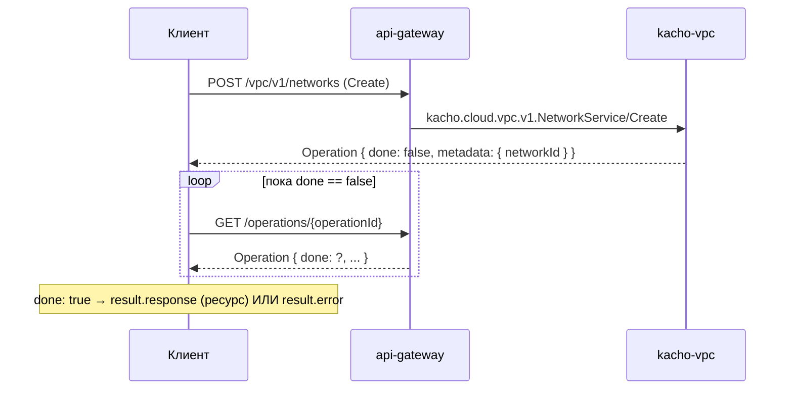

import CodeBlock from '@theme/CodeBlock'
import dedent from 'ts-dedent'

# Быстрый старт

Это пошаговый онбординг: за несколько запросов вы поднимете рабочее сетевое окружение в
Kachō VPC — от пустого проекта до подсети с выделенным адресом, сетевым интерфейсом и
правилами доступа. Каждый шаг продолжает предыдущий: id ресурса из ответа подставляется в
следующий запрос.

Все примеры — `curl` к REST-поверхности через `api-gateway`. Та же семантика (поля, коды
ошибок, async-модель) действует и для gRPC напрямую — REST лишь проекция единого
gRPC-контракта.

:::info Что мы построим
`Network` (сеть) → `Subnet` (подсеть в зоне) → `Address` (внутренний IPv4 из подсети) →
`NetworkInterface` (сетевой интерфейс с этим адресом) → правила `SecurityGroup` (кто может
ходить в нагрузку). К концу у вас будет полностью описанная изолированная сеть проекта.
:::

## Предпосылки

| Нужно | Зачем |
|---|---|
| Развернутый стенд Kachō (`api-gateway` + `kacho-vpc` + `kacho-iam` + `kacho-geo`) | Принимает запросы и выполняет authz/валидацию |
| `projectId` существующего проекта | Все ресурсы VPC — project-level; владелец проекта живет в kacho-iam |
| JWT-токен с правами на проект | `api-gateway` проверяет `Authorization: Bearer <token>` |
| Доступная зона (`zoneId`), напр. `zone-a` | Подсеть и адреса привязаны к зоне (валидируется через kacho-geo) |
| `curl` + `jq` (опционально, для удобного парсинга ответов) | Поллинг `Operation` и извлечение id |

Поднять стенд локально — раздел [Развертывание](/install/deploy); параметры сервиса —
[Конфигурация](/install/configuration). Ниже предполагается, что `api-gateway` доступен на
`http://localhost:18080` (как при port-forward из dev-стенда).

:::tip Удобные переменные окружения
Чтобы не повторять токен и базовый URL в каждой команде:

<CodeBlock language="bash">
  {dedent`
    export VPC=http://localhost:18080
    export TOKEN='<JWT>'
    export PROJECT='{projectId}'
    export ZONE='zone-a'
    auth=(-H "Authorization: Bearer $TOKEN" -H 'Content-Type: application/json')
  `}
</CodeBlock>
:::

## Модель Operation: как читать ответы на мутации

Любая **мутация** (`Create` / `Update` / `Delete` и `:verb`-действия) в Kachō
**асинхронна**: она не возвращает готовый ресурс, а синхронно отдает `Operation` —
квитанцию о принятой работе. Реальное создание выполняется в фоне; клиент **поллит**
`OperationService.Get(id)`, пока не увидит `done: true`.

Ответ на `Create` сразу содержит id будущего ресурса в `metadata` — можно использовать его,
не дожидаясь завершения, но **существование ресурса гарантировано только после `done: true`**.
Когда операция завершилась, заполнено ровно одно из полей `oneof result`:

| Поле | Значение |
|---|---|
| `response` | Успех: созданный / измененный ресурс (для `Delete` — пустой объект) |
| `error` | Неудача: `{code, message, details}` (например, нарушение FK или пересечение CIDR) |

Удобный шаблон поллинга (опрос с интервалом 2–5 с до `done`):

<CodeBlock language="bash">
  {dedent`
    poll() {
      local op="$1"
      while :; do
        body=$(curl -s "$VPC/operations/$op" "\${auth[@]}")
        echo "$body" | jq -e '.done == true' >/dev/null && { echo "$body"; return; }
        sleep 2
      done
    }
  `}
</CodeBlock>

:::note Префикс id операции
Все VPC-операции имеют id с префиксом `enp` (например, `enpk3xe746h019hnz182`). По этому
префиксу `api-gateway` маршрутизирует `GET /operations/{id}` в kacho-vpc.
:::

## Шаг 1. Создать Network

`Network` — корневой контейнер вашего сетевого пространства: внутри него живут подсети,
таблицы маршрутов и группы безопасности. При создании сети автоматически появляется
группа безопасности по умолчанию (`default-sg-...`), на которую ссылается
`defaultSecurityGroupId` сети.

<CodeBlock language="bash">
  {dedent`
    curl -s -X POST "$VPC/vpc/v1/networks" "\${auth[@]}" \\
      -d '{
        "projectId": "'"$PROJECT"'",
        "name": "prod-net",
        "description": "Продуктивная сеть",
        "labels": { "env": "prod" }
      }'
  `}
</CodeBlock>

Ответ — `Operation` (мутация async). `metadata.networkId` — id создаваемой сети:

<CodeBlock language="json">
  {dedent`
    {
      "id": "enpk3xe746h019hnz182",
      "description": "Create network prod-net",
      "done": false,
      "metadata": {
        "@type": "type.googleapis.com/kacho.cloud.vpc.v1.CreateNetworkMetadata",
        "networkId": "net0am5d8q1w4e7r2t6y"
      }
    }
  `}
</CodeBlock>

Дождитесь завершения и сохраните id сети:

<CodeBlock language="bash">
  {dedent`
    poll enpk3xe746h019hnz182
    export NET=net0am5d8q1w4e7r2t6y     # из metadata.networkId
  `}
</CodeBlock>

:::caution Ключевые ошибки
`INVALID_ARGUMENT` — некорректное тело/имя. `UNAUTHENTICATED` (401) — нет/невалиден JWT.
`PERMISSION_DENIED` (403) — нет прав на проект. Если проект не существует —
`"Project with id <id> not found"`; если kacho-iam недоступен — `UNAVAILABLE`.
:::

## Шаг 2. Создать Subnet

`Subnet` нарезает сеть на адресные диапазоны в конкретной зоне. Из ее CIDR-блоков затем
выделяются внутренние адреса. `networkId` и `zoneId` фиксируются при создании (immutable);
`zoneId` валидируется через домен Geography (kacho-geo).

<CodeBlock language="bash">
  {dedent`
    curl -s -X POST "$VPC/vpc/v1/subnets" "\${auth[@]}" \\
      -d '{
        "projectId": "'"$PROJECT"'",
        "networkId": "'"$NET"'",
        "zoneId": "'"$ZONE"'",
        "name": "app-subnet",
        "v4CidrBlocks": ["10.0.0.0/24"]
      }'
  `}
</CodeBlock>

Дождитесь операции и сохраните id подсети:

<CodeBlock language="bash">
  {dedent`
    poll <operationId>
    export SUB=subq2m8c0r5v7w1k3j9p   # из metadata.subnetId
  `}
</CodeBlock>

:::note CIDR-блоки подсети
Адрес сети должен иметь нулевые host-биты (`10.0.0.0/24`, не `10.0.0.5/24`), иначе
`INVALID_ARGUMENT`. Подсети одной сети не должны пересекаться по CIDR — иначе
`FAILED_PRECONDITION "Subnet CIDRs can not overlap"`. После создания набор CIDR меняется не
через `Update`, а действиями `:add-cidr-blocks` / `:remove-cidr-blocks`.
:::

## Шаг 3. Выделить Address

`Address` — выделенный из подсети IP. Здесь создается **внутренний** IPv4: можно задать
конкретный адрес в `address`, либо опустить его — тогда IPAM выберет свободный из CIDR
подсети.

<CodeBlock language="bash">
  {dedent`
    # авто-выбор свободного IPv4 из CIDR подсети
    curl -s -X POST "$VPC/vpc/v1/addresses" "\${auth[@]}" \\
      -d '{
        "projectId": "'"$PROJECT"'",
        "name": "app-ip",
        "internalIpv4AddressSpec": { "subnetId": "'"$SUB"'" }
      }'
  `}
</CodeBlock>

Чтобы зафиксировать конкретный адрес — добавьте `address` в спеку (он обязан попадать в
CIDR подсети):

<CodeBlock language="json">
  {dedent`
    {
      "projectId": "{projectId}",
      "name": "app-ip",
      "internalIpv4AddressSpec": { "address": "10.0.0.5", "subnetId": "{subnetId}" }
    }
  `}
</CodeBlock>

Дождитесь операции и сохраните id адреса:

<CodeBlock language="bash">
  {dedent`
    poll <operationId>
    export ADR=adr7t4w9e2x5h8mz0c3v   # из metadata.addressId
  `}
</CodeBlock>

:::note Внутренний vs внешний адрес
Тело несет **ровно один** вариант `oneof address_spec`. Здесь — внутренний адрес
(`internalIpv4AddressSpec` с обязательным `subnetId`). Для внешнего (публичного) адреса
используется `externalIpv4AddressSpec` с `zoneId` — он выделяется из административного пула.
:::

## Шаг 4. Создать NetworkInterface

`NetworkInterface` (NIC) — сетевой интерфейс в подсети: он связывает выделенный адрес(а),
группы безопасности и MAC в один объект, который привязывается к рабочей нагрузке. На
интерфейс приходится **≤1 IPv4 и ≤1 IPv6**; несколько адресов одного семейства — это
несколько интерфейсов. `macAddress` назначается сервером автоматически.

<CodeBlock language="bash">
  {dedent`
    curl -s -X POST "$VPC/vpc/v1/networkInterfaces" "\${auth[@]}" \\
      -d '{
        "projectId": "'"$PROJECT"'",
        "name": "app-nic",
        "subnetId": "'"$SUB"'",
        "v4AddressIds": ["'"$ADR"'"]
      }'
  `}
</CodeBlock>

Дождитесь операции и сохраните id интерфейса:

<CodeBlock language="bash">
  {dedent`
    poll <operationId>
    export NIC=nic3v5x7z9b1d4f6h8j0   # из metadata.networkInterfaceId
  `}
</CodeBlock>

:::note Группы безопасности по умолчанию
Если `securityGroupIds` не указан, интерфейс наследует группу безопасности по умолчанию
своей сети. Адреса в `v4AddressIds` / `v6AddressIds` должны принадлежать CIDR указанной
подсети, иначе `INVALID_ARGUMENT`. Пока интерфейс ссылается на адрес, удалить этот адрес
нельзя — сначала удаляется NIC (`FAILED_PRECONDITION`).
:::

## Шаг 5. Настроить правила SecurityGroup

`SecurityGroup` определяет, какой трафик разрешен к нагрузке. Набор правил — output-only в
обычном `Update`; он меняется специальным действием `UpdateRules`, которое за один вызов
удаляет старые правила (по id) и добавляет новые. Возьмем группу по умолчанию сети
(`defaultSecurityGroupId` из ответа `Get` на Network) или любую вашу SG и разрешим входящий
HTTPS из интернета:

<CodeBlock language="bash">
  {dedent`
    # SG = defaultSecurityGroupId сети (или id вашей SecurityGroup)
    curl -s -X PATCH "$VPC/vpc/v1/securityGroups/$SG/rules" "\${auth[@]}" \\
      -d '{
        "additionRuleSpecs": [
          {
            "direction": "INGRESS",
            "protocolName": "TCP",
            "ports": { "fromPort": 443, "toPort": 443 },
            "cidrBlocks": { "v4CidrBlocks": ["0.0.0.0/0"] }
          }
        ]
      }'
  `}
</CodeBlock>

Это мутация — вернется `Operation`; после `done: true` поле `response` содержит
`SecurityGroup` с обновленным `rules[]` (у каждого правила появится серверный `ruleId`).

<CodeBlock language="bash">
  {dedent`
    poll <operationId>
  `}
</CodeBlock>

:::note Состав правила
В каждом правиле обязательно `direction` (`INGRESS` | `EGRESS`) и **ровно один** target:
`cidrBlocks`, `securityGroupId` (трафик от другой SG) либо предопределенный target. Протокол
задается через `protocolName` (`TCP`/`UDP`/`ICMP`) или `protocolNumber`; `ports` — диапазон
`{fromPort, toPort}` (пусто = любой порт). Удалить правила можно, передав их id в
`deletionRuleIds` того же запроса; точечно одно правило — через `UpdateRule`.
:::

## Проверка результата

Все ресурсы читаются синхронно (`Get` / `List`):

<CodeBlock language="bash">
  {dedent`
    curl -s "$VPC/vpc/v1/networks/$NET" "\${auth[@]}"                          # сеть + defaultSecurityGroupId
    curl -s "$VPC/vpc/v1/networks/$NET/subnets" "\${auth[@]}"                  # подсети сети
    curl -s "$VPC/vpc/v1/networkInterfaces/$NIC" "\${auth[@]}"                 # интерфейс + macAddress, status
    curl -s "$VPC/vpc/v1/subnets/$SUB/addresses" "\${auth[@]}"                 # занятые адреса подсети
  `}
</CodeBlock>

## Уборка

Удалять ресурсы нужно **снизу вверх** — FK-ограничения (`RESTRICT`) не дадут удалить
родителя, пока есть дети:

<CodeBlock language="bash">
  {dedent`
    curl -s -X DELETE "$VPC/vpc/v1/networkInterfaces/$NIC" "\${auth[@]}"   # 1) интерфейс
    curl -s -X DELETE "$VPC/vpc/v1/addresses/$ADR" "\${auth[@]}"           # 2) адрес
    curl -s -X DELETE "$VPC/vpc/v1/subnets/$SUB" "\${auth[@]}"             # 3) подсеть
    curl -s -X DELETE "$VPC/vpc/v1/networks/$NET" "\${auth[@]}"            # 4) сеть (default-SG удалится вместе с ней)
  `}
</CodeBlock>

:::caution Порядок и preconditions
Удаление — тоже async; дождитесь `done: true` каждой операции перед следующим шагом. Сеть
с непустыми детьми (своими SG, подсетями, RouteTable) не удаляется —
`FAILED_PRECONDITION "network is not empty"`. Группа безопасности по умолчанию удаляется
атомарно вместе с сетью.
:::

## Что дальше

| Тема | Куда |
|---|---|
| Конвенции API, формат ошибок, пагинация, `:verb`-действия | [Обзор API](/api/overview) |
| Поля и методы каждого ресурса | [Network](/api/network) · [Subnet](/api/subnet) · [Address](/api/address) · [SecurityGroup](/api/security-group) · [NetworkInterface](/api/network-interface) |
| Маршрутизация и таблицы маршрутов | [RouteTable](/api/route-table) |
| Механика асинхронных операций (LRO) | [Операции](/api/operations) · [Операции (архитектура)](/architecture/operations) |
| Как устроен сервис внутри | [Архитектура](/architecture/overview) · [Модель данных](/architecture/data-model) · [IPAM](/architecture/ipam) |
| Авторизация и приватность | [Авторизация](/architecture/authz) |
