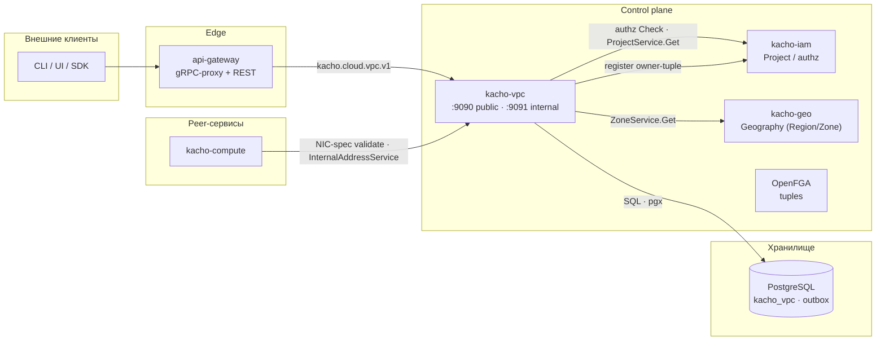
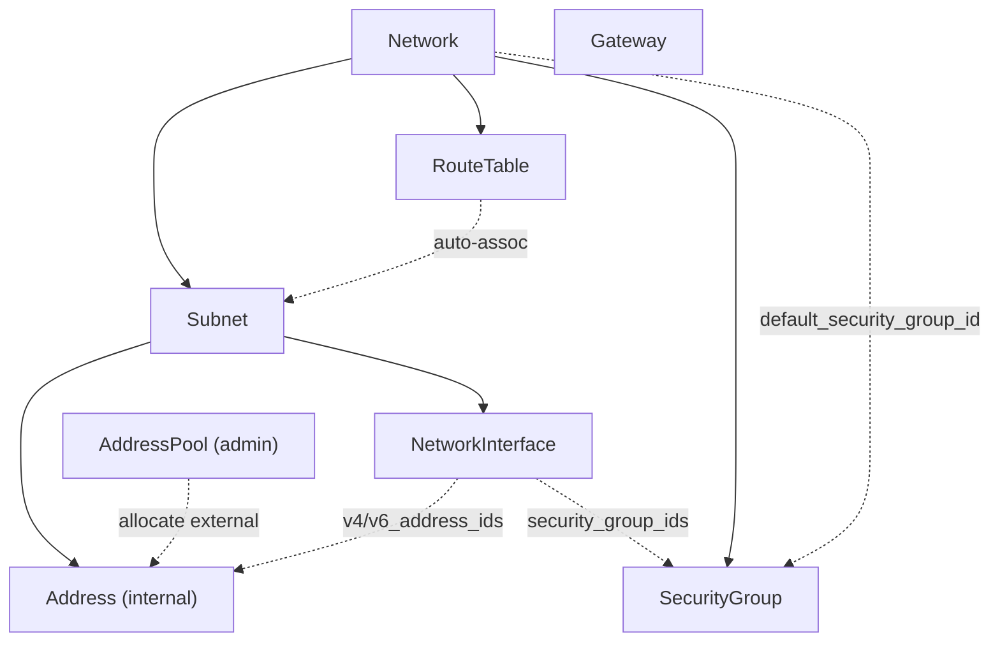

import hero from '@site/src/css/hero.module.css'

<header className={hero.hero}>
   Control-plane · VPC + IPAM

  <h1 className={hero.title}>
    Сетевая инфраструктура 
    платформы Kachō
  </h1>

  

    gRPC + REST API для виртуальных сетей, подсетей, адресов, групп безопасности и
    сетевых интерфейсов — со встроенным IPAM и асинхронной моделью <code>Operation</code>.
  

  

    <a className={hero.btnPrimary} href="/getting-started">Быстрый старт →</a>
    <a className={hero.btnGhost} href="/api/overview">Обзор API</a>
    <a className={hero.btnGhost} href="/architecture/overview">Архитектура</a>
    <a className={hero.btnGhost} href="https://github.com/PRO-Robotech/kacho-vpc">GitHub</a>
  

</header>

## Что это и зачем

**Kachō VPC** — control-plane сервис, который дает пользователю собственное изолированное
сетевое пространство в облаке Kachō: виртуальные сети, подсети, IP-адресацию, маршрутизацию,
правила сетевой безопасности и сетевые интерфейсы для рабочих нагрузок. Вместо того чтобы
вручную раздавать адреса, согласовывать диапазоны и следить за пересечениями, пользователь
описывает **намерение** («такая сеть, такая подсеть в зоне, такие правила доступа»), а
сервис берет на себя выделение адресов (встроенный IPAM), контроль непересечения CIDR,
изоляцию между проектами и согласованность ссылок между ресурсами.

Бизнес-ценность простая: команды получают сеть как самообслуживаемый ресурс через единый
API — быстро, воспроизводимо и безопасно. Каждый ресурс принадлежит проекту (`projectId`),
доступ проверяется на каждом запросе, а целостность связей (адрес → подсеть → сеть)
гарантируется на уровне хранилища, а не «на честном слове» клиента.

API следует **конвенциям Kachō**: плоские (flat) ресурсы, camelCase JSON, асинхронный
`Operation` на каждой мутации, REST-пути `/<service>/v1/<resource>`, единый формат ошибок
`{code, message, details[]}`. Состав ресурсов спроектирован под задачу в чистой форме —
например, `NetworkInterface` вынесен в самостоятельный ресурс (отдельно от вычислительного
инстанса), что позволяет управлять сетевой привязкой нагрузки независимо.

:::info Control-plane only
Kachō VPC управляет **намерением и состоянием** сетевой конфигурации (API, валидация,
учет адресов, авторизация). Это control-plane: реальная передача пакетов (data plane)
живет отдельно. Эта документация описывает control-plane API.
:::

:::tip С чего начать
Новому пользователю — [**Быстрый старт**](/getting-started): пошагово от нуля до рабочей
сети (Network → Subnet → Address → NetworkInterface → правила SecurityGroup) с реальными
`curl`-примерами. Готовы к деталям — [Обзор API](/api/overview) и [Архитектура](/architecture/overview).
:::

## Ключевые возможности

  

    ⇄
    gRPC + REST API
    Единый контракт на Protocol Buffers (<code>kacho-proto</code>), REST-проекция через grpc-gateway.
  

  

    ⏱
    Async Operations (LRO)
    Все мутации возвращают <code>Operation</code>; клиент поллит <code>OperationService.Get(id)</code> до <code>done=true</code>.
  

  

    ◉
    Встроенный IPAM
    Аллокация внутренних/внешних IP, пулы адресов (<code>AddressPool</code>), cascade-резолв пула.
  

  

    ⛨
    SecurityGroup
    Группы безопасности с правилами; авто-создание default-SG при <code>Network.Create</code>.
  

  

    ⧉
    NetworkInterface
    Самостоятельный сетевой интерфейс (NIC) с авто-аллокацией MAC, ≤1 IPv4 / ≤1 IPv6 на интерфейс.
  

  

    🔑
    Авторизация OpenFGA
    Per-RPC authz-гейт через kacho-iam (ReBAC; relation-based на ресурсах/проектах).
  

  

    ▤
    PostgreSQL + outbox
    Хранилище <code>kacho_vpc</code>; transactional outbox + LISTEN/NOTIFY для событий.
  

  

    ◈
    Многозональность
    Ресурсы привязаны к зонам; <code>zoneId</code> валидируется через домен Geography (kacho-geo).
  

## Архитектура

Kachō VPC — один из доменных сервисов платформы. Tenant-запросы проходят через `api-gateway`;
peer-сервисы зовут cluster-internal listener (`:9091`) напрямую, admin-REST — через
internal mux `api-gateway` (тоже на `:9091`).

Система построена по принципу **database-per-service**: kacho-vpc владеет схемой `kacho_vpc` и общается
с другими доменами только по API (никаких cross-service FK). Подробнее — [Архитектура](/architecture/overview).

## Доменная модель

Kachō VPC управляет **8 типами ресурсов** (7 публичных + admin-only `AddressPool`).
Все ресурсы — «плоские» (flat): domain-поля на верхнем уровне сообщения, без K8s-envelope.

<table>
  <thead>
    <tr><th>Ресурс</th><th>ID-префикс</th><th>Описание</th></tr>
  </thead>
  <tbody>
    <tr><td><strong>Network</strong></td><td><code>net</code></td><td>Виртуальная сеть — контейнер для Subnet / RouteTable / SecurityGroup</td></tr>
    <tr><td><strong>Subnet</strong></td><td><code>sub</code></td><td>Подсеть в зоне: IPv4/IPv6 CIDR-блоки, привязка к RouteTable</td></tr>
    <tr><td><strong>Address</strong></td><td><code>adr</code></td><td>IP-адрес: внутренний (в подсети) или внешний (из пула)</td></tr>
    <tr><td><strong>RouteTable</strong></td><td><code>rtb</code></td><td>Таблица маршрутов; авто-ассоциируется с подсетями сети</td></tr>
    <tr><td><strong>SecurityGroup</strong></td><td><code>sgr</code></td><td>Группа безопасности с правилами ingress/egress; принадлежит Network</td></tr>
    <tr><td><strong>Gateway</strong></td><td><code>gtw</code></td><td>Шлюз (shared egress) — project-level</td></tr>
    <tr><td><strong>NetworkInterface</strong></td><td><code>nic</code></td><td>Сетевой интерфейс в подсети: ≤1 IPv4 / ≤1 IPv6, авто-аллокация MAC</td></tr>
    <tr><td><strong>AddressPool</strong></td><td><code>apl</code></td><td><em>(internal/admin)</em> Глобальный пул CIDR для аллокации внешних IP</td></tr>
  </tbody>
</table>

:::note ID-формат
Каждый id — 3-символьный префикс ресурса + 17 символов crockford-base32 (`kacho-corelib/ids`);
тип ресурса читается по префиксу. `Operation` использует собственный префикс `enp`.
:::

### Связи ресурсов

:::tip Порядок удаления — снизу вверх
FK-ограничения (`RESTRICT`) требуют удалять детей раньше родителей:
`NetworkInterface → Address → Subnet → Network`. Адрес, занятый интерфейсом, удалить нельзя,
пока существует ссылающийся на него `NetworkInterface` — сначала удаляется NIC, затем адрес.
:::

## API-операции

Каждый ресурс поддерживает базовый набор операций (часть — ресурс-специфична):

<table>
  <thead><tr><th>Операция</th><th>Тип</th><th>Описание</th></tr></thead>
  <tbody>
    <tr><td><code>Get</code></td><td>sync</td><td>Получить ресурс по id</td></tr>
    <tr><td><code>List</code></td><td>sync</td><td>Список с фильтром (<code>name="..."</code>) и cursor-пагинацией</td></tr>
    <tr><td><code>Create</code></td><td><strong>async → Operation</strong></td><td>Создание ресурса</td></tr>
    <tr><td><code>Update</code></td><td><strong>async → Operation</strong></td><td>Изменение (с <code>update\_mask</code>)</td></tr>
    <tr><td><code>Delete</code></td><td><strong>async → Operation</strong></td><td>Удаление (hard-delete)</td></tr>
  </tbody>
</table>

Действия, не укладывающиеся в CRUD (управление CIDR-блоками подсети, маршрутами таблицы,
правилами группы безопасности), оформлены отдельными RPC с `:verb`-путем
(`:add-cidr-blocks`, `:add-routes`, `UpdateRules`, …) — полный список на [странице обзора API](/api/overview).

Подробнее о механике LRO — [Операции (Operations)](/architecture/operations). Практический
сквозной пример (от создания сети до настройки доступа) — [Быстрый старт](/getting-started).

## Технологический стек

<table>
  <thead><tr><th>Технология</th><th>Применение</th></tr></thead>
  <tbody>
    <tr><td>Go 1.25</td><td>Язык реализации</td></tr>
    <tr><td>Protocol Buffers / Buf</td><td>Контракт API (<code>kacho-proto</code>), кодогенерация</td></tr>
    <tr><td>PostgreSQL / pgx v5</td><td>Хранилище <code>kacho\_vpc</code></td></tr>
    <tr><td>Goose</td><td>Версионирование схемы (применены миграции <code>0001</code>..<code>0009</code>; <code>0001</code> — squashed baseline)</td></tr>
    <tr><td>sqlc + handwritten pgx</td><td>SQL-доступ (без ORM)</td></tr>
    <tr><td>OpenFGA (ReBAC)</td><td>Авторизация — relation-based на ресурсах/проектах</td></tr>
    <tr><td>grpc-gateway</td><td>REST-проекция gRPC</td></tr>
  </tbody>
</table>

## Структура репозиториев

<table>
  <thead><tr><th>Репозиторий</th><th>Назначение</th></tr></thead>
  <tbody>
    <tr><td><strong>kacho-vpc</strong></td><td>Этот сервис: control-plane VPC + IPAM</td></tr>
    <tr><td><strong>kacho-proto</strong></td><td>Центральные <code>.proto</code> + сгенерированные Go-stubs</td></tr>
    <tr><td><strong>kacho-corelib</strong></td><td>Общие пакеты (ids, operations, db, outbox, ...)</td></tr>
    <tr><td><strong>kacho-api-gateway</strong></td><td>Edge: gRPC-proxy + REST mux</td></tr>
    <tr><td><strong>kacho-iam</strong></td><td>Account / Project / авторизация (per-RPC Check)</td></tr>
    <tr><td><strong>kacho-geo</strong></td><td>Geography (Region / Zone) — валидация <code>zoneId</code></td></tr>
    <tr><td><strong>kacho-compute</strong></td><td>Instance / Disk / Image / Snapshot (peer-консумер VPC)</td></tr>
  </tbody>
</table>
