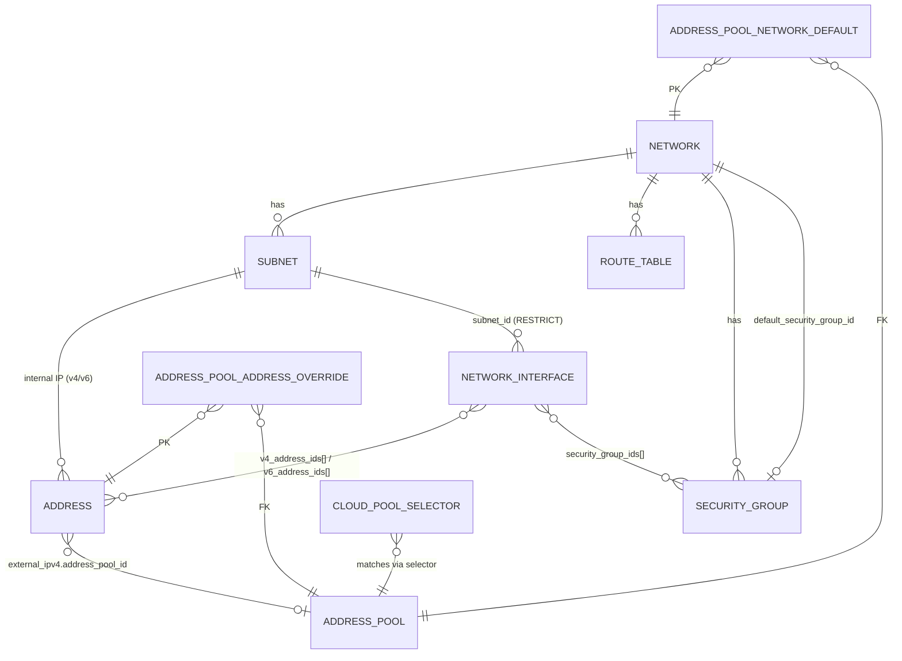

# 01 — Resources

Детально по каждому ресурсу. Поля, инварианты, связи, спецчастности.

## Иерархия и связи

> `Zone`/`Region` — это leaf-домен `kacho-geo`; в `kacho-vpc`
> `subnet.zone_id` / `address_pool.zone_id` / `address.external_ipv4.zone_id` —
> просто `TEXT`-id без FK, валидируется на request-path через
> `geo.v1.ZoneService.Get`.

## Public ресурсы (project-scoped)

### Network

Контейнер для Subnet/RouteTable/SG. Базовая VPC-сеть.

| Поле | Тип | Замечания |
|---|---|---|
| `id` | text PK, prefix `net` | |
| `project_id` | text NOT NULL | `networks_project_id_name_key` UNIQUE(project_id, name) |
| `name` | text | NameVPC permissive |
| `description` | text | ≤256 |
| `labels` | jsonb | ≤64 пар |
| `default_security_group_id` | text NULL FK→`security_groups` | устанавливается inline в `doCreate` при `KACHO_VPC_DEFAULT_SG_INLINE=true` (default). ON DELETE SET NULL |
| `vrf_id` | bigint, internal-only | VRF tenancy-id, аллоцируется control-plane'ом (sequence); инфра-чувствительное поле, отдается **только** через `InternalNetworkService` — на публичной поверхности нет |
| `created_at` | tstz | в proto-ответе truncate до секунд |

**Инварианты**:
- При Create (`KACHO_VPC_DEFAULT_SG_INLINE=true`, default) — атомарно создается
  Network + Default SG + биндинг `default_security_group_id` в одной TX worker'а.
  При `=false` Network создается без SG (для load-тестов / внешнего reconciler'а).
- `vrf_id` — internal-only инфра-идентификатор; не на публичной проекции Network.
- Hard-delete; FK от Subnet/RT/SG = RESTRICT.

### Subnet

Подсеть в Network, привязана к Zone.

| Поле | Тип | Замечания |
|---|---|---|
| `id` | text PK, prefix `sub` | |
| `project_id`, `network_id`, `zone_id` | text NOT NULL | immutable после Create; `subnets_project_id_name_key` UNIQUE(project_id, name) WHERE name<>'' |
| `name`, `description`, `labels` | | |
| `v4_cidr_blocks` | text[] DEFAULT `'{}'` | **опционально на Create** (proto-`(required)` снят); главный — `[0]`. CIDR-less подсеть легальна — `Address.Create` с internal-IPv4-спеком в нее / `AllocateInternalIP` → `FailedPrecondition "subnet ... has no IPv4 CIDR"`; добавить CIDR позже через `:add-cidr-blocks` |
| `v6_cidr_blocks` | jsonb | dual-stack; добавляется/удаляется через `:add-cidr-blocks`/`:remove-cidr-blocks` (валидный IPv6-префикс, host-bits=0, intra-request disjoint; cross-subnet backstop — EXCLUDE `subnets_no_overlap_v6`) |
| `v4_cidr_primary` | text computed | для EXCLUDE constraint (см. ниже) |
| `route_table_id` | text NULL FK→`route_tables` | optional |
| `dhcp_options` | jsonb | domain_name (RFC 1123), dns/ntp servers |

**Инварианты**:
- CIDR overlap **запрещен** в пределах Network — DB-level через
  `EXCLUDE USING gist` (v4 и v6). Маппится в `FailedPrecondition
  "Subnet CIDRs can not overlap"` (для v6 — overlap из `:add-cidr-blocks` → `FailedPrecondition`).
- `v4_cidr_blocks` / `v6_cidr_blocks` **необязательны** на Create — подсеть может быть
  CIDR-less; реальное добавление/удаление блоков (обеих семей) — через verbs
  `:add-cidr-blocks` / `:remove-cidr-blocks` (они принимают и `v6_cidr_blocks`).
  `UpdateSubnet` получил `v6_cidr_blocks` — soft-immutable / no-op (зеркало v4).
- `AddCidrBlocks` второй+ CIDR не покрывается DB EXCLUDE (constraint
  смотрит только на `v4_cidr_primary`). Защищено сервис-level через
  `networkRepo.List` cross-check.
- **Удаление подсети** блокируется (sync-precheck в `SubnetService.Delete`):
  есть внутренние Address (v4 ИЛИ v6 — `AddressesBySubnet` смотрит и `internal_ipv4`,
  и `internal_ipv6`) → `FailedPrecondition "Subnet has allocated internal addresses"`;
  затем — есть `NetworkInterface` → `FailedPrecondition "subnet ... has N network interface(s) (...); delete them first"`.
  DB-backstops: `addresses_internal_subnet_fkey` (на generated-колонке `addresses.internal_subnet_id`,
  выводимой из `internal_ipv4` ИЛИ `internal_ipv6`) и `network_interfaces_subnet_id_fkey ON DELETE RESTRICT`.

### Address

External (project-scoped public IP) или internal (IP в Subnet).

| Поле | Тип | Замечания |
|---|---|---|
| `id` | text PK, prefix `adr` | |
| `project_id` | text NOT NULL | |
| `addr_type` | smallint | 0=unspec, 1=external, 2=internal |
| `ip_version` | smallint | |
| `external_ipv4` | jsonb | `{address, zone_id, address_pool_id, requirements}` |
| `internal_ipv4` | jsonb | `{address, subnet_id}` |
| `internal_ipv6` | jsonb | `{address, subnet_id}` (oneof `Address.internal_ipv6_address` — `{address, oneof scope{subnet_id}}`) |
| `internal_subnet_id` | text computed | derived из `internal_ipv4->>'subnet_id'` **ИЛИ** `internal_ipv6->>'subnet_id'` — для UNIQUE per subnet + FK `addresses_internal_subnet_fkey` (и v4-, и v6-internal-адрес блокирует свою подсеть) |
| `reserved`, `used` | bool | computed на сервис-стороне; `used=true` ⇔ есть referrer-row (см. `address_references`, ниже / NIC) |
| `used_by` | Reference | денормализованная Reference кто использует адрес (flat-колонки `used_by_*`) |
| `deletion_protection` | bool | sync-check перед Delete |

**UNIQUE constraints**:
- `addresses_project_id_name_key` PARTIAL UNIQUE на `(project_id, name)`
  WHERE name `<>` `''` — дубль непустого `name` в project → `ALREADY_EXISTS`.
- `addresses_external_ip_uniq` PARTIAL UNIQUE на
  `external_ipv4 ->> 'address'` WHERE address `<>` `''` — запрещает
  дубль external IP глобально (не считая пустых allocate-pending).
- `addresses_external_pool_ip_uniq` PARTIAL UNIQUE на
  `(address_pool_id, address)` — запрещает повторный pick того же IP
  в том же pool.
- `addresses_internal_subnet_ip_uniq` PARTIAL UNIQUE на
  `(internal_subnet_id, address)` — запрещает дубль internal IPv4 в Subnet.
- `addresses_internal_subnet_ipv6_uniq` PARTIAL UNIQUE на
  `(subnet_id, address)` из `internal_ipv6` — то же для IPv6;
  заодно conflict-target для `InternalAddressService.AllocateInternalIPv6` (random-pick + retry).

**Связи / удаление**:
- `Address.internal_ipv6_address_spec` в `CreateAddressRequest` → IP из `subnet.v6_cidr_blocks`
  (random-pick через `InternalAddressService.AllocateInternalIPv6`). `ListAddressesRequest.subnet_id`
  фильтрует по `internal_ipv4->>'subnet_id'` ИЛИ `internal_ipv6->>'subnet_id'`.
- `Address.Delete` блокируется, если адрес `used` (referrer = `NetworkInterface`):
  `FailedPrecondition "address ... is in use by network interface ...; detach it before deleting the address"`.
  Освободить — detach адреса от NIC / удаление NIC. Порядок снизу вверх: NIC → Address → Subnet → Network.

**Allocate flow** см. [`02-data-flows.md`](02-data-flows.md#address-allocate-cascade).

### NetworkInterface (NIC)

First-class NIC-ресурс домена VPC. Project-level (`project_id` обязателен),
принадлежит `Subnet`. Может быть создан **без адресов**.

| Поле | Тип | Замечания |
|---|---|---|
| `id` | text PK, prefix `nic` | |
| `project_id` | text NOT NULL | |
| `name`, `labels` | | |
| `subnet_id` | text NOT NULL FK→`subnets` | `network_interfaces_subnet_id_fkey` **ON DELETE RESTRICT** — NIC жестко блокирует свою подсеть |
| `mac_address` | text, output-only | аллоцируется при Create (`0e:` + 40 бит crypto/rand), cloud-wide UNIQUE + retry на коллизию |
| `v4_address_ids[]` / `v6_address_ids[]` | text[] | ссылки на `Address`-ресурсы **по id** (≤1 v4 + ≤1 v6); один `Address` — максимум на одном NIC (enforced сервис-слоем через `addresses.used` + referrer-rows `address_references`, `referrer_type="network_interface"`) |
| `security_group_ids[]` | text[] | default на Create = `Network.default_security_group_id` сети подсети; принимаются и network-less SG (если в том же project) |
| `used_by` | `kacho.cloud.reference.Reference` | денормализованное зеркало «кто использует этот NIC»; flat-колонки `used_by_type`/`used_by_id`/`used_by_name` |
| `status` | enum | `PROVISIONING` / `ACTIVE` / `AVAILABLE` / `FAILED` / `DELETING` |

**Проекция** (lean, control-plane-only):
- **`NetworkInterface`:** `id`, `name`, `labels`, `subnet_id`, `mac_address`,
  `v4_address_ids`, `v6_address_ids`, `security_group_ids`, `used_by`, `status`.
- Инфра/data-plane-проекции у kacho-vpc нет — ресурс несет только control-plane-поля.
  **На публичной поверхности инфра-чувствительных полей нет.**

**RPC**: `NetworkInterfaceService` — Get/List/Create/Update/Delete/ListOperations;
REST `/vpc/v1/networkInterfaces`. Compute-Instance ссылается на NIC через `nic_id`.

> Удаление: NIC → Address → Subnet → Network (все RESTRICT). NIC блокирует подсеть; адрес в
> использовании у NIC нельзя удалить; подсеть с внутренними адресами / с NIC'ами — нельзя; сеть с
> дочерними ресурсами — нельзя (default SG авто-удаляется Delete-worker'ом).

### RouteTable

Static routes для Network. Один RT может быть привязан к нескольким
Subnet'ам.

| Поле | Замечания |
|---|---|
| `id` (prefix `rtb`), `project_id`, `network_id` immutable | UNIQUE(project_id, name) WHERE name<>'' |
| `static_routes` jsonb array | full-replace на Update |
| `name`, `description`, `labels` | |

### SecurityGroup

Firewall rules. **`network_id` опционально на Create** (proto-`(required)` снят) — network-unbound
(project-level) SG легальна. Один SG может быть `default_for_network`.

| Поле | Замечания |
|---|---|
| `id` (prefix `sgr`), `project_id` | UNIQUE(project_id, name) WHERE name<>'' |
| `network_id` | text **NULLABLE**; immutable после Create; пустой `network_id` хранится как SQL `NULL`, чтобы FK `security_groups_network_id_fkey` не срабатывал на `''`. `List?filter=network_id="<id>"` работает (whitelist фильтра включает `network_id`). Default-SG-на-сети всегда ставит непустой `network_id` |
| `status` | text |
| `default_for_network` | bool — `true` у inline-создаваемой default SG (если `KACHO_VPC_DEFAULT_SG_INLINE=true`) |
| `rules` | jsonb array (см. SgRulesEditor в UI / proto SecurityGroupRule) |

**RPC специфика**:
- `UpdateRules` — полный replace массива.
- `UpdateRule` — патч одного правила по `rule_id`.
- Optimistic concurrency через `xmin::text` (zero-overhead, без отдельной
  колонки).

### Gateway

Shared egress (NAT-style), не привязан к Network.

| Поле | Замечания |
|---|---|
| `id` (prefix `gtw`), `project_id` | UNIQUE(project_id, name) WHERE name<>'' |
| `shared_egress_gateway` | nested message |

## Internal/admin ресурсы (kacho-only, глобальные)

### Region / Zone

Geography (Region/Zone) — **не VPC-ресурс**, а leaf-домен `kacho-geo`. В kacho-vpc
`subnet.zone_id` / `address_pool.zone_id` хранятся как `TEXT`-id без FK; существование
`zone_id` валидируется на request-path через `geo.v1.ZoneService.Get`.

### AddressPool

Глобальный admin-only пул external IP.

| Поле | Тип | Замечания |
|---|---|---|
| `id` | text PK, prefix `apl` | |
| `name`, `description`, `labels` | | |
| `cidr_blocks` | text[] | IPv4 CIDR-блоки |
| `kind` | smallint | 1=EXTERNAL_PUBLIC, 2=EXTERNAL_TEST, 100=RESERVED_INTERNAL |
| `zone_id` | text NULL | `TEXT`-id домена geo, без FK; NULL = глобальный fallback |
| `is_default` | bool | partial UNIQUE на (COALESCE(zone_id,''), kind) WHERE is_default |
| `selector_labels` | jsonb | зарезервировано (в текущем cascade не участвует) |
| `selector_priority` | int | зарезервировано (tie-break) |

- API: `InternalAddressPoolService` (CRUD + binding + observability — см.
  [04-api-surface.md](04-api-surface.md)).
- ID prefix `apl` (3 символа — обязательный формат `corelib/ids`).
- НЕТ `project_id` — pool глобальный.

### Binding (служебная таблица)

`address_pool_network_default(network_id PK, pool_id)`:
- Для cascade Step 1 (network-default).
- API: `BindAsNetworkDefault / UnbindNetworkDefault`.

## Что не VPC-ресурс, но рядом живет

- `vpc_outbox` — таблица событий (resource_type/resource_id/op/payload).
  Триггер `pg_notify('vpc_outbox', sequence_no)` — in-cluster `LISTEN/NOTIFY`-канал
  доменных мутаций. Публичного Watch RPC в Kachō нет: клиенты наблюдают изменения
  через polling `List` / `OperationService.Get`.

- `operations` — общая LRO-таблица из `kacho-corelib` (`make sync-migrations`).
  Не редактировать локально.

См. полную схему БД и список миграций → [05-database.md](05-database.md).
