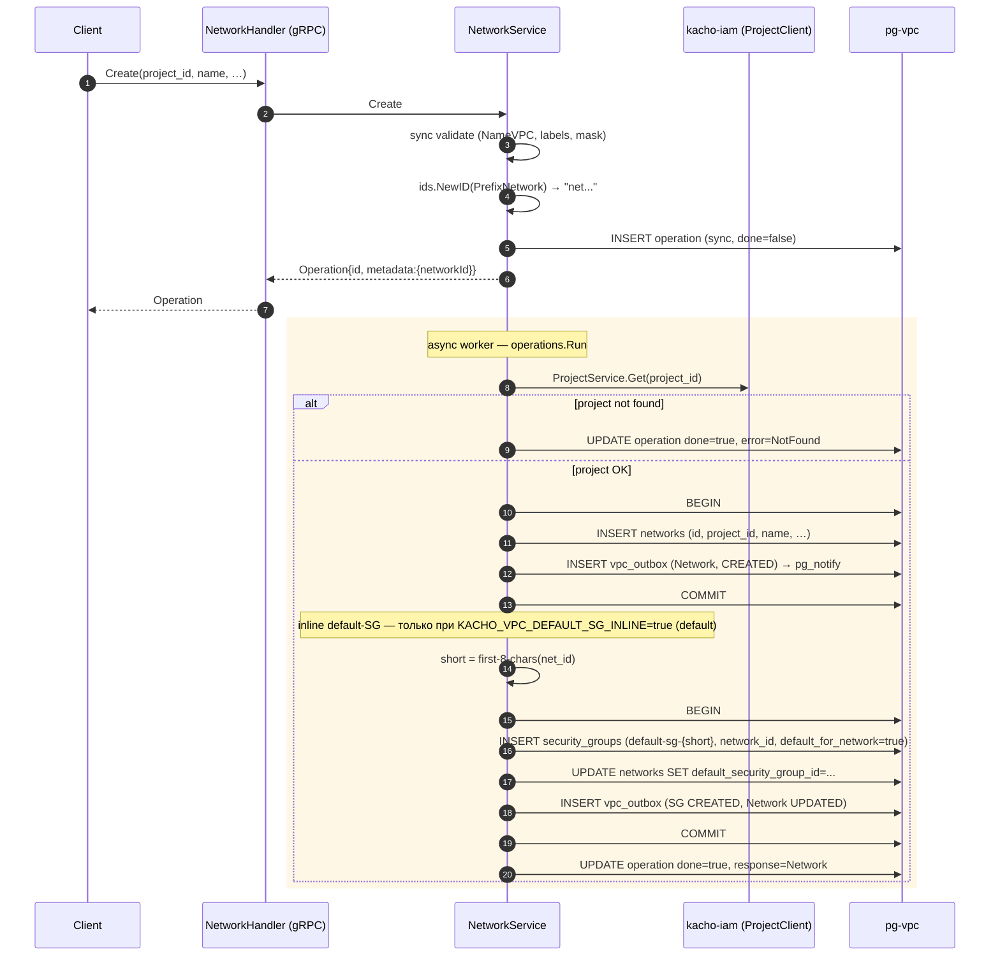
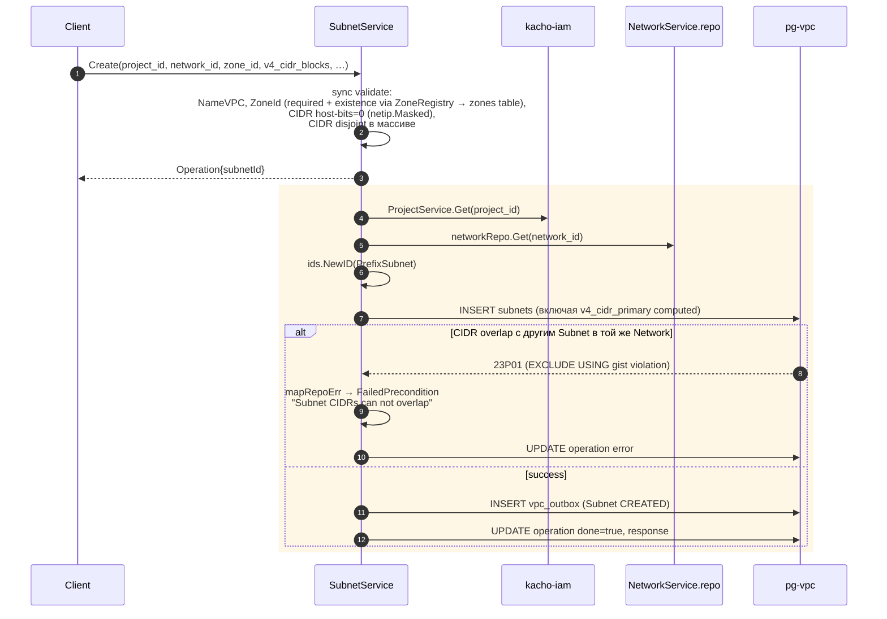
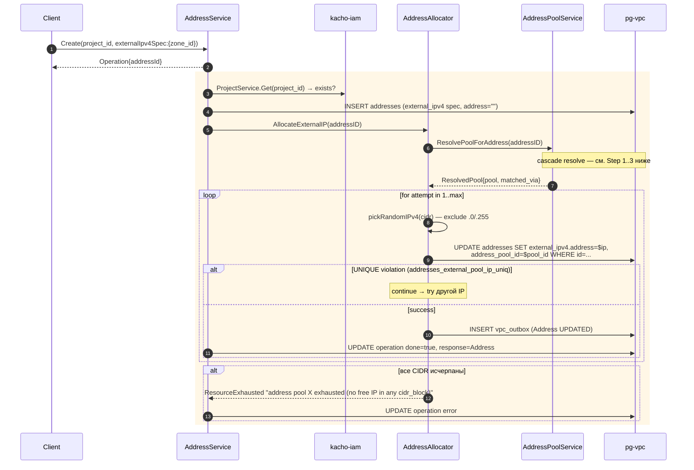
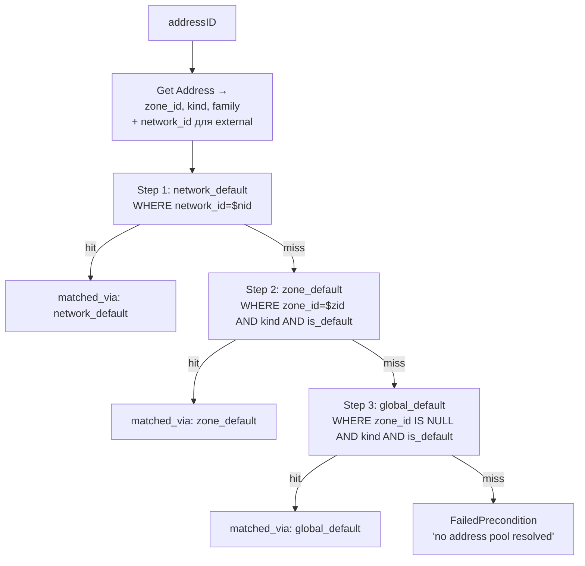
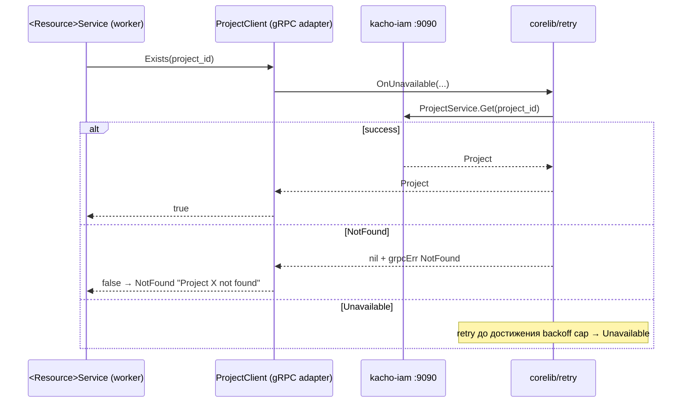
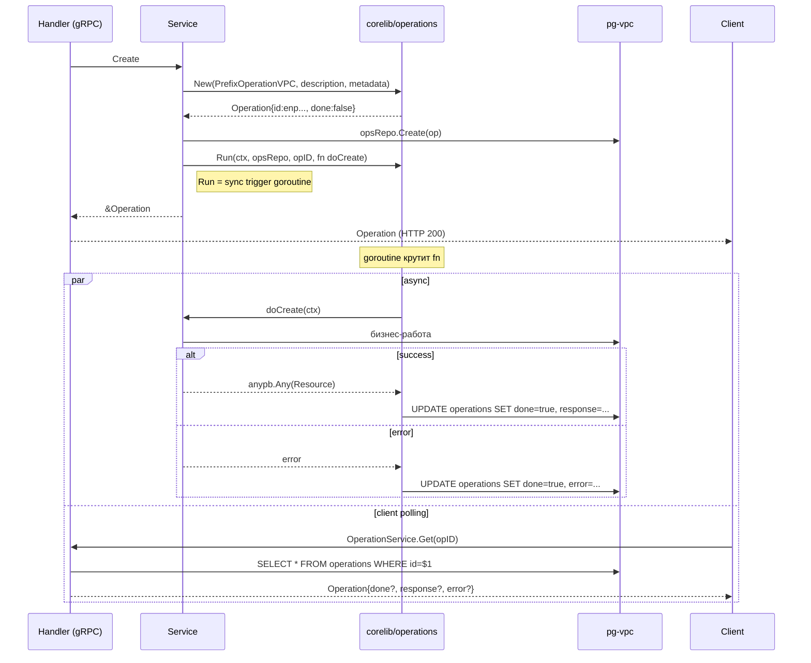
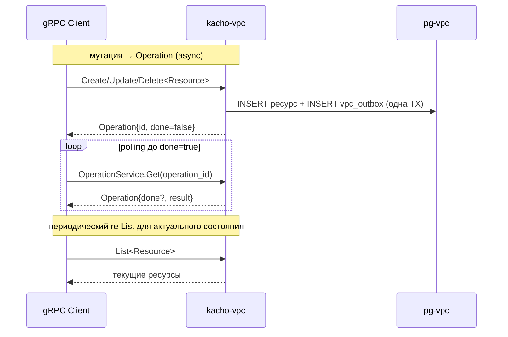
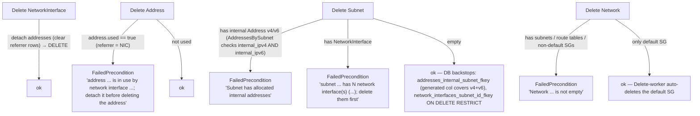

# 02 — Data Flows

Sequence-диаграммы реальных VPC-сценариев (то что **в коде**).

## Содержание

1. [Network create + inline default-SG](#1-network-create--inline-default-sg)
2. [Subnet create + CIDR overlap protection](#2-subnet-create--cidr-overlap-protection)
3. [Address allocate cascade (external)](#3-address-allocate-cascade-external)
4. [Address allocate (internal IP в Subnet)](#4-address-allocate-internal-ip-в-subnet)
5. [Cross-service: project existence check](#5-cross-service-project-existence-check)
6. [Operations LRO worker](#6-operations-lro-worker)
7. [Outbox-журнал доменных событий (polling-модель)](#7-outbox-журнал-доменных-событий-polling-модель)
8. [NetworkInterface create](#8-networkinterface-create)
9. [Dependency / delete-blocking chain (NIC → Address → Subnet → Network)](#9-dependency--delete-blocking-chain)

---

## 1. Network create + inline default-SG



Особенности:
- Default-SG создается inline в worker'е, если `KACHO_VPC_DEFAULT_SG_INLINE=true` (default). При `=false` шаги default-SG TX на диаграмме пропускаются.
- `Network` несет internal-only инфра-идентификатор `vrf_id` (отдается только через `InternalNetworkService`, на публичной поверхности его нет).
- Mapping: `ALREADY_EXISTS` на `networks_project_id_name_key` UNIQUE(project_id, name). Для остальных 6 ресурсов аналогичный partial UNIQUE `(project_id, name) WHERE name <> ''`.

---

## 2. Subnet create + CIDR overlap protection



EXCLUDE constraint (`subnets_no_overlap_v4`) проверяет только
`v4_cidr_primary` (array[0]). Для `AddCidrBlocks` второй+ CIDR — защита
сервис-level (`networkRepo.List` cross-check в `subnet/add_cidr_blocks.go`).

---

## 3. Address allocate cascade (external)

Главный нетривиальный flow. Подробнее в [`03-ipam.md`](03-ipam.md).



### Cascade resolve внутри `POOL.ResolvePoolForAddress`



На каждом шаге pool пропускается, если его CIDR-список для запрошенного family пуст
(family-aware фильтр).

---

## 4. Address allocate internal IP в Subnet

То же что external, но:
- Spec: `internal_ipv4_address_spec.subnet_id`.
- Cascade не нужен — IP берется прямо из CIDR Subnet, никакого pool'а.
- UNIQUE: `(internal_subnet_id, address)` — нельзя повторить IP в той же Subnet.

```mermaid
sequenceDiagram
  participant AS as AddressService
  participant ALC as AddressAllocator
  participant SUB as SubnetRepo
  participant DB as pg-vpc

  AS->>ALC: AllocateInternalIP(addressID)
  ALC->>SUB: Get(subnet_id) → cidr_blocks
  loop attempt in 1..max
    ALC->>ALC: pickRandomIPv4(cidr) — exclude .0/.255 + reserved (.1?)
    ALC->>DB: UPDATE addresses SET internal_ipv4.address=$ip
    alt UNIQUE violation
      continue
    else success
      ALC->>DB: INSERT vpc_outbox (Address UPDATED)
    end
  end
```

---

## 5. Cross-service: project existence check

Межсервисная зависимость VPC на `kacho-iam`. Используется на request-path
каждой Create-мутации — проверить, что владелец-проект существует
(`project_id` — legacy-имя колонки = id владельца-проекта).



---

## 6. Operations LRO worker

Шаблон для всех мутаций (Create/Update/Delete/AddCidrBlocks/...).



Worker — на той же поде, что сервис. Если pod крашится — операция
остается в `done=false` (восстановление прогресса — через повторный запрос клиента).

> **`ListOperations` переживает удаление ресурса.** Для Network/Subnet/Address/NetworkInterface
> `ListOperations` больше не требует существования ресурса (precondition `repo.Get` убран и из
> сервиса, и из хэндлера): жив → проверка project-ownership; `NotFound` → пропускаем и отдаем
> накопленные операции; прочие ошибки пробрасываются. У `operations`-строк нет FK-каскада —
> история сохраняется. (Для route_table/SG/gateway `ListOperations` по-прежнему
> гейтит на `repo.Get` — это существующее поведение, изменены только эти четыре.)

---

## 7. Outbox-журнал доменных событий (polling-модель)

Каждая мутация ресурса в той же транзакции пишет событие в `vpc_outbox`
(`resource_kind/resource_id/event_type/payload`). Триггер `vpc_outbox_notify_trg`
на INSERT шлет `pg_notify('vpc_outbox', sequence_no)` — это in-cluster
`LISTEN/NOTIFY`-канал.

**Публичного per-resource Watch RPC в Kachō нет.** Клиенты (UI/TUI/CLI и peer-сервисы)
узнают о состоянии через polling:



`vpc_outbox` — транзакционный журнал доменных событий; `pg_notify` доступен
in-cluster-потребителям, но наружу как Watch RPC не публикуется.

---

## 8. NetworkInterface create

NIC — first-class ресурс. Может быть создан без адресов.

```mermaid
sequenceDiagram
  autonumber
  participant U as Client
  participant S as NetworkInterfaceService
  participant RM as kacho-iam
  participant DB as pg-vpc

  U->>S: Create(project_id, subnet_id, v4_address_ids?, v6_address_ids?, security_group_ids?)
  S->>S: sync validate; default security_group_ids = Subnet.Network.default_security_group_id если пусто
  S-->>U: Operation{networkInterfaceId}

  rect rgb(255,247,230)
  S->>RM: ProjectService.Get(project_id)
  S->>DB: subnetRepo.Get(subnet_id) → network_id → default_security_group_id
  S->>S: ids.NewID(PrefixNetworkInterface) → "nic..."
  S->>DB: BEGIN
  S->>DB: INSERT network_interfaces (id, project_id, subnet_id, sg_ids, status=PROVISIONING)
  loop по v4_address_ids[] / v6_address_ids[]
    S->>DB: проверить Address.used == false (referrer-free) → INSERT address_references (referrer_type="network_interface")
    S->>DB: UPDATE addresses SET used=true
  end
  S->>DB: INSERT vpc_outbox (NetworkInterface CREATED)
  S->>DB: COMMIT
  S->>DB: UPDATE operation done=true, response=NetworkInterface
  end
```

`used_by` — денормализованное зеркало «кто использует NIC» (`{compute_instance, <instance_id>}` —
flat-колонки `used_by_type`/`used_by_id`/`used_by_name`); ставится атомарным CAS на смену владельца.
Compute-Instance со своей стороны ссылается на NIC через `nic_id`.

---

## 9. Dependency / delete-blocking chain

NIC → Address → Subnet → Network — все RESTRICT. Удаление снизу вверх.



> `network_interfaces.subnet_id` — `ON DELETE RESTRICT`: NIC всегда блокирует свою подсеть.
> Generated-колонка `addresses.internal_subnet_id` выводится из `internal_ipv4` ИЛИ `internal_ipv6`,
> поэтому FK `addresses_internal_subnet_fkey` блокирует подсеть и для v4-, и для v6-internal-адресов.

---

## Где смотреть исходник

| Поток | Код |
|---|---|
| Network create + default-SG | `internal/apps/kacho/api/network/` (`create.go`, `default_sg.go`, `helpers.go`) |
| Subnet create + CIDR | `internal/apps/kacho/api/subnet/create.go` |
| Subnet :add/:remove-cidr-blocks (v4 + v6) | `internal/apps/kacho/api/subnet/add_cidr_blocks.go` / `remove_cidr_blocks.go` |
| Address create + internal v4/v6 | `internal/apps/kacho/api/address/create.go` |
| NetworkInterface CRUD | `internal/apps/kacho/api/networkinterface/` (`create.go`, `update.go`, ...) |
| Cascade resolve | `internal/apps/kacho/api/addresspool/resolve.go` |
| AllocateExternalIP / AllocateInternalIP / AllocateInternalIPv6 | `internal/apps/kacho/api/address/allocate.go` (аллокатор-константы — `create.go`; бенчмарки — `internal/repo/address_pool_freelist_bench_test.go`) |
| ProjectClient.Exists → ProjectClient (IAM) | `internal/clients/iam_client.go` (+ `project_cache.go`) |
| Operations worker | `kacho-corelib/operations/run.go` |
| Outbox emit (в writer-TX) + LISTEN/NOTIFY trigger | `internal/repo/helpers/outbox.go`, `internal/repo/kacho/pg/*` (триггер `vpc_outbox_notify_trg` — `internal/migrations/0001_initial.sql`) |
