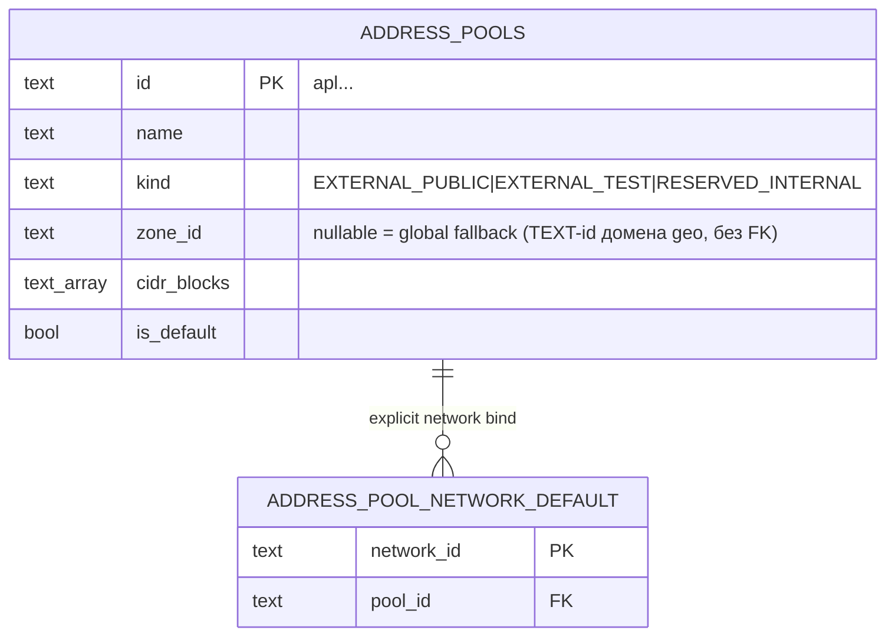
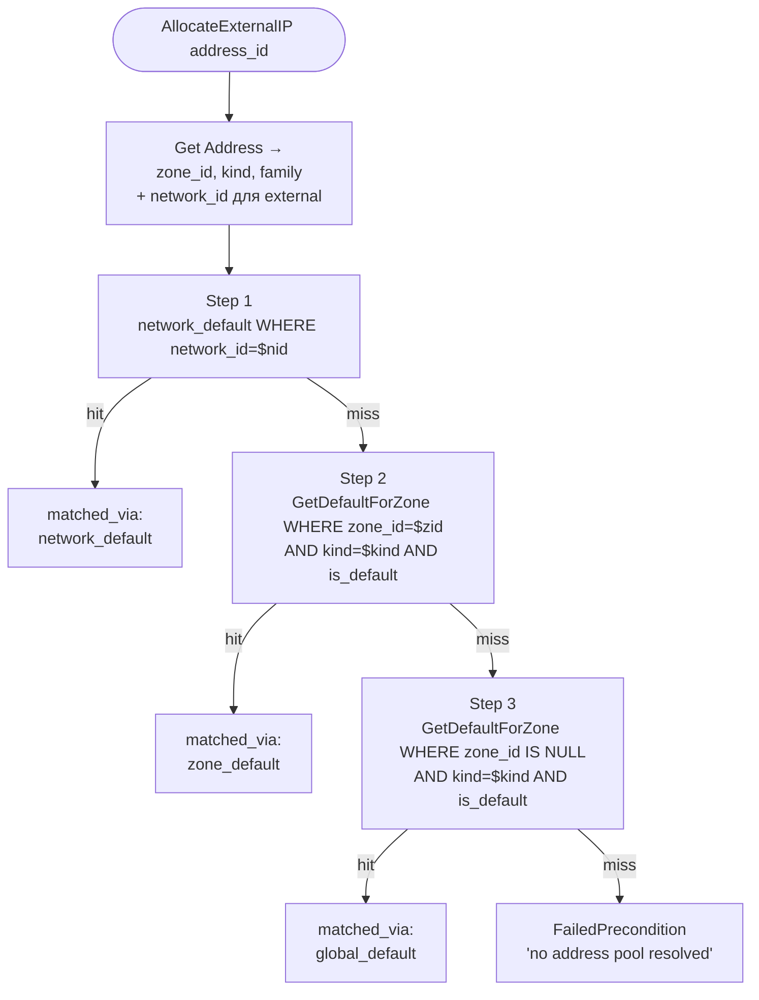

# 03 — IPAM Model (kacho-vpc)

Главная нетривиальная фича VPC. **Полностью внутренняя** — собственная
admin-управляемая модель пулов адресов, отдельная от клиентской иерархии.

## Сущности



## Две иерархии (важный концепт)

```
КЛИЕНТСКАЯ                            СИСТЕМНАЯ
───────────                            ─────────
Account  ─ kacho-iam                   (no parent)
   └─ Project ◄────────┐               Zone (домен kacho-geo, admin)
        └─ Network     │                   └─ AddressPool (admin, kacho-vpc)
            └─ Subnet  │                        │
                 └─ Address (internal)          │
                                                │
        └─ Address (external) ◄─────────────────┘
            external_ipv4.address_pool_id
```

- **Клиентская** — `kacho-iam` (Account/Project) + публичная VPC API.
- **Системная** — admin-managed. AddressPool не принадлежит клиенту, но
  external IP клиента берется оттуда. Region/Zone — отдельный leaf-домен
  `kacho-geo`; в kacho-vpc `zone_id` хранится как `TEXT`-id без FK.
- **Точка пересечения** — `AddressPool`: external IP клиента аллоцируется из пула,
  выбранного cascade-резолвом (network-default → zone-default → global-default).

## Zone

- Геогрфический leaf-ресурс домена `kacho-geo`, не VPC-ресурс.
- В kacho-vpc `subnet.zone_id` / `address_pool.zone_id` /
  `address.external_ipv4.zone_id` — `TEXT`-id без FK; существование `zone_id`
  валидируется на request-path вызовом `geo.v1.ZoneService.Get`.

## AddressPool

- Глобальный admin-only ресурс. **Нет** `project_id` — pool глобальный.
- `cidr_blocks TEXT[]` — массив IPv4 CIDR-блоков.
- `kind` — `EXTERNAL_PUBLIC | EXTERNAL_TEST | RESERVED_INTERNAL`.
- `zone_id` — `TEXT`-id домена geo, **nullable**. NULL = глобальный fallback (cascade Step 3 — global-default).
- `is_default` — partial UNIQUE: один `is_default=true` на `(COALESCE(zone_id,''), kind)`.
- `selector_labels JSONB`, `selector_priority INT` — зарезервированы (в текущем cascade не участвуют).
- `addresses_external_pool_ip_uniq` — partial UNIQUE на `(address_pool_id, address)` в `addresses` — гарантия что один IP не выделится дважды.

## Binding

`address_pool_network_default(network_id PK, pool_id)`:
- Cascade Step 1 (network-default).
- API: `BindAsNetworkDefault / UnbindNetworkDefault`.

## Cascade resolve

Используется в `AddressAllocator.AllocateExternalIP`.
Вход: `address_id`. Выход: `pool` (или `FailedPrecondition`). 3 шага, family-aware:



На каждом шаге pool пропускается, если его CIDR-список для запрошенного family пуст
(`poolHasFamily`): v4-резолв берет pool только с непустым `v4_cidr_blocks`, симметрично для v6.

## IP picker

`AddressAllocator.AllocateExternalIP` после resolve:

```
for attempt in 1..maxAttempts:
  for cidr in pool.cidr_blocks:
    ip = pickRandomIPv4(cidr)         # exclude .0/.broadcast
    err = addrRepo.SetIPSpec(addressID, {address:ip, pool_id:pool.id})
    if isUniqueViolation(err):
      continue                         # try другой IP
    return result, err
return ResourceExhausted "address pool X exhausted (no free IP in any cidr_block)"
```

`isUniqueViolation` распознает **обе** формы:
- raw pgErr (substring `SQLSTATE 23505` / `addresses_external_pool_ip_uniq`)
- обертку `service.ErrAlreadyExists` (через `errors.Is`)

Без второй ветки `wrapPgErr` в `SetIPSpec` ломал retry-loop и наружу шел raw "already exists" вместо `ResourceExhausted`.

## Internal IP allocate (v4 + v6)

`InternalAddressService.AllocateInternalIP` и `AllocateInternalIPv6` — internal-only, вызываются
in-process из `AddressService.doCreate` при `internal_ipv4_address_spec` / `internal_ipv6_address_spec`
(а также admin-tooling). Pool'а нет — IP берется из CIDR-блоков самой подсети:

- **v4** — random-pick + retry в `subnet.v4_cidr_blocks` (двухфазный sweep, см. ниже); conflict-target
  `addresses_internal_subnet_ip_uniq`. CIDR-less подсеть → `FailedPrecondition "subnet ... has no IPv4 CIDR"`
  (то же — explicit `internal_ipv4_address_spec.address` в CIDR-less подсеть).
- **v6** — `AllocateInternalIPv6`: random-pick + retry в `subnet.v6_cidr_blocks`;
  conflict-target `addresses_internal_subnet_ipv6_uniq` (partial UNIQUE на `(subnet_id, address)` из `internal_ipv6`).

`ListAddressesRequest.subnet_id` — фильтр; матчит `internal_ipv4->>'subnet_id'` **ИЛИ**
`internal_ipv6->>'subnet_id'` (т.е. возвращает оба семейства внутренних адресов подсети).

И v4-, и v6-внутренний адрес блокирует удаление своей подсети — sync-precheck `AddressesBySubnet`
(смотрит обе jsonb-колонки) + DB-backstop `addresses_internal_subnet_fkey` на generated-колонке
`addresses.internal_subnet_id` (выводится из `internal_ipv4` ИЛИ `internal_ipv6`).

## Utilization (admin observability)

`InternalAddressPoolService.GetUtilization(pool_id)`:

```json
{
  "poolId": "apl...",
  "totalIps": "510",
  "usedIps": "127",
  "freeIps": "383",
  "usedPercent": 24,
  "cidrs": [
    {"cidr":"198.51.100.0/24", "total":254, "used":120},
    {"cidr":"203.0.113.0/24",  "total":254, "used":7}
  ]
}
```

- `total` per CIDR = `2^(32-bits) - 2` (исключая network/broadcast). Для /31 = 2 (RFC 3021), /32 = 1.
- `used` per CIDR — Postgres `address::inet << cidr` подсчет.

REST: `GET /vpc/v1/addressPools/{pool_id}/utilization` (через apiGW, на cluster-internal listener).

## Управление (через api-gateway internal mux — нет CLI)

Отдельного `kachoctl-ipam` CLI **нет** (удален) — все admin-операции делаются
REST-запросами на cluster-internal listener api-gateway (локально — port-forward
на `localhost:18080`) либо из web-UI. Эти пути не публикуются на external TLS endpoint.

```bash
BASE=http://localhost:18080   # port-forward api-gateway

# Region / Zone — домен kacho-geo (не kacho-vpc): /geo/v1/{regions,zones}

# AddressPool (глобальный — без project_id) — InternalAddressPoolService.Create
curl -XPOST $BASE/vpc/v1/addressPools -d \
  '{"name":"default-zone-a","kind":"EXTERNAL_PUBLIC","zoneId":"zone-a","cidrBlocks":["198.51.100.0/24"],"isDefault":true}'

# Привязка пула к сети (cascade Step 1) — InternalAddressPoolService.BindAsNetworkDefault
curl -XPOST $BASE/vpc/v1/networks/net.../addressPoolBinding -d '{"poolId":"apl..."}'

# Observability — InternalAddressPoolService.{ListAddresses,GetUtilization}
curl "$BASE/vpc/v1/addressPools/apl.../utilization"
```

## Ошибки

| Ситуация | gRPC code | Текст |
|---|---|---|
| Все 3 шага не дали pool | `FailedPrecondition` | `"no address pool resolved for address X (network Y)"` |
| Pool найден, но все CIDR исчерпаны | `ResourceExhausted` | `"address pool X exhausted (no free IP in any cidr_block)"` |
| `zone_id` не существует (peer-валидация через `geo.v1.ZoneService.Get`) | `FailedPrecondition` | (общая обертка от mapPoolErr) |

Подробно про ошибки — в [`06-conventions.md`](06-conventions.md).
