# ER-diagram — `kacho_vpc` schema

> **Источник**: `internal/migrations/0001_initial.sql` (базовая схема) + delta-миграции
> `0002…0009`. Парная документация — `within-service-refs-audit.md`, которая аудитит,
> что каждая ссылка / инвариант покрыты DB-уровнем (FK / UNIQUE / EXCLUDE / CHECK / CAS).
>
> Схема — `kacho_vpc`: все user-таблицы + `goose_db_version` + user-функции
> (`kacho_labels_valid` + trigger-функции) живут в `kacho_vpc.*`. Extension `btree_gist`
> остается в `public` (extension-owned). Search_path: `kacho_vpc, public` —
> устанавливается через libpq-параметр `options=-c search_path=kacho_vpc,public` в
> `config.baseDSN`. Все id-колонки — `TEXT` (3-char crockford-base32 prefix + 17 chars).
>
> См. также: `01-resources.md` (поле-by-поле описание ресурсов), `03-ipam.md`
> (IPAM cascade), `05-database.md` (миграции / индексы прочие).

---

## Mermaid ER

```mermaid
erDiagram
  NETWORKS {
    text id PK
    text project_id "id владельца-проекта → kacho-iam.projects.id (cross-service, no FK)"
    text name "UNIQUE (project_id, name)"
    text description
    jsonb labels
    text default_security_group_id "FK → security_groups ON DELETE SET NULL (mig 0005)"
    text route_distinguisher
    bigint vrf_id "UNIQUE; internal-only (data-plane VRF id, mig 0007)"
    timestamptz created_at
  }

  SUBNETS {
    text id PK
    text project_id
    text name "partial UNIQUE (project_id, name) WHERE name<>''"
    text description
    jsonb labels
    text network_id "FK → networks.id (NO ACTION = RESTRICT)"
    text zone_id "cross-service ref → kacho-geo zones (no FK)"
    text_array v4_cidr_blocks
    text_array v6_cidr_blocks
    text route_table_id "FK → route_tables.id ON DELETE SET NULL"
    jsonb dhcp_options
    cidr v4_cidr_primary "GENERATED STORED from v4_cidr_blocks[1]"
    cidr v6_cidr_primary "GENERATED STORED from v6_cidr_blocks[1]"
    timestamptz created_at
  }

  ADDRESSES {
    text id PK
    text project_id
    text name "partial UNIQUE (project_id, name) WHERE name<>''"
    text description
    jsonb labels
    smallint addr_type
    smallint ip_version
    bool reserved
    bool used
    bool deletion_protection
    jsonb external_ipv4
    jsonb external_ipv6
    jsonb internal_ipv4
    jsonb internal_ipv6
    text internal_subnet_id "GENERATED STORED from internal_ipv4|v6->>subnet_id; FK→subnets.id ON DELETE RESTRICT"
    timestamptz created_at
  }

  ADDRESS_REFERENCES {
    text address_id PK "FK → addresses.id ON DELETE CASCADE"
    text referrer_type
    text referrer_id
    text referrer_name
    timestamptz attached_at
  }

  NETWORK_INTERFACES {
    text id PK
    text project_id
    text name "partial UNIQUE (project_id, name) WHERE name<>''"
    text description
    jsonb labels
    text subnet_id "FK → subnets.id ON DELETE RESTRICT"
    jsonb v4_address_ids "CHECK jsonb_array_length(v4_address_ids) <= 1"
    jsonb v6_address_ids "CHECK jsonb_array_length(v6_address_ids) <= 1"
    jsonb security_group_ids
    text used_by_type
    text used_by_id "atomic CAS, no partial UNIQUE"
    text used_by_name
    text mac_address "UNIQUE cloud-wide; CHECK lowercase colon-mac"
    text status "CHECK enum"
    timestamptz created_at
  }

  ROUTE_TABLES {
    text id PK
    text project_id
    text name "partial UNIQUE (project_id, name) WHERE name<>''"
    text description
    jsonb labels
    text network_id "FK → networks.id (NO ACTION; service prevents Network.Delete via guards)"
    jsonb static_routes
    timestamptz created_at
  }

  SECURITY_GROUPS {
    text id PK
    text project_id
    text name "partial UNIQUE (project_id, name) WHERE name<>''"
    text description
    jsonb labels
    text network_id "NULLABLE; FK → networks.id ON DELETE RESTRICT (when not NULL)"
    bool default_for_network "partial UNIQUE (network_id) WHERE default_for_network (mig 0005)"
    jsonb rules
    timestamptz created_at
  }

  GATEWAYS {
    text id PK
    text project_id
    text name "partial UNIQUE (project_id, name) WHERE name<>''"
    text description
    jsonb labels
    text gateway_type
    timestamptz created_at
  }

  ADDRESS_POOLS {
    text id PK
    text name
    text description
    jsonb labels
    text_array v4_cidr_blocks
    text_array v6_cidr_blocks
    smallint kind
    bool is_default "partial UNIQUE (COALESCE(zone_id,''), kind) WHERE is_default"
    jsonb selector_labels "GIN index where labels<>'{}'"
    int selector_priority
    text zone_id "cross-service ref → kacho-geo zones (no FK)"
    timestamptz created_at
    timestamptz modified_at
  }

  ADDRESS_POOL_CIDRS {
    text pool_id "FK → address_pools.id ON DELETE CASCADE"
    cidr block "EXCLUDE USING gist (kind WITH =, block WITH &&) (mig 0004)"
    smallint kind
  }

  ADDRESS_POOL_NETWORK_DEFAULT {
    text network_id PK "FK → networks.id ON DELETE CASCADE"
    text pool_id "FK → address_pools.id ON DELETE RESTRICT"
    timestamptz bound_at
  }

  ADDRESS_POOL_FREE_IPS {
    text pool_id PK "composite PK (pool_id, ip); FK → address_pools.id ON DELETE CASCADE"
    inet ip PK "composite PK (pool_id, ip)"
  }

  IPV6_POOL_CURSORS {
    text pool_id PK "FK → address_pools.id ON DELETE CASCADE"
    numeric next_offset "NUMERIC(39,0); fits 2^128"
  }

  IPV6_ALLOCATED_IPS {
    text pool_id PK "composite PK (pool_id, ip); FK → address_pools.id ON DELETE CASCADE; UNIQUE (pool_id, offset)"
    inet ip PK "composite PK (pool_id, ip)"
    numeric offset
    text address_id "no FK"
    timestamptz created_at
  }

  IPV6_RELEASED_OFFSETS {
    text pool_id PK "composite PK (pool_id, offset); FK → address_pools.id ON DELETE CASCADE"
    numeric offset PK "composite PK (pool_id, offset)"
  }

  OPERATIONS {
    text id PK
    text description
    text created_by
    bool done
    text metadata_type
    bytea metadata_data
    text resource_id
    int error_code
    text error_message
    bytea error_details
    text response_type
    bytea response_data
    text account_id "nullable denorm (mig 0009)"
    timestamptz created_at
    timestamptz modified_at
  }

  FGA_REGISTER_OUTBOX {
    bigint id PK "GENERATED BY DEFAULT AS IDENTITY"
    text event_type "CHECK enum"
    jsonb payload
    text resource_kind "additive (mig 0008)"
    text resource_id "additive (mig 0008)"
    int attempt_count
    text last_error
    timestamptz created_at
    timestamptz sent_at
  }

  VPC_OUTBOX {
    bigint sequence_no PK "DEFAULT nextval(vpc_outbox_sequence_no_seq)"
    text resource_kind
    text resource_id
    text event_type
    jsonb payload
    timestamptz created_at
    timestamptz processed_at
  }

  VPC_WATCH_CURSORS {
    text subscriber_id PK
    bigint last_sequence_no
    timestamptz updated_at
  }

  NETWORKS ||--o{ SUBNETS : "subnets.network_id (RESTRICT)"
  NETWORKS ||--o{ ROUTE_TABLES : "route_tables.network_id (RESTRICT)"
  NETWORKS ||--o{ SECURITY_GROUPS : "security_groups.network_id (RESTRICT, nullable)"
  NETWORKS ||--o{ ADDRESS_POOL_NETWORK_DEFAULT : "binding (CASCADE)"
  SUBNETS  ||--o{ NETWORK_INTERFACES : "network_interfaces.subnet_id (RESTRICT)"
  SUBNETS  ||--o{ ADDRESSES : "via addresses.internal_subnet_id GENERATED (RESTRICT)"
  ROUTE_TABLES ||--o{ SUBNETS : "subnets.route_table_id (SET NULL)"
  ADDRESSES ||--o| ADDRESS_REFERENCES : "address_id PK (CASCADE)"
  ADDRESS_POOLS ||--o{ ADDRESS_POOL_CIDRS : "pool_id (CASCADE)"
  ADDRESS_POOLS ||--o{ ADDRESS_POOL_NETWORK_DEFAULT : "pool_id (RESTRICT)"
  ADDRESS_POOLS ||--o{ ADDRESS_POOL_FREE_IPS : "pool_id (CASCADE)"
  ADDRESS_POOLS ||--o| IPV6_POOL_CURSORS : "pool_id PK (CASCADE)"
  ADDRESS_POOLS ||--o{ IPV6_ALLOCATED_IPS : "pool_id (CASCADE)"
  ADDRESS_POOLS ||--o{ IPV6_RELEASED_OFFSETS : "pool_id (CASCADE)"
  NETWORK_INTERFACES }o..o{ ADDRESSES : "v4_address_ids[] / v6_address_ids[] (soft-ref, no FK)"
  NETWORK_INTERFACES }o..o{ SECURITY_GROUPS : "security_group_ids[] (soft-ref, no FK)"
  SECURITY_GROUPS }o..o| NETWORKS : "default_security_group_id (FK SET NULL)"
```

---

## Таблицы — описание и DB-level гарантии

### Public ресурсы (project-scoped)

#### `networks`
Контейнер VPC. PK `id` (`net…`). UNIQUE `(project_id, name)` non-partial.
`default_security_group_id` — FK → `security_groups(id) ON DELETE SET NULL` (миграция 0005;
ранее без FK, nullable после 0005); выставляется inline в `network.go::doCreate` при
`KACHO_VPC_DEFAULT_SG_INLINE=true`. `vrf_id` (миграция 0007) — sequence-backed уникальный
per-network VRF id data-plane; инфра-чувствительное поле, отдается только через
`InternalNetworkService.GetNetwork`.

#### `subnets`
Подсеть в Network. UNIQUE `(project_id, name) WHERE name<>''`. FK `network_id → networks(id)`
(NO ACTION = блокирует удаление Network с детьми). FK `route_table_id → route_tables(id)
ON DELETE SET NULL`. **EXCLUDE-constraints**:
- `subnets_no_overlap_v4`: `EXCLUDE USING gist (network_id WITH =, v4_cidr_primary inet_ops WITH &&) WHERE (v4_cidr_primary IS NOT NULL)`.
- `subnets_no_overlap_v6`: симметрично для v6.

Generated columns `v4_cidr_primary` / `v6_cidr_primary` — STORED `cidr`, выводимое из первого
элемента массива при regex-match. Используются исключительно EXCLUDE-constraint'ами
(host-bits validation остается на service-слое — `validateCIDRPrefix`).

**Auto-association с RouteTable** (PL/pgSQL triggers):
- `rt_auto_assoc_subnets_trg` (AFTER INSERT ON route_tables) — выставляет `route_table_id` на subnets с `route_table_id IS NULL` в той же сети.
- `subnet_auto_pick_rt_trg` (BEFORE INSERT ON subnets) — заполняет `NEW.route_table_id` самой ранней RT этой сети, если клиент не задал.
- `subnets_outbox_emit_route_table_change_trg` (AFTER UPDATE OF route_table_id) — эмитит `Subnet.UPDATED` в `vpc_outbox`.

#### `addresses`
IP-ресурс (external / internal, v4 / v6). UNIQUE `(project_id, name) WHERE name<>''`.

**Generated column `internal_subnet_id`**: STORED TEXT, выводится из `internal_ipv4->>'subnet_id'`
ИЛИ `internal_ipv6->>'subnet_id'`. FK `addresses_internal_subnet_fkey → subnets(id)
ON DELETE RESTRICT` (через эту generated-колонку). Этот мостик заменяет
«software-precheck: subnet с адресами не удаляется» атомарной DB-гарантией.

**Partial UNIQUE indexes:**
- `addresses_external_ip_uniq`: UNIQUE `(external_ipv4->>'address')` — глобальная уникальность IPv4 в external-аллокации.
- `addresses_external_pool_ip_uniq`: per-pool dedup IPv4 (conflict-target для allocator).
- `addresses_external_v6_pool_ip_uniq`: аналог для IPv6.
- `addresses_internal_subnet_ip_uniq`: per-subnet dedup IPv4.
- `addresses_internal_subnet_ipv6_uniq`: тот же контракт для IPv6.

#### `address_references`
Один-к-одному backref «кто использует адрес». PK `address_id`, FK → `addresses(id) ON DELETE CASCADE`.
Service-слой синхронно проставляет/снимает referrer-row в TX с изменением `addresses.used`.

#### `network_interfaces`
First-class самостоятельный сетевой интерфейс. UNIQUE `(project_id, name) WHERE name<>''`.
UNIQUE `mac_address` cloud-wide. FK `subnet_id → subnets(id) ON DELETE RESTRICT` (NIC жестко
блокирует свою подсеть).

**CHECK-constraints:**
- `network_interfaces_v4_addr_max1`: `CHECK (jsonb_array_length(v4_address_ids) <= 1)`.
- `network_interfaces_v6_addr_max1`: симметрично v6.
- `network_interfaces_mac_address_check`: lowercase colon-separated MAC regex.
- `network_interfaces_status_check`: enum status.

Multi-IP на VM выражается через несколько NIC (а не secondary addresses в одном NIC).
Soft-refs `v4_address_ids[]` / `v6_address_ids[]` / `security_group_ids[]` хранятся
jsonb-массивами **без FK** — invariant «адрес ≤ 1 NIC» обеспечивается service-слоем через
`addresses.used` + `address_references`. `used_by_id` (кто приаттачил NIC, обычно
Compute.Instance) меняется через **atomic CAS** `UPDATE … WHERE id=$1 AND (used_by_id='' OR
used_by_id=$3) RETURNING …`. Проекция NIC чисто control-plane — инфра-полей нет.

#### `route_tables`
RouteTable project-level. UNIQUE `(project_id, name) WHERE name<>''`. FK `network_id → networks(id)` (NO ACTION).

#### `security_groups`
SG project-level. UNIQUE `(project_id, name) WHERE name<>''`. FK `network_id → networks(id)
ON DELETE RESTRICT` — **колонка nullable** (SG без привязки к сети: global / project-level /
unbound; пустая строка в домене хранится как NULL чтобы FK не срабатывал). `default_for_network`
покрыт partial UNIQUE `security_groups_one_default_per_network` (миграция 0005). Поле `status`
дропнуто миграцией 0003 (у SG нет provisioning-lifecycle). `rules` — jsonb-массив
(service-level validation).

#### `gateways`
Project-level. `gateways` — без cross-resource FK (`gateway_type` пока единственное domain-поле).

---

### IPAM / Address Pools (admin-only, internal API)

#### `address_pools`
Глобальный admin-ресурс (kacho-only). PK `id` (`apl…`). `v4_cidr_blocks` + `v6_cidr_blocks`
(text[]). `zone_id` — soft-ссылка на `kacho-geo.zones`, валидируется на request-path через
`geo.v1.ZoneService.Get`.

**Partial UNIQUE:** `address_pools_zone_kind_default_uniq` `(COALESCE(zone_id,''), kind)
WHERE is_default = true` — ровно один default-pool per (zone, kind). **GIN**
`address_pools_selector_labels_gin (selector_labels jsonb_path_ops) WHERE selector_labels <> '{}'`.

#### `address_pool_cidrs` (миграция 0004)
Нормализованная child-таблица CIDR пулов. `EXCLUDE USING gist (kind WITH =, block inet_ops
WITH &&)` — CIDR пулов не пересекаются per `kind` (declarative, race-free). FK `pool_id →
address_pools(id) ON DELETE CASCADE`. IPAM аллоцирует external-IP из CIDR пула; без этого
constraint два пула с пересекающимися CIDR могли аллоцировать один external-IP дважды.

#### `address_pool_network_default`
Explicit per-network default для IPAM cascade. PK `network_id`. FK CASCADE на Network
(Network.Delete авточистит binding), FK RESTRICT на pool_id. (Per-address override RPC и таблица
`address_pool_address_override` упразднены миграцией 0002; cloud-selector-шаг cascade и таблица
`cloud_pool_selector` — тоже.)

#### `address_pool_free_ips`
Материализованный freelist IPv4: atomic SKIP LOCKED pop вместо random-pick-and-retry.
PK `(pool_id, ip)`. FK `pool_id → address_pools(id) ON DELETE CASCADE`.

#### `ipv6_pool_cursors`, `ipv6_allocated_ips`, `ipv6_released_offsets`
Sparse counter-based IPAM для IPv6. Материализованный freelist на /64 нерабочий (18 квинтиллионов
адресов). Схема:
- `ipv6_pool_cursors (pool_id PK, next_offset NUMERIC(39,0))` — fresh-allocator cursor; FK CASCADE.
- `ipv6_allocated_ips (pool_id, ip, offset, address_id, created_at)` PK `(pool_id, ip)` + UNIQUE `(pool_id, offset)`.
- `ipv6_released_offsets (pool_id, offset)` PK `(pool_id, offset)` — переиспользуемые offset'ы; `FOR UPDATE SKIP LOCKED` pop в Allocate.

---

### Operations / Outbox (corelib-стиль, per-service)

#### `operations`
Long-running async operations (corelib schema). PK `id` (`enp…`, `PrefixOperationVPC`).
Индексы по `done`, `created_at`, `resource_id`. Без FK на ресурсы (resource_id — plain TEXT,
resource может быть удален до завершения op). `account_id` — nullable денормализация (миграция
0009; для vpc остается NULL).

#### `vpc_outbox`
Транзакционный outbox-журнал domain-событий. PK `sequence_no BIGINT` (DEFAULT
`nextval(vpc_outbox_sequence_no_seq)`). Trigger `vpc_outbox_notify_trg` AFTER INSERT →
`pg_notify('vpc_outbox', NEW.sequence_no::text)` — in-cluster `LISTEN/NOTIFY`-канал.
Публичного Watch RPC в Kachō нет: клиенты наблюдают изменения через polling
`List` / `OperationService.Get`.

#### `fga_register_outbox` (миграция 0006/0008)
Отдельный transactional-outbox для регистрации owner-tuple в FGA через `kacho-iam`. Независим
от доменного `vpc_outbox`. Одна строка == один tuple. LISTEN/NOTIFY-канал
`kacho_vpc_fga_register_outbox` будит register-drainer на INSERT. Колонки `resource_kind` /
`resource_id` (миграция 0008) нужны reconciler'у для адресации intent по ресурсу.

#### `vpc_watch_cursors`
Vestigial-таблица из baseline-схемы (`0001_initial.sql`); кодом не используется — Watch RPC
в API Kachō нет. PK `subscriber_id`.

---

## Связи через границу сервиса (cross-service, **software-validated, no FK**)

> database-per-service запрещает cross-DB FK. Ссылки в этом списке хранятся как `TEXT`
> колонки и валидируются gRPC-вызовом owner-сервиса на request-path; на чтении переживается
> dangling-ref.

| Колонка                                       | Owner-сервис             | Owner-метод                                | ON DELETE-симуляция         |
|-----------------------------------------------|--------------------------|--------------------------------------------|------------------------------|
| `networks.project_id`                         | `kacho-iam`              | `ProjectService.Get`                       | n/a (validate-on-write only) |
| `subnets.project_id` / `.zone_id`             | `kacho-iam` / `kacho-geo` | `ProjectService.Get` / `ZoneService.Get`  | n/a                          |
| `addresses.project_id`                        | `kacho-iam`              | `ProjectService.Get`                       | n/a                          |
| `addresses.external_ipv4->>'zone_id'`         | `kacho-geo`              | `ZoneService.Get`                          | n/a (graceful dangling)      |
| `addresses.external_ipv6->>'zone_id'`         | `kacho-geo`              | `ZoneService.Get`                          | n/a (graceful dangling)      |
| `address_pools.zone_id`                       | `kacho-geo`              | `ZoneService.Get`                          | n/a                          |
| `network_interfaces.used_by_id`               | varies (typically `kacho-compute.instances`) | (no peer call; tenant-facing reference) | n/a (denormalized mirror) |
| `route_tables.project_id` / `security_groups.project_id` / `gateways.project_id` / `network_interfaces.project_id` | `kacho-iam` | `ProjectService.Get` | n/a |

`subnets.route_table_id` — **внутри одной БД**, FK ON DELETE SET NULL (не cross-service).

---

## DB-level CHECK-constraints

Все 7 публичных VPC-ресурсов (`networks`, `subnets`, `addresses`, `route_tables`,
`security_groups`, `gateways`, `network_interfaces`) имеют DB-level CHECK constraints поверх
`domain.Validate` (БД — последний рубеж от внешних writers / багов в app-коде), объявленные
inline в `CREATE TABLE` базовой схемы:

- **name**: regex `^([a-zA-Z]([-_a-zA-Z0-9]{0,61}[a-zA-Z0-9])?)?$` (0–63 байт, allowed empty/uppercase/underscore).
- **description**: `length(description) ≤ 256`.
- **status** (NIC): enum-проверка `{PROVISIONING,ACTIVE,AVAILABLE,FAILED,DELETING,STATUS_UNSPECIFIED}|NULL`.
- **mac_address** (NIC): regex `^[0-9a-f]{2}(:[0-9a-f]{2}){5}$` (lowercase, colon-separated).
- **labels** (все 7 ресурсов): `CHECK (kacho_labels_valid(labels))` — helper-функция
  `kacho_vpc.kacho_labels_valid(jsonb) IMMUTABLE` проверяет cardinality ≤ 64,
  key regex `^[a-z][-_./\\@a-z0-9]{0,62}$`, value length ≤ 63.

Эти constraint'ы маппятся через `wrapPgErr` (SQLSTATE `23514`) в `service.ErrInvalidArg` →
gRPC `INVALID_ARGUMENT`.

---

## Ссылки

- `within-service-refs-audit.md` — построчный аудит ссылок против правила «within-service инварианты — на DB-уровне» и парные миграционные рекомендации.
- `01-resources.md` — описание ресурсов с проекциями proto-полей.
- `03-ipam.md` — IPAM cascade resolve + family-aware filter.
- `05-database.md` — миграционная история, индексы, generated-columns по таблицам.
- `06-conventions.md` — соглашения по error-mapping, timestamp, name-policy.
- `07-known-divergences.md` — осознанные дизайн-решения.
- `internal/migrations/0001_initial.sql` … `0009_operations_account_id.sql` — источник истины.
