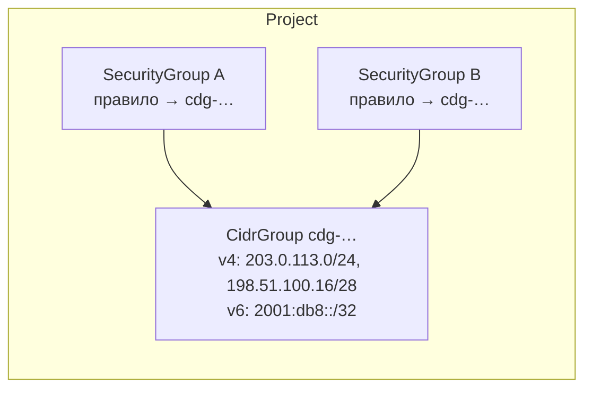

import { DICTIONARY } from '@site/src/constants/dictionary'
import { TYPES } from '@site/src/constants/types'
import { RESTRICTIONS } from '@site/src/constants/restrictions'
import { Restrictions } from '@site/src/components/commonBlocks/Restrictions'
import { Codes } from '@site/src/components/commonBlocks/Codes'
import { ApiOperation } from '@site/src/components/commonBlocks/ApiOperation'
import CodeBlock from '@theme/CodeBlock'
import dedent from 'ts-dedent'

# CidrGroup

**CidrGroup** — именованный набор префиксов, на который ссылается правило группы
безопасности вместо того, чтобы нести свою копию перечня.

Правило задаёт цель одним из трёх способов: собственные CIDR-блоки, другая группа
безопасности либо **этот набор**. Разница видна на масштабе: перечень офисных сетей,
повторяющийся в двадцати правилах, без набора правится в двадцати местах — и рано или
поздно правится не во всех. Набор делает перечень **предметом**: вы правите его один раз,
и все ссылающиеся правила следуют за ним автоматически.

Набор принадлежит **проекту**, а не сети: одним и тем же перечнем пользуются правила
любых групп безопасности этого проекта.

:::info Адресация — по `id`, имя косметическое
Идентификатор набора — `cdg-` + 17 символов crockford-base32 (например
`cdg-7h2k9m4p1q8r3s5t6`). Он присваивается при создании, **неизменяем всю жизнь ресурса**
и является единственным, чем набор адресуется — в ссылке правила стоит именно он.

`name` — косметическая метка в пределах проекта: уникальна (`UNIQUE(projectId, name)`,
уникальность полная), может свободно меняться и **никогда** не участвует в ссылке. Формой
имя не отличается от прочих ресурсов платформы — DNS label по RFC 1123. Пустая строка при
создании означает «назови сам»: сервер проставит имя, производное от `id`, поэтому набора
без имени не бывает; при `Update` пустое имя отвергается.
:::

## Состав: два семейства — два поля

Состав набора хранится **раздельно по семействам**: `v4CidrBlocks` и `v6CidrBlocks`.
Смешанного поля у ресурса нет, и это решение, а не оформление: блок не того семейства
отвергается **на входе**, до записи, поэтому смешанный набор невыразим вовсе. Иначе один
член чужого семейства ломал бы правило целиком уже при применении — а отказ там наступает
поздно и молча.

Блок обязан быть записан в **канонической сетевой форме**: host-биты нулевые. Ненулевые не
обнуляются за вас — такой ввод отвергается (`10.0.0.5/24` → отказ, `10.0.0.0/24` → приём).
А вот **написание** приводится к каноническому, поэтому `2001:0db8::/32` и `2001:db8::/32`
— один и тот же член набора, а не два: повторное добавление в другом написании не
задваивает состав и не расходует потолок.

<table>
  <thead><tr><th>Свойство состава</th><th>Поведение</th></tr></thead>
  <tbody>
    <tr><td>Потолок</td><td><strong>64 префикса на семейство</strong> — то есть до 64 IPv4 и до 64 IPv6 в одном наборе. Та же величина, что у супернета сети и у диапазонов подсети</td></tr>
    <tr><td>Дубликаты</td><td>Невозможны: повторное добавление того же префикса — успех без изменения</td></tr>
    <tr><td>Пересечения</td><td><strong>Разрешены.</strong> Набор перечисляет то, что перечисляет вызывающий; «область непересечения» у него не определена — в отличие от подсети и пула адресов, откуда адрес <em>выделяется</em></td></tr>
    <tr><td>Как меняется</td><td>Только действиями <code>:add-cidr-blocks</code> / <code>:remove-cidr-blocks</code>. <code>Update</code> состава не касается</td></tr>
  </tbody>
</table>

:::note Почему состав не правится через `Update`
Полная замена набора одним `PATCH` дала бы «победил последний» двум редакторам, каждый из
которых прислал свой полный список: правка второго молча затёрла бы правку первого.
Отдельные действия работают **дельтой**, поэтому одновременные «добавь эти два» и «сними
тот один» складываются, а не вытесняют друг друга; и отказ по потолку может назвать разом
текущий размер, запрошенное и сам предел.
:::

## Поля ресурса

<table>
  <thead><tr><th>Поле</th><th>Тип</th><th>Описание</th></tr></thead>
  <tbody>
    <tr><td><code>id</code></td><td><code>{TYPES.string}</code></td><td>Идентификатор набора: <code>cdg-</code> + 17 символов crockford-base32 (output-only, генерируется сервером; неизменяем)</td></tr>
    <tr><td><code>projectId</code></td><td><code>{TYPES.string}</code></td><td>{DICTIONARY.projectId.short}. Неизменяем после создания</td></tr>
    <tr><td><code>name</code></td><td><code>{TYPES.string}</code></td><td>{DICTIONARY.name.short}</td></tr>
    <tr><td><code>description</code></td><td><code>{TYPES.string}</code></td><td>{DICTIONARY.description.short}</td></tr>
    <tr><td><code>labels</code></td><td><code>{TYPES.mapStringString}</code></td><td>{DICTIONARY.labels.short}</td></tr>
    <tr><td><code>createdAt</code></td><td><code>{TYPES.timestamp}</code></td><td>{DICTIONARY.createdAt.short}</td></tr>
    <tr><td><code>v4CidrBlocks</code></td><td><code>{TYPES.stringArray}</code></td><td>Текущие IPv4-члены набора, каноническая сетевая форма (host-биты = 0)</td></tr>
    <tr><td><code>v6CidrBlocks</code></td><td><code>{TYPES.stringArray}</code></td><td>Текущие IPv6-члены набора — зеркало <code>v4CidrBlocks</code></td></tr>
    <tr><td><code>cidrBlockCount</code></td><td><code>{TYPES.int32}</code></td><td>Общее число членов по обоим семействам. <strong>Output-only</strong> — выводится сервером, на вход не принимается</td></tr>
    <tr><td><code>usedBy</code></td><td><code>{TYPES.reference}[]</code></td><td>Потребители набора: группы безопасности, чьи правила на него ссылаются. <strong>Output-only</strong>, выводится на чтении из фактических ссылок правил (см. ниже)</td></tr>
  </tbody>
</table>

:::info Что именно показывает `usedBy`
Каждый элемент называет **группу правил** — её вид (`vpc.securityGroup`), идентификатор и
имя на момент чтения, — а `type: USED_BY` и `owned: false` говорят, что группа набором
**пользуется, но не владеет**: снятие правила набор не удаляет.

Идентификаторы отдельных правил наружу не уезжают: они относятся к чужому ресурсу и
координатой для вас не являются. Поле заполняется и в `Get`, и в `List` — одним запросом
на всю страницу.
:::

## Как набор попадает в правило

Ссылка живёт на стороне [SecurityGroup](/api/security-group): в правиле выбирается ветвь
цели `cidrGroupId`. Две границы, которые сервис проверяет на каждой записи правил:

- набор обязан лежать **в том же проекте**, что и группа правил. Набор чужого проекта и
  набор, которого нет вовсе, отвечают **одним и тем же** текстом
  `InvalidArgument "CidrGroup <id> not found"` — по тексту отказа нельзя установить,
  существует ли набор, которым вы не владеете;
- набор обязан быть **непустым**:
  `FailedPrecondition "CidrGroup <id> is empty; a rule cannot reference an empty set"`.

:::caution Пустой набор в живой ссылке не допускается ни одним путём
Снять последний префикс у набора, на который ссылается хотя бы одно правило, нельзя:
`:remove-cidr-blocks` отвечает `FailedPrecondition`. Причина не формальная. Пустой набор в
ссылке либо заставил бы правило исчезнуть целиком (разрешение молча **сужается**), либо
заставил бы фильтр пропасть из правила (разрешение молча **расширяется**). Оба исхода —
защита, у которой осталась форма и не осталось содержания, поэтому состояние не допускается
вовсе: сначала снимите ссылку, потом опустошайте набор.
:::

---

## Get

<ApiOperation method="GET" endpoint="/vpc/v1/cidrGroups/{cidrGroupId}">

Возвращает набор по идентификатору (sync) вместе с составом, посчитанным числом членов и
списком потребителей.

#### Пример запроса

<CodeBlock language="bash">
  {dedent`
    curl http://localhost:18080/vpc/v1/cidrGroups/{cidrGroupId} \\
      -H 'Authorization: Bearer <JWT>'
  `}
</CodeBlock>

#### Пример ответа

<CodeBlock language="json">
  {dedent`
    {
      "id": "{cidrGroupId}",
      "projectId": "{projectId}",
      "name": "office-networks",
      "description": "Сети офисов",
      "labels": { "env": "prod" },
      "createdAt": "2026-06-06T14:27:00Z",
      "v4CidrBlocks": ["203.0.113.0/24", "198.51.100.16/28"],
      "v6CidrBlocks": ["2001:db8::/32"],
      "cidrBlockCount": 3,
      "usedBy": [
        {
          "referrer": {
            "type": "vpc.securityGroup",
            "id": "{securityGroupId}",
            "name": "web-tier"
          },
          "type": "USED_BY",
          "owned": false
        }
      ]
    }
  `}
</CodeBlock>

Нераспознанный префикс идентификатора отвергается **первым же действием** —
`InvalidArgument "invalid cidr_group id '<X>'"`, до обращения к хранилищу. Корректный по
форме, но несуществующий идентификатор → `NotFound "CidrGroup <id> not found"`. Порядок
здесь несущий: без проверки формата строка, которая набором быть не может, получила бы
утверждение об **отсутствии** ресурса.

<Restrictions items={[{ label: 'cidrGroupId', rules: RESTRICTIONS.resourceIdHyphen }]} />
<Codes codes={['invalidArgument', 'notFound', 'permissionDenied', 'internal']} />

</ApiOperation>

---

## List

<ApiOperation method="GET" endpoint="/vpc/v1/cidrGroups">

Список наборов проекта (sync) с фильтром и cursor-пагинацией. Результат сужен по правам
вызывающего построчно: страница читается курсором, а затем права спрашиваются об
идентификаторах **этой** страницы.

#### Параметры запроса

<table>
  <thead><tr><th>Параметр</th><th>Обязательность</th><th>Тип</th><th>Описание</th></tr></thead>
  <tbody>
    <tr><td><code>projectId</code></td><td><strong>да</strong></td><td><code>{TYPES.string}</code></td><td>{DICTIONARY.projectId.short}</td></tr>
    <tr><td><code>filter</code></td><td>нет</td><td><code>{TYPES.string}</code></td><td>{DICTIONARY.filter.short}</td></tr>
    <tr><td><code>pageSize</code></td><td>нет</td><td><code>{TYPES.int64}</code></td><td>{DICTIONARY.pageSize.short}</td></tr>
    <tr><td><code>pageToken</code></td><td>нет</td><td><code>{TYPES.string}</code></td><td>{DICTIONARY.pageToken.short}</td></tr>
  </tbody>
</table>

#### Пример запроса

<CodeBlock language="bash">
  {dedent`
    curl 'http://localhost:18080/vpc/v1/cidrGroups?projectId={projectId}&filter=name%3D%22office-networks%22' \\
      -H 'Authorization: Bearer <JWT>'
  `}
</CodeBlock>

#### Пример ответа

<CodeBlock language="json">
  {dedent`
    {
      "cidrGroups": [
        {
          "id": "{cidrGroupId}",
          "projectId": "{projectId}",
          "name": "office-networks",
          "createdAt": "2026-06-06T14:27:00Z",
          "v4CidrBlocks": ["203.0.113.0/24"],
          "cidrBlockCount": 1
        }
      ],
      "nextPageToken": ""
    }
  `}
</CodeBlock>

:::note Фильтровать можно по полям строки, но не по составу
Белый список полей фильтра — `name` и `project_id` (второй вы и так задаёте параметром
запроса). Вопроса «какой набор содержит такой-то префикс» фильтр не выражает: это не
равенство, а вложенность, и разборщик такого оператора не знает. Ответ на него — прочитать
нужные наборы и сравнить состав на своей стороне.
:::

<Restrictions items={[
  { label: 'projectId', rules: RESTRICTIONS.projectId },
  { label: 'pagination', rules: RESTRICTIONS.pagination },
]} />
<Codes codes={['invalidArgument', 'permissionDenied', 'internal']} />

</ApiOperation>

---

## Create

<ApiOperation method="POST" endpoint="/vpc/v1/cidrGroups" async>

Создаёт набор в указанном проекте. Возвращает `Operation` (async); идентификатор будущего
набора приходит сразу — в `metadata.cidrGroupId`.

Набор можно создать **сразу с составом** (оба семейства необязательны — допустим и пустой
набор, на него просто нельзя сослаться из правила, пока он пуст).

#### Тело запроса

<table>
  <thead><tr><th>Параметр</th><th>Обязательность</th><th>Тип</th><th>Описание</th></tr></thead>
  <tbody>
    <tr><td><code>projectId</code></td><td><strong>да</strong></td><td><code>{TYPES.string}</code></td><td>{DICTIONARY.projectId.short}</td></tr>
    <tr><td><code>name</code></td><td>нет</td><td><code>{TYPES.string}</code></td><td>Имя набора (уникально в проекте; пустое — сервер проставит производное от <code>id</code>)</td></tr>
    <tr><td><code>description</code></td><td>нет</td><td><code>{TYPES.string}</code></td><td>{DICTIONARY.description.short}</td></tr>
    <tr><td><code>labels</code></td><td>нет</td><td><code>{TYPES.mapStringString}</code></td><td>{DICTIONARY.labels.short}</td></tr>
    <tr><td><code>v4CidrBlocks</code></td><td>нет</td><td><code>{TYPES.stringArray}</code></td><td>Начальные IPv4-члены; host-биты = 0, ≤ 64</td></tr>
    <tr><td><code>v6CidrBlocks</code></td><td>нет</td><td><code>{TYPES.stringArray}</code></td><td>Начальные IPv6-члены; ≤ 64</td></tr>
  </tbody>
</table>

#### Пример запроса

<CodeBlock language="bash">
  {dedent`
    curl -X POST http://localhost:18080/vpc/v1/cidrGroups \\
      -H 'Authorization: Bearer <JWT>' \\
      -H 'Content-Type: application/json' \\
      -d '{
        "projectId": "{projectId}",
        "name": "office-networks",
        "description": "Сети офисов",
        "labels": { "env": "prod" },
        "v4CidrBlocks": ["203.0.113.0/24", "198.51.100.16/28"],
        "v6CidrBlocks": ["2001:db8::/32"]
      }'
  `}
</CodeBlock>

#### Пример ответа (Operation)

<CodeBlock language="json">
  {dedent`
    {
      "id": "{operationId}",
      "description": "Create cidr group office-networks",
      "createdAt": "2026-06-06T14:27:00Z",
      "done": false,
      "metadata": {
        "@type": "type.googleapis.com/kacho.cloud.vpc.v1.CreateCidrGroupMetadata",
        "cidrGroupId": "{cidrGroupId}"
      }
    }
  `}
</CodeBlock>

#### Отказы, которые приходят синхронно

Разбор состава идёт **до** создания операции, поэтому неверный ввод вы получаете ответом, а
не «успешной операцией, упавшей через секунду»:

<table>
  <thead><tr><th>Что прислано</th><th>Ответ</th></tr></thead>
  <tbody>
    <tr><td>Не CIDR-префикс либо ненулевые host-биты (<code>10.0.0.5/24</code>)</td><td><code>InvalidArgument "invalid CIDR block '&lt;X&gt;'"</code></td></tr>
    <tr><td>Блок не того семейства — IPv6 в <code>v4CidrBlocks</code> или наоборот</td><td><code>InvalidArgument "invalid CIDR block '&lt;X&gt;' in v4_cidr_blocks[&lt;i&gt;]"</code> — с номером слота, чтобы правился ваш ввод, а не гадалось, какой из блоков не тот</td></tr>
    <tr><td>Больше 64 префиксов в одном семействе</td><td><code>InvalidArgument "too many CIDR blocks (max 64 per family)"</code></td></tr>
    <tr><td>Имя занято в этом проекте</td><td><code>AlreadyExists "CidrGroup with name &lt;name&gt; already exists"</code></td></tr>
  </tbody>
</table>

Отсутствие проекта синхронно **не** проверяется намеренно: между такой проверкой и
записью проект может исчезнуть, и набор создался бы всё равно. Ответ приходит ошибкой
операции — `NotFound "Project <id> not found"`; недоступность владельца проектов —
`Unavailable` (мутация fail-closed).

:::tip Опрос результата
Поллите <code>GET /operations/&#123;operationId&#125;</code> до <code>done: true</code>; затем <code>response</code>
содержит созданный <code>CidrGroup</code>, либо <code>error</code> — <code>google.rpc.Status</code>.
См. [Операции](/architecture/operations).
:::

<Restrictions items={[
  { label: 'projectId', rules: RESTRICTIONS.projectId },
  { label: 'name', rules: RESTRICTIONS.name },
  { label: 'description', rules: RESTRICTIONS.description },
  { label: 'labels', rules: RESTRICTIONS.labels },
  { label: 'v4CidrBlocks / v6CidrBlocks', rules: RESTRICTIONS.cidrGroupBlocks },
]} />
<Codes codes={['invalidArgument', 'alreadyExists', 'notFound', 'failedPrecondition', 'unavailable', 'permissionDenied', 'internal']} />

</ApiOperation>

---

## Update

<ApiOperation method="PATCH" endpoint="/vpc/v1/cidrGroups/{cidrGroupId}" async>

Изменяет **косметические** поля набора — `name`, `description`, `labels`, и ничего больше.
Возвращает `Operation` (async).

#### Тело запроса

<table>
  <thead><tr><th>Параметр</th><th>Обязательность</th><th>Тип</th><th>Описание</th></tr></thead>
  <tbody>
    <tr><td><code>updateMask</code></td><td>нет</td><td><code>{TYPES.fieldMask}</code></td><td>{DICTIONARY.updateMask.short}</td></tr>
    <tr><td><code>name</code></td><td>нет</td><td><code>{TYPES.string}</code></td><td>Новое имя набора (уникально в проекте)</td></tr>
    <tr><td><code>description</code></td><td>нет</td><td><code>{TYPES.string}</code></td><td>{DICTIONARY.description.short}</td></tr>
    <tr><td><code>labels</code></td><td>нет</td><td><code>{TYPES.mapStringString}</code></td><td>{DICTIONARY.labels.short} (полная замена набора)</td></tr>
    <tr><td colSpan="4">Состава в запросе изменения <b>нет</b>: он правится действиями <code>:add-cidr-blocks</code> / <code>:remove-cidr-blocks</code></td></tr>
  </tbody>
</table>

#### Что отвергается в `updateMask`

<table>
  <thead><tr><th>Имя в маске</th><th>Ответ</th></tr></thead>
  <tbody>
    <tr><td><code>v4_cidr_blocks</code>, <code>v6_cidr_blocks</code></td><td><code>InvalidArgument "&lt;field&gt; is not updatable via Update; use AddCidrBlocks/RemoveCidrBlocks"</code> — отказ называет действие, которым это делается</td></tr>
    <tr><td><code>id</code>, <code>project_id</code>, <code>created_at</code>, <code>cidr_block_count</code>, <code>used_by</code></td><td><code>InvalidArgument "&lt;field&gt; is immutable after CidrGroup.Create"</code></td></tr>
    <tr><td>Любое неизвестное имя</td><td><code>InvalidArgument</code></td></tr>
  </tbody>
</table>

Пустая маска = full-PATCH: применяются все изменяемые поля (`name`, `description`,
`labels`), состав не затрагивается ни при какой маске.

#### Пример запроса

<CodeBlock language="bash">
  {dedent`
    curl -X PATCH http://localhost:18080/vpc/v1/cidrGroups/{cidrGroupId} \\
      -H 'Authorization: Bearer <JWT>' \\
      -H 'Content-Type: application/json' \\
      -d '{
        "updateMask": "description",
        "description": "Сети офисов (обновлено)"
      }'
  `}
</CodeBlock>

#### Пример ответа (Operation)

<CodeBlock language="json">
  {dedent`
    {
      "id": "{operationId}",
      "description": "Update cidr group {cidrGroupId}",
      "done": false,
      "metadata": {
        "@type": "type.googleapis.com/kacho.cloud.vpc.v1.UpdateCidrGroupMetadata",
        "cidrGroupId": "{cidrGroupId}"
      }
    }
  `}
</CodeBlock>

:::caution Полная замена labels
`labels` обновляется целиком: переданный набор **полностью заменяет** существующий. Чтобы
добавить или убрать одну метку — прочитайте текущий набор (`Get`), измените локально и
отправьте результат.
:::

<Restrictions items={[
  { label: 'updateMask', rules: RESTRICTIONS.updateMask },
  { label: 'name', rules: RESTRICTIONS.name },
]} />
<Codes codes={['invalidArgument', 'notFound', 'alreadyExists', 'permissionDenied', 'internal']} />

</ApiOperation>

---

## AddCidrBlocks

<ApiOperation method="POST" endpoint="/vpc/v1/cidrGroups/{cidrGroupId}:add-cidr-blocks" async>

Добавляет префиксы в набор. Возвращает `Operation` (async). Хотя бы одно из двух полей
должно быть непустым, иначе `InvalidArgument
"v4_cidr_blocks or v6_cidr_blocks is required"`.

:::info Действие идемпотентно
Добавление префикса, который в наборе уже есть, — **успех без изменения**, а не отказ.
Так и должно быть: действие асинхронное, поэтому клиент, не узнавший исход (обрыв связи,
таймаут), обязан уметь повторить запрос. Неидемпотентное действие превращало бы штатный
повтор в ложную ошибку.
:::

#### Тело запроса

<table>
  <thead><tr><th>Параметр</th><th>Обязательность</th><th>Тип</th><th>Описание</th></tr></thead>
  <tbody>
    <tr><td><code>v4CidrBlocks</code></td><td>одно из двух</td><td><code>{TYPES.stringArray}</code></td><td>Добавляемые IPv4-префиксы; host-биты = 0</td></tr>
    <tr><td><code>v6CidrBlocks</code></td><td>одно из двух</td><td><code>{TYPES.stringArray}</code></td><td>Добавляемые IPv6-префиксы</td></tr>
  </tbody>
</table>

#### Пример запроса

<CodeBlock language="bash">
  {dedent`
    curl -X POST http://localhost:18080/vpc/v1/cidrGroups/{cidrGroupId}:add-cidr-blocks \\
      -H 'Authorization: Bearer <JWT>' \\
      -H 'Content-Type: application/json' \\
      -d '{
        "v4CidrBlocks": ["192.0.2.0/24"]
      }'
  `}
</CodeBlock>

#### Потолок: две границы, и они про разное

Присланный **разом** список больше 64 в одном семействе отвергается синхронно:
`InvalidArgument "too many CIDR blocks (max 64 per family)"` — это граница стоимости
одного запроса.

Накопленный состав держит база, и её отказ приходит ошибкой операции:

<CodeBlock language="text">
  {dedent`
    CidrGroup cdg-… block limit exceeded (v4: 62 present, 5 requested, limit 64 per family)
  `}
</CodeBlock>

Текст называет **и** текущий размер, **и** запрошенное: вы правите свой запрос, и «ещё два
можно» ответило бы не на тот вопрос. Код — `FailedPrecondition`. Проверка держится
конструкцией базы, а не сверкой в коде, поэтому два одновременных добавления не могут
пройти оба и оставить набор над потолком.

<Restrictions items={[
  { label: 'cidrGroupId', rules: RESTRICTIONS.resourceIdHyphen },
  { label: 'v4CidrBlocks / v6CidrBlocks', rules: RESTRICTIONS.cidrGroupBlocks },
]} />
<Codes codes={['invalidArgument', 'notFound', 'failedPrecondition', 'permissionDenied', 'internal']} />

</ApiOperation>

---

## RemoveCidrBlocks

<ApiOperation method="POST" endpoint="/vpc/v1/cidrGroups/{cidrGroupId}:remove-cidr-blocks" async>

Снимает префиксы из набора. Возвращает `Operation` (async). Хотя бы одно из двух полей
должно быть непустым — то же требование и тот же текст, что у парного действия.

Идемпотентно в том же смысле: снятие префикса, которого в наборе нет, — успех без
изменения.

Потолком это действие **не** гейтится: сужение обязано проходить всегда, иначе набор,
каким-то образом оказавшийся над потолком, стало бы нечем починить.

#### Тело запроса

<table>
  <thead><tr><th>Параметр</th><th>Обязательность</th><th>Тип</th><th>Описание</th></tr></thead>
  <tbody>
    <tr><td><code>v4CidrBlocks</code></td><td>одно из двух</td><td><code>{TYPES.stringArray}</code></td><td>Снимаемые IPv4-префиксы</td></tr>
    <tr><td><code>v6CidrBlocks</code></td><td>одно из двух</td><td><code>{TYPES.stringArray}</code></td><td>Снимаемые IPv6-префиксы</td></tr>
  </tbody>
</table>

#### Пример запроса

<CodeBlock language="bash">
  {dedent`
    curl -X POST http://localhost:18080/vpc/v1/cidrGroups/{cidrGroupId}:remove-cidr-blocks \\
      -H 'Authorization: Bearer <JWT>' \\
      -H 'Content-Type: application/json' \\
      -d '{
        "v4CidrBlocks": ["192.0.2.0/24"]
      }'
  `}
</CodeBlock>

#### Опустошение набора с живой ссылкой

Запрос, который снял бы **последний** префикс набора, пока на набор ссылается хотя бы одно
правило, отклоняется целиком — состав остаётся прежним:

<CodeBlock language="text">
  {dedent`
    CidrGroup cdg-… is in use (security groups: 2, rules: 3)
  `}
</CodeBlock>

Код — `FailedPrecondition`. Отказ называет **радиус числами**: сколько групп безопасности и
сколько правил держат набор, — чтобы не выяснять это перебором. Идентификаторы чужих
правил в отказе не раскрываются.

<Restrictions items={[{ label: 'cidrGroupId', rules: RESTRICTIONS.resourceIdHyphen }]} />
<Codes codes={['invalidArgument', 'notFound', 'failedPrecondition', 'permissionDenied', 'internal']} />

</ApiOperation>

---

## Delete

<ApiOperation method="DELETE" endpoint="/vpc/v1/cidrGroups/{cidrGroupId}" async>

Удаляет набор (hard-delete). Возвращает `Operation`, чей `response` —
`google.protobuf.Empty`. Состав уходит вместе с набором.

Набор, на который ссылается хотя бы одно правило, **не удаляется**: отказ синхронный,
`FailedPrecondition`, с тем же перечнем по видам и числам, что и у опустошения:

<CodeBlock language="text">
  {dedent`
    CidrGroup cdg-… is in use (security groups: 2, rules: 3)
  `}
</CodeBlock>

Тот же запрет держится и конструкцией базы — в момент удаления, а не в момент вопроса.
Поэтому правило, созданное между вашим запросом и удалением, не остаётся с висячей
ссылкой.

#### Пример запроса

<CodeBlock language="bash">
  {dedent`
    curl -X DELETE http://localhost:18080/vpc/v1/cidrGroups/{cidrGroupId} \\
      -H 'Authorization: Bearer <JWT>'
  `}
</CodeBlock>

#### Пример ответа (Operation, response = Empty)

<CodeBlock language="json">
  {dedent`
    {
      "id": "{operationId}",
      "description": "Delete cidr group {cidrGroupId}",
      "done": false,
      "metadata": {
        "@type": "type.googleapis.com/kacho.cloud.vpc.v1.DeleteCidrGroupMetadata",
        "cidrGroupId": "{cidrGroupId}"
      }
    }
  `}
</CodeBlock>

:::caution Порядок снятия
Чтобы убрать набор, который используется: снимите (или перенацельте) правила, ссылающиеся
на него, — их видно в `usedBy` при `Get`, — и только затем удаляйте набор. Повторное
создание выдаст **новый** `id`, а значит все ссылки придётся переписать.
:::

<Restrictions items={[{ label: 'cidrGroupId', rules: RESTRICTIONS.resourceIdHyphen }]} />
<Codes codes={['invalidArgument', 'notFound', 'failedPrecondition', 'permissionDenied', 'internal']} />

</ApiOperation>

---

## ListOperations

<ApiOperation method="GET" endpoint="/vpc/v1/cidrGroups/{cidrGroupId}/operations">

История операций конкретного набора (sync) с cursor-пагинацией: `Create` / `Update` /
`AddCidrBlocks` / `RemoveCidrBlocks` / `Delete`. Выдача сужена до операций **самого
вызывающего**. История остаётся доступной и после удаления набора.

#### Параметры запроса

<table>
  <thead><tr><th>Параметр</th><th>Обязательность</th><th>Тип</th><th>Описание</th></tr></thead>
  <tbody>
    <tr><td><code>cidrGroupId</code></td><td><strong>да</strong></td><td><code>{TYPES.string}</code></td><td>Идентификатор набора (path-параметр)</td></tr>
    <tr><td><code>pageSize</code></td><td>нет</td><td><code>{TYPES.int64}</code></td><td>{DICTIONARY.pageSize.short}</td></tr>
    <tr><td><code>pageToken</code></td><td>нет</td><td><code>{TYPES.string}</code></td><td>{DICTIONARY.pageToken.short}</td></tr>
  </tbody>
</table>

#### Пример запроса

<CodeBlock language="bash">
  {dedent`
    curl 'http://localhost:18080/vpc/v1/cidrGroups/{cidrGroupId}/operations' \\
      -H 'Authorization: Bearer <JWT>'
  `}
</CodeBlock>

#### Пример ответа

<CodeBlock language="json">
  {dedent`
    {
      "operations": [
        {
          "id": "{operationId}",
          "description": "Add CIDR blocks to cidr group {cidrGroupId}",
          "createdAt": "2026-06-06T14:27:00Z",
          "done": true
        }
      ],
      "nextPageToken": ""
    }
  `}
</CodeBlock>

<Restrictions items={[
  { label: 'cidrGroupId', rules: RESTRICTIONS.resourceIdHyphen },
  { label: 'pagination', rules: RESTRICTIONS.pagination },
]} />
<Codes codes={['invalidArgument', 'notFound', 'permissionDenied', 'internal']} />

</ApiOperation>

---

## Типичные сценарии

- **Один перечень на много правил.** Заводите набор («сети офисов», «партнёрские сети»,
  «сети мониторинга») и ссылайтесь на него из правил всех групп безопасности проекта.
  Появился новый офис — одно `:add-cidr-blocks`, и он разрешён везде, где набор назван.
- **Двойной стек одним предметом.** IPv4- и IPv6-перечень живут в одном наборе разными
  полями: правило ссылается на набор, а какое семейство применить — решает семейство
  самого правила.
- **Ревизия доступа.** `Get` показывает в `usedBy`, какие группы безопасности держат
  набор. Это ответ на вопрос «кому сейчас разрешены эти сети» без перебора всех правил
  проекта.
- **Плановое снятие сети.** Убрать сеть из доступа — `:remove-cidr-blocks` на одном
  наборе; правила править не нужно.

## Подводные камни и рекомендации

:::caution Что важно знать
- **Набор принадлежит проекту.** Правило может сослаться только на набор **своего**
  проекта. Набор чужого проекта отвечает так же, как несуществующий.
- **Пустой набор не годится в качестве цели.** На пустой набор нельзя сослаться, а у
  набора со ссылкой нельзя снять последний префикс. Планируйте порядок: сначала состав,
  потом ссылка; при снятии — наоборот.
- **Состав не правится через `Update`.** Имя поля состава в `updateMask` отвергается —
  отказ называет действие, которым это делается.
- **Потолок — 64 префикса на семейство.** Он не расширяется настройкой. Если перечень
  упирается в потолок, это признак того, что предметов на самом деле несколько: разбейте
  их на отдельные наборы по смыслу.
- **Пересечения не проверяются.** `10.0.0.0/8` и `10.1.0.0/16` в одном наборе — законное
  состояние. Дублирование смысла при этом ваша ответственность.
- **`labels` заменяются целиком** — частичное обновление через read-modify-write.
:::

:::tip Best practices
- Называйте набор **предметом**, а не адресом: `office-networks`, `partner-networks`,
  `monitoring-sources` читаются в правилах лучше, чем `cidr-list-2`.
- Держите набор узким по смыслу. Один набор «всё разрешённое» экономит строки и лишает
  ревизию доступа смысла: снять из него одну сеть, не задев остальных потребителей,
  нельзя.
- В автоматизации дожидайтесь `done: true` перед тем, как ссылаться на свежесозданный
  набор из правила.
- Ссылку в правиле стройте по `id`, полученному из `metadata.cidrGroupId` операции
  создания, а не по имени: имя может смениться, `id` — никогда.
:::
