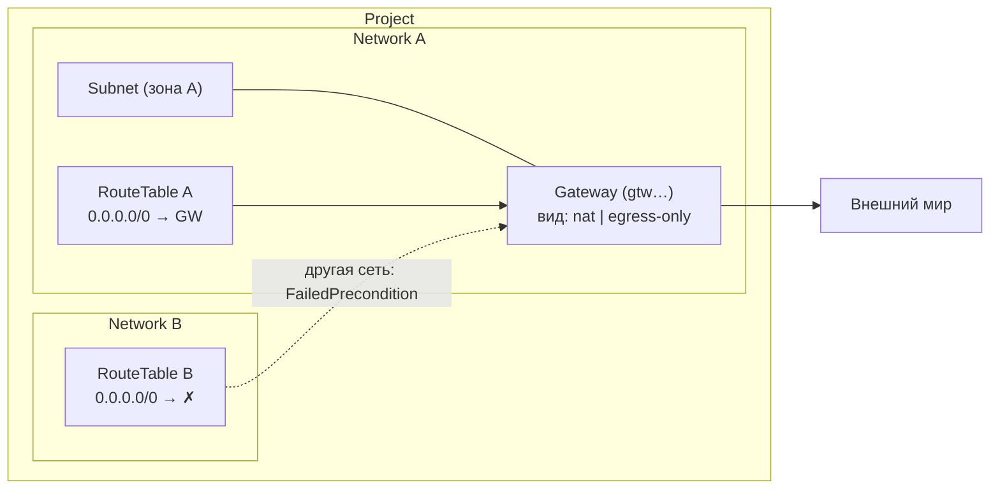

import { DICTIONARY } from '@site/src/constants/dictionary'
import { TYPES } from '@site/src/constants/types'
import { RESTRICTIONS } from '@site/src/constants/restrictions'
import { Restrictions } from '@site/src/components/commonBlocks/Restrictions'
import { Codes } from '@site/src/components/commonBlocks/Codes'
import { ApiOperation } from '@site/src/components/commonBlocks/ApiOperation'
import CodeBlock from '@theme/CodeBlock'
import dedent from 'ts-dedent'

# Gateway

**Gateway** — управляемая Kachō точка выхода трафика подсети во внешний мир. Вы
объявляете НАМЕРЕНИЕ («машины этих подсетей выходят наружу») и ссылаетесь на шлюз как на
следующий узел в маршрутах, вместо того чтобы держать собственный egress-узел и его
конфигурацию.

**Вид шлюза выбирается при создании и неизменяем** (`oneof gateway`), потому что смена
вида — это другой шлюз:

- `natGateway` — публичная трансляция исходящего IPv4;
- `egressOnlyGateway` — «только исход» для IPv6: трафик изнутри наружу разрешён,
  входящие соединения не устанавливаются, публичный адрес не выделяется.

**Шлюз привязан к подсети** (`subnetId`, обязателен и неизменяем). Эта привязка — она же
его якорь размещения: собственной зоны или региона шлюз не несёт, он наследует
размещение подсети — так же, как сетевой интерфейс и адрес. Отсюда правила ссылки из
маршрута (см. ниже): та же сеть, совпадающая зона, совпадающее семейство.

Подсеть привязки обязана нести CIDR-блок того семейства, которое обслуживает выбранный
вид: у `natGateway` — IPv4, у `egressOnlyGateway` — IPv6.

<table>
  <thead><tr><th>Что не так с якорем</th><th>Ответ на <code>Create</code></th></tr></thead>
  <tbody>
    <tr><td><code>subnetId</code> не прислан</td><td><code>InvalidArgument "subnet_id: required"</code> — синхронно</td></tr>
    <tr><td>Ветвь <code>oneof gateway</code> не выбрана</td><td><code>InvalidArgument "gateway: required"</code> — синхронно. Вид за вас не подставляется: шлюз, делающий не то, о чём просили, хуже отказа</td></tr>
    <tr><td>Подсети нет <strong>либо</strong> она чужого проекта</td><td><code>NotFound "Subnet &lt;id&gt; not found"</code> — один и тот же ответ на оба случая: по тексту нельзя установить, существует ли чужая подсеть</td></tr>
    <tr><td>У подсети нет блока нужного семейства</td><td><code>FailedPrecondition "Subnet &lt;id&gt; has no IPv4 CIDR block"</code> (или <code>IPv6</code> — по выбранному виду)</td></tr>
  </tbody>
</table>

Существование подсети проверяется **в момент записи**, а не отдельным вопросом заранее:
иначе между вопросом и записью подсеть могла бы исчезнуть, и шлюз всё равно создался бы.
Поэтому два последних отказа приходят ошибкой операции, а первые два — сразу ответом.

:::note Подсеть с привязанным шлюзом не удаляется
Обратная сторона якоря: пока шлюз привязан к подсети, `Subnet.Delete` отвечает
`FailedPrecondition "subnet has dependent resources"`. Сначала удалите шлюз.
:::

:::note Имя — та же форма, что у всех остальных ресурсов
Имя Gateway подчиняется **общей** форме платформы — DNS label по RFC 1123,
`^[a-z0-9]([-a-z0-9]{0,61}[a-z0-9])?$`: строчные латинские буквы, цифры и дефис, первый
и последний знак — буква или цифра, длина 1..63. Цифра первым знаком допустима.

Отдельного правила «строгий шлюз против permissive-сети» **не существует**: до #715
валидаторов имени было четыре и они разошлись по трём осям; с тех пор валидатор в дереве
один (`pkg/validate/nameform`), и та же форма продублирована ограничением таблицы. Имя,
валидное для сети, валидно и для шлюза — переносите соглашение об именовании между
ресурсами свободно.

Пустая строка при `Create` означает «назови сам»: сервер подставит имя, производное от
`id`. При `Update` пустое имя отвергается — ресурса без имени не бывает.
:::

## Поля ресурса

<table>
  <thead><tr><th>Поле</th><th>Тип</th><th>Описание</th></tr></thead>
  <tbody>
    <tr><td><code>id</code></td><td><code>{TYPES.string}</code></td><td>{DICTIONARY.id.short} (префикс <code>gtw</code>)</td></tr>
    <tr><td><code>projectId</code></td><td><code>{TYPES.string}</code></td><td>{DICTIONARY.projectId.short}</td></tr>
    <tr><td><code>name</code></td><td><code>{TYPES.string}</code></td><td>Имя шлюза — общая форма платформы (см. врезку выше); уникально в пределах проекта</td></tr>
    <tr><td><code>description</code></td><td><code>{TYPES.string}</code></td><td>{DICTIONARY.description.short}</td></tr>
    <tr><td><code>labels</code></td><td><code>{TYPES.mapStringString}</code></td><td>{DICTIONARY.labels.short}</td></tr>
    <tr><td><code>createdAt</code></td><td><code>{TYPES.timestamp}</code></td><td>{DICTIONARY.createdAt.short}</td></tr>
    <tr><td><code>subnetId</code></td><td><code>{TYPES.string}</code></td><td>Подсеть привязки; она же якорь размещения. Обязателен, неизменяем</td></tr>
    <tr><td><code>natGateway</code></td><td><code>NatGateway</code></td><td>Вариант <code>oneof gateway</code>: публичная трансляция исходящего IPv4</td></tr>
    <tr><td><code>egressOnlyGateway</code></td><td><code>EgressOnlyGateway</code></td><td>Вариант <code>oneof gateway</code>: «только исход» для IPv6</td></tr>
  </tbody>
</table>

:::info Префикс ID
Идентификатор шлюза имеет префикс <code>gtw</code>: 3-символьный префикс + 17 символов
crockford-base32, тип ресурса читается по префиксу. Префикс <code>enp</code> — у
операций (`Operation`), не у шлюзов.
:::

## Где используется Gateway

Шлюз сам по себе не «включает» выход в интернет — он становится точкой выхода, когда на
него ссылается маршрут. Привязка происходит на стороне [RouteTable](/api/route-table):
маршрут указывает шлюз как next-hop, и трафик подсетей, к которым привязана эта таблица,
направляется через него.

:::note Ссылка из маршрута РЕЗОЛВИТСЯ
`StaticRoute.next_hop` — ровно одна из двух ветвей: `nextHopAddress` либо `gatewayId`.
Ни одной и обе сразу — отказ, называющий поле.

Названный шлюз проверяется на пути запроса: нет строки → `NotFound` «Gateway … not
found»; есть, но не годится → `FailedPrecondition`. Годится он, когда выполнены все три
условия:

- **та же сеть** — подсеть привязки шлюза принадлежит сети этой таблицы маршрутов;
- **когерентное размещение** — зональная подсеть таблицы и зональная подсеть шлюза в
  ОДНОЙ зоне; региональная (anycast) подсеть зоны не несёт и из зональной сверки
  исключена by construction;
- **семейство** — IPv4-назначение идёт через `natGateway`, IPv6-назначение через
  `egressOnlyGateway`.

Шлюз, названный живым маршрутом, **не удаляется**: `FailedPrecondition` «gateway is in
use». Сначала снимите маршрут.
:::

---

## Get

<ApiOperation method="GET" endpoint="/vpc/v1/gateways/{gatewayId}">

Возвращает шлюз по идентификатору (sync). Malformed id (нераспознанный префикс) →
`InvalidArgument` первым стейтментом; well-formed, но отсутствующий → `NotFound`.

#### Пример запроса

<CodeBlock language="bash">
  {dedent`
    curl http://localhost:18080/vpc/v1/gateways/{gatewayId} \\
      -H 'Authorization: Bearer <JWT>'
  `}
</CodeBlock>

#### Пример ответа

<CodeBlock language="json">
  {dedent`
    {
      "id": "{gatewayId}",
      "projectId": "{projectId}",
      "name": "egress-gw",
      "description": "Выход наружу для подсетей сети",
      "labels": { "env": "prod" },
      "createdAt": "2026-06-06T14:27:00Z",
      "subnetId": "{subnetId}",
      "natGateway": {}
    }
  `}
</CodeBlock>

<Restrictions items={[{ label: 'resourceId', rules: RESTRICTIONS.resourceId }]} />
<Codes codes={['invalidArgument', 'notFound', 'permissionDenied', 'internal']} />

</ApiOperation>

---

## List

<ApiOperation method="GET" endpoint="/vpc/v1/gateways">

Список шлюзов проекта (sync) с фильтром и cursor-пагинацией. Результат отфильтрован по
правам вызывающего: вы видите только шлюзы проектов, к которым у вас есть доступ.

#### Параметры запроса

<table>
  <thead><tr><th>Параметр</th><th>Обязательность</th><th>Тип</th><th>Описание</th></tr></thead>
  <tbody>
    <tr><td><code>projectId</code></td><td><strong>да</strong></td><td><code>{TYPES.string}</code></td><td>{DICTIONARY.projectId.short}</td></tr>
    <tr><td><code>filter</code></td><td>нет</td><td><code>{TYPES.string}</code></td><td>{DICTIONARY.filter.short}</td></tr>
    <tr><td><code>pageSize</code></td><td>нет</td><td><code>{TYPES.int64}</code></td><td>{DICTIONARY.pageSize.short}</td></tr>
    <tr><td><code>pageToken</code></td><td>нет</td><td><code>{TYPES.string}</code></td><td>{DICTIONARY.pageToken.short}</td></tr>
  </tbody>
</table>

#### Пример запроса

<CodeBlock language="bash">
  {dedent`
    curl 'http://localhost:18080/vpc/v1/gateways?projectId={projectId}&filter=name%3D%22egress-gw%22' \\
      -H 'Authorization: Bearer <JWT>'
  `}
</CodeBlock>

#### Пример ответа

<CodeBlock language="json">
  {dedent`
    {
      "gateways": [
        {
          "id": "{gatewayId}",
          "projectId": "{projectId}",
          "name": "egress-gw",
          "createdAt": "2026-06-06T14:27:00Z",
          "subnetId": "{subnetId}",
          "natGateway": {}
        }
      ],
      "nextPageToken": ""
    }
  `}
</CodeBlock>

:::tip Пагинация
Если `nextPageToken` непуст — есть еще страница: передайте его в `pageToken` следующего
запроса. Токен opaque (base64 от `{createdAt, id}`); не конструируйте его вручную.
:::

<Restrictions items={[
  { label: 'projectId', rules: RESTRICTIONS.projectId },
  { label: 'pagination', rules: RESTRICTIONS.pagination },
]} />
<Codes codes={['invalidArgument', 'permissionDenied', 'internal']} />

</ApiOperation>

---

## Create

<ApiOperation method="POST" endpoint="/vpc/v1/gateways" async>

Создает шлюз в указанном проекте. Возвращает `Operation` (async). В обработчике
операции: проверка существования проекта → вставка `Gateway` (вместе с проверкой якоря
размещения) → запись события в outbox.

Имя должно быть уникальным в пределах проекта — уникальность полная
(`UNIQUE(projectId, name)`), а не «только для непустых». Синхронной проверки имени здесь
нет — её держит сама база, поэтому дубликат приходит **ошибкой операции**
(`ALREADY_EXISTS`), а не ответом на запрос. Пустая строка в запросе означает «назови сам»
и слот не занимает: сервер проставит имя, производное от `id`.

#### Тело запроса

<table>
  <thead><tr><th>Параметр</th><th>Обязательность</th><th>Тип</th><th>Описание</th></tr></thead>
  <tbody>
    <tr><td><code>projectId</code></td><td><strong>да</strong></td><td><code>{TYPES.string}</code></td><td>{DICTIONARY.projectId.short}</td></tr>
    <tr><td><code>name</code></td><td>нет</td><td><code>{TYPES.string}</code></td><td>Имя шлюза — общая форма платформы (см. врезку выше); уникально в проекте</td></tr>
    <tr><td><code>description</code></td><td>нет</td><td><code>{TYPES.string}</code></td><td>{DICTIONARY.description.short}</td></tr>
    <tr><td><code>labels</code></td><td>нет</td><td><code>{TYPES.mapStringString}</code></td><td>{DICTIONARY.labels.short}</td></tr>
    <tr><td><code>subnetId</code></td><td><b>да</b></td><td><code>{TYPES.string}</code></td><td>Подсеть привязки и якорь размещения. Неизменяема</td></tr>
    <tr><td><code>natGatewaySpec</code></td><td><b>да</b>, ровно одна из двух</td><td><code>NatGatewaySpec</code></td><td>Вариант <code>oneof gateway</code>: трансляция исходящего IPv4. Пустой объект</td></tr>
    <tr><td><code>egressOnlyGatewaySpec</code></td><td><b>да</b>, ровно одна из двух</td><td><code>EgressOnlyGatewaySpec</code></td><td>Вариант <code>oneof gateway</code>: «только исход» для IPv6. Пустой объект</td></tr>
  </tbody>
</table>

#### Пример запроса

<CodeBlock language="bash">
  {dedent`
    curl -X POST http://localhost:18080/vpc/v1/gateways \\
      -H 'Authorization: Bearer <JWT>' \\
      -H 'Content-Type: application/json' \\
      -d '{
        "projectId": "{projectId}",
        "name": "egress-gw",
        "labels": { "env": "prod" },
        "subnetId": "{subnetId}",
        "natGatewaySpec": {}
      }'
  `}
</CodeBlock>

#### Пример ответа (Operation)

<CodeBlock language="json">
  {dedent`
    {
      "id": "{operationId}",
      "description": "Create gateway egress-gw",
      "createdAt": "2026-06-06T14:27:00Z",
      "done": false,
      "metadata": {
        "@type": "type.googleapis.com/kacho.cloud.vpc.v1.CreateGatewayMetadata",
        "gatewayId": "{gatewayId}"
      }
    }
  `}
</CodeBlock>

:::tip Опрос результата
Поллите <code>GET /operations/&#123;operationId&#125;</code> до <code>done: true</code>; затем <code>response</code>
содержит созданный <code>Gateway</code>, либо <code>error</code> — <code>google.rpc.Status</code>.
См. [Операции](/architecture/operations).
:::

<Restrictions items={[
  { label: 'projectId', rules: RESTRICTIONS.projectId },
  { label: 'name', rules: RESTRICTIONS.nameGateway },
  { label: 'description', rules: RESTRICTIONS.description },
  { label: 'labels', rules: RESTRICTIONS.labels },
]} />
<Codes codes={['invalidArgument', 'alreadyExists', 'notFound', 'unavailable', 'permissionDenied', 'internal']} />

</ApiOperation>

---

## Update

<ApiOperation method="PATCH" endpoint="/vpc/v1/gateways/{gatewayId}" async>

Изменяет mutable-поля шлюза (`name`, `description`, `labels`).
Immutable: `projectId`, `subnetId` и вид шлюза (ветвь `oneof gateway`) — их имена в
`updateMask` отвергаются с конвенционным текстом «&lt;field&gt; is immutable after
Gateway.Create». Возвращает `Operation` (async). Соблюдается
`update_mask`-дисциплина: неизвестное поле или immutable в маске → `InvalidArgument`;
пустая маска = full-PATCH (применяются все mutable-поля, immutable из тела
игнорируются).

#### Тело запроса

<table>
  <thead><tr><th>Параметр</th><th>Обязательность</th><th>Тип</th><th>Описание</th></tr></thead>
  <tbody>
    <tr><td><code>updateMask</code></td><td>нет</td><td><code>{TYPES.fieldMask}</code></td><td>{DICTIONARY.updateMask.short}</td></tr>
    <tr><td><code>name</code></td><td>нет</td><td><code>{TYPES.string}</code></td><td>Новое имя шлюза — общая форма платформы (см. врезку выше); уникально в проекте</td></tr>
    <tr><td><code>description</code></td><td>нет</td><td><code>{TYPES.string}</code></td><td>{DICTIONARY.description.short}</td></tr>
    <tr><td><code>labels</code></td><td>нет</td><td><code>{TYPES.mapStringString}</code></td><td>{DICTIONARY.labels.short} (полная замена набора)</td></tr>
    <tr><td colSpan="4">Вида шлюза и подсети привязки в запросе изменения <b>нет</b>: оба неизменяемы после <code>Create</code>. Имя <code>natGateway</code> / <code>egressOnlyGateway</code> / <code>subnetId</code> в <code>updateMask</code> → <code>InvalidArgument</code> «&lt;field&gt; is immutable after Gateway.Create»</td></tr>
  </tbody>
</table>

#### Пример запроса

<CodeBlock language="bash">
  {dedent`
    curl -X PATCH http://localhost:18080/vpc/v1/gateways/{gatewayId} \\
      -H 'Authorization: Bearer <JWT>' \\
      -H 'Content-Type: application/json' \\
      -d '{
        "updateMask": "description",
        "description": "Egress-шлюз (обновлено)"
      }'
  `}
</CodeBlock>

#### Пример ответа (Operation)

<CodeBlock language="json">
  {dedent`
    {
      "id": "{operationId}",
      "description": "Update gateway {gatewayId}",
      "done": false,
      "metadata": {
        "@type": "type.googleapis.com/kacho.cloud.vpc.v1.UpdateGatewayMetadata",
        "gatewayId": "{gatewayId}"
      }
    }
  `}
</CodeBlock>

:::caution Полная замена labels
`labels` обновляется целиком: переданный набор **полностью заменяет** существующий. Чтобы
добавить или убрать одну метку — прочитайте текущий набор (`Get`), измените локально и
отправьте результат.
:::

<Restrictions items={[
  { label: 'updateMask', rules: RESTRICTIONS.updateMask },
  { label: 'name', rules: RESTRICTIONS.nameGateway },
]} />
<Codes codes={['invalidArgument', 'notFound', 'alreadyExists', 'permissionDenied', 'internal']} />

</ApiOperation>

---

## Delete

<ApiOperation method="DELETE" endpoint="/vpc/v1/gateways/{gatewayId}" async>

Удаляет шлюз (hard-delete). Возвращает `Operation`, чей `response` —
`google.protobuf.Empty`.

#### Пример запроса

<CodeBlock language="bash">
  {dedent`
    curl -X DELETE http://localhost:18080/vpc/v1/gateways/{gatewayId} \\
      -H 'Authorization: Bearer <JWT>'
  `}
</CodeBlock>

#### Пример ответа (Operation, response = Empty)

<CodeBlock language="json">
  {dedent`
    {
      "id": "{operationId}",
      "description": "Delete gateway {gatewayId}",
      "done": false,
      "metadata": {
        "@type": "type.googleapis.com/kacho.cloud.vpc.v1.DeleteGatewayMetadata",
        "gatewayId": "{gatewayId}"
      }
    }
  `}
</CodeBlock>

:::caution Шлюз как next-hop
Прежде чем удалять шлюз, на который ссылаются маршруты, снимите эти ссылки в
соответствующих `RouteTable`. Удаленный шлюз нельзя использовать как точку выхода, а
повторное создание выдаст новый `id`.
:::

<Restrictions items={[{ label: 'resourceId', rules: RESTRICTIONS.resourceId }]} />
<Codes codes={['invalidArgument', 'notFound', 'failedPrecondition', 'permissionDenied', 'internal']} />

</ApiOperation>

---

## ListOperations

<ApiOperation method="GET" endpoint="/vpc/v1/gateways/{gatewayId}/operations">

Список операций (LRO) для указанного шлюза (sync) с cursor-пагинацией — история
`Create` / `Update` / `Delete`. Удобно для аудита изменений и диагностики застрявших
операций.

#### Параметры запроса

<table>
  <thead><tr><th>Параметр</th><th>Обязательность</th><th>Тип</th><th>Описание</th></tr></thead>
  <tbody>
    <tr><td><code>gatewayId</code></td><td><strong>да</strong></td><td><code>{TYPES.string}</code></td><td>{DICTIONARY.id.short} (path-параметр)</td></tr>
    <tr><td><code>pageSize</code></td><td>нет</td><td><code>{TYPES.int64}</code></td><td>{DICTIONARY.pageSize.short}</td></tr>
    <tr><td><code>pageToken</code></td><td>нет</td><td><code>{TYPES.string}</code></td><td>{DICTIONARY.pageToken.short}</td></tr>
  </tbody>
</table>

#### Пример запроса

<CodeBlock language="bash">
  {dedent`
    curl 'http://localhost:18080/vpc/v1/gateways/{gatewayId}/operations' \\
      -H 'Authorization: Bearer <JWT>'
  `}
</CodeBlock>

#### Пример ответа

<CodeBlock language="json">
  {dedent`
    {
      "operations": [
        {
          "id": "{operationId}",
          "description": "Create gateway egress-gw",
          "createdAt": "2026-06-06T14:27:00Z",
          "done": true
        }
      ],
      "nextPageToken": ""
    }
  `}
</CodeBlock>

<Restrictions items={[
  { label: 'resourceId', rules: RESTRICTIONS.resourceId },
  { label: 'pagination', rules: RESTRICTIONS.pagination },
]} />
<Codes codes={['invalidArgument', 'notFound', 'permissionDenied', 'internal']} />

</ApiOperation>

---

## Типичные сценарии

- **Выход наружу для подсетей одной сети.** Заводите шлюз в подсети сети и ссылаетесь на
  него из маршрутов таблиц ЭТОЙ ЖЕ сети. Ссылка из таблицы другой сети отвергается —
  трафик не пересекает границу сети.
- **Двойной стек — два шлюза.** IPv4 наружу обслуживает `natGateway`, IPv6 —
  `egressOnlyGateway`; маршрут каждого семейства называет свой.
- **Разделение окружений метками.** Помечаете шлюзы (`env: prod` / `env: staging`) и
  находите нужный через `List` с `filter=name="…"`, а группировку и поиск ведете по
  `labels`.
- **Аудит и диагностика.** `ListOperations` дает хронологию изменений конкретного шлюза —
  кто и когда его создал/правил, и завершилась ли последняя операция.

## Подводные камни и рекомендации

:::caution Что важно знать
- **Шлюз стоит в подсети, и это ограничивает, кто может на него сослаться.** Ресурс
  заводится в проекте, но его якорь — подсеть, поэтому маршрут может назвать шлюз только
  из таблицы **той же сети** и (для зональной подсети) **той же зоны**. Один шлюз на много
  сетей не работает: сети нужен свой. Здесь раньше стояло обратное — «одного достаточно
  для многих сетей»; это было верно, пока у шлюза не было якоря, и перестало быть верным
  вместе с его появлением.
- **Имя — общее для всей платформы.** Отдельной, более строгой формы у шлюза нет: имя
  подчиняется тому же DNS label по RFC 1123, что и у `Network`/`Subnet`, поэтому
  соглашение об именовании переносится между ресурсами без правок (см. врезку «Имя — та
  же форма, что у всех остальных ресурсов» выше).
- **Уникальность имени — в пределах проекта.** Повторное `name` → `ALREADY_EXISTS`.
  В разных проектах имена не конфликтуют.
- **`labels` заменяются целиком.** Частичное обновление меток нужно делать через
  read-modify-write (`Get` → правка → `Update`).
- **Привязка к маршрутам.** Связь шлюза с трафиком живет в `RouteTable` (next-hop), а не
  в самом `Gateway`. Перед удалением шлюза снимите ссылающиеся на него маршруты.
:::

:::tip Best practices
- Давайте шлюзу осмысленное `name` и поддерживайте `labels` (`env`, `team`) — по ним
  ведётся навигация; вид шлюза виден в проекции ветвью `oneof`.
- Выбирайте вид осознанно: он неизменяем, и смена вида означает новый шлюз с новым
  идентификатором, а значит и правку всех маршрутов, которые его называли.
- Все мутации асинхронные: дожидайтесь `done: true` в `Operation`, прежде чем строить
  на шлюз маршруты в автоматизации.
- Для воспроизводимых стендов держите создание шлюза в одном описании инфраструктуры
  рядом с сетями и таблицами маршрутов проекта.
:::
