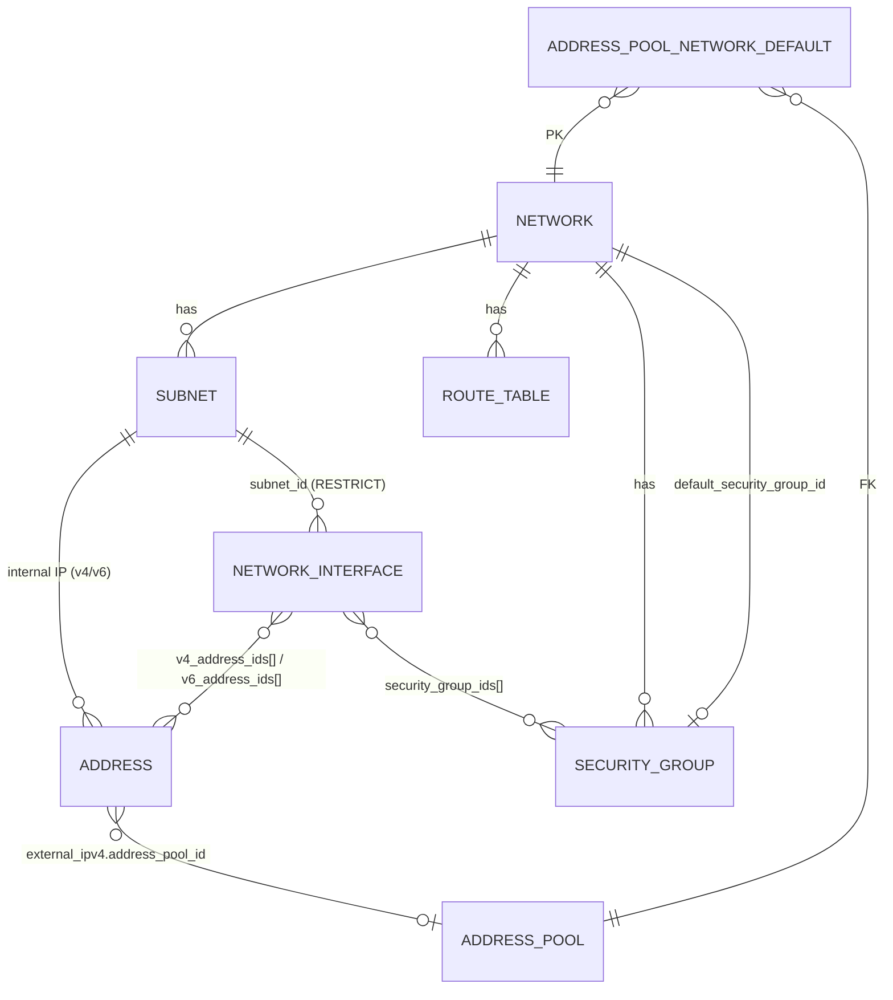

# 01 — Resources

Детально по каждому ресурсу. Поля, инварианты, связи, спецчастности.

## Иерархия и связи

> Здесь стояли ещё две связи — per-address override пула и таблица селектора облака.
> Обе сущности **дропнуты** миграцией `0002_drop_override_and_cloud_pool_selector.sql`
> вместе с соответствующим шагом IPAM-каскада; в дереве от них не осталось ни таблицы,
> ни Go-типа (предикат: `git grep -l CloudPoolSelector -- 'services/vpc/**/*.go'` —
> пусто). Диаграмма схемы, рисующая снятые таблицы, читается как утверждение об их
> существовании, поэтому связи убраны, а не помечены.

> `Zone`/`Region` — это leaf-домен `kacho-geo`; в `kacho-vpc`
> `subnet.zone_id` / `address_pool.zone_id` / `address.external_ipv4.zone_id` —
> просто `TEXT`-id без FK, валидируется на request-path через
> `geo.v1.ZoneService.Get`.

## Public ресурсы (project-scoped)

### Network

Контейнер для Subnet/RouteTable/SG. Базовая VPC-сеть.

| Поле | Тип | Замечания |
|---|---|---|
| `id` | text PK, prefix `net` | |
| `project_id` | text NOT NULL | `networks_project_id_name_key` UNIQUE(project_id, name) |
| `name` | text | NameVPC permissive |
| `description` | text | ≤256 |
| `labels` | jsonb | ≤64 пар |
| `default_security_group_id` | text NULL FK→`security_groups` | устанавливается в воркере Create БЕЗУСЛОВНО. ON DELETE SET NULL |
| `ipv4_cidr_blocks` / `ipv6_cidr_blocks` | text[] NOT NULL DEFAULT `'{}'` | **объявленный супернет сети** (миграция 0015, VPC-1 F2): CIDR каждой подсети обязан лежать внутри одного из этих блоков. Тенант-управляемые аддитивные наборы, меняются через `:add-cidr-blocks`/`:remove-cidr-blocks`; кардинальность ограничена CHECK (0016) |
| `default_route_table_id` | text NULL FK→`route_tables` | системная RT сети, создаётся на `Network.Create` и является **источником истины** о том, какую RT наследует подсеть без явного `route_table_id` (0015 объявила колонку, 0017 сделала её действующей) |
| `vrf_id` | bigint, internal-only | VRF tenancy-id, аллоцируется control-plane'ом (sequence); инфра-чувствительное поле, отдается **только** через `InternalNetworkService` — на публичной поверхности нет |
| `created_at` | tstz | в proto-ответе truncate до секунд |

**Инварианты**:
- При Create БЕЗУСЛОВНО — атомарно создается
  Network + Default SG + биндинг `default_security_group_id` в одной TX worker'а.
  При `=false` Network создается без SG (для load-тестов / внешнего reconciler'а).
- Супернет объявляется на Create и **ограничивает** подсети: CIDR подсети обязан быть
  подмножеством одного из блоков сети (`validateSubnetWithinSupernet`).
- `vrf_id` — internal-only инфра-идентификатор; не на публичной проекции Network.
- Hard-delete; FK от Subnet/RT/SG = RESTRICT.

### Subnet

Подсеть в Network. Размещение задаётся дискриминатором, а не набором ad-hoc полей.

**Имена в контракте и имена колонок различаются — это не опечатка.** Контракт (proto/REST)
несёт `ipv4_cidr_primary` + `ipv4_cidr_blocks`, БД хранит один массив `v4_cidr_blocks`,
у которого якорь — элемент `[1]`. Ниже колонка и контрактное поле названы раздельно.

| Колонка | Тип | Замечания |
|---|---|---|
| `id` | text PK, prefix `sub` | |
| `project_id`, `network_id` | text NOT NULL | immutable после Create; `subnets_project_id_name_key` UNIQUE(project_id, name) WHERE name<>'' |
| `placement_type` | text NOT NULL | `ZONAL` \| `REGIONAL`, обязателен и immutable; `UNSPECIFIED` в БД быть не может — CHECK перечисляет только два значения (миграция 0012) |
| `zone_id` / `region_id` | text NOT NULL DEFAULT `''` | ровно одно непусто, взаимоисключение держит CHECK `subnets_placement_payload_chk`: `ZONAL`→`zone_id`, `REGIONAL`→`region_id` |
| `name`, `description`, `labels` | | |
| `v4_cidr_blocks` | text[] NOT NULL DEFAULT `'{}'` | `[1]` — **якорь** `ipv4_cidr_primary` контракта (immutable, задаётся на Create); остальные элементы — дополнительные диапазоны из `:add-cidr-blocks`. v6-only подсеть легальна: якорь пуст, и тогда internal-v4-аллокация в неё → `FailedPrecondition "subnet %s has no IPv4 CIDR"` |
| `v6_cidr_blocks` | text[] NOT NULL DEFAULT `'{}'` | то же для IPv6: `[1]` = `ipv6_cidr_primary`; v4-only подсеть легальна |
| `v4_cidr_primary` / `v6_cidr_primary` | cidr GENERATED STORED | производные от `[1]`; нужны EXCLUDE-констрейнтам |
| `route_table_id` | text NULL FK→`route_tables` | не задан на Create → подставляется `network.default_route_table_id` |
| `dhcp_options` | jsonb | **колонка осталась от baseline, контракта у неё больше нет**: поле снято из `Subnet`/`Create`/`Update` (номера и имя зарезервированы, VPC-1-43). Ни один RPC его не принимает и не отдаёт |

**Инварианты**:
- CIDR подсети обязан лежать **внутри объявленного супернета сети**
  (`network.ipv4_cidr_blocks`/`ipv6_cidr_blocks`) — проверка `validateSubnetWithinSupernet`
  на Create и на `:add-cidr-blocks`.
- CIDR overlap **запрещен** в пределах Network на DB-уровне, причём для **всех** блоков,
  а не только для якоря: baseline-EXCLUDE `subnets_no_overlap_v4/v6` смотрит только на
  `*_cidr_primary`, поэтому миграция 0010 завела нормализованную child-таблицу
  `subnet_cidr_blocks` с `EXCLUDE USING gist (network_id WITH =, block inet_ops WITH &&)`.
  Прежняя редакция утверждала, что вторичные блоки закрыты сервисным cross-check'ом —
  сегодня это DB-инвариант, как и требует ban #10.
  Маппится в `FailedPrecondition "Subnet CIDRs can not overlap"`.
- **CIDR immutable через Update.** Якорь не меняется никогда; дополнительные диапазоны —
  только через `:add-cidr-blocks` / `:remove-cidr-blocks`. В `UpdateSubnetRequest`
  CIDR-полей **нет вовсе** — их номера зарезервированы, поэтому «soft-immutable / no-op»
  здесь больше не про что: принять и выбросить нечего.
- **Удаление подсети** блокируется (sync-precheck в `SubnetService.Delete`):
  есть внутренние Address (v4 ИЛИ v6 — `AddressesBySubnet` смотрит и `internal_ipv4`,
  и `internal_ipv6`) → `FailedPrecondition "Subnet has allocated internal addresses"`;
  затем — есть `NetworkInterface` → `FailedPrecondition "subnet ... has N network interface(s) (...); delete them first"`.
  DB-backstops: `addresses_internal_subnet_fkey` (на generated-колонке `addresses.internal_subnet_id`,
  выводимой из `internal_ipv4` ИЛИ `internal_ipv6`) и `network_interfaces_subnet_id_fkey ON DELETE RESTRICT`.

### Address

External (project-scoped public IP) или internal (IP в Subnet).

| Поле | Тип | Замечания |
|---|---|---|
| `id` | text PK, prefix `adr` | |
| `project_id` | text NOT NULL | |
| `addr_type` | smallint | 0=unspec, 1=external, 2=internal |
| `ip_version` | smallint | |
| `external_ipv4` | jsonb | `{address, zone_id, address_pool_id, requirements}` |
| `internal_ipv4` | jsonb | `{address, subnet_id}` |
| `internal_ipv6` | jsonb | `{address, subnet_id}` (oneof `Address.internal_ipv6_address` — `{address, oneof scope{subnet_id}}`) |
| `internal_subnet_id` | text computed | derived из `internal_ipv4->>'subnet_id'` **ИЛИ** `internal_ipv6->>'subnet_id'` — для UNIQUE per subnet + FK `addresses_internal_subnet_fkey` (и v4-, и v6-internal-адрес блокирует свою подсеть) |
| `used` | bool | computed на сервис-стороне; `used=true` ⇔ есть referrer-row (см. `address_references`, ниже / NIC) |
| `reserved` | bool | адрес удерживается **за проектом сам по себе** (тенант заказал именно адрес). `Create` ставит `true` — см. ниже |
| `used_by` | Reference | денормализованная Reference кто использует адрес (flat-колонки `used_by_*`) |
| `deletion_protection` | bool | sync-check перед Delete |

**UNIQUE constraints**:
- `addresses_project_id_name_key` PARTIAL UNIQUE на `(project_id, name)`
  WHERE name `<>` `''` — дубль непустого `name` в project → `ALREADY_EXISTS`.
- `addresses_external_ip_uniq` PARTIAL UNIQUE на
  `external_ipv4 ->> 'address'` WHERE address `<>` `''` — запрещает
  дубль external IP глобально (не считая пустых allocate-pending).
- `addresses_external_pool_ip_uniq` PARTIAL UNIQUE на
  `(address_pool_id, address)` — запрещает повторный pick того же IP
  в том же pool.
- `addresses_internal_subnet_ip_uniq` PARTIAL UNIQUE на
  `(internal_subnet_id, address)` — запрещает дубль internal IPv4 в Subnet.
- `addresses_internal_subnet_ipv6_uniq` PARTIAL UNIQUE на
  `(subnet_id, address)` из `internal_ipv6` — то же для IPv6;
  заодно conflict-target для `InternalAddressService.AllocateInternalIPv6` (random-pick + retry).

**Связи / удаление**:
- `Address.internal_ipv6_address_spec` в `CreateAddressRequest` → IP из `subnet.v6_cidr_blocks`
  (random-pick через `InternalAddressService.AllocateInternalIPv6`). `ListAddressesRequest.subnet_id`
  фильтрует по `internal_ipv4->>'subnet_id'` ИЛИ `internal_ipv6->>'subnet_id'`.
- `Address.Delete` блокируется, если адрес `used` (referrer = `NetworkInterface`):
  `FailedPrecondition "address ... is in use by network interface ...; detach it before deleting the address"`.
  Освободить — detach адреса от NIC / удаление NIC. Порядок снизу вверх: NIC → Address → Subnet → Network.

**Allocate flow** см. [`02-data-flows.md`](02-data-flows.md#address-allocate-cascade).

**`reserved` — что означает и чего НЕ делает.**

`reserved` говорит: адрес удерживается **за проектом сам по себе** — тенант заказал
именно адрес, поэтому адрес переживает любого потребителя, который его одалживает, и
исчезает только по явному `Delete`. Противоположность — адрес, выделенный **побочным
эффектом** создания чего-то другого, чья жизнь привязана к этому потребителю.

- **Свежесозданный адрес зарезервирован.** `AddressService.Create` — это и есть заказ
  адреса тенантом, и других способов родить адрес на публичной поверхности нет, поэтому
  `doCreate` ставит `Reserved: true` безусловно. В `CreateAddressRequest` поля `reserved`
  нет **потому, что выбирать нечего**, а не потому, что значение стартует с `false`.
  То же с другой стороны: `InternalAddressService.MarkAddressEphemeralInUse` существует,
  чтобы **снять** флаг с адреса, авто-выделенного под интерфейс, — снимать было бы нечего,
  не поставь его `Create`. Исторический предок флага — `status.state = "RESERVED"`,
  выставлявшийся при создании синхронно (acceptance sub-phase 0.3, F1); плоский редизайн
  расщепил это состояние на пару `reserved`/`used`.
- **Отказ от резерва — решение тенанта**, принимается через `AddressService.Update`
  (`update_mask = "reserved"`). Это единственная дверь, через которую флаг двигается
  наружу от `Create`.

> [!warning] Флаг ничего не энфорсит — сегодня его никто не читает
> Ни одна ветка, ни один SQL-предикат в сервисе не сверяется с `reserved`. Удаление
> гейтится `used` + `deletion_protection` (`DELETE … WHERE id=$1 AND used=false AND
> deletion_protection=false`), реклеймера / sweeper'а / lease-expiry для адресов в vpc
> **не существует** вовсе (фоновых петель две — redrive FGA-outbox и LRO-recovery, обе
> таблицу `addresses` не трогают). Поэтому «зарезервирован» = **правдивое утверждение о
> происхождении** адреса, адресованное читающему его тенанту, а НЕ точка энфорсмента.
> Не читать как защиту, пока защиту кто-нибудь не реализует. Прежняя формулировка
> на сайте документации — «адрес зарезервирован (не освобождается автоматически)» — была верна лишь
> потому, что автоматически не освобождается **ничто**; она обещала защиту от механизма,
> которого нет, и заменена описанием происхождения.

### NetworkInterface (NIC)

First-class NIC-ресурс домена VPC. Project-level (`project_id` обязателен),
принадлежит `Subnet`. Может быть создан **без адресов**.

| Поле | Тип | Замечания |
|---|---|---|
| `id` | text PK, prefix `nic` | |
| `project_id` | text NOT NULL | |
| `name`, `labels` | | |
| `subnet_id` | text NOT NULL FK→`subnets` | `network_interfaces_subnet_id_fkey` **ON DELETE RESTRICT** — NIC жестко блокирует свою подсеть |
| `mac_address` | text, output-only | аллоцируется при Create (`0e:` + 40 бит crypto/rand), cloud-wide UNIQUE + retry на коллизию |
| `v4_address_ids[]` / `v6_address_ids[]` | text[] | ссылки на `Address`-ресурсы **по id** (≤1 v4 + ≤1 v6); один `Address` — максимум на одном NIC (enforced сервис-слоем через `addresses.used` + referrer-rows `address_references`, `referrer_type="network_interface"`) |
| `security_group_ids[]` | jsonb | подставляемого умолчания НЕТ: пустой массив остаётся пустым (`Network.default_security_group_id` в этот путь не читается). Каждый переданный id проверяется на существование, принадлежность проекту интерфейса и сеть подсети; network-less (project-level) SG принимается в любой подсети своего проекта. Число групп ограничено (`MaxNICSecurityGroups` + CHECK) |
| `used_by` | `kacho.cloud.reference.Reference` | денормализованное зеркало «кто использует этот NIC»; flat-колонки `used_by_type`/`used_by_id`/`used_by_name` |
| `status` | enum | `PROVISIONING` / `ACTIVE` / `AVAILABLE` / `FAILED` / `DELETING` |

**Проекция** (lean, control-plane-only):
- **`NetworkInterface`:** `id`, `name`, `labels`, `subnet_id`, `mac_address`,
  `v4_address_ids`, `v6_address_ids`, `security_group_ids`, `used_by`, `status`.
- Инфра/data-plane-проекции у kacho-vpc нет — ресурс несет только control-plane-поля.
  **На публичной поверхности инфра-чувствительных полей нет.**

**RPC**: `NetworkInterfaceService` — Get/List/Create/Update/Delete/ListOperations;
REST `/vpc/v1/networkInterfaces`. Compute-Instance ссылается на NIC через `nic_id`.

> Удаление: NIC → Address → Subnet → Network (все RESTRICT). NIC блокирует подсеть; адрес в
> использовании у NIC нельзя удалить; подсеть с внутренними адресами / с NIC'ами — нельзя; сеть с
> дочерними ресурсами — нельзя (default SG авто-удаляется Delete-worker'ом).

### RouteTable

Static routes для Network. Один RT может быть привязан к нескольким
Subnet'ам.

| Поле | Замечания |
|---|---|
| `id` (prefix `rtb`), `project_id`, `network_id` immutable | UNIQUE(project_id, name) WHERE name<>'' |
| `static_routes` jsonb array | full-replace на Update |
| `name`, `description`, `labels` | |

### SecurityGroup

Firewall rules. **`network_id` обязателен на Create и immutable после него**: SG принадлежит
ровно одной Network своего проекта. Один SG может быть `default_for_network`.

> [!warning] Здесь стояло обратное — «`network_id` опционально, proto-`(required)` снят»
> Дерево говорит трижды и в одну сторону: в контракте у поля стоит `[(required) = true]`
> (`proto/kacho/cloud/vpc/v1/security_group_service.proto`), use-case отвергает пустое
> значение синхронно — `InvalidArgument "network_id required"`
> (`internal/apps/kacho/api/securitygroup/create.go`), а комментарий колонки в
> `0001_initial.sql` дословно объявляет её `mandatory and immutable after Create`.
> Утверждение об опциональности жило в **восьми** местах инженерного корпуса при верной
> странице сайта — тот случай, когда два места об одном предмете расходятся, и перевес у
> того, что сверено с деревом, а не у того, что чаще повторено.

| Поле | Замечания |
|---|---|
| `id` (prefix `sgr`), `project_id` | UNIQUE(project_id, name) WHERE name<>'' |
| `network_id` | text; **обязателен** на Create, immutable после. Колонка объявлена NULLABLE ради FK (пустая строка сломала бы ссылку), но use-case пустую не пропускает. `List?filter=network_id="<id>"` работает (whitelist фильтра включает `network_id`) |
| `default_for_network` | bool — `true` у системной группы, которую создаёт сама сеть (безусловно) |
| `rules` | jsonb array; область значений правила (протокол, диапазон портов) держится CHECK'ами на DB-уровне — миграция `0027_security_group_rules_domain.sql` |

**RPC специфика**:
- `UpdateRules` — полный replace массива.
- `UpdateRule` — патч одного правила по `rule_id`.
- Optimistic concurrency через `xmin::text` (zero-overhead, без отдельной
  колонки).

### Gateway

Shared egress (NAT-style), не привязан к Network.

| Поле | Замечания |
|---|---|
| `id` (prefix `gtw`), `project_id` | UNIQUE(project_id, name) WHERE name<>'' |
| `shared_egress_gateway` | nested message |

## Internal/admin ресурсы (kacho-only, глобальные)

### Region / Zone

Geography (Region/Zone) — **не VPC-ресурс**, а leaf-домен `kacho-geo`. В kacho-vpc
`subnet.zone_id` / `address_pool.zone_id` хранятся как `TEXT`-id без FK; существование
`zone_id` валидируется на request-path через `geo.v1.ZoneService.Get`.

### AddressPool

Глобальный admin-only пул external IP.

| Поле | Тип | Замечания |
|---|---|---|
| `id` | text PK, prefix `apl` | |
| `name`, `description`, `labels` | | |
| `v4_cidr_blocks` / `v6_cidr_blocks` | text[] | CIDR-блоки пула, **раздельно по семьям** (split-by-family). Прежняя редакция называла одну колонку `cidr_blocks` — такой колонки нет, и объединение семей было бы неверно по существу |
| `kind` | smallint | 1=EXTERNAL_PUBLIC, 2=EXTERNAL_TEST, 100=RESERVED_INTERNAL |
| `zone_id` | text NULL | `TEXT`-id домена geo, без FK; NULL = глобальный fallback |
| `is_default` | bool | partial UNIQUE на (COALESCE(zone_id,''), kind) WHERE is_default |
| `selector_labels` | jsonb | зарезервировано (в текущем cascade не участвует) |
| `selector_priority` | int | зарезервировано (tie-break) |

- API: `InternalAddressPoolService` (CRUD + binding + observability — см.
  [04-api-surface.md](04-api-surface.md)).
- ID prefix `apl` (3 символа — обязательный формат `corelib/ids`).
- НЕТ `project_id` — pool глобальный.

### Binding (служебная таблица)

`address_pool_network_default(network_id PK, pool_id)`:
- Для cascade Step 1 (network-default).
- API: `BindAsNetworkDefault / UnbindNetworkDefault`.

## Что не VPC-ресурс, но рядом живет

- `vpc_outbox` — таблица событий (resource_type/resource_id/op/payload).
  Триггер `pg_notify('vpc_outbox', sequence_no)` — in-cluster `LISTEN/NOTIFY`-канал
  доменных мутаций. Публичного Watch RPC в Kachō нет: клиенты наблюдают изменения
  через polling `List` / `OperationService.Get`.

- `operations` — LRO-таблица сервиса, в схеме `kacho_vpc` (`0001_initial.sql`).
  Не редактировать локально.

См. полную схему БД и список миграций → [05-database.md](05-database.md).
